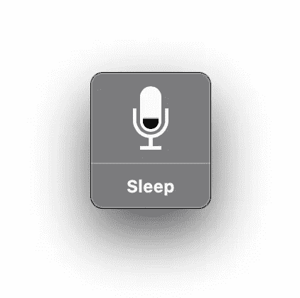
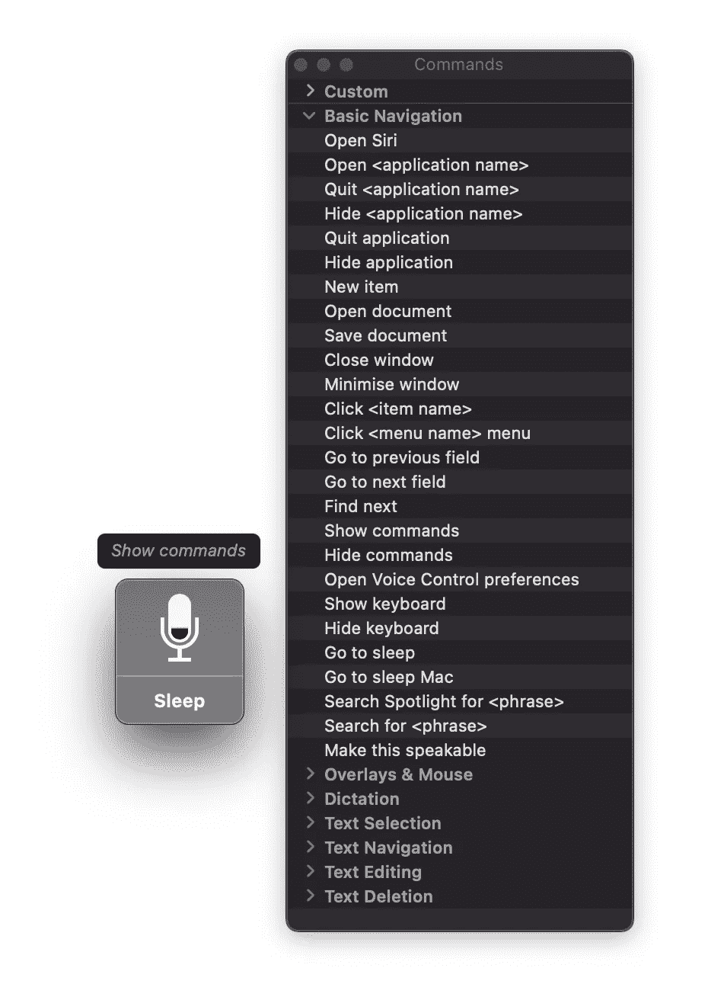
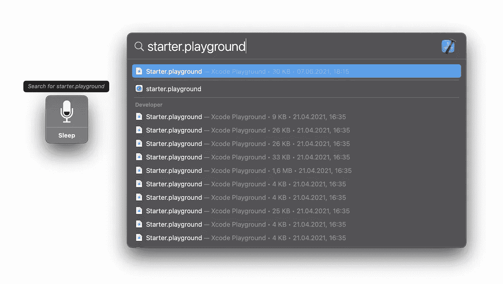
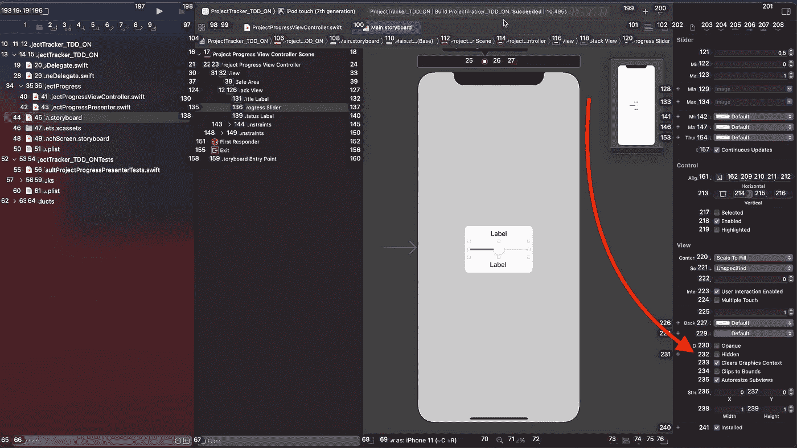
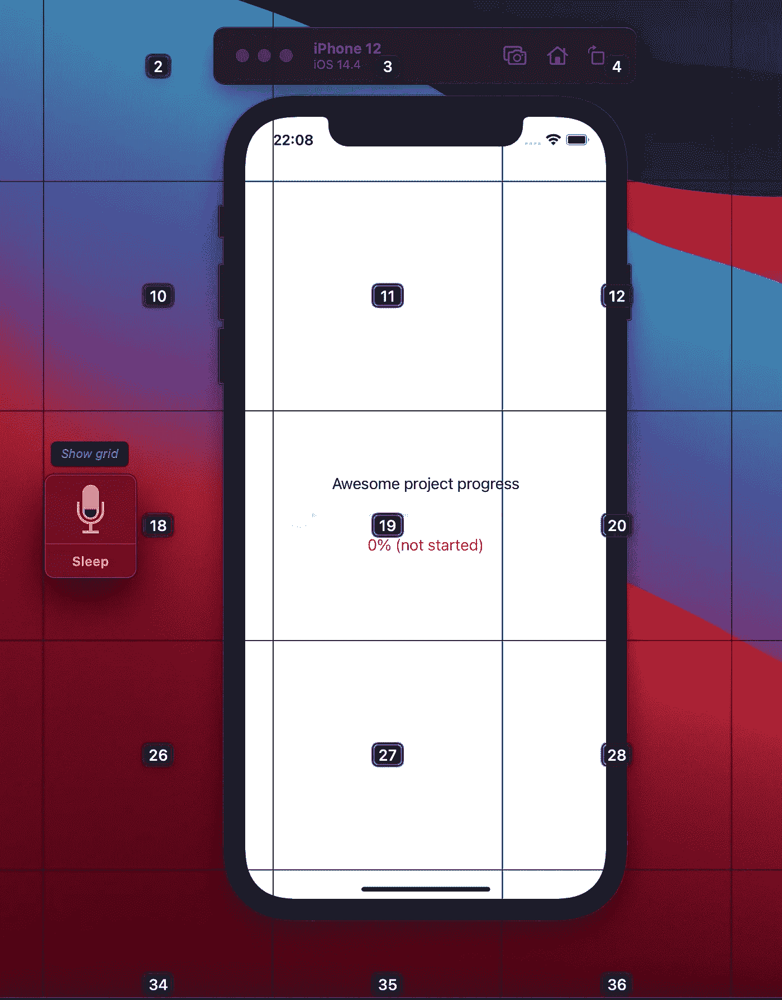
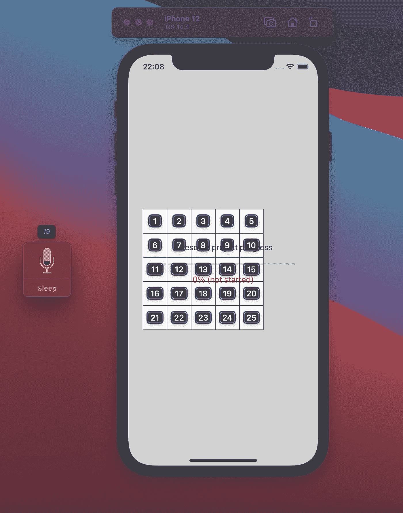
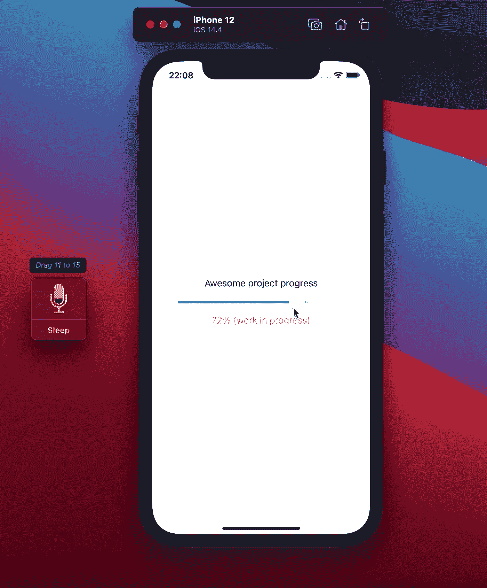
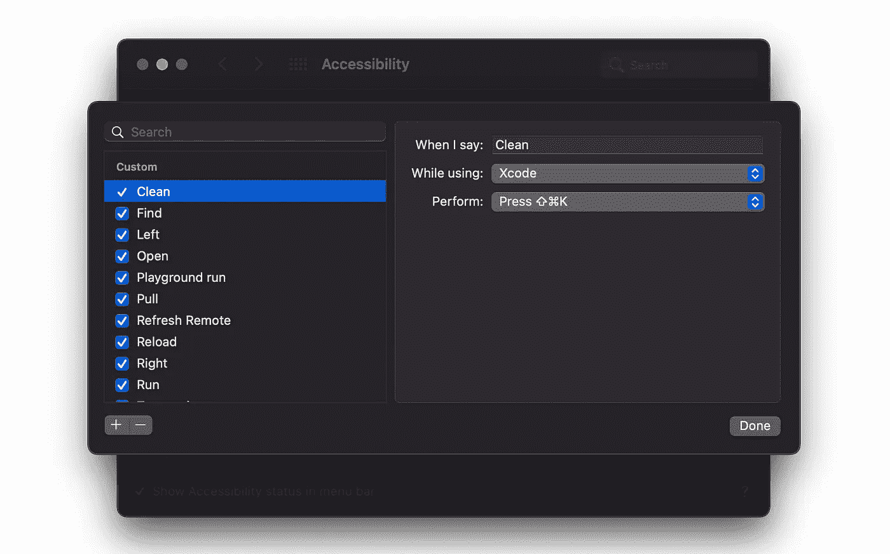
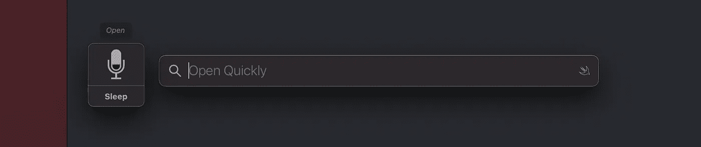
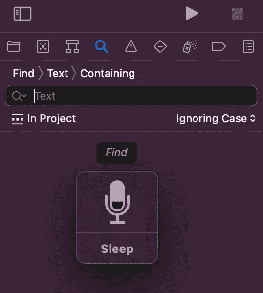

# 当你有部分残疾时，软件开发会是什么样子

> 原文：<https://betterprogramming.pub/what-software-development-looks-like-when-you-have-a-partial-disability-f94d791e4102>

## 如何使用语音控制辅助工具保持高效工作的故事

在 [Unsplash](https://unsplash.com/s/photos/microphone?utm_source=unsplash&utm_medium=referral&utm_content=creditCopyText) 上由 [Michal Czyz](https://unsplash.com/@digitalmike?utm_source=unsplash&utm_medium=referral&utm_content=creditCopyText) 拍摄的照片

今年夏天，我接受了手术，在大约一个半月的时间里，我无法使用我的惯用手。结果我的生活受到了很大影响，工作也是。

在这篇文章中，我想分享我在只有一只操作手的情况下开发 iOS 软件的经验。iOS 软件开发所需的应用程序的可访问性如何？你如何使用辅助功能？即使您没有任何残疾，辅助功能也能提高您的工作效率吗？

# **声控拯救**

在查看了 Mac 上不同的[辅助功能后，语音控制看起来最适合我的情况。](https://support.apple.com/en-hk/guide/mac-help/mh35884/mac)

> “语音控制是 macOS Catalina、iOS 13 和 iPadOS 中内置的一项新功能，它使那些无法使用传统输入设备的人能够完全用语音控制他们的 Mac、iPhone 和 iPad。对于行动不便的用户来说，完全语音控制他们的设备是真正的变革。”— [语音控制技术简介](https://www.apple.com/macos/big-sur/docs/Voice_Control_Tech_Brief_Sept_2019.pdf)

是的，当你有运动障碍时，这是一个真正改变生活的功能。

若要在 Mac 上打开语音控制，请访问🍏>系统偏好设置>辅助功能>语音控制>启用语音控制，或者只需对 Siri 说“打开语音控制”。之后会出现声控反馈窗口。这个窗口持续监听你的语音输入，并将其转换为命令或文本听写，这与 Siri 非常相似。

语音控制反馈窗口

# 日常任务的语音控制

语音控制附带了一系列内置命令来执行基本的导航、叠加和鼠标操作、听写、文本选择、文本导航、文本编辑和文本删除。若要查看所有可用的命令，请说出“显示命令”

用于基本导航的可用语音控制命令列表

您可以使用内置命令做什么的一些示例:

*   通过说出“打开 Safari”、“打开 Xcode”、“打开 Sourcetree”、“打开 Charles”等来打开任何桌面应用程序或在它们之间切换。
*   通过说“搜索[ *任何你想要的东西* ]”在聚光灯下搜索任何你想要的东西

使用语音控制搜索 Starter.playground 文件

*   同样，当 Safari 打开时，说“搜索[ *你想要的任何东西* ]”，你就会被带到那里。
*   不用鼠标也能和桌面应用互动。内置命令“显示数字”将为屏幕上每个可以点击的元素显示一个标签。

Xcode 接口生成器打开时的“显示数字”命令。如果你想把那个讨厌的 UISlider 藏起来，就说“232”或“232”

*   如果你想在屏幕上点击精确的点或者拖拽什么东西，可以使用“显示网格”命令。以下是如何使用语音在 iOS 模拟器中更改滑块值的分步示例:

第一步。说“显示网格”这将把屏幕分成若干区域。现在你可以说出精确的网格数来放大它。要增加滑块值，我们需要从网格编号 19 开始。

第二步:说出你需要放大的网格数:“19。”这将把网格分成更小的子网格。

第三步:说“把十一拖到十五。”搞定了。

# **语音控制和 Xcode = ❤️**

对我来说，用一只手开发软件的主要挑战是需要按快捷键，这些快捷键由位于键盘不同部分的几个键组成，必须同时按下。

我们能用语音控制解决这个问题吗？是啊！

有了语音控制，你可以用一个简单的语音命令代替那些复杂的快捷键。为此，请转到🍏>系统偏好设置>辅助功能>语音控制>命令…>然后点按➕按钮。

语音命令“清理”将清理 Xcode 项目

以下是我在 Xcode 中使用时发现很有价值的自定义命令示例:

*   说“干净”来清洁工程(⇧⌘K).

使用语音控制清理 Xcode 项目

*   说*运行*到*运行*项目(⌘R).

使用语音控制运行 Xcode 项目

*   说“开”就赶紧开(⇧⌘O).

在 Xcode 中使用语音控制快速打开

*   说出“查找”以打开查找导航器/搜索(⇧⌘F).

使用语音控制在 Xcode 中搜索

*   说出【再次测试】来运行上一次执行的测试命令(⌃⌥⌘G)

有了语音控制，您可以做几乎所有您在开发 IDE 中经常做的事情(例如，滚动、编辑文本、口述文本、移动光标以及许多更酷的事情)。对于文本输入，您可以使用听写。如果您想要忽略听写，请说出“命令模式”以仅响应命令。

# **队友和经理注意事项**

如果你的团队成员有某种残疾(像我一样)，我建议你记住以下几点:

*   比起发短信，更喜欢口头交流。用一只手打字太难了，听写也一样。请不要聊天，而要打简短的电话。如果需要，你可以在电话后写一个简短的总结。
*   **忍受工作日程的变化**。我不得不每隔一天预约几个小时去看医生，接受医疗程序。
*   **忍受较慢的工作速度**。尽量只用一只手洗碗；与用双手做相比，这将花费更多的时间。这同样适用于软件开发:即使有了可访问性特性，也很难像没有障碍时一样快速地交付软件，尤其是在最初的几周，当你需要学习和习惯可访问性工具的时候。
*   **心理健康。我做事很慢，这种新常态让我很恼火。试着支持你有残疾的队友。**

# **总之**

*   残疾并不妨碍你继续做你喜欢的事情。使用内置的辅助工具，您几乎可以在与机器的交互方面做任何事情。
*   即使你没有特殊需求，辅助功能也是有用的:如果你可以说“干净”，为什么要在 Xcode 中按那个复杂的快捷键呢？
*   让你自己的产品变得易于使用并不是为了给某些人帮个忙。这是在你永久或暂时残疾的情况下，为你未来的自己做的一件好事。

如果你有类似的经历或者有好的可访问性提示，请在这个故事的评论中分享。

# 从这里去哪里

*   如果你是 iOS 工程师，为什么不在自己的 app 中提升语音控制体验？ `[accessibilityInputLabels(_:)](https://developer.apple.com/documentation/swiftui/view/accessibilityinputlabels(_:)-9q3yf)`见[文档。](https://developer.apple.com/documentation/swiftui/view/accessibilityinputlabels(_:)-9q3yf)
*   阅读 Shirley Ryan AbilityLab 关于如何改进单手打字的文章。
*   查看 Mac 上可用的[辅助功能偏好设置列表](https://support.apple.com/en-gb/guide/mac-help/mchlp1400/mac)。

感谢阅读，照顾好自己。