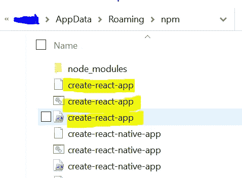

# 如果创建-反应-应用不起作用该怎么办

> 原文：<https://betterprogramming.pub/what-to-do-if-create-react-app-doesnt-work-ad601b4c238>

## 让它发挥作用的八步指南


[扎克·卢塞罗](https://unsplash.com/@zlucerophoto?utm_source=medium&utm_medium=referral)在 [Unsplash](https://unsplash.com?utm_source=medium&utm_medium=referral) 上的照片。

`[create-react-app](https://reactjs.org/docs/create-a-new-react-app.html)`是 React 开发人员初始化新 React 应用程序的一种便捷方式，无需担心样板模板、配置等问题。它可以节省时间和精力，让您可以直接开发您的应用程序！

理论上，使用`create-react-app`就像这样简单:

```
npx create-react-app my-app
cd my-app
npm start
```

然而，您可能会遇到阻止`create-react-app`执行的问题——即使您以前在您的机器上使用过它。

就我而言，我得到了以下消息:

```
You are running create-react-app 4.0.0, which is behind the latest release (4.0.1).
We no longer support global installation of Create React App.
```

我能够解决这个问题(尽管这并不像文档暗示的那么容易)，所以我将介绍哪些有效，哪些无效。

当我第一次试图解决这个问题时，很自然地，我去了 [create-react-app docs](https://create-react-app.dev/docs/getting-started/#:~:text=If%20you've%20previously%20installed,always%20uses%20the%20latest%20version.&text=Then%20open%20http%3A%2F%2Flocalhost%3A3000%2F%20to%20see%20your%20app.) 。他们说:

> “如果您之前已经通过`npm install -g create-react-app`在全球范围内安装了`create-react-app`，我们建议您使用`n` pm un `install -g create-react-app`或`yarn global remove create-react-app`卸载该软件包，以确保`npx`始终使用最新版本。”

所以你首先应该尝试上面的命令。

# 1.npm uninstall -g create-react-app

这是卸载您的`create-react-app`全局安装的 npm 命令。理论上，当这移除了全局安装时，您应该能够运行`npx create-react-app my-app`。然而，这对我不起作用。

# 2.纱线全局移除创建-反应-应用

这基本上是前一种方法的纱线版本。我没有用纱，所以这个方法对我不适用。

# 3.npm 更新 npx

这条简单的线实际上是唯一对我有效的东西。在运行了`npm update npx`之后，我运行了最初的`npx create-react-app my-app`，它非常有效。你会惊讶地发现，除了更新软件包之外，还有多少错误可以简单地解决。

*注意:*[*npx*](https://medium.com/@maybekatz/introducing-npx-an-npm-package-runner-55f7d4bd282b)*自带 npm 5.2+及更高版本。参见* [*旧 npm 版本*](https://gist.github.com/gaearon/4064d3c23a77c74a3614c498a8bb1c5f) *说明。*

虽然这对我来说行得通，但如果它不能给你带来同样的结果，你还是可以尝试一些事情。

# 4.npm 安装 npm@latest -g

另一个治疗`create-react-app`忧郁的简单方法。您可以尝试重新安装 npm 的最新版本。要检查 npm 的版本，请在终端中键入`npm -v`。国家预防机制的最新版本可以在国家预防机制的网站上找到[。如果您有最新的 npm 版本，那么您可以尝试方法 5。](https://www.npmjs.com/package/npm)

# 5.npm 缓存清理-强制

任何时候你在命令中使用`--force`，确保那是你想要做的。`--force`基本上执行一个命令，否则会在命令行中遇到警告。它应该谨慎地与命令一起使用。然而，在这种情况下，我们试图删除 npm 缓存，以确保`create-react-app`不会在全局范围内安装。我试过了，虽然我没有遇到任何负面影响，但当我试图运行`npx create-react-app my-app`时，仍然会出现错误。

放心吧！你可以试试别的方法。

# 6.哪里/哪个创建-反应-应用程序

如果你使用的是 Windows，你可以写`where create-react-app`来试着找到难以捉摸的全局安装在你的系统文件的什么地方。在 Mac 上，您可以使用相同的命令。把`where`换成`which`就行了。一旦找到它的位置，就可以从系统文件中删除它。然而，如果这没有返回任何结果(就像我的情况)，您可以尝试方法 7。

# 7.查找隐藏的文件夹(Mac 和 Windows)

如果你找不到`create-react-app`的位置，可能是因为你的文件夹实际上是隐藏的。这些文件夹和文件很可能是隐藏的，因为它们[包含不应轻易更改、移动或删除的数据，因为它们是操作系统文件。](https://www.lifewire.com/what-is-a-hidden-file-2625898)全局 npm 软件包安装与我们的操作系统纠缠在一起。对于我们的例子，我们想尝试下面的方法。



## **窗户**

去`AppData/Roaming/npm`找到你的`create-react-app`文件。你可以在文件浏览器的目录栏(搜索栏的左边)用`%AppData%`找到 AppData/Roaming。

向下滚动直到你找到`npm`目录，然后你会看到你的`create-react-app`文件。也可以尝试删除`/Roaming`中的`npm-cache`文件夹。

## **Mac**

你可以[在 Mac 上导航到 Finder，输入](https://stackabuse.com/the-ultimate-guide-to-configuring-npm/) `[~/.npm](https://stackabuse.com/the-ultimate-guide-to-configuring-npm/)` [找到](https://stackabuse.com/the-ultimate-guide-to-configuring-npm/) `[npm-cache](https://stackabuse.com/the-ultimate-guide-to-configuring-npm/)` [文件夹](https://stackabuse.com/the-ultimate-guide-to-configuring-npm/)。

# 8.最后一招

如果在完成上述所有操作后，您无法运行`npx create-react-app my-app`，那么这可能是节点本身的问题。如果您*真的*需要`create-react-app`，您可能需要重新安装 Node 并重新配置您的依赖项，以确保您有一个 Node、npm、npx 等的新开始。[这是更新和重装 Node 的好资源](https://phoenixnap.com/kb/update-node-js-version)。

# 摘要

希望这些选项中的一个能够帮助您使用`create-react-app`,并且对您的开发环境影响最小。然而，应该注意的是`create-react-app`对于 React 应用程序的开发并不重要，有一些资源(比如[这篇文章](https://dev.to/vish448/create-react-project-without-create-react-app-3goh))可以帮助你创建一个没有它的应用程序。

[*在这里将你的免费中级会员升级为付费会员*](https://matt-croak.medium.com/membership) *，每月只需 5 美元，你就可以获得数千位作家的无限量无广告故事。这是一个附属链接，你的会员资格的一部分帮助我为我创造的内容获得奖励。谢谢大家！*

# 参考

[](https://create-react-app.dev/docs/getting-started/#:~:text=If%20you%27ve%20previously%20installed,always%20uses%20the%20latest%20version.&text=Then%20open%20http%3A%2F%2Flocalhost%3A3000%2F%20to%20see%20your%20app) [## 入门|创建 React 应用程序

### Create React App 是官方支持的创建单页 React 应用程序的方式。它提供了一个现代建筑…

创建-反应-应用程序.开发](https://create-react-app.dev/docs/getting-started/#:~:text=If%20you%27ve%20previously%20installed,always%20uses%20the%20latest%20version.&text=Then%20open%20http%3A%2F%2Flocalhost%3A3000%2F%20to%20see%20your%20app) [](https://stackoverflow.com/questions/64963796/create-react-app-is-not-working-since-version-4-0-1) [## 从版本 4.0.1 开始，create-react-app 不工作

### 他们发布 4.0.2 版本后我也面临这个问题。他们提到了这一点:如果您以前安装了…

stackoverflow.com](https://stackoverflow.com/questions/64963796/create-react-app-is-not-working-since-version-4-0-1) [](https://www.npmjs.com/package/npm) [## npm

### 默认情况下，与 node 和大多数第三方发行版捆绑在一起。

www.npmjs.com](https://www.npmjs.com/package/npm) [](https://www.lifewire.com/what-is-a-hidden-file-2625898) [## 什么是隐藏文件？

### 隐藏文件是任何打开了 hidden 属性的文件。正如您所料，包含此内容的文件或文件夹…

www.lifewire.com](https://www.lifewire.com/what-is-a-hidden-file-2625898) [](https://stackabuse.com/the-ultimate-guide-to-configuring-npm/) [## 配置 NPM 的终极指南

### 简介*设置参数*可能的参数列表*访问控制/授权*缓存*常规*…

stackabuse.com](https://stackabuse.com/the-ultimate-guide-to-configuring-npm/) [](https://phoenixnap.com/kb/update-node-js-version) [## 如何将 Node.js 更新至最新版本{Linux、Windows 和 MacOS}

### Node.js 是一个开源的 JavaScript 运行时环境。因为 Node.js 有一个活跃的用户社区，所以小的更新…

phoenixnap.com](https://phoenixnap.com/kb/update-node-js-version) [](https://dev.to/vish448/create-react-project-without-create-react-app-3goh) [## 不使用 create-react-app 创建 React 项目

### 按照这些命令，用终端创建 react 应用程序非常简单。简单对吗？然而，有一个…

开发到](https://dev.to/vish448/create-react-project-without-create-react-app-3goh)