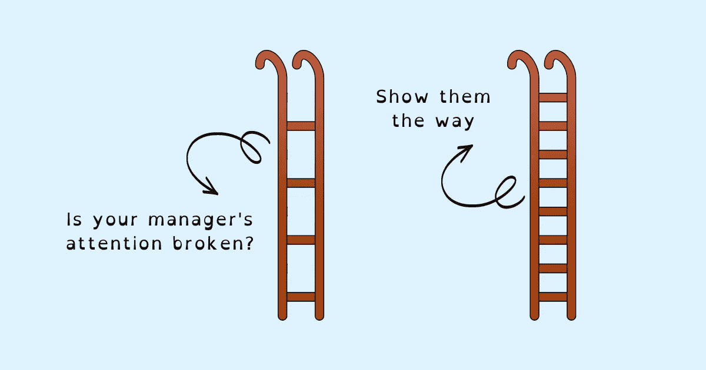

# 如果你的经理没有注意到你，该怎么办

> 原文：<https://betterprogramming.pub/what-to-do-if-your-manager-isnt-paying-attention-3295184b373>

## 仅仅做伟大的工作是不够的。你还需要让自己引人注目

鸣谢:作者

你受够了你的经理，因为他们不注意你吗？他们是太忙而没有注意到，还是根本不在乎？你是否经常纠结于在目标上取得进展所需的清晰的方向感或清晰度？你的经理的精力放在哪里——结果还是实现结果的过程？

当你做得很好时，可能会感到沮丧，但你为实现目标付出的所有努力都没有得到你的经理的认可。不被关注还会让你觉得自己很渺小，导致被拒绝的消极感觉，并在新机会出现时让你失去尽最大努力的动力。仅仅做伟大的工作是不够的。你还需要让自己引人注目。

我们都带着梦想加入工作，去做一些大的、有影响力的、有意义的、值得认可的事情。但是当你在解决沟通、[协作](https://www.techtello.com/cross-functional-collaboration/)和协调问题上浪费更多的时间时，剩下来做真正工作的时间就更少了。随着你做出重大贡献的能力下降，因没有做任何重大事情而产生的精神压力和焦虑会上升。不应该轻视清晰度和上下文。它们是完成伟大工作的重要组成部分。

达到你的目标和实现你的目标是工作的重要部分。但如果它们成为判断和评价你价值的首要标准呢？过于重视目的地会让你无法做出正确的选择。旅途中的错误和失败可能会让你分心，远离你的目标。做任何有价值的事情都不在于具体的结果，而在于你在过程中学习、调整和适应的能力。

> "引起别人注意的最基本的方法是:打破一种模式."—奇普·希斯和丹·希斯，《为坚持而生》

现在来回答一个相关的问题:你的经理在所有这些领域扮演什么角色，你如何吸引他们的注意力以在工作中取得成功？

使用这个三步框架打破你的经理的默认模式，让他们开始关注你需要的东西:

1.  自我推销
2.  自我导向
3.  自我纠正

# 自我推销

你的经理应该知道你做得好的领域，你擅长的地方，你的优势和亮点。让你的经理了解情况对你的成功和成长至关重要。但是如果你的经理不注意怎么办？

你是应该低着头，继续做好工作，希望有一天他们会注意到你，还是应该努力成为公众的焦点，让自己引人注目？

自我推销不是吹嘘或贬低别人来抬高自己。这是在展示你的技能，确保你的老板和同事了解你真正的能力，并展示你的真正实力。

> “自我推销是一种领导力和政治技巧，掌握这种技巧对于驾驭职场现实、为成功做好准备至关重要。”―邦妮·马库斯，“推销的政治”

当你的经理知道你带来了什么，你就更有可能获得与你的优势相符的机会。在那些他们认为你可以做出贡献的领域，其他人也会很乐意向你伸出援手。你不仅可以做扩展你的知识和技能的工作，而且以这种方式帮助别人也能让你学习和成长。

仅仅承认自我推销的重要性是不够的。你实际上需要做的是让自己被人看到。所以，我们来学习一下怎么做吧。

从回答这些问题开始(你可以每周或每月做一次):

1.  上周/上个月你展示了哪些优势？
2.  你最大的成就是什么？是什么让这一成就如此重要(想想对业务/产品的影响)？
3.  你面临过哪些挑战？你是如何克服这些挑战的？
4.  你学到的最重要的东西是什么？你是如何应用这些知识的，或者计划在未来如何应用它们？
5.  你采取了什么措施？这些计划产生了什么价值(对产品、业务、其他员工的价值)？

一旦你为这些数据创建了思维导图，要么给你的经理发电子邮件，要么在下一次[1-1 会议](https://www.techtello.com/questions-to-ask-a-manager/)中与他们讨论。确保将其纳入一对一会议的议程中。没有它，你更有可能把时间花在别的地方，然后带着失望离开。记住，主动是关键。

保持信息清晰简洁，并包含关键点——当你让信息简洁明了时，你的经理更有可能注意到你。以下是您需要发送或分享的内容:

*   你最大的成就是
*   面临的挑战以及您是如何克服这些挑战的
*   你的学识
*   计划和创造的价值

最后，谈谈你的优势，并征求他们对这些方面的建议——你如何利用这些优势产生更大的影响，你的工作如何惠及他人和组织，他们认为你如何看待自己，以及他们如何看待你的工作？

寻求建议会引起经理的注意——他们被迫考虑你的工作，评估你对团队的价值。

# 自我导向

良好的方向感，结合上下文和清晰性，对于出色的工作非常重要。没有它，你更有可能浪费时间做无关紧要的工作，半吊子的需求导致返工，或者由错位和混乱带来的精神压力和焦虑会阻止你做任何有价值的工作。

我们都希望我们的经理做好自己的工作，这样我们也能做好自己的工作，但是如果你的经理不注意怎么办？

你的经理的态度是接受现状而不去挑战它，浪费时间在表面问题上而不是深入挖掘，花更多的时间去灭火，花更少的时间去建设和规划未来，这会损害你的生产力和绩效。

如果没有清晰的思路、共享的环境，以及寻求团队间的一致，工作就少了乐趣，多了折磨。无法做好工作带来的精神痛苦会挫伤积极性，对你的心理健康和个人幸福有害。

> “他们并不是看不到解决方案。就是他们看不到问题所在。”切斯特顿

不要抱怨你的经理忽视问题，而是将他们的注意力引向问题。为此，请回答以下问题:

1.  你在做什么假设？
2.  哪些领域缺乏清晰度？
3.  你对如何衡量成功有共识吗？你看到了哪些差距？
4.  你做了什么来疏通自己，向前看？
5.  你需要什么样的帮助？

哪怕是花几分钟的时间来为自己确定这一点，然后与你的经理分享，也一定会引起他们的注意。不要只是陈述问题；确定解决方案，把它们放在你的经理面前，然后寻求他们的建议。

当你做完作业后，他们不能忽视它。他们不能拒绝帮忙。如果他们这样做了，问题不在于注意力，而在于他们的态度。最好换个团队或者去别处看看。

# 自我纠正

当错误和失败发生时，它们会让我们失望，但它们在弥合我们的现状和我们的目标之间的差距方面也起着至关重要的作用。

向他们学习给了我们一个机会去修正方向，发现新的做事方法，重新振作起来，而不是感觉被击倒，因为害怕失败而瘫痪。

另一方面，忽视或无知会把小挫折变成永久的失败原因。不能认识到这只是一个艰难的阶段，会产生消极和[绝望的恶性循环。](https://www.techtello.com/learned-helplessness-vs-learned-optimism/)

因此，通过从错误中学习来改正错误是做好工作的关键部分。但是，如果你的经理只关心结果，而不关注实现结果的过程，那该怎么办呢？你应该不惜一切代价避免犯错吗？你应该放弃看起来有风险的项目吗？你应该开始谨慎行事，做看似容易的工作吗？

你可以。但是，做你一直在做的工作，额外努力避免错误，放弃你非常适合的机会，只是因为它们看起来有风险，这限制了你能做什么和你能取得多少成就。

与其从限制开始，不如想想可能性。要做到这一点，让自己面对正确的机会，然后这样做:

1.  在你成功的道路上有哪些障碍？
2.  当它们出现时，你如何处理它们？
3.  你能从过去从事过类似项目的其他人那里学到什么，并应用到你的工作中？
4.  当你最需要的时候，谁能给你建议和帮助？
5.  你能做些什么来避免将劣势或小挫折变成大失败？

通过制定一个允许你自我纠正的计划并与你的经理分享，你获得了他们的信任并引起了他们的注意。展示方法和思维的灵活性是如何让你到达你需要的地方，而不是拘泥于某一种做事方式。向他们展示，当你专注于过程时，为什么目的地不那么重要。讨论做同一件事的不同选择或多种方式。有了调整、适应和学习的能力，一切皆有可能。

> “当领导者变得专注于结果而不是根源，担心结果而不是发展团队成员的过程时，他们可能会在短期内生存，但从长远来看，他们不会茁壮成长。”—乔恩·戈登，“你先在更衣室里赢了”

你的经理的注意力可能不在需要的地方，但通过自我推销、自我指导和自我纠正，你可以抓住更大更好的机会，清楚地做好你的工作，在前进的过程中做出修正，最后当你做得很好时，制造一些轰动。万事如意！

# 摘要

1.  获得经理的关注对工作成功至关重要。没有它，你更有可能在黑暗中射击，并希望得到结果。
2.  引起经理注意的最重要的一步是让你的工作引人注目。找出你能展示自己的关键领域，并让他们出现在你的经理面前。
3.  将您的经理的注意力引向需求差距，验证您的假设，并与成功的通用衡量标准保持一致。
4.  主动识别障碍和处理障碍的计划。让你的经理专注于过程(通过保持灵活性、不断学习和适应)，而不是纠结于结果。

关注我这里和 Twitter 上的更多故事。这篇报道最初发表在 https://www.techtello.com 的[。](https://www.techtello.com/what-to-do-if-your-manager-is-not-paying-attention/)