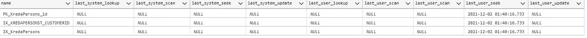
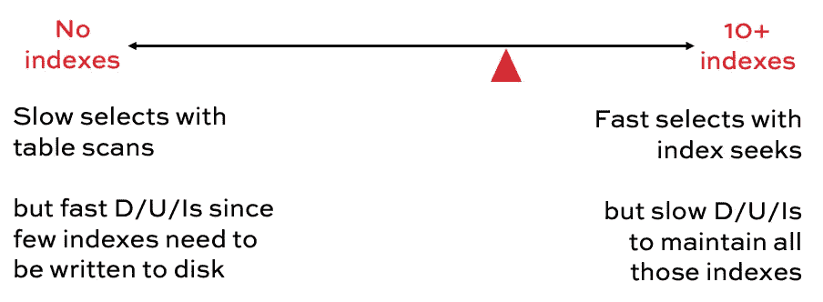

# 当索引大于 SQL 表时该怎么办

> 原文：<https://betterprogramming.pub/what-to-do-when-the-index-is-larger-than-the-table-2fae2ae8ee75>

## 让我解释一下如何处理大型索引表


照片由[克里斯·利维拉尼](https://unsplash.com/@chrisliverani?utm_source=medium&utm_medium=referral)在 [Unsplash](https://unsplash.com?utm_source=medium&utm_medium=referral) 拍摄

使用表格是开发人员的日常工作。但是 SQL 开发并不经常。在某些情况下，我看到了我的过去。许多开发人员创建只有一个索引的表。

# 问题是

当产品用于生产时，当数据量增加时，它会变慢。每个开发人员都说“哟！创建一个索引”。

这可能导致索引大于表本身。

# 是什么导致了索引大小？

增加索引大小有几个原因。

同一列中有太多索引。

首先，分析你的指数。删除未使用的索引。此外，减少现有列的数量。

> 请记住，聚集索引列是所有非聚集索引中的“隐藏”包含列

要确定索引的用法，可以使用以下查询:

输出将如下所示:



这将显示何时以及谁将使用该索引。

**重叠索引**

如果在`a,b,c,d`上有一个索引，在`a,b,c`上有一个索引，你可以考虑删除第二个索引，因为第一个索引覆盖了第二个索引。因此，请尝试将重叠的列聚合到一个索引中。

**索引碎片**

索引可能会产生碎片，您可以使用下面的查询来了解实际索引的碎片情况。

在这种情况下，您可以使用以下命令重建索引

`ALTER INDEX INDEX_NAM;E ON TABLE_NAME REBUILD`

之后，将重建索引，减少碎片

**识别存储在索引文件中的内容？**

首先，你必须知道，索引会存储你告诉存储的任何东西。该查询将帮助您了解哪些索引使用了最多的空间，以及使用的原因(在行数据、lob 数据中)

```
SELECT  convert(char(8),object_name(i.object_id)) AS table_name, i.name AS index_name, 
    i.index_id, i.type_desc as index_type,
    partition_id, partition_number AS pnum,  rows, 
    allocation_unit_id AS au_id, a.type_desc as page_type_desc, total_pages AS pages
FROM sys.indexes i JOIN sys.partitions p  
      ON i.object_id = p.object_id AND i.index_id = p.index_id
    JOIN sys.allocation_units a
      ON p.partition_id = a.container_id
      order by pages desc
```

# 找到最适合你的解决方案



正如您在图中看到的，当您创建更多的索引时，您会消耗更多的索引空间，并且很难维护这些空间。但是索引越少，查询性能越差。很难告诉任何人哪种实践适合。所以可以说“这取决于你的数据”。当你需要一个经验法则时:

使用“ **5 和 5 规则**”。这意味着您最多可以创建 5 个索引。每个表 5 列。

仅此而已！希望您喜欢它，它可以帮助您在数据查询中获得更高的性能。