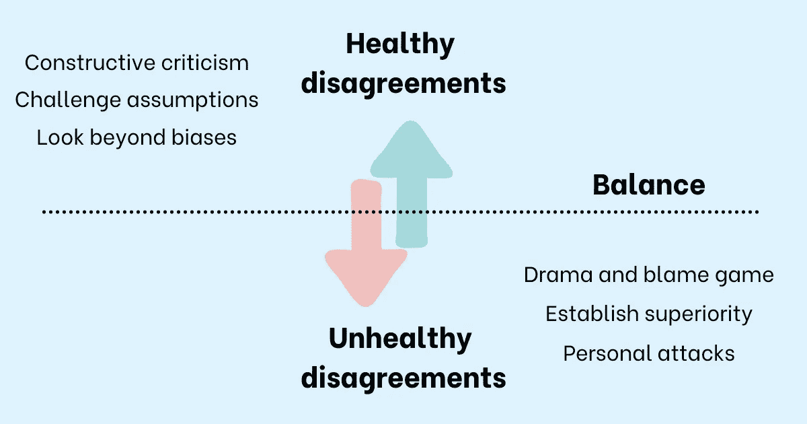

# 你的员工在职场打架怎么办？

> 原文：<https://betterprogramming.pub/what-to-do-when-your-employees-are-fighting-in-the-workplace-e87b98594eac>

## 与他人持不同意见的自由不能是无边界的

鸣谢:作者

无论是在家里还是在工作中，我都喜欢对自己的想法和观点提出健康的不同意见。它们让我得以一窥如此多独特的视角，并帮助我看到我们周围的世界是多么的不同。我不同意人们所说的每一件事，但我绝对愿意听取他们的意见。

我知道通过邀请他人挑战我的观点，我学到了很多，也成长了很多，我认为鼓励我的团队对他们自己的工作进行建设性的批评是一个很好的做法。征求别人的意见该多好啊。挑战他们的假设。帮助他们超越偏见。承认他们可能是错的。

> “犯错并不总是快乐的。接受错误的道路充满了痛苦的时刻，当我们记得这些时刻对进步至关重要时，我们会更好地处理它们。但如果我们不能学会在发现自己错了的时候偶尔开心一下，那就很难做对任何事情。”
> 
> —亚当·格兰特在《再想一想:知道自己不知道的东西的力量》

带着正确的意图，这样的对话不仅令人愉快，还能让你成长为一个人。想象一下，对一个问题进行头脑风暴，团队中的每个人都参与其中，唯一的目的是公开发表自己的观点，以使产品、设计、决策或想法变得更好。没有人试图证明他们的聪明或显示他们有多博学。房间里最大的声音被抑制，最好的想法获胜。

我们都想成为这样一个团队的一员，我也是。我鼓励我的团队寻求公正的反馈，质疑他们的假设，并在做出任何决定前征求他人的意见。效果非常好。团队成员报告说，他们很享受这些对话带来的充满活力的环境。他们感到受到了挑战。他们从别人那里学到的东西比他们认为自己能学到的要多得多。团队成员之间的协同作用使我们一起取得了一些伟大的成果。

但是没有它的挣扎是不可能的。在我让我的团队公开表达不同意见的热情中，我意识到我犯了一个大错误。

# 我没想到会这样

我和两位德高望重的高级工程师一起工作。这是一个大项目，有一个相当大的团队。我将项目的重要部分委托给了他们两人，深知他们会比我预期的做得更多。

他们都有明确的责任范围，我认为让他们互相回顾彼此的工作是个好主意。这不仅有助于他们寻找另一种视角，而且了解彼此的工作也将使他们在团队的整体方向上保持一致。毕竟，我们都在朝着同一个目的[目标](https://www.techtello.com/goal-setting/)努力。

我只想作为一个团队取得更好的结果，但在这样做的时候错过了关键的一步。

在项目开始的短短几周内，健康的分歧变成了人身攻击。他们没有一起寻找最好的想法，而是花更多的时间去证明谁的想法更好。他们会就一项决定争论几个小时，但没有得出任何有意义的结论，然后在背后说对方坏话。所有的[戏剧](https://www.techtello.com/how-to-opt-out-of-the-drama-triangle/)和指责游戏并没有随着他们而结束，因为他们把其他团队成员拉了进来，并期望他们站在哪一边。

不仅项目遭受了损失，整个团队也遭受了损失。这对所有人来说都是一个非常消极的环境。当一个团队中的两个高层有不正常的关系时，团队的其他成员就不能很好地发挥作用。每个人都对自己的不成熟感到沮丧。

错误是我的。我对有分歧的好处如此兴奋，以至于我拒绝看到它的坏处。我可能让这种不和谐发展得太远了，后来才意识到我的工作是在建设性的分歧和破坏性的行为之间定义一个健康的界限。与他人意见相左的自由不能没有边界，也不能以给团队创造一个有害的工作环境为代价。

就我个人而言，我关心他们两个，并尊重他们的技术专长。但我也意识到，我不能让我对他们的感情阻止我让他们为自己的行为负责[。](https://www.techtello.com/building-accountability-at-work/)

解决冲突并不容易，而且比我想象的要付出更多的努力。但是通过一些关键的实践，我能够扭转局面。这不仅是一次富有挑战性的经历，对我来说也是一次巨大的学习机会。

当你的团队成员在打架或处于非心脏关系时，用以下原则解决冲突:

# 1.用上下文来引导，而不是控制

雷德·哈斯汀斯在《没有规则的规则:网飞和重塑文化》中写道:“根据上下文引导，而不是控制。”这是如此重要的一课，因为通过告诉他人停止争斗并给出如何结束争斗的建议来进行干预不会解决冲突。

你需要花时间去理解和解决驱动他们行为的核心问题。就我而言，我意识到两位高级工程师在各自的团队中都表现良好。他们关心他们，听取他们的建议，作为一个整体一起工作。然而，只有在一起工作时，他们的看法才不一致。

在仔细听了他们的话并试图理解这一切之后，我意识到他们的行为是源于对自己地位的深深的不安全感。他们都想升职，而且非常想。他们担心如果不确立自己的优势，就会失去机会。

了解驱动他们行为的心态让我有余地进行更有成效的对话。

# 2.不要偏袒任何一方

我的第二个重要经验是。不要太武断或固执己见。你可以有自己的观察，但不要以结论为导向。当听到故事的双方时，很容易不知所措，并表达自己的观点或支持某一方。不要这样做。不要试图通过贬低别人来激励他们，提升他们。这看起来像是短期内让事情运转起来的简单方法，但从长期来看，它弊大于利。

当两位在工作中争吵的高级工程师坦率地与我分享他们的感受时，我承认他们的感受，但不承认他们感受这些感受是正确的。我没有无视他们的情绪，同时要求他们超越情绪，看到他们处境的现实。

这并不容易。但是你必须帮助他们看到两面。你必须帮助他们认识到总有不止一个故事。允许他们分享自己的观点，同时让他们也能看到另一个观点。

> "每一次成功对话的核心都是相关信息的自由流动."
> 
> ——Kerry Patterson 在“当风险很高时，重要的谈话工具”中

你要去打听，去倾听，去问很多问题，让他们看到自己思维中的缺陷。第一次可能不会发生，但是如果你对这个过程有耐心，你一定可以改变他们的想法。

# 3.谈论问题，而不是人

在解决这场争吵时，我学到的第三点是——作为经理，我们可能犯的最大错误是将一个人的行为归因于他们的性格——“这就是他们。”

关注人而不是问题，把他们的反应和他们的反应归因于他们的个性肯定会让他们对自己的处境有所防备。正如丹尼尔·戈尔曼在《情商:为什么它比智商更重要》一书中所说，感知到的威胁会导致“杏仁核劫持”并引发战斗或逃跑反应。他们要么试图通过为自己的行为辩护来对抗这种情况，要么想办法逃离这种情况。

不过，专注于问题，谈论团队对这种情况的感受，并将整个故事联系到这种情况如何限制了他们作为一个团队可以创造的影响和他们可以实现的成果，这肯定会让他们对对话感兴趣。

一旦你吸引了他们的注意力，没有分心去为他们的处境辩护，你就可以合作解决问题。

在讨论这个问题的时候，一定要清楚这种行为是不可容忍的。不要试图粉饰你需要传达的信息。保持简单。保持直接。

# 4.求解答

我关于解决争吵的最后一课是这样的——作为一名[经理](https://www.techtello.com/what-type-of-manager-are-you/)，你可能觉得有责任通过提供解决方案来解决员工之间的分歧。在最初的几分钟里，你可能会试图通过提供一些看起来不错的建议来避免尴尬的沉默，但这从来没有真正起作用。

不要试图为他们解决问题。问一些问题，让他们思考自己的处境，保持沉默，让他们提出自己的解决方案。你可以引导对话，提供建议，只要看起来像是他们想做的事情。

结束对话时，就实施这些变更的时间表达成一致。不要让它无止境。不要指望他们会立即改变策略。他们需要付出一些努力来找到富有成效的合作方式。如果他们不这样做，你要非常清楚，作为经理，你不会接受这种行为，如果情况没有改变，你将采取更严格的行动。

未来几周至关重要。仔细观察他们，听取团队的意见，继续对话。向他们提供进度反馈，帮助他们了解自己的表现，以及他们还可以做些什么来更好地开展团队合作。

在工作场所打架的员工不仅会给他们的生活增加压力和焦虑，还会给所有相关人员带来非常不愉快和沮丧的经历。不要回避困难的对话。不要抱着问题会自行解决的希望而拖延。作为经理，你有责任为所有人提供一个健康的工作环境。

# 摘要

1.  鼓励你的团队有健康的分歧。这是寻求不同意见并做出明智决定的好方法。
2.  定义建设性分歧和破坏团队士气并影响团队集体产出的不健康行为之间的界限。
3.  如果你团队中的人在工作场所打架，不要忽视它或假设问题会自行解决。积极解决问题是你的责任。
4.  解决争吵的首要原则是根据上下文而不是控制来引导。解决核心问题。
5.  解决这一冲突的第二个原则是不偏袒任何一方。承认他们的感受，但不承认他们的感受是正确的。帮助他们看到另一面。
6.  永远不要试图通过争论对方的行为来解决争吵。说说问题。
7.  提出问题并引导他们找到解决方案。要清楚如果他们没有学会有成效地合作的后果。

## 想联系作者？

*这个故事最初发表于*[*【https://www.techtello.com】*](https://www.techtello.com/fighting-at-work/)*。*