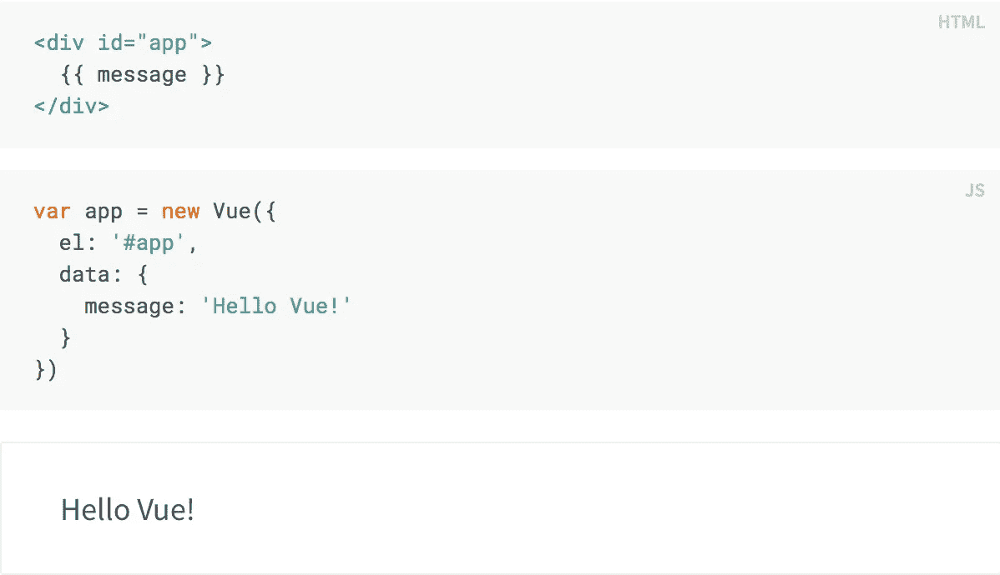
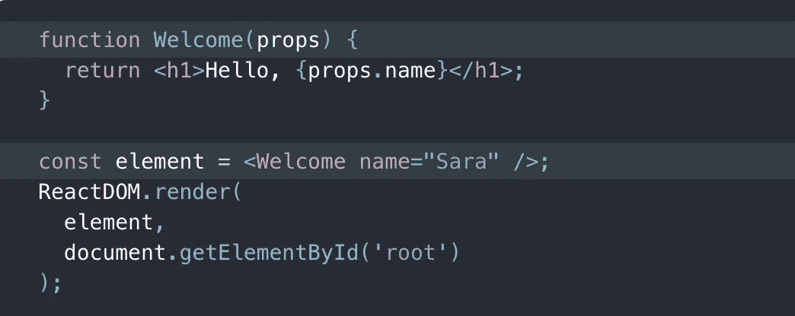
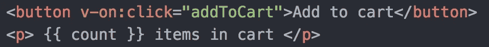
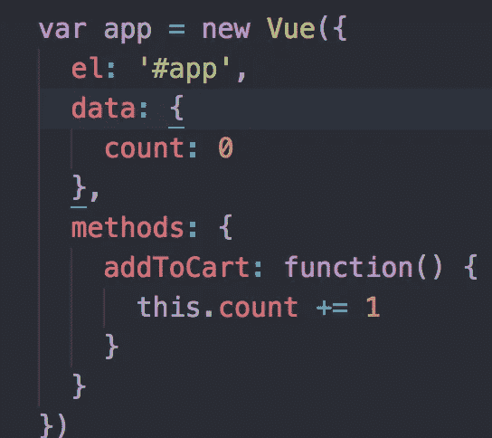

# 使用 React 后使用 Vue.js 需要了解什么

> 原文：<https://betterprogramming.pub/what-to-know-about-working-with-vue-after-using-react-4164d9ff5427>

## Vue 和 React 的异同


vue . j

在我在熨斗学校期间，我们学习前端开发的大部分时间都花在了使用普通的 JavaScript、React 和 Redux 上。最近，我开始从事一个使用 [Vue.js](http://vuejs.org) 的项目，我必须熟悉流行的 JavaScript 框架。

在我的研究中，我认为这可能是一个好主意，看看 Vue 和 React 并列，看看一些高层次的相似性和差异。在这篇文章中，我将概述比较 Vue 和 React 时的一些要点，重点是在 React 工作后第一次来 Vue 的人想知道什么。

# 类似

React 和 Vue 都利用虚拟 DOM 来制作反应组件，这意味着当数据改变时，组件会在页面上自动改变。它们都是为了支持基于组件的开发而设计的，这种开发通过将应用程序分解为可重复的代码块来提高可伸缩性，随着应用程序的增长，这些代码块可以很容易地重用。

这两个框架都是轻量级和快速的，并利用生命周期方法让开发人员控制何时以及如何呈现页面的不同元素。Vue 和 React 有相当多的共同点，两者都是你的好选择，这取决于你正在构建的目标和你想要实现的目标。

# 差异

## 基础知识

尽管我现在对 React 更熟悉了，但我确实觉得它的学习曲线更陡。我将在下面介绍一些原因，经过几周的深入研究后，这些原因开始变得有意义，但这是在与以前没有接触过 React 或 Vue 的开发人员一起工作时需要考虑的事情。

一个关键的区别是，React 只使用 JavaScript，而 Vue 使用 HTML/CSS/JavaScript 结构，这对于 [Vanilla JS](https://stackoverflow.com/a/20435744/602210) 开发者来说可能更熟悉。为了控制应用程序的 UI，React 开发人员使用 [JSX](https://reactjs.org/docs/introducing-jsx.html) ，这是一个 JavaScript 扩展，它创建 React 元素，看起来像 HTML 和 JavaScript 之间的混搭。

让我们一起来看看 React 组件和 Vue 组件的区别:



“你好，世界！”在 Vue 中，从 [Vue 文档](https://vuejs.org/v2/guide/#Declarative-Rendering)

在这个 Vue 示例中，组件本身以 div 的形式呈现在标准 HTML 中。然后，在下面的 JavaScript 中，Vue 的新实例使用带有行`el: '#app'`(‘El’代表元素)的将 id 为`#app`的元素作为目标，然后是组件所需的任何数据。然后消息通过`{{ message }}`行呈现在`div`中。用`message`键存储的任何数据都将被显示。如果您要打开该组件的控制台并编写`app.data = "Howdy"`，屏幕上的消息将会改变。



React 中的“你好”，来自 [React 文档](https://reactjs.org/docs/getting-started.html)

在 React 中，功能组件使用 JSX ( `props.name`)将收到的数据作为道具返回元素。这个例子也展示了页面上的元素是如何连接到 React 的。

## 操纵数据

操作存储在 Vue 中的数据相当简单，因为任何更改都会通过 Vue 的反应绑定系统自动更新页面和存储中的数据。举个例子，假设我们有一个按钮可以向购物车中添加商品。在 HTML 文件中，我们将编写如下内容:



在 index.html 的档案里

在我们的 Vue 实例中，我们会像这样跟踪这些数据和方法:



在 main.js 文件中

`{{ count }}`显示存储在我们数据中的项目数量，并且`v-on: click`将按钮绑定到我们的`addToCart`并知道在用户单击按钮时执行它。更新数据就像在我们的 Vue 实例中引用`this.count`并递增一样简单。

在 React 中，事情并不那么简单。你不能简单地通过说`this.count += 1`来更新状态中存储的数据。您必须显式使用函数`setState()`来更新 state 中存储的数据。整个计数器组件如下所示:


总的来说，除了处理实际增量的函数之外，与 Vue 没有太大的不同。`setState()`函数允许开发者对其组件的生命周期方法进行更大的控制，但是根据应用程序的使用情况，它可能会令人感到乏味。还是那句话，这完全取决于个人喜好。

## 条件渲染

在 Vue 中，有几个条件渲染选项。第一个看起来非常类似于普通 JavaScript 中的条件——您向一个元素添加一个`v-if`指令，如果条件为真，它将显示，并向替代选项添加`v-else`。例如，如果您有一个在线商店，并希望根据库存来更改显示的内容，您可以编写如下内容:

```
<h3 v-if="count > 0"> {{ count }} items left</h3>
<h3 v-else>Out of stock!</h3>
```

在这些情况下，只有满足条件时，才会呈现元素。另一个选择是`v-show`。当您使用`v-show`时，元素将总是被渲染，但是显示设置将根据是否满足条件在 CSS 中切换。例如，如果您想只在商品打折时显示消息，您可以写:

```
<h3 v-show="onSale">This item is on sale!</h3>
```

在 React 中也有一些选项。一种是使用简单的 JS if-else 呈现，尽管这会变得相当冗长。更简短的版本是通过三元运算符使用内嵌条件呈现。扩展我们上面的示例，在 React 组件中，这将呈现为:

```
render() {
  return(
    <div>
      {this.state.count > 0 ? (
        <h3> {this.state.count} items left</h3>
      ) : (
        <h3>Out of stock!</h3>
      )}
    </div>
)}
```

您也可以以类似于`v-show`的方式使用`&&`操作符。当别无选择，并且您只希望在满足特定条件的情况下显示某些内容时，就像我们之前的打折示例一样，您应该执行以下操作:

```
render() {
  return(
    <div>
      {this.state.onSale && 
       <h3>This item is on sale!</h3>
      }
    </div>
)}
```

我希望您觉得这是一个有帮助的高层次概述，如果您想更详细地了解 React 和 Vue，我鼓励您浏览下面的资源。

# 资源

[](https://vuejs.org/v2/guide/comparison.html#React) [## 与其他框架的比较- Vue.js

### vue . js——渐进式 JavaScript 框架

vuejs.org](https://vuejs.org/v2/guide/comparison.html#React) [](https://mentormate.com/blog/react-vs-vue-the-core-differences/) [## React 与 Vue:核心差异- MentorMate

### 在这篇博客中，我们将探讨 React 和 Vue 工作方式的主要区别及其背后的核心思想。我们的…

mentormate.com](https://mentormate.com/blog/react-vs-vue-the-core-differences/) [](https://medium.com/javascript-in-plain-english/i-created-the-exact-same-app-in-react-and-vue-here-are-the-differences-e9a1ae8077fd) [## 我在 React 和 Vue 中创建了完全相同的应用程序。以下是不同之处。

### React vs Vue。最后是 Vue 和 React 的并列代码对比！🎉

medium.com](https://medium.com/javascript-in-plain-english/i-created-the-exact-same-app-in-react-and-vue-here-are-the-differences-e9a1ae8077fd)