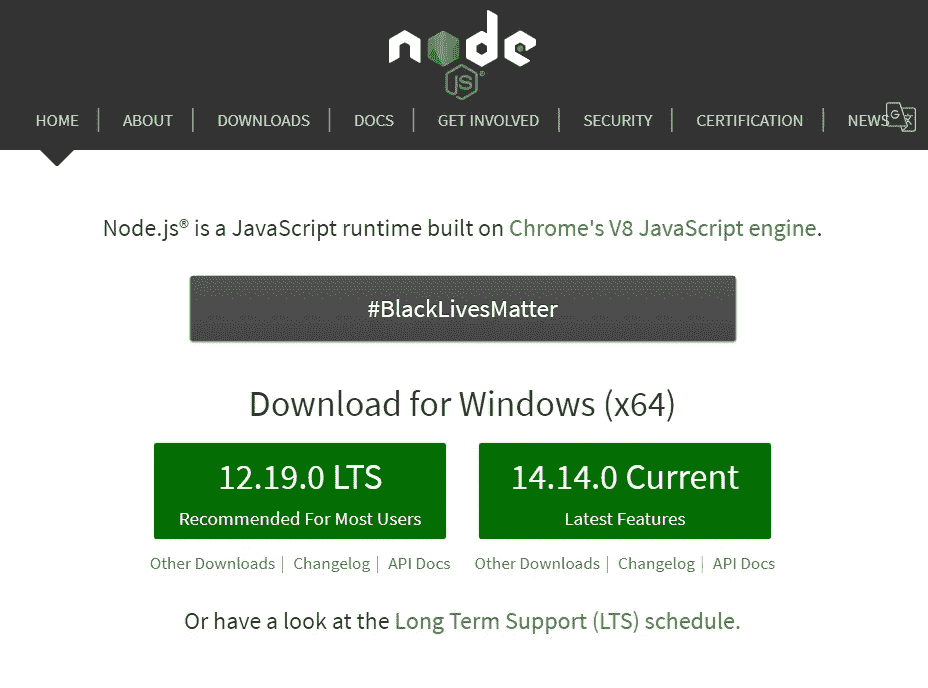
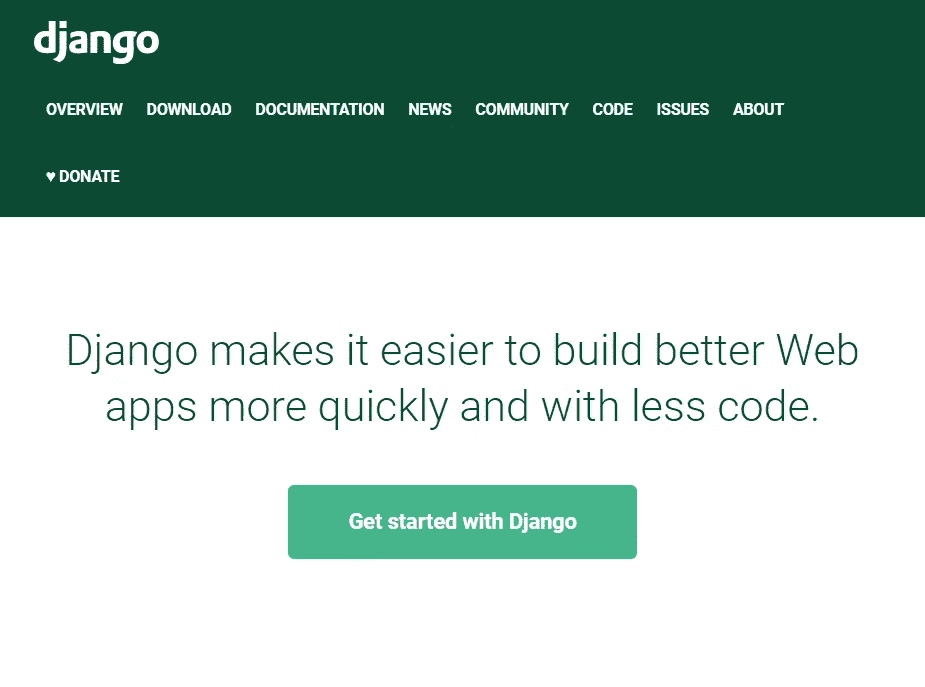
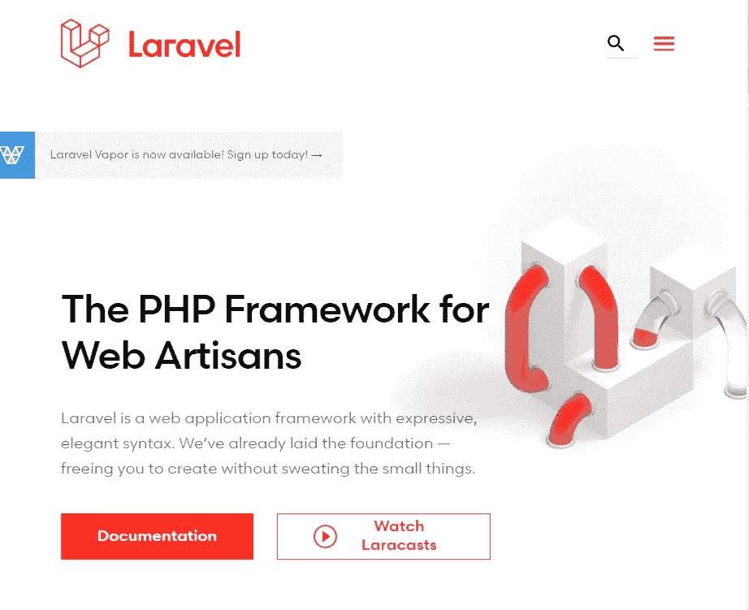
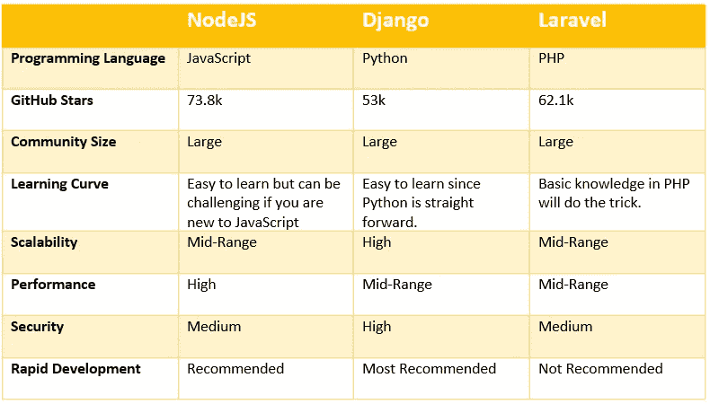

# 2021 年最好的后端开发框架是什么

> 原文：<https://betterprogramming.pub/what-will-be-the-best-backend-development-framework-for-2021-489652dee555>

## Node 对 Django 对 Laravel

照片由[帕特里克·福尔](https://unsplash.com/@patrickian4?utm_source=medium&utm_medium=referral)在 [Unsplash](https://unsplash.com?utm_source=medium&utm_medium=referral) 拍摄

接下来该学什么？如果你是一个开发者，这个问题应该一直在你的脑海里。每天都有新技术推出，现有技术也在不断改进。既然这些技术我们都学不会，那么决定下一步该学什么真的很重要。

在这篇文章中，我将讨论基于三种不同编程语言的三种后端开发框架，让您了解 2021 年应该学习什么。

# 节点. js

来源:https://nodejs.org/en/

NodeJS 是一个 JavaScript 运行时环境框架，可用于跨平台开发。由于 JavaScript 是当前上下文中最流行的语言之一，这种流行也使 NodeJS 成为最常用的后端框架之一。除此之外，NodeJS 带来了许多吸引开发者的重要特性。

*   NodeJS 从不等待 API 返回数据，因为它是异步的。NodeJS 将继续下一个 API 请求，而不等待上一个请求的响应，NodeJS 的事件通知机制负责将响应正确地传递给服务器。因此，NodeJS 被称为**异步**和**事件驱动。**
*   快速代码执行。
*   没有缓冲。
*   虽然 NodeJS 是单线程的，但是高可伸缩性使它能够处理大量的请求。

NodeJS 被世界上一些著名的公司使用，包括易贝，通用电气，GoDaddy，微软，PayPal，优步，维基百科。如果您正在构建 I/O 绑定的应用程序、数据流应用程序、数据密集型实时应用程序(DIRT)、基于 JSON APIs 的应用程序或单页面应用程序，Node JS 是一个完美的匹配。

## **优点**

*   基于大家都很熟悉的 JavaScript。
*   轻松的学习曲线和大社区。
*   包含一个优秀的包管理器。
*   图书馆支持。
*   快速轻松地处理并发请求。
*   简单且可扩展。
*   公认的。

## 不足之处

*   一些开发人员可能很难处理异步请求。
*   嵌套回调。

# 姜戈

来源:[https://www.djangoproject.com/](https://www.djangoproject.com/)

Django 是一个用 Python 编写的开源、高级 web 应用程序框架。Django 于 2005 年推出，其使用 Python 进行 web 开发的想法是一场巨大的革命。Django 遵循模型-模板-视图架构，这个框架的主要焦点是为复杂网站的开发提供一个简单的方法。Instagram、Mozilla、Bitbucket 是一些使用 Django 作为框架的领先公司。

## 优势

*   快速发展。Django 的主要意图之一是减少应用程序的开发时间。
*   Django 有助于避免许多常见的安全漏洞，如 SQL 注入、跨站脚本、跨站请求伪造等。
*   可扩展性。
*   支持大量的库和帮助模块。
*   您不必太担心用户认证和内容管理，因为 Django 会为您处理它们。

## 不足之处

*   与 JavaScript 相比，许多开发人员不具备 Python 方面的专业知识。
*   虽然 Django 是可伸缩的，但是小规模的应用程序可能会有问题。
*   整体框架。
*   Django 不能同时处理多个请求。

# 拉勒韦尔

来源:https://laravel.com/

PHP 是 web 开发人员中另一种著名的语言，Laravel 基于 PHP。Laravel 遵循模型-视图-控制架构，健壮且易于理解。众所周知，Laravel 是年轻开发人员的良好起点。它提供了大量的特性，比如灵活的路由以方便扩展，配置管理以处理不同的环境，查询构建器和 ORM 以查询数据库，模式构建器以维护数据库定义和模式，轻量级模板等等。9GAG，MasterCard，Kmong 是一些在产品中使用 Laravel 的著名公司。

## 优势

*   高度安全。
*   基于 MVC。
*   使用刀片模板引擎。
*   内置授权和认证系统。
*   支持测试自动化。

## 不足之处

*   与 Django 和 NodeJs 相比，内置支持更少，因为 Laravel 是轻量级的。
*   与其他平台相比，社区支持最少。
*   将遗留系统转换成 Laravel 很困难。
*   从旧版本更新到新版本可能会破坏您的应用程序。
*   与网站相比，移动应用中的整页重新加载可能有点重。

# NodeJs vs Django vs Laravel

作者作品

正如您所看到的，所有这三个框架在开发人员中非常流行，大多数时候他们倾向于根据自己喜欢的语言来选择框架。例如，如果你擅长 JavaScript，你肯定会选择 NodeJS。但是在选择框架时，我们还应该考虑其他方面。

如果你是一个开发新手，不了解 JavaScript、Python 或 PHP，那么 Django 或 Python 将是一个不错的选择。因为 Python 的语法非常简单明了，所以你很容易理解它。所以，当谈到学习曲线时，我会把 Django 排在第一位，然后是 Laravel 和 NodeJS。

安全性是我们在任何项目中都需要解决的另一个衡量标准，所有这些框架都提供了内置特性，使开发人员的工作变得更加轻松。在这三个当中，姜戈也是这里的第一名。

如果我们谈论可伸缩性和性能，Django 可以被认为是可伸缩性方面最好的框架，而 NodeJS 提供了最好的性能。

所有这些框架都有很大的社区和很好的文档可以开始使用，并且已经很好地建立了。因此，不要犹豫，为您的项目选择它们。

# 结论

Django、NodeJS 和 Laravel 是基于三种不同语言的三个后端开发框架，它们是这些语言的主要框架。

总之，我认为学习这些框架是一个好主意。但是如果你学习 NodeJS 或 Django，你可以将这些知识用于各种其他目的，比如前端开发、移动应用程序开发、算法、机器学习等等。此外，还有一些其他领先的后端开发框架，如 ASP.NET，也在竞争中脱颖而出。在这三者中，NodeJS 或 Django 将是你未来的最佳投资。