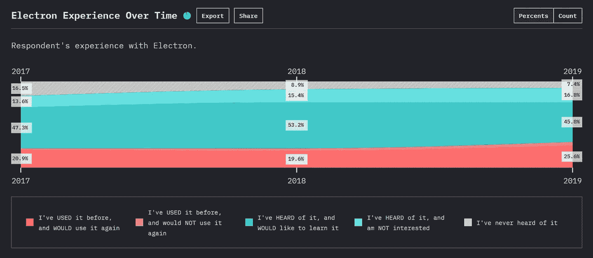
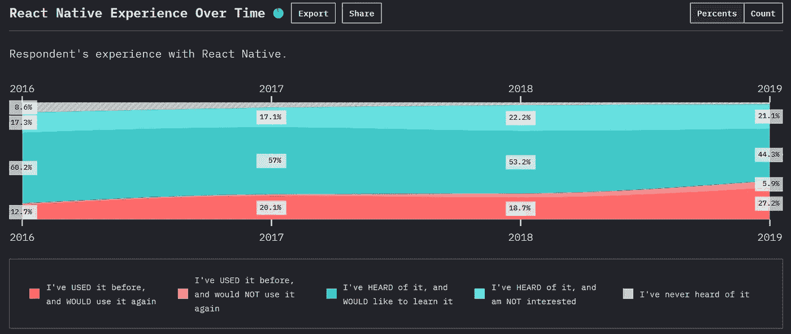
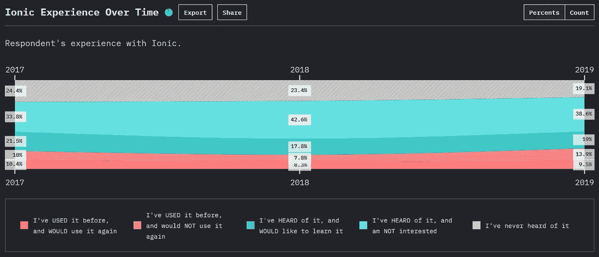
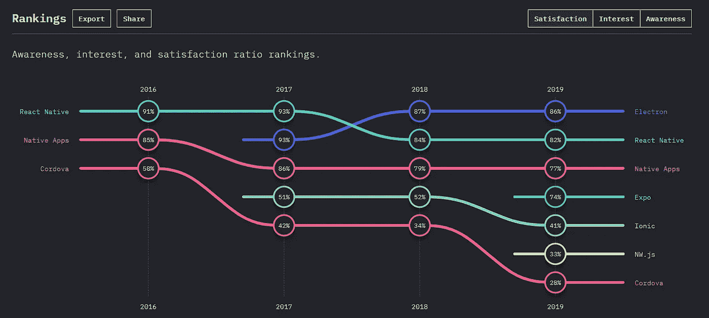

# 2021 年移动和桌面应用最好的 JavaScript 框架会是什么？

> 原文：<https://betterprogramming.pub/what-will-the-best-javascript-framework-for-mobile-and-desktop-applications-be-in-2021-3883571141db>

## 电子、自然反应、离子等等

[梁杰森](https://unsplash.com/@ninjason?utm_source=medium&utm_medium=referral)在 [Unsplash](https://unsplash.com?utm_source=medium&utm_medium=referral) 上的照片

当我们听到 *JavaScript* 这个词时，web 开发是我们脑海中的即时想法，因为 JavaScript 在很长一段时间内一直是 web 应用程序开发中使用最广泛的语言，并且像 Angular、React 和 Vue 这样的框架最近非常有名。

尽管 JavaScript 引领着 web 开发世界，但在移动和桌面应用程序开发世界中，它不得不生活在 Java、C#和 C++的阴影之下。但是大多数人不会注意到的是，JavaScript 对移动和桌面应用程序开发都产生了影响。在本文中，我将讨论一些领先的 JavaScript 框架及其在移动和桌面开发领域的优缺点。

# 1.电子

[Electron](https://www.electronjs.org/) 是我们列表中的第一个，它是 2013 年推出的桌面应用开发框架。Electron 允许开发人员使用 HTML、CSS 和 JavaScript 开发他们的应用程序，这非常类似于 web 开发栈。是不是很酷？还没完:Electron 是 [Node.js](https://nodejs.org/en/) 和 [Chromium](https://www.chromium.org/) 的组合，这种组合可以让你运行任何使用 Electron 的 web 应用或者节点应用。

来源:[https://2019.stateofjs.com/mobile-desktop/electron/](https://2019.stateofjs.com/mobile-desktop/electron/)

## 电子的优势

*   使用 Chromium 来呈现用户界面，这为您提供了更多的功能，比如开发人员工具
*   它的行为就像一个 web 应用程序。
*   可以使用 HTML、CSS 和 JavaScript 轻松开发
*   您可以只关注核心应用程序开发，因为 Electron 会处理所有其他繁琐的初始化步骤。
*   多平台支持
*   使用 npm 模块

## 电子的缺点

*   铬需要很大的空间。
*   安全问题
*   本机依赖关系的跨平台问题

# 2.反应自然

[React Native](https://reactnative.dev/) 是目前最常用的移动开发平台之一。React native 于 2015 年推出，并迅速在 JavaScript 开发人员中传播开来，因为以前他们必须学习 Java 等语言才能开发移动应用程序。这种使用 JavaScript 开发移动应用程序的能力吸引了许多 web 开发人员使用 Native 来开始他们的移动开发之旅。

来源:https://2019.stateofjs.com/mobile-desktop/reactnative/

JavaScript 和 JSX 是 React Native 的主要组件，能够在 Android 和 IOS 平台上使用大部分代码是其大肆宣传的主要原因。React Native 有许多优点，我将列出几个重要的优点如下:

## 反应本地的优势

*   拥有各种包和库的大型生态系统
*   开发时间更短
*   持续更新，由脸书提供支持
*   多平台支持
*   热重装
*   开放源码
*   支持简化的用户界面创建
*   大型社区和文档

## React Native 的缺点

*   在某种程度上需要本地知识
*   与纯本机应用程序相比，可能存在性能问题
*   安全问题

# 3.离子的

[Ionic](https://ionicframework.com/) 是另一个基于 JavaScript 的开源移动开发框架，它与 Angular 也有着密切的关系。Ionic 于 2013 年推出，它的黄金时代伴随着 Angular 的崛起而到来。与 electronic 类似，Ionic 也包含一个 HTML 5 SDK，允许您使用 HTML、CSS 和 JavaScript 开发本地应用程序。Ionic 的主要目标是构建创造性的、用户友好的应用程序，以满足您的应用需求。但可悲的是，随着 React Native 的大肆宣传，我们可以看到 Ionic 用户数量的减少。

来源:[https://2019.stateofjs.com/mobile-desktop/ionic/](https://2019.stateofjs.com/mobile-desktop/ionic/)

## 离子的优势

*   跨平台支持
*   可以使用常见的 web 开发技术轻松开发
*   包含预先设计的组件和主题
*   它简单易学。
*   内置 CLI
*   最新版本的 Ionic 支持 React 和 Vue。

## 离子的缺点

*   不适合高性能应用
*   热重装不可用。
*   安全问题
*   缺乏稳定的插件
*   构建中随机失败是很常见的

# 结论

除了上面提到的框架，很少有其他的框架，像 native apps、 [Cordova](https://cordova.apache.org/) 和 [Expo](https://expo.io/) 可以用来开发移动和桌面应用。下图显示了 JavaScript 2019 年调查的[州的统计数据。](https://2019.stateofjs.com/mobile-desktop/)

来源:[https://2019.stateofjs.com/mobile-desktop/](https://2019.stateofjs.com/mobile-desktop/)

我们可以清楚地看到，Electron 和 React Native 位于顶部，而 Ionic 则远低于 native apps 和 Expo。但在比较中选择 Ionic 的原因是 Ionic 是基于 Angular 的，如果你熟悉 Angular，那就很容易学习 Ionic。

然而，还有许多其他非 JavaScript 框架，如 [Flutter](https://flutter.dev/docs) ，它们在移动应用程序开发竞赛中发展迅速。我认为这些 JavaScript 框架在未来很难跟上它们。如果您有兴趣在不久的将来使用 JavaScript 进行移动和桌面应用程序开发，Electron 和 React Native 将是您的最佳选择。

## 参考

*   [https://2019.stateofjs.com/mobile-desktop/](https://2019.stateofjs.com/mobile-desktop/)