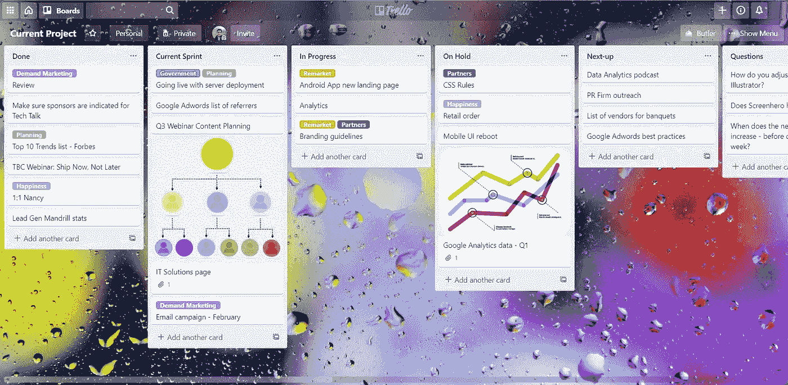
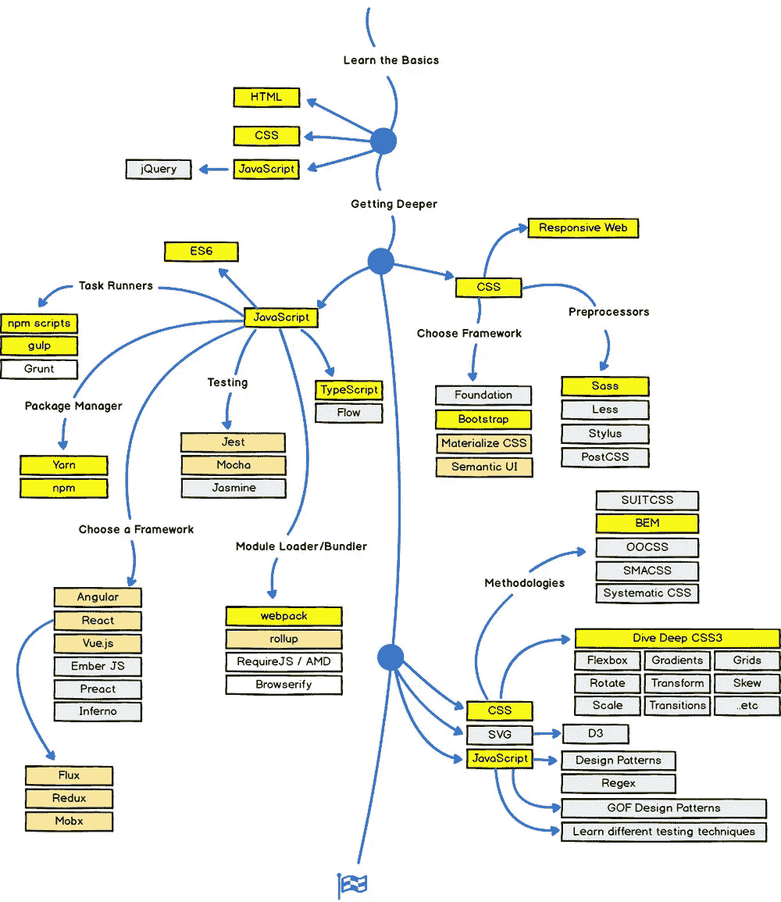

# 在自学一门新的编码语言时，你能做些什么来激励自己

> 原文：<https://betterprogramming.pub/what-you-can-do-to-motivate-yourself-while-teaching-yourself-a-new-coding-language-dbf2e3c5528e>

## 你最强的技能是你自己学习的

照片由[上的](https://unsplash.com?utm_source=medium&utm_medium=referral)[面](https://unsplash.com/@surface?utm_source=medium&utm_medium=referral)拍下

几门 Udemy 课程，无数个小时的堆积溢出，以及令人尴尬的大量愤怒退出之后，我已经获得了相当多的方法，每当我接受一项新技能时，让自己保持专注。在这个艰难的时期，我们看到像纽约这样的城市变成了鬼城，养老院成为令人心碎的新闻来源，我希望这些技术能帮助你让在家学习不再是一种折磨。

# 1.将你的项目分成更小的里程碑

虽然这听起来很老套，但是把你的项目分成小项目会让它不那么令人生畏。对于初学者来说，由于独特的语法，学习一门新语言变得势不可挡。分而治之的好处是完成那些较小的项目会给你一种成就感，让你保持动力。

对于小规模或爱好活动，我会推荐使用 [Trello](https://trello.com/home) 进行项目管理。它有一个干净的，高度可定制的界面，有几个模板可供选择。我个人用的一个是[这个](https://trello.com/b/DnZvFigA/agile-board)。

将任务从“进行中”转移到“完成中”会给你一种成就感，让你保持动力。

# 2.使用在线网站获取灵感，而且只能获取灵感

这是给有抱负的网络开发者和 UX 开发者的。像 Dribbble 和 awwwards 这样的资源对你偶尔的动力很有帮助。然而，认为你只学了一周就能达到那种水平是不切实际的。这些项目背后的人有几十年的经验，而这些网站却没有表现出来。我并没有从所有为网页设计做出贡献的天才创作者那里拿走任何东西，但是把他们的工作作为你学习过程的目标只会让你失去兴趣，因为你开始意识到获得那种技能水平需要很多时间。

我在浏览 Dribbble 和 awwwards 时使用的一个技巧是保存我喜欢的。然后，我剖析每个项目的组成部分，思考如果我是设计它的人，我会做得多么不同。如果我最终发现了一个独特的设计特点或技巧，我会把它写下来供以后参考。这样做一段时间后，你将会拥有一本属于你自己的设计技巧小书。

# 3.聪明地工作，而不是努力

学习一个新的框架或一门语言不一定是朝九晚五的工作。一头扎进学习新东西是很诱人的。然而，考虑到当今所有的语言及其不同的框架是多么复杂，停止不知所措和迷失的唯一方法是规划出你的道路。

确定你的最终目标——你想用这种语言实现的特定功能。例如，如果你是第一次接触 Python，选择你是否打算做 web 开发，在这种情况下，你应该向学习 Django 迈进。或者你想从事机器学习，为此你需要 Numpy 和 Pandas，然后才能进入更多的专家库。找出这样的途径将使你保持专注，而不是在没有获得任何专业知识的情况下在框架之间跳跃。

GitHub 用户 Kamranahmeds 制作的路线图(T0)是我在 web 开发过程中使用的。

# 4.为自己建立一个奖励系统

由[本·怀特](https://unsplash.com/@benwhitephotography?utm_source=medium&utm_medium=referral)在 [Unsplash](https://unsplash.com?utm_source=medium&utm_medium=referral) 上拍摄

这种技术与将您的项目分成更小的里程碑密切相关。不要没完没了地编码，而是设计一个奖励系统，在你每次实现你的小目标时给自己一点奖励。奖励可以是任何东西，取决于你喜欢做什么。它可以是你一直想看的一集你最喜欢的节目，去你最喜欢的公园，或者是像吃你最喜欢的糖果一样的小事。

成就感和对回报的期待导致多巴胺的释放，这将防止你对自己的项目失去兴趣。据 [WebMD](https://www.webmd.com/mental-health/what-is-dopamine#1) ，

> 多巴胺在我们感受快乐的过程中扮演了一个角色。这是我们人类独特的思考和计划能力的很大一部分。它帮助我们奋斗，集中注意力，并发现有趣的事情。

不管你的回报是什么，重要的是回报的前景，以及导致那一刻的动力。

这些技术不是魔法药水的成分(我希望它们是！)，所以他们不打算这样工作。然而，在我的工作流程中使用它们几年后，我注意到我的效率有了轻微的提高，从长远来看，这些加起来会产生巨大的变化。我希望它们对你也有用。

祝你的编码之旅好运！