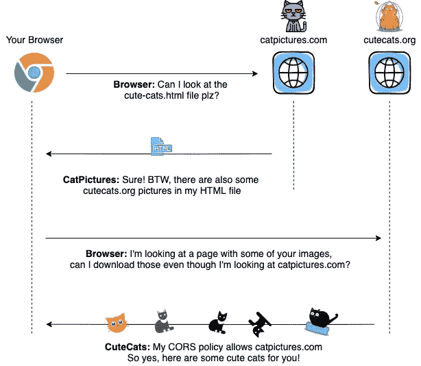
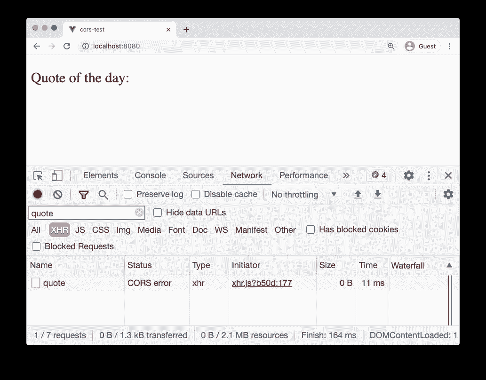
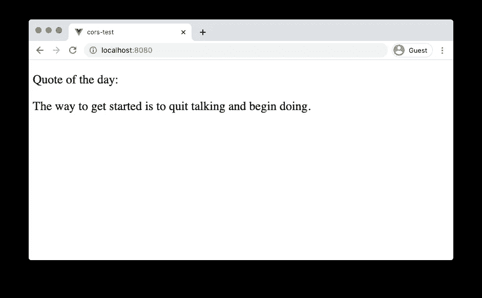
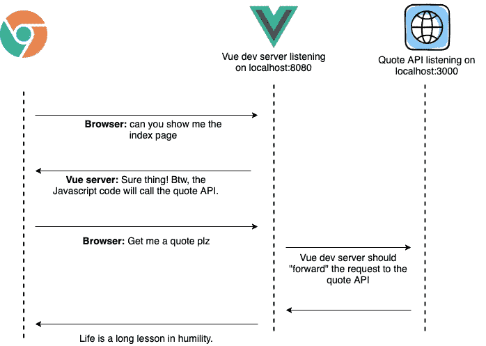

# 关于 CORS 和 Vue.js 你需要知道什么来增加浏览器的安全性

> 原文：<https://betterprogramming.pub/what-you-need-to-know-about-cors-and-vue-to-boost-browser-security-7c216252b20d>

## 使用 CORS 框架增强您的浏览器端保护


[车头时距](https://unsplash.com/@headwayio?utm_source=medium&utm_medium=referral)对[车头时距](https://unsplash.com?utm_source=medium&utm_medium=referral)拍照。

这周我在开发一个前端应用程序，发现了一些 CORS 错误。我以前遇到过这些错误，但是我从来没有真正想过为什么跨域共享是危险的。

我知道这与安全有关，但细节对我来说有点模糊。所以，我决定研究一下，写一篇关于 CORS 的深度文章，并提供一些例子。

让我们开始吧

# **什么是 CORS？**

CORS 主张跨产地资源共享。它是一种机制，允许服务器指示哪些其他域可以访问它们的资源。

资源可以是任何东西。一个图像、一个 API 请求，甚至加载一个外部 iframe。

我创建了一个图表，概述了在互联网上搜索猫图片时可能发生的(简化的)真实世界 CORS 场景:



作者照片。

# 建立一个 CORS 范例

猫是伟大的，但让我们建立自己的简单的例子。我将在 Node.js 中创建一个 quote API。这个 API 有一个单独的`GET /quote`端点，它返回一个鼓舞人心的报价。

我创建了这个返回报价的小节点脚本。它使用 [Express.js](https://expressjs.com/) 来创建服务器:

让我们通过使用`curl`调用 API 来测试它是否工作:

```
curl localhost:3000/quote{"quote": "The way to get started is to quit talking and begin doing."}
```

如您所见，目前还没有问题。简单的 API 可以工作。

# 从浏览器调用 API

首先要理解的是，CORS 只影响来自浏览器的请求。这就是为什么我们简单的`curl`请求没有任何问题——我们没有使用网络浏览器。

让我们创建一个调用我们的 API 的非常简单的 Vue 应用程序。我还将安装 Axios，这是一个执行 HTTP 请求的包:

```
vue create cors-test
cd cors-test
npm i axios
```

我修改了`App.vue`文件来调用我们的报价 API:

Vue 有专门的开发服务器。运行以下命令时:

```
npm run serve
```

Vue 将启动一个简单的网络服务器，监听端口`8080`并为前端服务。这对于简单的开发来说是非常好的，但是当我们调用我们的 API 时会遇到问题。

让我们打开 [http://localhost:8080](http://localhost:8080) 页面:



我们可以看到没有加载报价，浏览器给出了一个 CORS 错误。这是因为`http://localhost:8080`和`http://localhost:3000`被认为是不同的域，因此 CORS 策略开始起作用。

# 如何修复 CORS 错误

有多种方法可以修复 CORS 错误。

## 1.允许来自服务器的 CORS 请求

使用`Access-Control-Allow-Origin`头，我们可以指定哪些来源可以使用我们的 API。

我们可以将它设置为`http://localhost:8080`以允许我们的 Vue 应用程序调用它:

让我们再试一次！



我们看到浏览器被允许访问 API。

注意，您也可以指定一个通配符`*`来允许任何域访问 API。

## 2.发展代理人

在开发过程中，您经常会看到后端服务器与前端服务器运行在不同的端口上。

我们的例子也是如此，前端服务器运行在`localhost:8080`上，后端服务器运行在`localhost:3000`上。

在生产环境中，我们可能会将这些应用程序部署到同一个域中(`quotes.org`服务于前端应用程序，`quotes.org/api`服务于 API)。在这种情况下，生产环境中不会出现 CORS 问题，因为所有东西都在同一个域中。

对于 CORS 问题只存在于开发服务器上的情况，我们可以设置一个开发代理:



作者照片。

要设置这个代理系统，我们可以在 Vue 项目的根目录下创建一个`vue.config.js`文件:

然后我们还应该更改`App.vue`文件:

当运行所有内容时，我们再次在浏览器中看到一个报价！

[查看 Vue 文档](https://cli.vuejs.org/config/#devserver-proxy)，了解调整本地代理服务器的所有方法。

## 3.生产代理

假设 quote API 是由一家名为 Quote Inc .的公司开发的，在这种情况下，您无法访问源代码。

您可以像我们在上一步中所做的那样在您的 Vue 应用程序上设置代理，但是一旦您将应用程序部署到生产环境中，这将不再有效，因为您不再使用 Vue dev 服务器。

现在有很多方法可以解决这个问题。您可以在您的产品 Nginx 或 Apache 配置文件中设置一个代理。

解决这个问题的另一种方法是从您自己的本地 API“转发”API 请求。例如，在我们的节点服务器中，我们可以保留`Get /quote`端点，并从那里简单地调用 Quote Inc. API。

这里，我们不会遇到任何 CORS 问题，因为我们是从节点服务器(而不是从浏览器)调用 API 的:

在这种情况下，我们仍然可以从浏览器中使用对 CORS 不友好的报价公司 API！

# 为什么 CORS 甚至在那里？

解决 CORS 问题可能有点令人头痛。为什么它会在那里？

要知道的最重要的一点是，浏览器在发出请求时会自动向服务器发送 cookie 数据。这意味着，如果您登录脸书并访问 malicious-cats.com，卡特彼勒网站可能会向脸书发送跨网站请求。

假设 malicious-cats.com 试图代表您向`facebook.com/post-message`端点发送一个请求，在您的墙上写了一个帖子，说“我爱 Mali couss-cats . com！”

即使 malicious-cats.com 不能查看您的脸书饼干，它仍然可以使用它们，因为浏览器会将它们附加到对 facebook.com 的请求中。

这是一个稍微简化的例子。现在有更多的安全措施来阻止这种情况，比如 [CSRF](https://en.wikipedia.org/wiki/Cross-site_request_forgery) 或者[访问控制-允许-凭证](https://developer.mozilla.org/en-US/docs/Web/HTTP/Headers/Access-Control-Allow-Credentials)标题。但它确实说明了允许 CORS 请求的基本危险。

# 结论

我们已经了解了 CORS 请求到底是什么，如何修复最常见的错误，以及为什么要创建这个系统。

如果你想了解更多关于 CORS 的信息，我会推荐关于这个主题的[优秀的 MDN Web Docs](https://developer.mozilla.org/en-US/docs/Web/HTTP/CORS) 页面。

快乐编码！