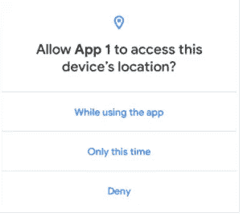
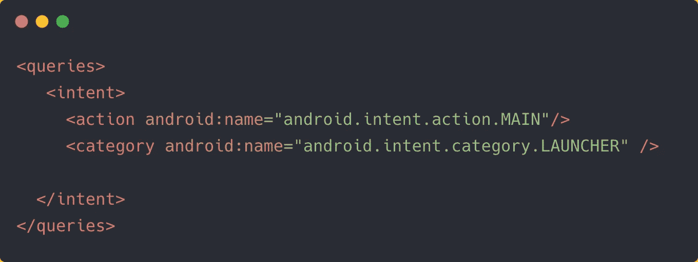
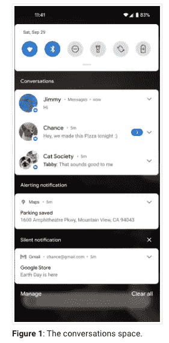

# 让你的应用为 Android 11 做好准备你需要知道什么

> 原文：<https://betterprogramming.pub/what-you-need-to-know-to-get-your-apps-ready-for-android-11-de54f1578ee4>

## 面向开发者的 Android 11 清单

由[克里斯蒂安·威迪格](https://unsplash.com/@christianw?utm_source=medium&utm_medium=referral)在 [Unsplash](https://unsplash.com?utm_source=medium&utm_medium=referral) 上拍摄的照片

Android 11 目前处于测试阶段，计划于 2020 年第三季度公开发布。

从能够支持设备录音的原生屏幕记录器，到预定的黑暗模式和以气泡形式查看消息通知，Android R 今年将推出许多令人兴奋的新变化。

隐私一直是下一次 Android 更新的主要焦点，这意味着开发者的工作已经被削减了。

在接下来的几节中，我将带你浏览一份清单，供你在为 Android 11 发布下一款应用时参考。

# 权限现在有了'**只有这一次'选项**

Android 11 提升了其权限模型，包括一次性权限，让用户可以更精细地控制他们的位置、摄像头、麦克风和其他系统权限访问。

这意味着如果用户关闭应用程序并重新打开它，权限对话框将在访问相关系统控件之前再次提示。

值得注意的是，如果用户将你的应用程序放在后台，在活动或服务运行时，权限仍然会保持不变。

这使得处理系统资源访问变得更加重要，因为它可以随时被终止。

[来源](https://developer.android.com/preview/privacy/location)

# 系统现在将自动撤销未使用应用程序的权限，并在重复“拒绝”时隐藏对话框

Android 11 系统现在更加强调数据和隐私。几个月没有使用某个应用程序的用户可能不知道它过去被授予的权限。

因此，为了让用户更有意识地控制他们的资源，系统会自动重置所有未使用的应用程序的权限。

在这样做的时候，开发者可能会遇到后台服务的障碍，这些后台服务需要这些权限来执行同步数据或获取位置等任务。

幸运的是，您可以从设置中通知用户禁用权限的自动撤销。你需要做的就是使用`[Intent.ACTION_AUTO_REVOKE_PERMISSIONS](https://developer.android.com/reference/android/content/Intent#ACTION_AUTO_REVOKE_PERMISSIONS)`启动一个意向到应用的设置页面。

此外，调用`isAutoRevokeWhitelisted()`方法来确定应用程序权限的状态。

Android 11 运行时权限流的另一个重要变化是引入了隐式的“不要再问”。直到 Android 10，开发者可以在每次用户按下拒绝键时提示许可请求。现在，如果用户连续多次点击拒绝来获得特定的权限，这个动作意味着“不要再问了”

# 单独的后台位置权限

Android 11 中你需要解决的第三个大变化是后台位置权限的处理。

我们知道 Android 10 需要在清单中定义一个新的权限`ACCESS_BACKGROUND_LOCATION`来请求后台位置。

Android 11 现在带来了一个新的流程，其中要求开发人员对后台位置的使用进行更多的描述。这意味着使用`ACCESS_FINE_LOCATION` 或`ACCESS_COARSE_LOCATION`调用的权限请求对话框将只允许在使用应用程序时访问位置。

对于后台定位请求，您必须使用`ACCESS_BACKGROUND_LOCATION`单独调用`requestPermission`方法。这将把用户带到应用程序的设置页面，在那里他们可以允许它。“设置”页面现在显示了一个新选项，“允许所有时间”，如果用户选择授予完整位置访问权限。

需要注意的是，同时调用前台和后台位置请求或者在前台请求之前调用`ACCESS_BACKGROUND_LOCATION`将被系统忽略。

# 包可见性限制

Android 11 通过强迫开发者指定他们希望明确交互的应用程序来提升隐私。

为此，您需要在清单文件中的新的`<queries>`元素内指定这些应用程序的`<package>`名称。但是您也可以指定`<intent>`类别来允许访问一组应用程序。

因此，为了访问设备上的所有应用程序，您需要在清单文件中指定以下内容。

在 Android 11 中调用`queryIntentActivities()`只会返回那些在`queries`中定义的应用。

如果您的应用程序属于浏览器、启动器或安全应用程序，您可能希望访问已安装设备上的所有应用程序，而不是每次都手动添加查询和更新您的应用程序。在这种情况下，需要指定一个新的权限`android.permission.QUERY_ALL_PACKAGES`。

请注意，如果你使用隐式意图与其他应用程序交互，Android 11 中的上述包可见性限制不会影响你的应用程序。

# 改进的范围存储实现

在 Android 10 引入作用域存储之前，开发人员可以读取系统存储中的敏感数据，也可以在任何地方写入文件，这导致了存储混乱，因为即使在应用程序卸载后，文件也会保留。

引入作用域存储是为了防止开发人员滥用完全存储访问。它确保每个应用程序都有自己指定的目录。

但是在发布的时候，作用域存储要求你使用[存储访问框架](https://developer.android.com/guide/topics/providers/document-provider)来访问你的应用目录之外的文件。从本质上讲，`java.io.File` API 不再工作了。这导致了开发者社区的强烈反对。像批量删除文件这样的事情变得很麻烦—用户必须手动确认对系统中每个文件的访问。

但令人高兴的是，在 Android 10 中，作用域存储实现成为可选的。您可以在清单中指定`android:requestLegacyExternalStorage=true`来退出它。

但是从 Android 11 开始，使用作用域存储现在是强制性的。

因此，Android 通过重新引入`java.io.File` API 使得直接访问文件路径变得更加方便。

还有，Android 11 带来了新的媒体商店 API 进行批处理:`createWriteRequest()`、`createTrashRequest()`、`createFavoriteRequest()`。要了解更多信息，请参考“[Android 11 中的存储更新](https://developer.android.com/preview/privacy/storage)”

回收站请求引入了一种新的隐藏回收站机制，在完全删除文件之前，将已删除的文件在系统中保留一段定义的时间。

需要完全填充权限的应用程序(如第三方安装程序)需要在`AndroidManifest.xml`文件中指定新的`[MANAGE_EXTERNAL_STORAGE](https://developer.android.com/reference/android/Manifest.permission#MANAGE_EXTERNAL_STORAGE)`权限。

# 新对话通知

通知是当今每个应用程序不可或缺的一部分。Android 11 现在带来了聊天消息通知的专用部分。

[来源](https://developer.android.com/preview/features/conversations)

如果您的应用程序包含聊天功能，您需要确保将相应的通知设置为`[MessagingStyle](https://developer.android.com/reference/android/app/Notification.MessagingStyle)`，以便在对话空间中显示它。

此外，为了确保对话通知可以显示为气泡，您需要为该通知设置一个关联的`shortcutId`。

对话通知还提供了一些快捷功能，如暂停、自动回复和优先处理特定聊天。

# 主屏幕上的拜拜祝酒词和 API 变化

敬酒已经存在很长时间了。尽管出现了小吃，但祝酒词仍被大量使用和滥用。例如，由于祝酒词不需要绑定到某个活动，开发人员甚至可以在应用程序处于后台时显示它们。

Android 11 已经完全屏蔽了从后台发送时显示自定义祝酒词的功能。

此外，文本祝酒不再支持`setView`。对它们执行`getView()`将返回 null。

我们不能再为祝酒词文本设置边距和重力。

Android 11 中 Toasts API 的一个重要新增功能是新的`addCallback()`方法来监听 toast 的出现和消失。

# 结论

Android 11 注重隐私，尽管包可见性限制不会真正防止应用程序不交互，但其余大部分功能都是为了提高 Android 应用程序的安全性。

希望你顺利迁移到 Android 11。

这一次到此为止。感谢阅读。