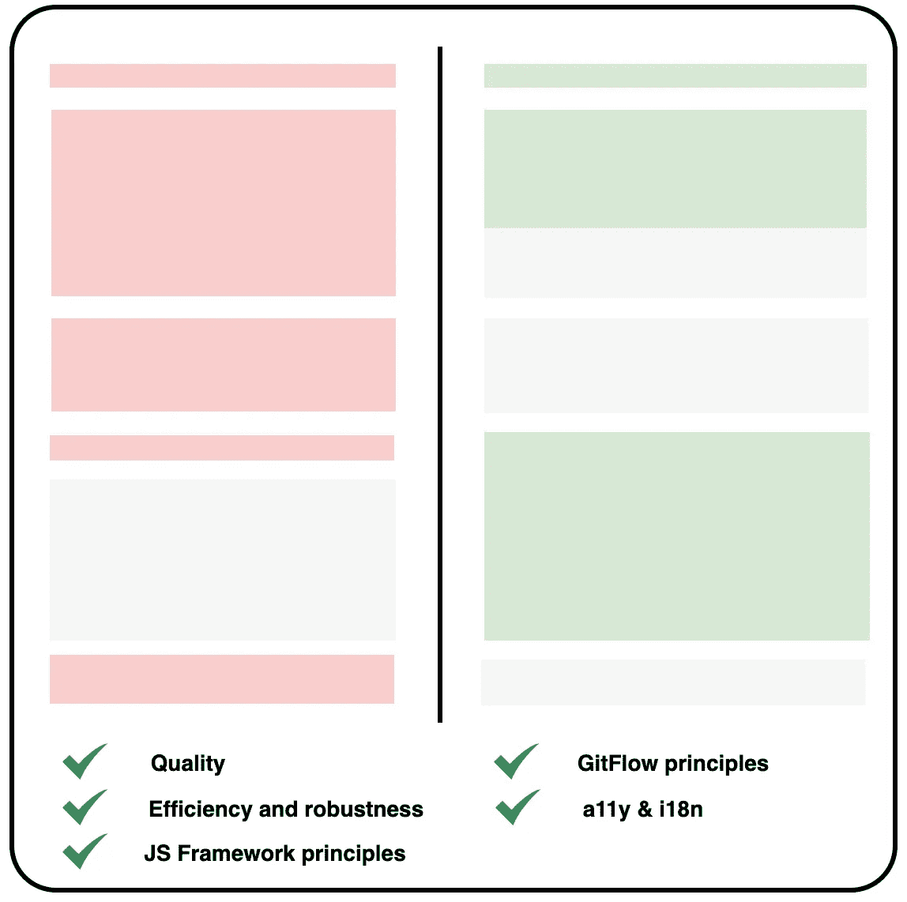

# 在前端代码评审中您应该检查什么

> 原文：<https://betterprogramming.pub/what-you-should-inspect-in-a-front-end-code-review-4010e1bc285a>

## 开发者体验

## 质量代码清单，包括 Angular/React/Vue.js 示例


阿伦·范·德·波尔在 [Unsplash](https://unsplash.com/s/photos/abstract?utm_source=unsplash&utm_medium=referral&utm_content=creditCopyText) 上的照片

如果你是一个前端团队的一员，有几个人才(包括你)，每天可能会有数百个提交。事实上，无论您使用什么团队方法来交付新特性，每个开发人员都在开发特定的功能。

为了验证他们的更改，开发人员应该请求一个合并请求(或拉请求)来将这些更改合并到公共分支(用于引用的分支)。其他前端开发人员会做代码审核。

代码审查非常重要，原因有四:

*   您可以检查代码是否满足规范。
*   您被告知代码修改，这将潜在地引导您在活动分支上改变您的修改或者建议一些增强。
*   保证代码质量是一个很好的实践。
*   这是一种分享经验、技巧和编码技能的方式。

让我们一起来看看您在下一次前端代码审查中应该检查什么。



图片来源:作者

为了回顾代码变更，我们将关注五个主要主题:

*   代码的质量
*   代码的效率和健壮性
*   JS 框架原则得到尊重了吗？
*   GitFlow 原则
*   可访问性(a11y)和国际化(i18n)

# 代码的质量

源代码的质量水平总是很难评估，尤其是当它涉及到几个文件，并且在更广的层面上，涉及到整个应用程序时。

不管怎样，好的代码必须遵循一般的软件开发原则，不管是什么语言。以下是其中的一些。

## 干燥和代码分解

如果我们被问及想到的软件开发中的第一条编码规则，我们肯定会干巴巴地回答:不要重复你自己。避免代码冗余是一个关键原则。

查找代码重复包括检查源代码，找出在一个文件或一堆文件中重复多次的代码片段。它可以采用常量值、语句或一组静态值的形式。

然后，您可以建议用一个包含静态值或 helpers/util 函数的新文件来分解这些代码行，这些文件在项目中的任何地方都可以访问。

利用 Javascript 框架的技术和特性是一个好习惯。无论您使用 Angular、React 还是 Vue.js，它们都提供了分解代码片段的工具。您应该检查一个方法是否可以重用为:

*   一款[米欣](https://vuejs.org/v2/guide/mixins.html)
*   一个[角度](https://angular.io/guide/attribute-directives)或 [Vue](https://vuejs.org/v2/guide/custom-directive.html) 指令
*   一个[过滤器](https://vuejs.org/v2/guide/filters.html)或一个[管道](https://angular.io/guide/pipes)
*   有角度的[服务](https://angular.io/tutorial/toh-pt4)
*   一个反应过来的[钩子](https://reactjs.org/docs/hooks-intro.html)

此外，可以将重复的模板提取到一个专用组件或一个[片段](https://reactjs.org/docs/fragments.html)(如果使用 React)中，以便根据需要重用。这遵循 React 的[组件专门化](https://reactjs.org/docs/composition-vs-inheritance.html#specialization)规则。

## 有意义的评论

干净的代码不言自明。

这就是为什么干净的代码不应该包含注释。变量名和方法名应该是超显式的。在这种情况下，阅读代码可能类似于阅读一本书——但情况并非总是如此。

实话实说吧。每个项目都有自己的特点，应该加以评论。欢迎有意义的评论来解释是怎么回事。但是什么是有意义的评论呢？

它应该写在两行上。第一个解释了这种情况(我们为什么要这样做)。然后第二个指示面对问题的行动。例如，假设我们必须自动认证一个用户:

```
*// If a network error occurred because no cookie
// Login again with JWT (JSON Web Token)*if (err.message.includes('Missing Session token') && jwt) {
  await loginUser(jwt);
  doSomethingElse();
}
```

另外，寻找注释代码并抑制它们！事实上，注释一段代码以便以后激活它或者避免丢失它是一种常见的习惯。坦率地说，它在 10%的时间里是有用的，所以你可以毫无疑问地建议删除它们。如果以后需要，您可以参考 Git 历史来检索代码片段。删除这些注释将节省你滚动的时间，并避免文件中不相关的代码。

## 巧妙的样式表

CSS 不仅仅是一组给内容块赋予颜色或者在 DOM 中布局的规则。它附带了一些在你的项目的每一个组成部分中都必须遵循的策略。

必须在每个模板中设置一个清晰的 CSS 结构，有明确的、有意义的类名。例如，检查是否使用了有状态的名称:

```
<div class="phone-field**--is-error**">For input with error</div>
<div class="phone-field**--is-success**">For input with valid value</div>
```

新的样式表语言如 [Sass](https://sass-lang.com/) 、 [Less](http://lesscss.org/) 和 [Stylus](https://stylus-lang.com/) 允许您创建可重用的 CSS 类，这要归功于类的组合、变量和混合。使用他们的超能力会节省你的时间和精力。那么检查 CSS 的改进是为组件制作可重用的布局和外观的好办法。

对智能样式表的另一个潜在检查是关于模板中类的使用。事实上，使用 CSS 类定义的对象语法可以增强代码的可读性。

下面是 CSS 类定义的对象语法的文档: [Angular](https://angular.io/guide/attribute-binding#class-binding) ， [React](https://reactjs.org/docs/faq-styling.html) ， [Vue.js](https://vuejs.org/v2/guide/class-and-style.html#Object-Syntax) 。

## 单元测试呢？

我们永远不会停止说:一段好的代码是用单元测试来测试的。

这些单元测试检查执行可能运行的每个分支。它确保了良好控制的代码基础，并允许您在引入修改时快速检测潜在的回归。

测试是计算机科学中一个独立的领域。许多来自软件开发的关键原则应该应用到测试中，比如 DRY(前面看到的)和 KISS(保持愚蠢和简单)。

像 [Jest](https://jestjs.io/) 、 [Mocha](https://mochajs.org/) 、 [Chai](https://www.chaijs.com/) 和 [Jasmine](https://jasmine.github.io/) 这样的单元测试库提供了大量的方法来简化单元测试。如果你想通过 e2e(端到端)集成测试来扩展你的测试电池，拥有超级友好和直观 GUI 的 [Cypress](https://www.cypress.io/) 是一个不错的选择。

一个基本的验证可以是检查测试设置或后清理语句是否没有重复多次。`beforeEach`和`afterEach`是分别准备和后期清理操场的适当方法(由单元测试框架提供)。

测试命名也有其重要性。关于命名的一个良好实践是选择以下技术之一，并坚持使用:

```
it('SHOULD do something WHEN myVariable is true')# ORmyMethod_SHOULD_return_true_WHEN_myVariable_is_true()
```

# 代码的效率和健壮性

代码的效率和健壮性是获得一个良好控制和无 bug 的代码库的主要关键。它基于开发人员的编码习惯和技能，这些都是随着经验而来的。

## 处理意外值

即使你 101%确定一个值总是被定义或者有一个期望值，在你的项目中的某个点上不会是这种情况。事实上，项目和应用程序会不断发展，可能会出现一些意想不到的价值。

这就是为什么通过执行以下操作来防止这些情况发生非常重要:

*   检查对象属性中的`null`或`undefined`值。如果你使用的是 [Typescript](https://www.typescriptlang.org/index.html) 或 [Babel 的可选链接](https://babeljs.io/docs/en/babel-plugin-proposal-optional-chaining)，使用`?`语法会非常简单。
*   确保在使用`switch-case`语句处理意外值时提供了`default`案例。
*   对`if — else if — else`条件指令进行上述操作。

## 让条件语句清晰易读

条件指令中有效的验证和清晰的逻辑将有助于代码的可读性。

然后，确保有一个合理的和合乎逻辑的方式在条件。也许是验证太复杂，也许是不够安全…

建议创建一个专用方法，使条件更具可读性。另外，它可以在其他地方重复使用。

## 分解组件

在几个组件或单个组件模板中找到相似的模板是很常见的。一个好的做法是将这些代码提取到一个专门的组件或者一个可重用的模板中。

Angular 提供了`ng-template`或`ng-container`元素来创建可重用的模板。

根据定义，React 倾向于创建新的专门化组件。如果您喜欢可重用的模板，您可以在文章“[如何在 React JS](https://medium.com/javascript-in-plain-english/how-to-build-reusable-layouts-in-react-js-daf8adcbca79) 中构建可重用的布局”中找到方法

Vue.js 不提供这样的东西，但是你可以创建一个专用的组件，或者遵循 Anthony Gore 在他的文章"[扩展 Vue 组件模板](https://vuejsdevelopers.com/2020/02/24/extending-vuejs-components-templates/)中的建议。

# JS 框架原则得到尊重了吗？

当处理创建动态的和用户友好的 web 应用程序时，JS 框架是不可避免的。他们是前端开发领域的游戏改变者。每个框架都有自己的原则、规则和约定。因此，您需要检查这些标准是否得到遵守。

## 命名约定

应该遵守命名约定，以便能够识别文件的内容或变量的用途。

以下是每个框架的非详尽检查列表:

`**Angular**` ( [更多详情在此](https://angular.io/guide/styleguide))

*   文件名以`component`、`directive`、`filter`、`service`或`module`为后缀
*   可观察变量以`$`结尾
*   类构造函数中的私有参数以下划线为前缀

`**React**` (更多详情[此处](https://css-tricks.com/react-code-style-guide/)和[此处](https://xcidic.github.io/coding-guidelines/react/))

*   对 React 组件使用 PascalCase，对组件实例使用 camelCase
*   避免出于不同目的使用 DOM 组件属性名

`**Vue.js**` ( [更多详情在此](https://vuejs.org/v2/style-guide/))

*   组件文件名和`name`是“pascal 大小写”(例如`MyComponent.vue`)
*   Vue 实例中的函数或变量以`$`(如`this.$route`或`this.$emit`)开头，因此最好不要添加以该字符开头的自定义函数或变量。

## 生命周期挂钩、数据流和访问器

JS 框架是根据几个控制组件状态和行为的生命周期挂钩构建的。需要恰当地使用它们来避免意外的无限循环或内存泄漏。

例如，在 Angular 中，您需要在使用`Subscriptions`时检查`OnDestroy`生命周期挂钩是否通过调用`unsubscribe`方法取消了所有订阅。

在 Vue.js 中，`beforeRouteEnter`守卫(或任何路线守卫)最终应该调用`next`方法来导航。这也关系到棱角分明的防护装置。

在 React 中，您应该检查一下`componentWillMount`和`componentWillUpdate`生命周期方法的用法，由于误解，它们现在已经被[弃用了](https://reactjs.org/blog/2018/03/27/update-on-async-rendering.html)。

`render`方法在类组件中是强制的。它不能修改组件状态。[更多详情可在此处找到](https://reactjs.org/docs/react-component.html#render)。

再次在 Vue.js 中，您应该检查`computed`中的`data`属性变化，这是一个主要的反模式实践。计算属性只是数据存取器，而不是更新值。这可以应用于角度`getters`。

# GitFlow 原则

如果您不熟悉这个术语，那么 *GitFlow* 意味着您已经设置的管理同一代码库的多个版本的策略。有一个参考分支和它的许多副本，有它们的特性。

必须应用关于此策略的通用规则，并且必须遵循这些规则以避免代码丢失或冲突。在每一次代码审查中，必须尊重 GitFlow。

## 每次提交都不应该破坏应用程序

这与其说是对代码审查的检查，不如说是建议。事实上，每一次提交都不能引入构建时间或运行时错误。

如果出于某种原因，您需要回滚到某个特定的提交，而这个会触发故障诊断，那么它会将所有源代码弄得一团糟。

这就是为什么这是一个更好的方式，以微小但可控和清晰的变化频繁提交。

## 检查涉及的分支

合并请求涉及两个分支是不足为奇的:包含变更的分支和引用分支。

两个都检查一下是个好主意。事实上，由于我们对创建分支没有限制，因此很容易出现错误。这可能来自各种原因:

*   错误的参考分支(例如，如果有子分支)
*   拼写错误
*   要合并的重复分支(如果出于任何原因已经创建了要合并的分支的副本)

避免引入不需要的代码片段的两个良好实践是:

*   通过在票号前添加前缀来明确命名特性分支(如果您使用票务平台，如 [GitLab](https://gitlab.com/) 、 [GitHub](https://github.com/) 、 [JIRA](https://www.atlassian.com/software/jira) 或[Azure devo PS Services](https://azure.microsoft.com/en-us/services/devops/))
    例如:`287-add-tracking`
*   将您的引用分支合并到要先合并的分支中。这将有助于检测本地分支机构中的潜在错误和冲突。因此，引用分支受到保护，合并将受到控制。

## 在本地测试分支

这是一种积极的做法，但它应该是一种反射。通过检查来本地测试分支是一个很好的习惯。

使用简单的命令`git checkout my-feature-branch-to-test`并运行应用程序将允许您在构建应用程序时在本地检测错误。当然，这将是一种验证规范是否得到满足的简便方法。

然而，让我们诚实地说:这需要时间，在一个上市时间必须尽可能短的世界里，这种做法经常被放弃。

# 可访问性(a11y)和国际化(i18n)

广泛思考！一个 web 应用程序可能会被很大一部分人访问，包括来自世界各地的人。通过在代码中添加一些属性来包含有视觉障碍、运动障碍和其他障碍的人，将会改变您为他们提供的体验。

可访问性(a11y)和国际化(i18n)已经成为前端开发的关键概念。如果你对这些特性没有印象，你可以参考我以前的文章“[你可能错过的前端特性](https://medium.com/better-programming/the-front-end-features-you-might-have-missed-38f3ad1360a9)”用户体验部分。

## 辅助功能属性

您应该确保存在 a11y 属性，例如:

*   `alt`对于图像，一个 [HTML 属性](https://developer.mozilla.org/en-US/docs/Web/HTML/Element/img)用于替代文本，例如用于非可视浏览器
*   ARIA 属性，[可访问的富互联网应用](https://developer.mozilla.org/en-US/docs/Web/Accessibility/ARIA)属性，例如`aria-label`、`tab-index`、`aria-hidden`和`role`，这些属性描述了页面的内容
*   `for`与`label` HTML 标记一起使用([更多信息请点击](https://developer.mozilla.org/en-US/docs/Web/HTML/Element/label#Accessibility_concerns)

## i18n 键

一次提交涉及许多方面(包括 HTML 模板、CSS 样式、测试和组件)，可能会忘记翻译—特别是当您管理几种语言时。

因此，不要忘记检查每种语言的每种翻译是否匹配。另外，模板中可能会使用翻译，但它并不对应于现有的键。

这似乎是一个无聊的任务，但魔鬼藏在细节中，不是吗？

## 利用您使用的 i18n 库

你可以用你的 i18n 库做不可思议的事情。

它们变得越来越多价，并提供强大的功能。您可以处理:

*   多元化
*   日期和数字格式
*   HTML 模板化
*   翻译延迟加载

不要犹豫过度使用它，尤其是关于变位(*是*，*是*，*是*，*是*，*是*，*是*)，或者在句子的特定单词上添加 CSS 类。目标是使你的翻译尽可能地可重用。

利用 i18n 库将节省您的时间和精力。这是值得的，而不是另起炉灶！

# 最后

审阅合并请求可能会花费很多时间，但这是一个习惯的好习惯。它允许您了解其他开发人员对代码库进行的更改。此外，这是分享编程语言技巧、前端开发见解和经验的一种不同方式。

最后，花在审查上的时间将是对未来的一个很好的赌注，因为你越早设定好的编码实践，花在审查上的时间就越早缩短。某种程度上，这是对未来的投资。