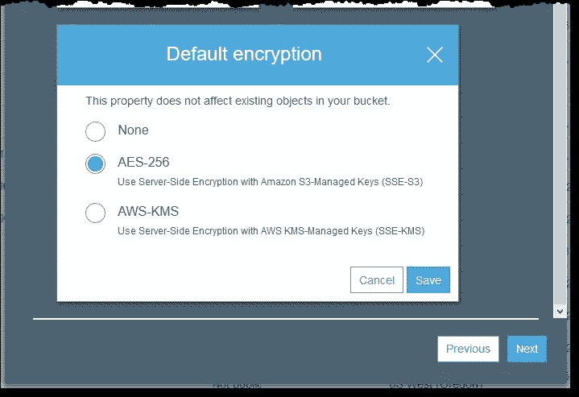
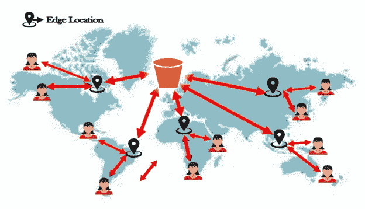

# AWS S3 到底是什么？

> 原文：<https://betterprogramming.pub/whats-aws-s3-anyway-49bd3809b336>

## 关于 AWS 简单存储服务，您需要了解的一切

在 [Unsplash](https://unsplash.com?utm_source=medium&utm_medium=referral) 上由 [Daniel Eledut](https://unsplash.com/@pixtolero2?utm_source=medium&utm_medium=referral) 拍摄的照片。

在本文中，您将了解一个名为[简单存储服务](https://aws.amazon.com/s3/)的核心 AWS 服务。AWS 简单存储服务(或 S3)是一个非常通用和有用的服务。它也是最古老的 AWS 服务之一。这意味着它是你应该知道的——尤其是为了考试。

因此，让我们先来看看这个服务的一些用例。

# AWS S3 使用案例

AWS S3 的一些使用案例包括:

*   静态网站托管= >你可以使用 S3 来存储像盖茨比这样的静态网站。
*   存档数据= >多亏了 S3 冰川，您可以低成本地存档万亿字节的数据。
*   Backups = >正如您将在本文后面看到的，S3 提供了最大的持久性和可用性。这意味着这是一个完美的地方来存储您的备份。
*   网站资产= >您可以存储您的网站资产，如徽标、媒体、照片、视频等。

# 什么是 AWS S3？

S3 是最古老和最基本的 AWS 服务之一。这项服务允许您在世界任何地方存储和检索任何数量的数据。

简单来说，这是一个托管服务，你可以在这里存储你的平面文件。对于平面文件，我指的是不变的文件(例如图片、视频等。).因此，您不能在 S3 上存储数据库，因为它在不断变化。

# 对象和桶

S3 是一个对象存储服务，这意味着对象存储在桶中。桶是目录的另一个术语，对象是文件的另一个术语。对象(文件)包含以下信息:

*   key = >文件的名称
*   value = >文件的内容
*   版本 ID = >启用版本控制时
*   元数据= >关于对象的附加数据

每个存储桶可以包含多个对象，每个存储桶可以包含其他文件夹，而这些文件夹又包含其他对象。此外，每个存储桶都有一个唯一的名称。把它想象成一个域名:不能有两个同名的网站。因此，您的存储桶名称必须是唯一的。

让我们快速回顾一下。AWS S3 是一种存储服务，它将您的数据存储为键-值对，其中键是文件的名称，值是文件的内容。此外，它使用桶(目录)来存储您的对象(文件)。

## 基本要点

*   它是基于对象的。
*   文件大小从 0 字节到 5 TB 不等。
*   你有无限的存储空间。
*   数据存储在桶中。
*   桶必须有唯一的名称，因为 S3 命名空间是通用的。这意味着世界上不能有两个同名的桶。
*   当一个对象成功上传到 bucket 中时，它返回状态代码 200。

# S3 存储类

AWS S3 是一项复杂的服务，您可以将它用于不同的用例，例如归档您的数据、简单地存储您的数据等等。因此，对于不同的使用情形，它有不同的存储类别。

## **S3 标准**

*   该存储级别具有 99.99%的可用性和 99.999999999%的耐用性。
*   它将您的数据存储在跨多个设施的多个系统上，以承受同时失去两个设施的情况。
*   它跨至少三个可用性区域复制数据。

## **S3 IA(不常访问)**

*   此存储类别适用于不常访问但在需要时需要快速访问的数据。
*   尽管它比标准存储便宜，但它对每次文件检索都要收费。

## **S3 一区 IA**

*   这和 S3 IA 几乎是一样的，唯一的区别是你的数据只存储在一个地方。
*   当您检索数据时，它会收取检索费。

## **S3 智能分层**

*   此存储类别会自动将您的数据移动到最经济高效的存储层。例如，它可以将您的数据从 S3 标准推到 S3 One Zone IA 以降低成本。
*   它不会影响性能。

## **S3 冰川**

*   S3 冰川适用于数据存档，检索时间在几分钟到几小时之间是可以接受的。
*   它是成本第二低的存储类别。

## **S3 冰川深处档案馆**

*   它和 S3 一样，有一个显著的区别:数据检索需要 12 个小时。
*   它也是成本最低的存储类别。

# S3 安全

默认情况下，您创建的所有 S3 存储桶都是私有的。换句话说，它们是不公开的。如果你给他们链接，没有人可以访问他们。您必须更改权限，以允许他人访问您的 S3 对象。

有三种方法可以控制对 AWS S3 资源的访问:

*   IAM policies = >指定特定用户的访问权限(例如，该用户允许哪些 API 调用)。
*   木桶策略= >在 S3 木桶上能做什么和不能做什么。它支持对存储桶的跨帐户访问。
*   访问控制列表= >规则在对象级别设置。

## 访问控制列表

这三者有什么区别？首先，ACL 是控制对对象和桶的访问的遗留机制。但是，它们并没有被弃用，如果您发现它们足以控制访问，您仍然可以使用它们。

什么是 ACL？您可以将 ACL 附加到您的 S3 存储桶或对象，它定义了可以访问它们的帐户和组。它还指定了这些帐户和组对您的存储桶和对象的访问类型。请务必注意，您可以将不同的 ACL 附加到同一个存储桶中的对象。

## 木桶策略

然而，AWS 建议使用 S3 存储桶策略或 IAM 策略来控制对对象和存储桶的访问。正如您可以从名称中推断的那样，时段策略仅适用于 S3 时段。因此，您不能将存储桶策略应用于单个对象。

使用 AWS S3 时段策略，您可以允许或拒绝人们对您附加这些策略的时段执行不同的操作。例如，您可以允许用户将对象放入(上传)存储桶中，但是您可以拒绝他们从存储桶中删除对象的能力。让我们看看下面的 JSON 代码片段:

我们可以查看`Action`、`Effect`、`Resource`和`Principal`字段来了解该策略的作用。查看`Action`和`Resource`字段，我们可以看到它是关于创建存储桶的。该资源还告诉我们，它适用于名为`catalinsbucket`的桶。然后，`Effect`和`Principal`字段告诉我们，它允许每个人创建 buckets。

当然，政策可能会变得更复杂，但你会明白的。

## IAM 策略

IAM 策略有点不同，因为您使用它们来允许或拒绝对各种 AWS 资源的操作。您可以将这些策略应用于 IAM 用户、组或角色。简而言之，这些策略指定了用户、组或角色在您的 AWS 环境中可以做什么。

因此，IAM 和存储桶策略之间的区别是什么？您将存储桶策略应用于存储桶。另一方面，您将 IAM 策略应用于用户/组/角色。让我们看另一个例子:

从代码片段中，我们可以推断出这个策略是关于什么的——非常类似于上面的 bucket 策略。然而，有一点不同。对于 IAM 策略，我们没有`Principal`，因为该策略应用于用户/组/角色。这样做的原因是我们将策略应用于一个主体，因此指定它是多余的。同样，通过查看策略，我们可以看到特定的用户/组/角色被允许上传文件到`catalinsbucket`。

## 何时使用一个而不是另一个

如果您想控制用户在您的 AWS 环境中可以做什么，您可能应该使用 IAM 策略。如果您想控制谁可以访问您的 S3 存储桶，您可能应该使用存储桶策略。

# S3 加密

如果您想控制用户在您的 AWS 环境中可以做什么，您可能应该使用 IAM 策略。如果您想控制谁可以访问您的 S3 存储桶，您可能应该使用存储桶策略。

它允许您为您的 S3 存储桶设置必要的加密行为。加密至关重要，因为它可以保护您的数据不被窃取。举个例子，假设有人入侵了 AWS 服务器并获得了您的数据。你不希望他们读取你的数据。因此，AWS 提供了多种加密 S3 数据的方法。默认情况下，AWS S3 使用 SSL/TSL。

有四种类型的服务器端加密:

*   SSE-S3 = >它使用 AES-256 算法，由 AWS 处理密钥。S3 使用唯一的密钥来加密每个对象。
*   SSE-KMS = >您可以选择您可以创建和管理的 CMK(客户主密钥)，或者您可以选择由 AWS 管理的 CMK。加密数据的密钥与它们保护的数据一起存储。如果您需要满足与加密相关的合规性要求，AWS KMS 中的安全控制非常有用。
*   SSE-C —作为客户，您管理密钥，这意味着 AWS S3 不存储密钥。您必须跟踪哪个对象使用哪个加密密钥。

来源: [AWS 文档](https://docs.aws.amazon.com/AmazonS3/latest/userguide/UsingEncryption.html)

除了这些选项之外，还有客户端加密，这意味着您在将数据上传到 S3 之前对其进行加密。使用客户端加密，您可以将主密钥(CMK)存储在 AWS 的密钥管理服务(AWA KMS)中，或者将主密钥保存在您的应用程序中。您全权负责加密和解密数据。

# S3 数据一致性

数据一致性是一个至关重要的话题。我们有两个问题:

*   当我们上传一个新的对象到 S3 时会发生什么？
*   当我们从 S3 更新/删除现有对象时会发生什么？

让我们从上传新对象到 S3 开始。为此，我们有“写后读一致性”更简单地说，这意味着我们可以在上传后立即访问这些对象。你上传一张图片，你就可以直接访问它。

当我们更新或删除现有对象时会发生什么？在这种情况下，我们有“最终一致性”换句话说，这意味着我们可能在更新旧对象后得到它。此外，在删除一个对象后，我们可能仍然能够在一段时间内访问它。为什么会这样？这是因为，由于 S3 存储桶中的数据分散在多个设备和设施中，传播这些变化需要时间。

# 跨区域复制(CRR)

此功能允许您更容易地在不同的 AWS 区域中复制 S3 对象。要使用“跨区域复制”功能，您必须启用版本控制，因为它是建立在该功能之上的。

启用此功能后，您可以从另一个 AWS 区域选择一个目标存储桶，以自动复制上载到特定 S3 存储桶的所有对象。这个特性的美妙之处在于，它还将元数据和访问控制列表与对象一起复制。

跨区域复制是一项了不起的功能，因为它为您的数据提供了更高的持久性、更低的访问延迟和潜在的灾难恢复。

# S3 版本控制

所有“版本控制”意味着在同一个桶中保存同一个对象的多个变体。你为什么要这么做？使用同一对象的不同版本，您可以从应用程序故障和意外删除或覆盖中快速恢复。请注意，一旦启用该功能，就无法将其禁用。只能暂停。

启用该功能后，每个对象都有一个唯一的版本 ID。例如，相同的图像(例如 catalin_profile.jpg)具有不同的版本 id。您可以多次上传同一个对象，并且会有许多具有不同 id 的实例。当您覆盖对象时，会产生一个新的对象版本。删除对象时，S3 会插入一个删除标记，而不是永久删除对象。

为了获得额外的安全性，您可以启用多因素身份验证(MFA)。这意味着 S3 需要额外的身份验证来更改存储桶的版本状态并永久删除对象版本。

# S3 生命周期管理

每个人都关心成本，有时您的对象可能会使用低成本的存储类。此功能允许您自动将对象移动到更具成本效益的存储类别，或者完全删除对象。

通过转换操作，您可以定义对象何时应该转换到另一个存储类。例如，您可能希望在一年后将数据移动到 S3 冰川。通过到期操作，您可以定义对象何时到期。一旦对象过期，S3 就会删除它们。

此功能便于有效管理您的成本。它会自动将您的数据移动到更高效的存储级别，帮助您节省资金。

# 转移加速度

简而言之，AWS S3 传输加速允许在最终用户和存储桶之间进行更快的长距离文件传输。传输加速利用分布在全球的 CloudFront 边缘位置，实现快速、安全的长距离文件传输。

这是怎么回事？用户使用边缘位置 URL 来上传文件，而不是上传到存储桶。一旦文件到达特定的边缘位置，S3 使用优化的网络路径将数据发送到用户的存储桶。

您为什么会使用此功能？

*   你有来自世界各地的用户上传到一个桶。
*   你定期在各大洲之间传输千兆字节或兆兆字节的数据。

来源:[阿什什·帕特尔](https://medium.com/awesome-cloud/aws-amazon-s3-transfer-acceleration-overview-6baa7b029c27)

上图更好地说明了这一特征。用户将文件上传到离他们最近的边缘位置，AWS 负责通过优化的网络路径将数据从边缘位置路由到 S3 存储桶。仅此而已。

# 结论

总之，AWS S3 是一项你需要熟悉的服务——尤其是如果你想参加考试的话。在本文中，您了解了:

*   S3 是什么
*   S3 用例
*   S3 存储类
*   S3 的安全和加密
*   生命周期管理
*   数据一致性

*如果对 JavaScript 教程感兴趣，我推荐* [*前端高手*](https://catalins.tech/frontend-masters-membership-is-it-worth-it) *！*

*如果你想用技术写作赚钱，就去查查* [*那些付钱让你写*](https://catalins.tech/websites-that-pay-you-to-write-technical-articles) *技术文章的网站吧！*

*如果你想学习 JavaScript，我推荐这些* [*5 资源作为初学者学习 JavaScript*](https://catalins.tech/5-best-resources-to-learn-javascript-as-a-beginner)*！*

*谈判你的工资是必不可少的——学习* [*作为一名开发者如何谈判你的工资*](https://catalins.tech/how-to-negotiate-your-salary-as-a-developer) *！*

*用* [*Git 别名*](https://catalins.tech/git-aliases-what-are-they-and-how-to-use-them) *加速你的开发。*

*如果你想* [*以开发者身份开博客*](https://catalins.tech/how-to-start-your-blog-as-a-developer) *，我推荐你阅读《* [*如何以开发者身份开博客*](https://catalins.tech/how-to-start-your-blog-as-a-developer) *》一文！*

你是否很难跟上科技领域的最新消息？参见 [*作为开发者保持最新状态的一种方法*](https://catalins.tech/one-way-to-stay-up-to-date-as-developer) *！*

*学习* [*如何在 JavaScript*](https://catalins.tech/how-to-use-asyncawait-in-javascript) *中使用 Async/Await！*

GitHub 简介目前风靡一时。了解 [*如何创建 GitHub 个人资料页面*](https://catalins.tech/how-to-create-a-kickass-github-profile-page) *！*

*查看这 7 个* [*资源，帮你通过求职面试*](https://catalins.tech/7-github-repositories-to-help-you-crush-your-job-interviews) *！*

*查看* [*新特性 JavaScript ECMAScript 2021 es 2021*](https://catalins.tech/javascript-es2021-you-need-to-see-these-ecmascript-2021-features)*！*

*你是初学程序员吗？查看这些* [*编程项目思路*](https://catalins.tech/10-programming-project-ideas-for-beginners) *！*

你是在学习编码还是打算做编码？查看 [*免费学习编程的最佳地点*](https://catalins.tech/20-best-places-to-learn-programming-for-free) *！*

[*用这 9 个浏览器扩展提高你的开发者生产力*](https://catalins.tech/my-9-must-have-browser-extensions-for-increased-developer-productivity) *！*

*如果你是 Node.js 的开发者，我建议你去 Node.js* *查看一下这些* [*4 个创造性的设计模式！*](https://catalins.tech/the-4-creational-design-patterns-in-nodejs-you-should-know)

*查看这些惊人的*[*JavaScript ECMAScript 2020 特性*](https://catalins.tech/javascript-es2020-the-features-you-should-know) *！*