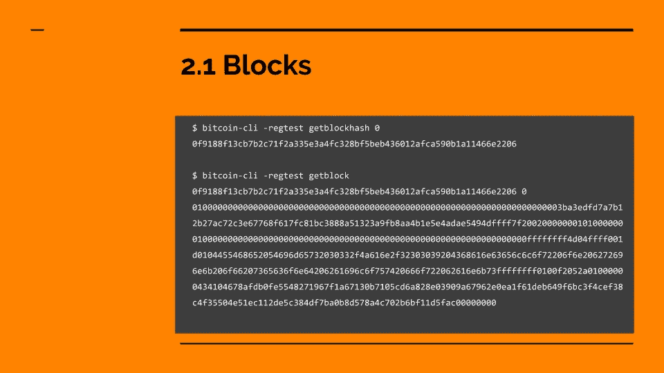

# 一个比特币区块里有什么？

> 原文：<https://betterprogramming.pub/whats-in-a-bitcoin-block-41d0a5d1472f>

## 如何理解构成比特币区块链区块的数据



块是一种数据结构，包含事务以及关于块的元数据。所有交易必须包含在有效的块中，才能被视为最终交易。网络上的所有完整节点将存储该块的副本，以便验证新的事务并与其他节点共享数据。

> 这是视频课程的一部分，加入全球 22 个国家的人在我的课程[上成为比特币+区块链程序员](https://www.udemy.com/course/create-your-own-blockchain/)。

# 方块图

```
$ bitcoin-cli -regtest getblockhash 0 
0f9188f13cb7b2c71f2a335e3a4fc328bf5beb436012afca590b1a11466e2206$ bitcoin-cli -regtest getblock 0f9188f13cb7b2c71f2a335e3a4fc328bf5beb436012afca590b1a11466e2206 0
```

`0100000000000000000000000000000000000000000000000000000000000000000000003ba3edfd7a7b12b27ac72c3e67768f617fc81bc3888a51323a9fb8aa4b1e5e4adae5494dffff7f20020000000101000000010000000000000000000000000000000000000000000000000000000000000000ffffffff4d04ffff001d0104455468652054696d65732030332f4a616e2f32303039204368616e63656c6c6f72206f6e206272696e6b206f66207365636f6e64206261696c6f757420666f722062616e6b73ffffffff0100f2052a01000000434104678afdb0fe5548271967f1a67130b7105cd6a828e03909a67962e0ea1f61deb649f6bc3f4cef38c4f35504e51ec112de5c384df7ba0b8d578a4c702b6bf11d5fac00000000`

这是 regtest 网络的起源块，正如你所看到的，它不是真正的人可读的。我们将学习数据是如何从左到右编码的。

`{block header}` `{transaction counter}` `{transactions}`

# 块标题

`{version 4B}` `{previous block hash 32B}` `{merkle root hash 32B}` `{time 4B}{bits 4B}` `{nonce 4B}`

*   `version` (4 字节)-块格式版本。
*   `previous block hash` (32 字节)——前面块的哈希。将这一点包含在报头中很重要，因为块的散列是根据报头计算的，因此取决于前一个块的值，将每个新块链接到最后一个块。这是区块链链条中的一环。
*   `merkle root hash` (32 字节)-块中所有事务的 [Merkle 树](https://en.wikipedia.org/wiki/Merkle_tree)根的散列。如果任何事务被更改、删除或重新排序，都会改变 merkle 根散列。这就是锁定块中所有事务的原因。
*   `time` (4 字节)——[Unix 时间](https://en.bitcoin.it/wiki/Block_timestamp)中的时间戳(秒)。由于世界各地的每个节点的时钟不能保证同步，因此只要求与网络的其他节点相差不超过 2 小时。
*   `bits` (4 字节)—[紧凑格式](https://bitcoin.org/en/developer-reference#target-nbits)的目标哈希值。块哈希必须等于或小于该值，才能被视为有效。
*   `nonce` (4 字节)-可以是任何 4 字节值，在挖掘时不断变化，直到找到有效的块哈希。

# **数值**

*   **版本** — `01000000` (1)
*   **前一块哈希**——`0000000000000000000000000000000000000000000000000000000000000000`
*   **默克尔根哈希**——`3ba3edfd7a7b12b27ac72c3e67768f617fc81bc3888a51323a9fb8aa4b1e5e4a`
*   **时间** — `dae5494d`(格林威治时间 2011 年 2 月 2 日星期三下午 11:16:42)
*   **位**—`ffff7f20`(7 fffff 000000000000000000000000000000000000000000000000000)
*   **随机数** — `02000000`(十进制 2)

**注:**记住比特币使用的是 [Little Endian](https://chortle.ccsu.edu/AssemblyTutorial/Chapter-15/ass15_3.html) 格式，可能看起来是反的。您可以使用提供的工具`$ reverse_endian {hex}`来反转十六进制字符串的字节顺序。

# 交易计数器

`01` (1)区块中的交易

*   事务计数器(可变长度)—以一个[可变长度整数](https://en.bitcoin.it/wiki/Protocol_documentation#Variable_length_integer)表示的块中的事务数量。

> 这是视频课程的一部分，加入全球 22 个国家的人在我的课程[上成为比特币+区块链程序员](https://www.udemy.com/course/create-your-own-blockchain/)。