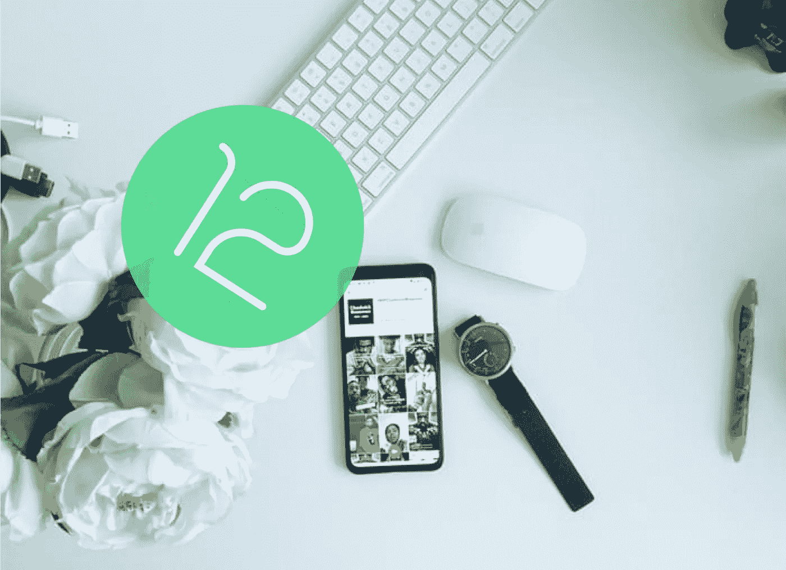

# 对于开发者来说，Android 12 有什么新功能？

> 原文：<https://betterprogramming.pub/whats-new-for-developers-in-android-12-cac901993bc1>

## 闪屏 API、可定制的小部件、新的权限等等



[Obi Onyeador](https://unsplash.com/@thenewmalcolm?utm_source=medium&utm_medium=referral) 在 [Unsplash](https://unsplash.com?utm_source=medium&utm_medium=referral) 上的照片(作者用 Android 12 官方 logo 修改)。

谷歌 I/O 2021 活动正在进行中，我们已经发现了 Android 开发者需要知道的一些最重要的变化。

在接下来的几节中，我们将讨论 Android SDK 31 发布的新特性和 API 变化，它目前处于测试阶段。你可以接触到 Android Studio 北极狐的早期预览版，并体验一下 API。

让我们开始吧。

# 一个新的闪屏 API

过去，Android 的闪屏指南相当模糊。大多数开发人员只是为闪屏创建一个布局文件。虽然有更好的方法通过设置自定义主题来组成闪屏，但谷歌现在推出了专用的[闪屏 API](https://developer.android.com/reference/android/window/SplashScreen) 。

简单地说，您可以通过调用`Activity.getSplashScreen()`在应用程序中检索闪屏实例。

新的 API 在所有应用程序中使用徽标和启动动画来标准化启动屏幕。当然，您仍然可以通过使用样式属性来自定义屏幕:

*   `[windowSplashScreenBackground](https://developer.android.com/reference/android/R.attr#windowSplashScreenBackground)`用于填充屏幕的背景。
*   `[windowSplashScreenAnimatableIcon](https://developer.android.com/reference/android/R.attr#windowSplashScreenAnimatedIcon)`用于将闪屏上显示的应用标志替换为另一个动画 drawable。
*   `[windowSplashScreenAnimationDuration](https://developer.android.com/reference/android/R.attr#windowSplashScreenAnimationDuration)`用于设置闪屏消失前的超时时间。

您还可以通过调用闪屏实例上的`[setOnExitAnimationListener](https://developer.android.com/reference/android/window/SplashScreen#setOnExitAnimationListener(android.window.SplashScreen.OnExitAnimationListener))`来自定义闪屏的过渡或消失。

总是调用`splashScreenView.remove()`来结束 Android 12 中自定义的闪屏动画。

有关更多详细信息，请查看[闪屏 API 文档](https://developer.android.com/about/versions/12/features/splash-screen)。

# 改进的 Widgets API

十年来，微件一直是 Android 生态系统的核心部分。可悲的是，谷歌直到 iOS 14 的可定制 widgets 才认真对待他们的 Widgets API。

在 Android 12 中，小部件有很多变化。让我们一次看一个。

## 圆角

小部件将包含在圆角中，您可以使用`[system_app_widget_background_radius](https://developer.android.com/reference/android/R.dimen#system_app_widget_background_radius)`维度属性来查找。

同样值得注意的是，小部件中的子视图将有一个单独的圆角半径:`[system_app_widget_inner_radius](https://developer.android.com/reference/android/R.dimen#system_app_widget_inner_radius)`。因此，需要确保小部件视图背景/布局是可裁剪的。

## 颜色；色彩；色调

Android 12 引入了新的“Material You”设计，带来了与背景形成对比的动态字体颜色。

因此，为小部件使用`Theme.DeviceDefault.DayNight`风格是理想的，这样小部件 UI 组件就可以根据设备主题进行调整。

通常，当用户点击一个小部件来启动应用程序时，过渡并不平滑(主要是由于应用程序背景和小部件背景的颜色不同)。Android 12 通过加入一个新的属性对此进行了改进。

通过将`@android:id/background`设置为 widget 视图中根布局的 ID，您让应用程序知道在过渡期间应用程序 launch open 使用了 widget 背景。

## 通过样式个性化部件

之前，您可以设置一个配置属性(`<appwidget-provider>`)来将小部件重定向到所需的活动。你也可以使用`android:widgetFeatures="reconfigurable"`长按并重新配置你的 Android `Activity`上的一个小部件。

现在，Android 12 中的`android:widgetFeatures`又有了一个标志，可以提供更多的定制。`configuration_optional`可用于绕过从您的应用程序配置小工具。

您还可以使用以下属性设置在选取器中显示的 widget 模板预览:

```
<appwidget-provider
  ...
  android:previewLayout="@layout/my_widget_preview"
  android:description="@string/my_widget_description">
</appwidget-provider>
```

## 远程视图

由于小部件驻留在应用程序外的启动屏幕上，`RemoteViews`用于实现它们。`RemoteView`接口负责向小部件添加 UI 元素，并监听用户交互。

在 Android 12 中，`RemoteView`现在包括了一个`setRemoteAdapter`方法，你可以传递布局并插入一组项目——类似于我们在`ListViews`中所做的。

## 布局属性

Widgets API 带来了更多的属性，有助于确定 Android 12 中 Widgets 的大小:

*   `[targetCellWidth](https://developer.android.com/reference/android/appwidget/AppWidgetProviderInfo#targetCellWidth)`和`[targetCellHeight](https://developer.android.com/reference/android/appwidget/AppWidgetProviderInfo#targetCellHeight)`定义了启动器网格中小部件主机的精确宽度和高度。
*   `[maxResizeWidth](https://developer.android.com/reference/android/appwidget/AppWidgetProviderInfo#maxResizeWidth)`和`[maxResizeHeight](https://developer.android.com/reference/android/appwidget/AppWidgetProviderInfo#maxResizeWidth)`定义了允许调整大小时小工具的最大尺寸。

您可以为您的`RemoteViews`中的小部件定义多达三种不同的大小布局。

Android 12 中另一个有趣的小部件更新是通过语音命令调用它们的能力。为此，我们只需在`capability`下添加一个`app-widget`标签，并在`shortcuts.xml`文件中定义`WidgetProvider`的小部件标识符和目标类。您还可以使用新提供的`setResponseSpeech`和`setResponseText`方法在您的小部件中添加文本到语音转换功能。

要深入了解 Android 12 中的小部件，请查看官方资源库[。](https://github.com/android/user-interface-samples/tree/main/AppWidget)

# 新的 Android 12 权限:位置、蓝牙和剪贴板

随着用户越来越意识到数据隐私，Android 12 使用户隐私成为其设计系统中更不可或缺的一部分。Android 12 权限模型中有一些新的变化，你可能想知道。

首先，位置许可对话框现在允许用户在近似位置和精确位置之间进行选择。大概的位置由`ACCESS_COARSE_LOCATION`权限访问，如果你不需要精确的位置，你应该避免询问`ACCESS_FINE_LOCATION`。

任何应用程序都可以访问剪贴板，这对许多人来说是一个隐私噩梦。展望未来，Android 12 将在每次外部应用程序从剪贴板读取数据时显示一段祝酒词。为了避免过多的弹出消息，您可以在使用`ClipboardManager.getPrimaryClipDescription()`访问数据之前先检查数据的种类。这个方法不显示吐司。

说到祝酒词，他们现在可以显示一个应用程序图标，但更重要的是，Android 12 进一步限制了小时间范围内可以显示的祝酒词数量。

直到最近，扫描附近设备的蓝牙也需要位置访问。但随着 Android 12 的推出，这一切都将改变。两个新的权限`[BLUETOOTH_SCAN](https://developer.android.com/reference/android/Manifest.permission#BLUETOOTH_SCAN)`和`[BLUETOOTH_CONNECT](https://developer.android.com/reference/android/Manifest.permission#BLUETOOTH_CONNECT)`，分别用于扫描和连接已经配对的设备。您可以通过以下方式明确声明您的应用程序从不需要附近设备的物理位置:

```
<uses-permission android:name="android.permission.BLUETOOTH_SCAN"
                 android:usesPermissionFlags="neverForLocation" />
```

Android 12 还带来了新的自动休眠功能。这是对 Android 11 中引入的自动重置权限的增强。简而言之，系统会在一段时间(通常为 30 天)后自动重置未使用应用的权限。

作为开发人员，如果应用程序需要在后台定期轮询，您可能需要禁用自动重置行为。为此，调用`[Intent.ACTION_APPLICATION_DETAILS_SETTINGS](https://developer.android.com/reference/android/provider/Settings#ACTION_APPLICATION_DETAILS_SETTINGS)`意图，将用户带到设置屏幕手动撤销自动复位行为。

# 通知 API 的增强

如果通知设计系统没有重大改变，Android 更新就不会结束。那些使用`RemoteViews`设计定制通知的人将再次经历一段艰难的时间，因为 Android 12 将不再能够使用完整的通知。相反，它们将被包装在一个标准的通知样式的模板中。

API 还有一些值得一提的变化:

*   `[Notification.CallStyle](https://developer.android.com/reference/android/app/Notification.CallStyle)`是一个专门的电话模板。
*   `MessagingStyle`和`BigPictureStyle`通知获得了一些新的定制方法(比如`[bigPicture](https://developer.android.com/reference/android/app/Notification.BigPictureStyle#bigPicture(android.graphics.drawable.Icon))([Icon](https://developer.android.com/reference/android/graphics/drawable/Icon) icon)`)。您现在可以在通知中显示动画图像/gif，还可以调用`[showBigPictureWhenCollapsed](https://developer.android.com/reference/android/app/Notification.BigPictureStyle#showBigPictureWhenCollapsed(boolean))`方法来优先显示大图片，而不是大的应用程序图标。

# 机器学习和增强现实:ML Kit 和 ARCore

设备上的机器学习已经成为当务之急，谷歌进一步增强了他们已经流行的 [ML Kit](https://developers.google.com/ml-kit) 框架。框架中添加了一些强大的 API，使移动设备上的机器学习变得更加容易:

*   数字墨迹识别:跨多种语言检测手写文本。
*   实体提取:智能检测原始文本类型，并做出所需的行动。例如，如果你从文本中选择一个地址，它会显示一个带有地图选项的弹出窗口。
*   自拍分割:将前景与背景分开。
*   姿态检测:实时检测和跟踪人体部位(32 点)。

另一方面，ARCore 也给了我们一些强大的 API。原始深度 API 允许您更详细地分析场景几何，而新的深度命中测试 API 允许您立即将虚拟对象放置在场景中，而无需搜索平面或最佳照明。

谷歌还发布了一个录制和播放 API，让你可以将 ARCore 对象添加到常规视频中。

# 前台服务限制

Android 已经从后台限制了打开活动，而有了最新的 API level 31，你就再也不能从后台启动大部分前台服务了。

在一些必须的场景中，最好使用[工作管理器](https://developer.android.com/topic/libraries/architecture/workmanager) API 并调用`setExpedited()`来优先运行前台服务。

对于报警管理员来说，为了发送准确的报警，声明`[SCHEDULE_EXACT_ALARM](https://developer.android.com/reference/android/Manifest.permission#SCHEDULE_EXACT_ALARM)`权限是至关重要的。

更多详情，请查看[官方文档](https://developer.android.com/about/versions/12/foreground-services)。

# 减少样板代码的新内容 API

对于拖放、复制粘贴和键盘贴纸，我们以前有三种不同的界面方法:

```
setOnDragListener.    //drag-drop
onTextContextMenuItem //copy-paste
OnCommitContentListener //keyboard sticker
```

Android 12 将它们合二为一，从而增强了可重用性:

```
setOnReceiveContentListener(mimeTypes)
```

*   为了模糊图像或视图，我们现在有一种`setRenderEffect`方法，通过使用硬件加速来加速操作，使其几乎实时工作。
*   为了设计适应平板电脑和可折叠屏幕的应用程序布局，两个 UI 组件得到了更新:`[SlidingPaneLayout](https://developer.android.com/jetpack/androidx/releases/slidingpanelayout)`让您可以在多个窗格上设计布局。另一方面，`[NavRail](https://material.io/components/navigation-rail)`可以方便地设置底部菜单式的侧边栏。
*   [画中画](https://developer.android.com/about/versions/12/features/pip-improvements) (PiP)模式也有 API 增强，引入了标志以实现更平滑的过渡、禁用调整大小等等。
*   Android 12 还引入了一种叫做 AVIF 的新图像格式。据说同样大小的质量更好。这也意味着我们现在需要在清单文件中明确提到我们的应用程序支持的文件格式(如果 AVIF 不可用，Android 将自动切换到最受支持的格式)。

最后但同样重要的是，Jetpack Compose，被视为 Android 开发未来的现代声明式 UI 工具包，现在有了一个成熟的智能编辑器来进行实时预览。该库的 1.0 版本将于 7 月份推出。

# 结论

虽然这几乎是你作为开发者需要了解的关于 Android 12 的一切，但还有很多更微妙的功能。跳转到[谷歌 IO](https://events.google.com/io/program/discover/?lng=en) 网站或[安卓文档](https://developer.android.com/about/versions/12)获取更多信息。

我希望你会发现这份清单对于在更新发布之前发布应用程序很有用。

感谢阅读。