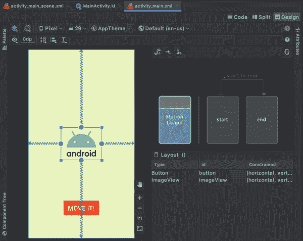
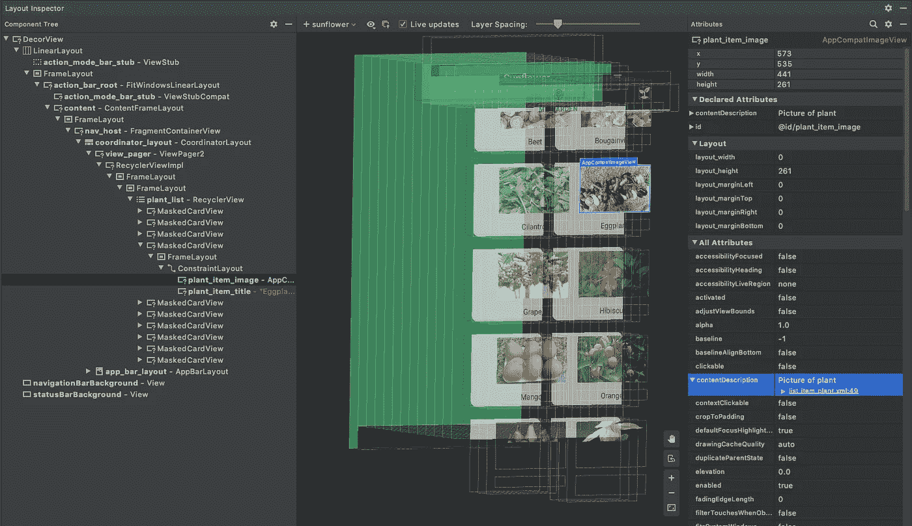
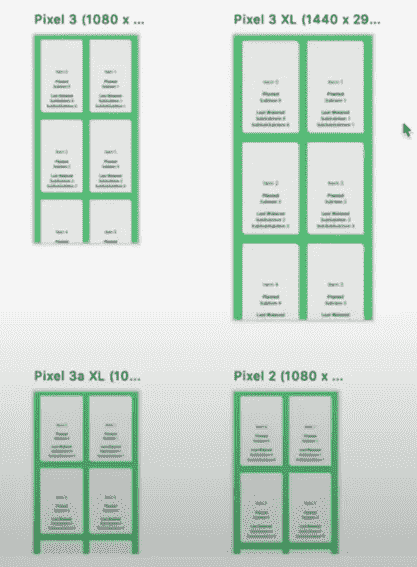
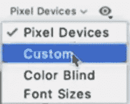
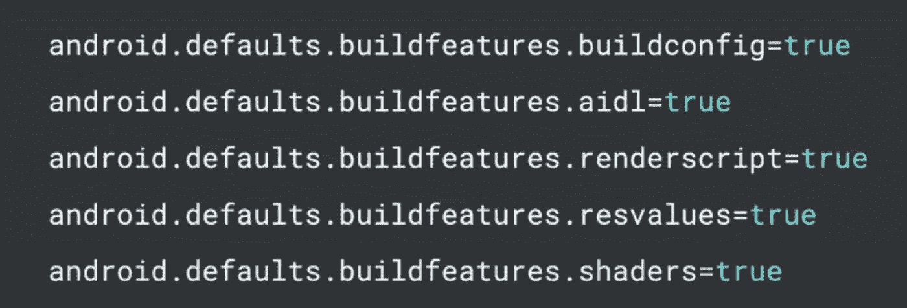
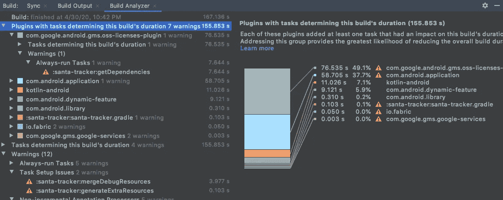
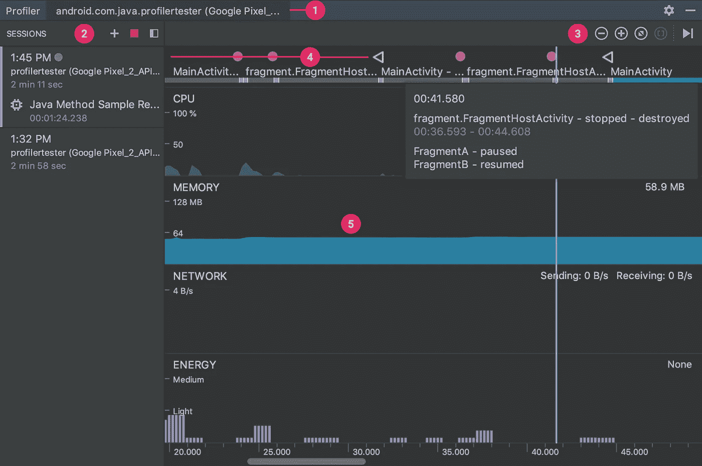
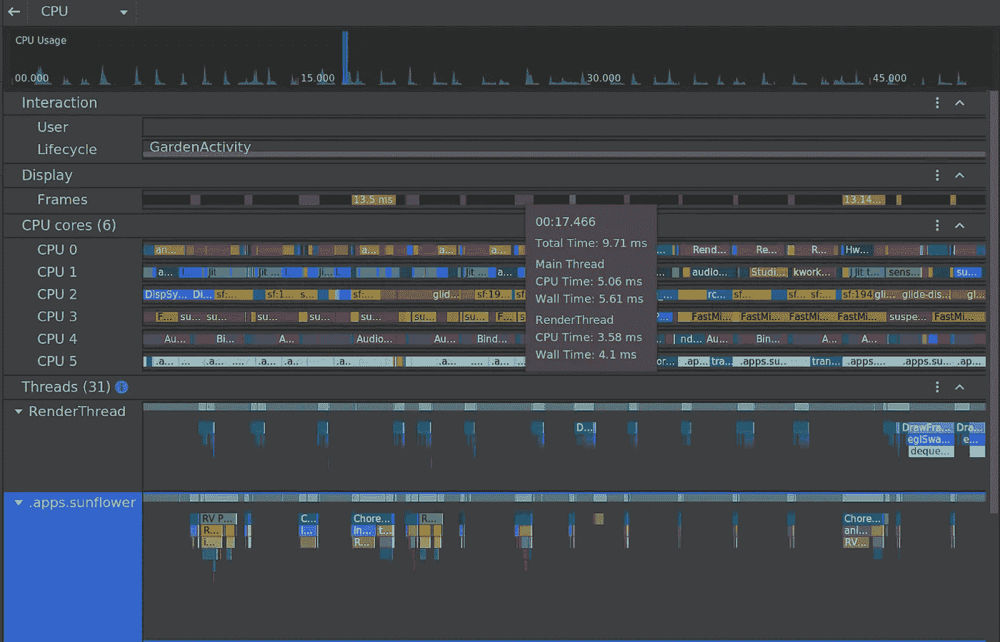
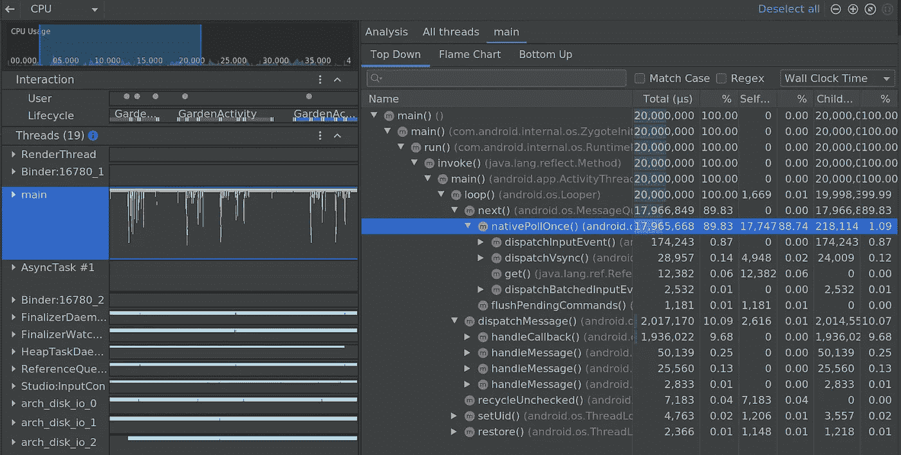

# Android Studio 4.0 有什么新功能？

> 原文：<https://betterprogramming.pub/whats-new-in-android-studio-4-0-d685e0ad8253>

## Android Studio 4.0 中最好的新功能列表

作者照片。

[Android Studio 4.0](https://developer.android.com/studio) 稳定版终于在 5 月 28 日发布。正如每个版本都有一些有趣的特性一样，4.0 也有自己令人兴奋的特性。在本文中，我们将探索 4.0 中对开发人员有用的一些最佳特性。

# 运动编辑器

MotionLayout 是 ConstraintLayout 的一个子类，帮助我们管理应用程序中的运动和小部件动画。Android Studio 4.0 包括一个用于运动布局的可视化设计编辑器。这个特性可以帮助我们轻松地创建、编辑和预览动画，而无需构建应用程序。我们不再需要创建和修改复杂的 XML 文件，因为运动编辑器会为我们生成属性，并支持编辑约束集、过渡等。更多信息请查看[官方文档](https://developer.android.com/studio/write/motion-editor)。

# 实时布局检查器

布局检查器已经更新，可以实时了解应用程序的用户界面。有了这个功能，调试应用程序的 UI 就容易多了，因为它让我们能够访问与我们运行的应用程序保持更新的数据，并提供关于如何解析资源的见解。

*使用实时布局检查器实时调试应用的用户界面。*

我们可以通过从主菜单中选择视图>工具窗口>布局检查器来访问此功能。如果我们将应用程序部署到运行在 API 29 级别或更高级别的设备上，我们可以访问一些附加功能(当设备上的视图发生变化时，动态布局层次结构会更新，详细的视图属性也可以帮助我们确定如何解析资源值，等等。).查看更多关于[布局检查器](https://medium.com/androiddevelopers/layout-inspector-1f8d446d048)的信息。

# 布局多重预览

布局多重预览或布局验证是一种可视化工具，用于在同一时间点在不同设备和配置中预览布局。我们可以使用这个特性来识别 UI 中的潜在问题，因为我们通常为可视屏幕大小或特定配置设计 UI。我们可以通过选择 IDE 窗口右上角的布局验证选项卡来访问此功能。

我们有不同的选项，可以根据我们的要求进行选择。

# 构建分析器

自从 Android 开发开始以来，较大应用程序的构建时间一直是开销要素之一。我个人经历了 10-20 分钟的构建时间来检查变更。这浪费了开发人员的时间和生产力。所以我们花了一些时间来优化应用的构建时间。这里最重要的因素是我们不知道构建系统的哪个部分消耗更多的时间。构建分析器是在 Android Studio 4.0 和 Gradle 插件 4.0 中引入的。它帮助我们分析和发现构建过程中的问题，比如配置不当的任务等。我们可以通过在每个模块的`build.gradle`文件中包含以下一行或多行来指定默认设置。

Build Analyzer 通过突出显示对我们的总体构建时间负有最大责任的插件和任务，并通过建议减少回归的步骤，来帮助我们理解和解决构建中的瓶颈。[了解更多](https://developer.android.com/studio/build/build-analyzer)。

# CPU Profiler UI 升级

[评测器](https://medium.com/better-programming/improve-apps-performance-with-android-profilers-edb240deeb71)是提高我们应用性能的最佳方式之一。 [CPU 剖析器](https://developer.android.com/studio/profile/cpu-profiler)旨在提供关于我们应用的线程活动和跟踪记录的信息。以前，所有分析器的组合数据都显示在一个部分下:

但是在 Android Studio 4.0 中，CPU 记录现在从主分析器时间线中分离出来，并组织成组，以便于分析。您可以上下移动组或拖放组内的单个项目，以进行额外的自定义。

为了便于并排分析，您现在可以在线程活动时间线中查看所有线程活动(包括方法、函数和事件),并尝试新的导航快捷方式来轻松移动数据。

系统跟踪 UI 也进行了重新设计，以便为更好的视觉区分对事件进行独特的着色，对线程进行排序以首先显示最繁忙的线程，并且我们现在可以专注于查看我们选择的线程的数据，而不是所有线程的组合。[了解更多](https://developer.android.com/studio/releases#cpu-profiler-upgrades)。

# R8 规则的智能编辑器

R8 是在 Android Gradle 插件 3.4.0 中引入的，它将去糖、收缩、模糊、优化和去索引全部结合在一个步骤中，从而显著提高了构建性能。要想了解更多关于 R8 的情况，请看这篇关于 R8 缩小 T2 的文章。以前，编写 R8 规则时不支持提供自动建议的智能编辑器。但是在 4.0 中，当编写代码收缩规则时，智能编辑器特性是可用的。在为 R8 创建规则文件时，Android Studio 现在提供了智能编辑器功能，如语法高亮显示、补全和错误检查。该编辑器还与您的 Android 项目集成，为所有类、方法和字段提供完整的符号完成，并包括快速导航和重构。

# Kotlin Android Live 模板

动态模板是一种方便的 IntelliJ 特性，它允许您通过键入简单的关键字将常见的构造插入到代码中。Android Studio 现在为我们的 Kotlin 代码提供了特定于 Android 的实时模板。例如，只需键入`toast`并按 Tab 键，就可以快速插入一段祝酒词的样板代码。有关可用实时模板的完整列表，请导航至设置(或首选项)对话框中的编辑器>实时模板。

# 参考

*   [Android Studio 4.0](https://android-developers.googleblog.com/2020/05/android-studio-4.html)
*   [关于 Android Studio 4.0](https://www.youtube.com/watch?time_continue=548&v=f1fHPqAYj5I&feature=emb_logo)

# 结论

就这些了，我希望你喜欢阅读这篇文章。请让我知道你的建议和意见。