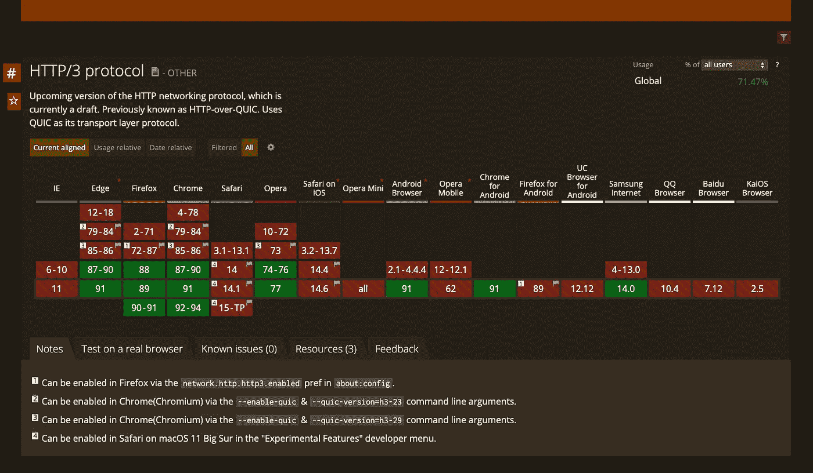
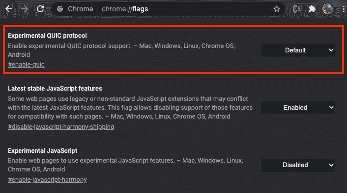
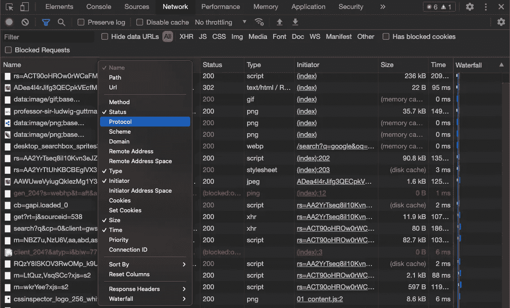
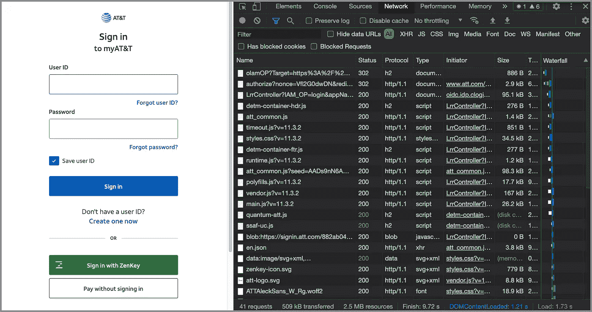
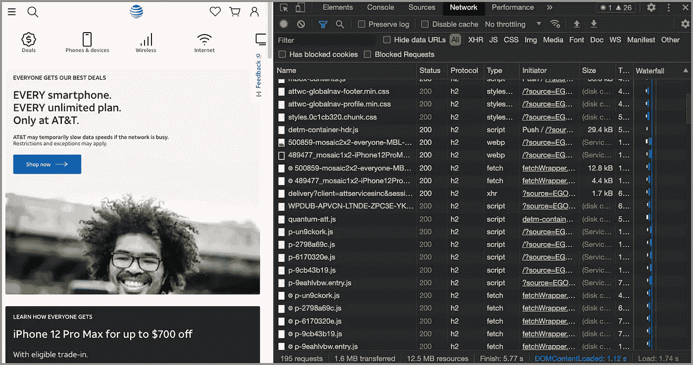
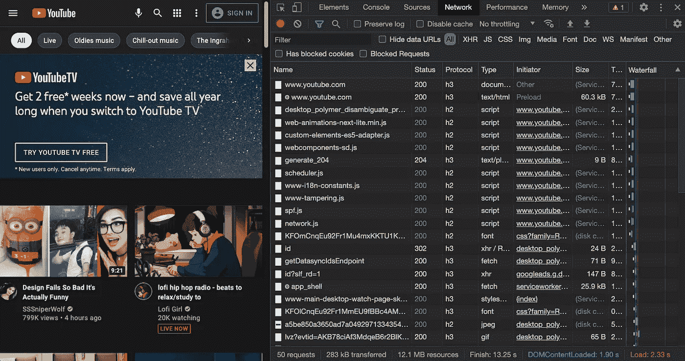

# HTTP/3 有什么新特性？

> 原文：<https://betterprogramming.pub/whats-new-in-http-3-10c2455a4f8c>

## HTTP/0.9、HTTP/1.0、HTTP/1.1、HTTP/2 和 HTTP/3 的演练


由[卡斯帕·卡米尔·鲁宾](https://unsplash.com/@casparrubin?utm_source=medium&utm_medium=referral)在 [Unsplash](https://unsplash.com?utm_source=medium&utm_medium=referral) 上拍摄的照片。

> 超文本传输协议(HTTP)是用于分布式、协作式超媒体信息系统的应用层协议。它是一种通用的、无状态的协议，除了用于超文本之外，还可用于许多任务，如名称服务器和分布式对象管理系统— [W3](https://www.w3.org/Protocols/rfc2616/rfc2616.html)

HTTP 允许浏览器和服务器进行通信。它构成了 web 服务器执行最基本操作所必须做的事情的基础。HTTP 已经经历了许多阶段。[超文本传输协议第三版](https://quicwg.org/base-drafts/draft-ietf-quic-http.html) (HTTP/3)最新草案于 2021 年 5 月 27 日发布。

让我们回顾一下 HTTP 的历史，探索一下 HTTP/3 中的新特性。

# HTTP/0.9

蒂姆·伯纳斯·李爵士，又名 TimBL，是英国计算机科学家，万维网的发明者。他在 1989 年创建了单行 HTTP 协议。它只是返回一个网页。这个协议在 1991 年被命名为 HTTP/0.9。

这是一个简单的[单页规格说明](https://www.w3.org/Protocols/HTTP/AsImplemented.html)。它只有一个方法`GET`，后跟文档地址和可选的端口地址，并以回车(CR)和换行(LF)结束:

```
GET /aWebpage.html
```

响应可以是所请求的 HTML 文件:

```
<HTML>
  The Webpage content
</HTML>
```

或者响应可能是一个错误页面:

```
<HTML>
  Cannot get the page
</HTML>
```

HTTP/0.9 有四个术语:连接、断开、请求和响应。没有 HTTP 头，没有状态/错误代码，没有 cookies，也没有其他现代特性。HTTP/0.9 建立在传输控制协议 TCP 之上。响应后，连接立即终止。

# HTTP/1.0

1996 年，HTTP/1.0 发布。[规范](https://datatracker.ietf.org/doc/html/rfc1945)被显著扩展，支持三种方法:`GET`、`Head`和`POST`。它还有其他术语:消息、资源、实体、客户端、用户代理、服务器、源服务器、代理、网关、隧道和缓存。

HTTP/1.0 对 HTTP/0.9 的改进如下:

*   每个请求都附加了 HTTP 版本。
*   响应开始时会发送一个状态代码。
*   请求和响应都包含 HTTP 头。
*   报头中的元数据使协议具有灵活性和可扩展性。
*   标题中的内容类型能够传输除 HTML 文件之外的文档。

但是，HTTP/1.0 不是官方标准。

# HTTP/1.1

HTTP 的第一个标准化版本 HTTP/1.1 ( [RFC 2068](https://datatracker.ietf.org/doc/html/rfc2068) )发布于 1997 年初，仅比 HTTP/1.0 晚几个月。HTTP/1.1 支持七种方法:`OPTIONS`、`GET`、`HEAD`、`POST`、`PUT`、`DELETE`、`TRACE`。[RFC 5789](https://datatracker.ietf.org/doc/html/rfc5789)2010 年新增`PATCH`，2014 年 [RFC 7231](https://datatracker.ietf.org/doc/html/rfc7231) 新增`CONNECT`。

HTTP/1.1 有额外的术语:表示、内容协商、变量、可缓存、第一手、显式到期时间、启发式到期时间、年龄、新鲜度寿命、新鲜度、陈旧度、语义透明和验证器。

HTTP/1.1 是 HTTP 1.0 的增强版:

*   虚拟主机允许从一个 IP 地址服务多个域。
*   持久和流水线连接允许 web 浏览器通过单个持久连接发送多个请求。
*   缓存支持节省了带宽，并使响应速度更快。
*   分块编码允许在知道响应的总长度之前发送响应。这支持动态生成页面。
*   内容协商，包括语言、编码或类型，允许客户端和服务器就最适合交换的内容达成一致。

HTTP/1.1 在未来 15 年左右的时间里会非常稳定。在此期间，HTTPS(超文本传输协议安全)出现了。它是 HTTP 的安全版本，使用 SSL/TLS 进行安全的加密通信。

自 2000 年以来，web APIs 的真正潜力得到了认可。罗伊·菲尔丁带领一组专家发明了 REST，即具象状态转移。REST 是一种软件架构风格，它定义了创建 web 服务时要遵守的一组约束和标准。REST APIs 支持 HTTP/1.1 及更高版本。

# HTTP/2

HTTP/2 的目标是更有效地利用网络资源，并减少对延迟的感知。它引入了一个新的二进制帧层，该层不向后兼容 HTTP/1.x 服务器和客户端。

HTTP/2 的第一个草案使用 SPDY 作为其规范草案的工作基础。[规范](https://datatracker.ietf.org/doc/html/rfc7540)发布于 2015 年。它有额外的术语:连接错误、端点、帧、对等体、接收者、发送者、流、流错误、中介和有效负载体。

HTTP/2 构建了并行化、优先级和流控制:

*   流是已建立的 TCP 连接中的双向字节流，可以携带一条或多条消息。
*   通信通过单个 TCP 连接与任意数量的双向流进行。
*   这是一个多路复用协议。并行请求通过相同的连接进行处理。
*   它提供了将一个资源优先于另一个资源的能力，因此将它放在响应行的头上。
*   它允许主动将表示从服务器推送到客户端。
*   它使用二进制协议而不是文本。这使得它是机器可读的，从而提高了性能。它还提高了整体安全性。
*   请求和响应头被压缩。
*   帧在流上传送，数据帧有效载荷受流量控制。

# HTTP/3

随着越来越多的智能手机和便携式设备的出现，以及越来越多的设备无线化，整个 web 响应时间都增加了。HTTP/2 的行首阻塞问题导致了缓慢和无响应的用户体验。由于 TCP 保证发送和接收数据包的顺序，丢失的数据包将停止所有流，即使它可能只影响其中一个流。HTTP/2 没有强制加密，容易受到流重用攻击以及压缩页头和 cookie 攻击。

HTTP/3 可以解决这些问题。

HTTP/3 是继 HTTP/1.1 和 HTTP/2 之后的第三个重大修订。目前，它仍然是一个草案。[最新规范](https://quicwg.org/base-drafts/draft-ietf-quic-http.html)发布于 2021 年 5 月 27 日。它还有其他术语:中止、HTTP/3 连接和内容。

HTTP/3 是一种新的、快速、可靠和安全的协议，适用于所有形式的设备。

*   HTTP/3 使用的不是 TCP，而是谷歌在 2012 年开发的新协议 QUIC。QUIC 运行在用户数据报协议 UDP 之上。
*   QUIC 提供本地多路复用，丢失的数据包只会影响数据丢失的数据流。这解决了 HTTP/2 中的行首阻塞问题。
*   QUIC 为流数据和所有在流上发送的 HTTP/3 帧类型提供流量控制。因此，所有帧头和有效载荷都受流量控制。
*   在 HTTP/2 中，请求和响应头由 QPACK 而不是 HPACK 压缩。
*   几个 HTTP/3 帧用于管理服务器推送。
*   HTTP/3 包括 TLS 1.3 加密。实际上，它相当于 HTTPS。

# HTTP/3 支持

HTTP/3 为提高 web 性能和安全性带来了革命性的变化。建立 HTTP/3 网站需要服务器和浏览器的支持。

## 服务器支持

目前， [Google Cloud](https://cloud.google.com/) 、 [Cloudflare](https://www.cloudflare.com/) 、 [Fastly](https://www.fastly.com/) 支持 HTTP/3。

## 浏览器支持

Chrome、Firefox、Edge、Opera 以及部分手机浏览器支持 HTTP/3。我们可以去`https://caniuse.com/?search=http3`查看更新后的浏览器的可支持性。绿色单元格列出了支持的浏览器版本。



HTTP/3 浏览器支持表由`[Can I use...](https://caniuse.com/?search=http3)`

在 Chrome 上，HTTP/3 是作为一个实验协议启用的。当我们在浏览器 URL 中输入`chrome://flags`时，我们可以看到 QUIC 默认是启用的。



# 协议检查

可以通过网络选项卡检查请求/响应的协议。打开 Google Chrome 开发者工具，选择网络选项卡。右键单击表头时，可以选择协议列来显示该列。



据`https://w3techs.com/technologies/overview/site_element`统计，截至 2021 年 7 月，45.7%的网站在 HTTP/2 上，20%的网站在 HTTP/3 上。


由 [W3Techs](https://w3techs.com/technologies/overview/site_element) 生成的图像

## HTTP/1.1 示例

现在还在用 HTTP/1.1 协议的公共网站已经不多了。美国电话电报公司的登录页面就是其中之一。



美国电话电报公司登录页面

## HTTP/2 示例

大多数公共网站都在 HTTP/2 上，美国电话电报公司官方页面也是如此:



美国电话电报公司官方页面

## HTTP/3 示例

YouTube 页面在 HTTP/3 上。



Youtube 官方页面

# 结论

我们已经走过了 HTTP/0.9、HTTP/1.0、HTTP/1.1、HTTP/2 和 HTTP/3。HTTP/3 使用 QUIC，它运行在 UDP 之上。它是一种新的、快速、可靠和安全的协议，适用于所有形式的设备。

您是否正在考虑将您的应用程序迁移到 HTTP/3 服务器上，或者您是否已经更新了浏览器以通过 HTTP/3 查看 web 应用程序？

感谢阅读。我希望这有所帮助。如果你有兴趣，可以看看[我的其他媒体文章](https://jenniferfubook.medium.com/jennifer-fus-web-development-publications-1a887e4454af)。