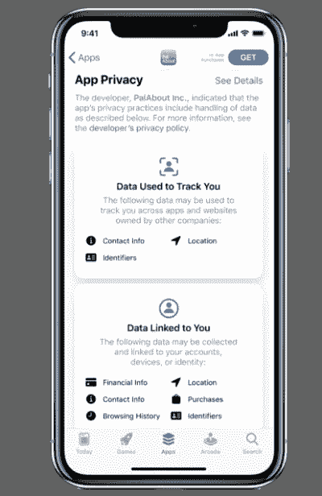
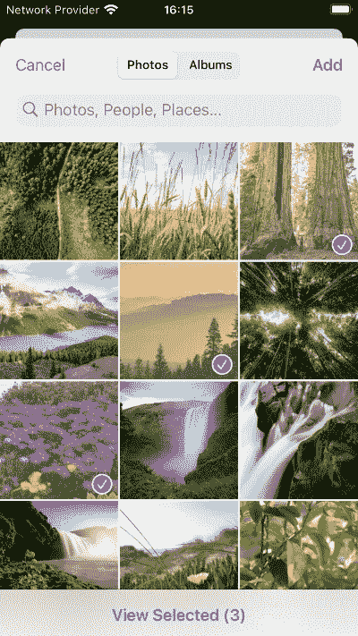
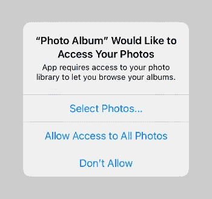
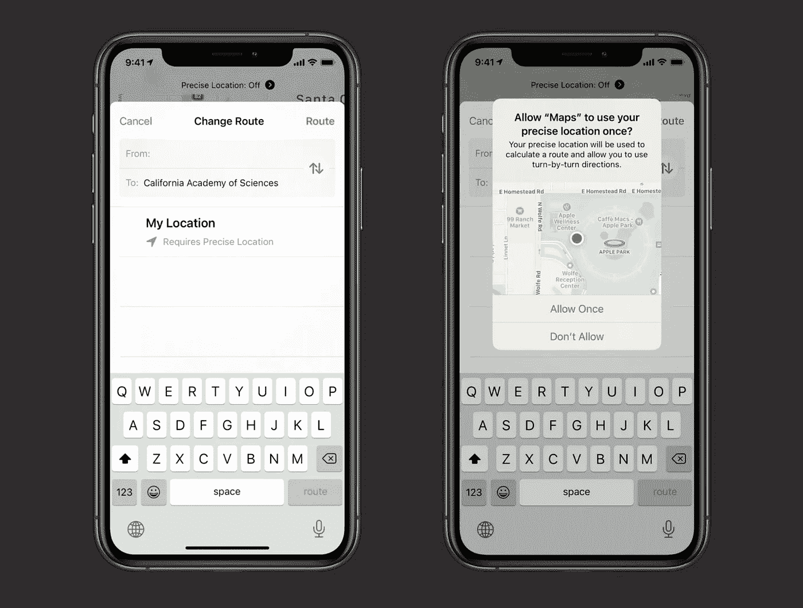
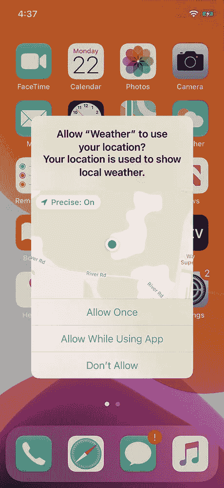
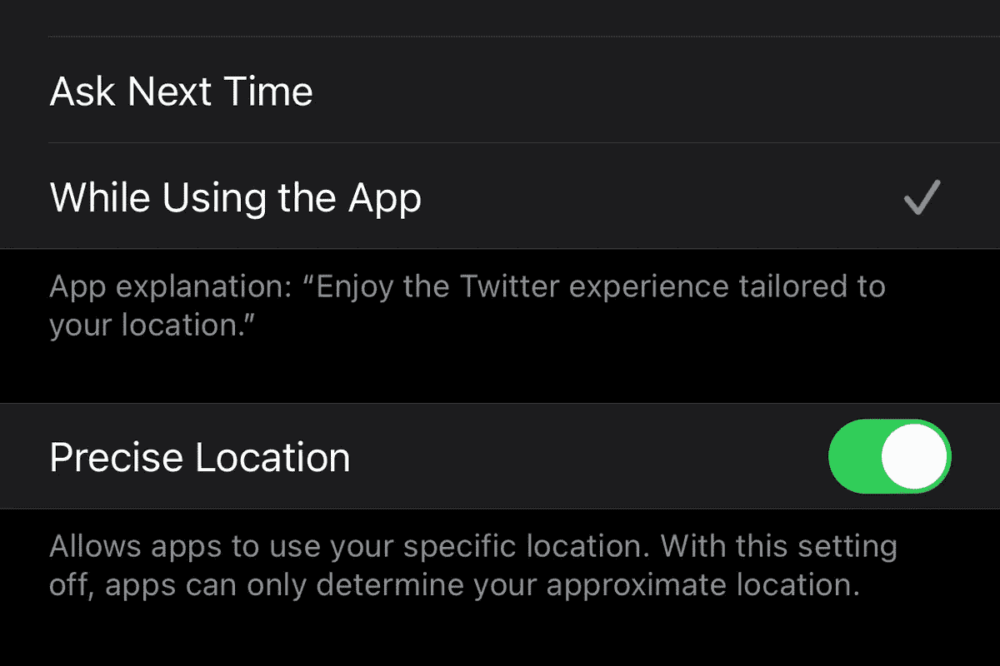
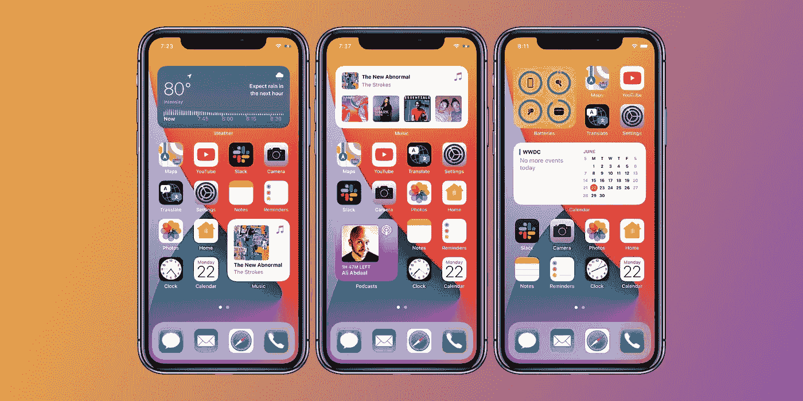
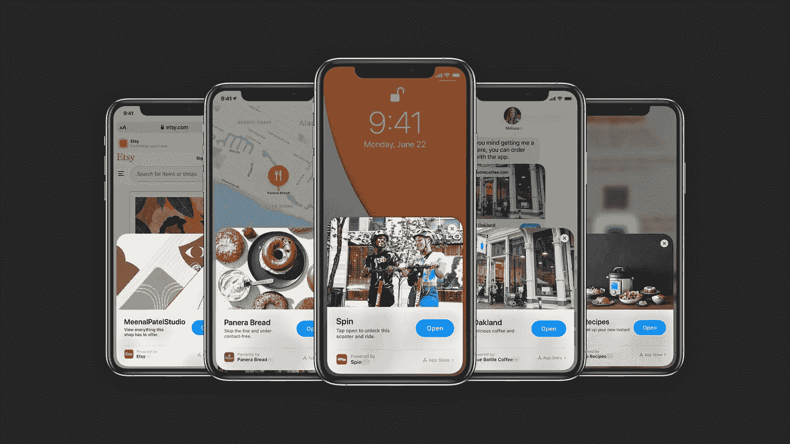

# iOS 14 的新功能——面向开发者

> 原文：<https://betterprogramming.pub/whats-new-in-ios-14-for-developers-52e6c0ae2d73>

## *小工具、应用程序剪辑、隐私更改等*

图片来源:[苹果](https://www.apple.com/ios/ios-14/)

在 WWDC20 上，苹果发布了其最受欢迎的操作系统 iOS 的第 14 版。经过七个测试版的测试期后，蒂姆·库克在苹果的 Time Flies 硬件活动(9 月 15 日)上确认了 iOS 14 的公开发行版(9 月 16 日)的可用性。

开发商对这一令人惊讶的声明并不满意。通常，苹果会在公开发售前一周发布金主(Golden Master)版本的 iOS。这让开发者有时间在该版本上测试他们的应用，修复最后一刻可能出现的错误和崩溃。另一个需要注意的重要事情是，使用 Xcode 的测试版提交应用程序进行审查是不可能的。

考虑到应用审查的时间框架，希望通过在发布时发布支持 iOS 14 新功能的更新来获得竞争优势的开发人员非常失望。

撇开苹果开发者关系不谈，这篇文章列出了你在为 iOS 14 准备下一次应用更新时必须/应该考虑的事情(如果你还没有的话)。

**变化是按部分组织的，并按优先级排序**，从你今天需要做的那些开始，以确保你的应用程序符合苹果对隐私的承诺，然后是你应该利用的其他功能，以使你的应用程序脱颖而出。

# 用户隐私

## 1.描述您的应用程序如何使用数据

**优先级:**立即(强制)

这是苹果今年最明显的隐私增强。您将被要求[披露关于您的应用程序收集何种数据的信息](https://developer.apple.com/support/app-privacy-on-the-app-store)以及它是否用于跟踪用户。您提供的信息将显示在该应用的 App Store 页面上。

App Store 上的隐私实践部分(示例应用程序)。(图片来源:[苹果](https://developer.apple.com/app-store/user-privacy-and-data-use/))

当您提交新版本的应用进行审核时，可以在 [App Store Connect](https://appstoreconnect.apple.com/) 中完成。

## 2.请求追踪许可

**优先级:**立即(必要时强制)

在 iOS 14 中，对广告商用户标识符(IDFA)的访问现在是可选的。**在以下情况下，您需要通过应用程序跟踪透明度框架征求用户的明确同意**:

*   显示目标广告
*   与第三方共享个人数据(例如位置)
*   使用第三方 analytics SDK 收集数据以投放广告或衡量广告效率

如果您收集的数据从未离开用户的设备，或者如果它用于防止欺诈或安全目的，您不需要请求许可。

如果用户拒绝同意，广告标识符将返回一串零，使其无效。也就是说，移动广告研究[估计高达 70%的 iOS 14 用户会选择被跟踪](https://www.adcolony.com/blog/2020/08/30/mobile-monday-study-shows-idfa-opt-in-rates-could-be-up-to-70-two-thirds-of-mobile-gamers-are-playing-more-than-before/)。(在采用的最初几个月，该数字可能会有所变化。)

有关这可能对你的应用程序产生的影响的更多细节，请参考文章“[苹果在 iOS 14 中对 IDFA 的改变](https://clearcode.cc/blog/apple-idfa/)”

## 3.照片图库更改

**优先级:**中(可选，但推荐)

过去，有两种方法可以访问用户的照片库。您可以简单地呈现`UIImagePickerController`并获得他们选择的图像。然而，许多流行的应用程序通常要求对用户的照片库进行读写访问，这是一个主要的隐私问题。用户不知道他们是否只是在使用特权上传他们选择的图片，或者后台是否正在进行其他邪恶的事情(例如，基于照片地理位置收集元数据为他们提供定向广告)。

苹果很清楚这种滥用。从 iOS 14 开始，现在有两种方法可以访问用户的照片库:`PHPicker` (取代了`UIImagePickerController`)，以及一个有限的照片选择器。

`PHPicker`提供综合搜索并允许多项选择。这特别有用，因为它放弃了开发或集成自定义照片拾取器的需要。它不仅减少了技术债务，而且你还可以获得苹果未来可能增加的所有增强功能。(除非您的用例明确需要一个定制的选择器。)

iOS 14 中新的 PHPicker(图片来源:[库巴 Suder](https://mackuba.eu/2020/07/07/photo-library-changes-ios-14/) )

另一种方法是有限的选择器，你的应用程序只能看到用户照片库中(非常)有限的子集。

**这是现在请求许可的标准方式，而不是应用程序的选择加入方式。**它还会影响使用旧 SDK 构建的应用。如果您不使用`PHPicker`，当您的应用程序试图访问照片库时，用户将会看到此对话框。

iOS 14 中照片图库访问的新标准权限对话框(图片来源:[库巴苏德](https://mackuba.eu/2020/07/07/photo-library-changes-ios-14/))

当用户选择顶部选项时，他们可以选择你的应用程序看到的照片。你的应用程序只能访问这些照片，无法知道用户的整个库中有多少照片。(当然，他们也可以通过中间选项授予您所有照片的权限。)

你的应用可以访问以下授权类型:授权、受限、受限/拒绝或未确定(在请求访问之前)。出于兼容性目的，即使用户授予您有限的权限，使用较旧的 SDK 构建的应用程序也将始终返回“已授权”。如果你不做任何事情，你的应用程序将继续工作，但用户体验可能会受到影响。

这种方法有一个警告:如果用户选择了五张照片，下次你需要访问照片库时，你将只能看到完全相同的五张照片。这是因为上述弹出窗口只会在您第一次请求访问时显示。 [Kuba Suder](https://mackuba.eu/2020/07/07/photo-library-changes-ios-14/) 提出了许多解决用户体验问题的方法，但推荐的做法是**在每次需要使用受限方法访问时请求授权**。然而，最好的实践是简单地使用系统选择器(`PHPicker`)。正如作者所说:

> “如果你有一个应用程序，目前使用某种滑动表格来显示最近的照片，用户可以从中选择一张照片，将其附加到帖子上，你真的真的应该考虑只使用系统选择器，而不是将表格作为一种‘暂存区’，并向流程中添加另一个不必要的步骤。”

有关这些变化以及如何实现它们的更多信息，请查看 [Kuba Suder 对此事的精彩概述](https://mackuba.eu/2020/07/07/photo-library-changes-ios-14/)。

## 4.大概位置

**优先级:**因应用类型而异

在 iOS 14 中，用户现在可以选择将应用程序的位置访问限制在一个大致的位置。虽然一些应用程序需要精确的位置(例如，路线导航、送餐)，但其他应用程序不需要随时知道用户的位置。例如，一个天气应用程序可以并且应该使用一个大概的位置。

近似的半径通常是直径几英里，并且将根据上下文动态地收缩/扩张。值得注意的是，近似位置的刷新频率远低于精确位置(即，当应用程序在后台时，大约每小时四次)。

iOS 14 中的地图应用需要精确的位置进行路由(左)，并要求一次性精确位置(右)。(图片来源: [9to5Mac](https://9to5mac.com/2020/08/12/ios-14-precise-location/) )

当用户授予访问权限时，它将是精确的或近似的。如果需要，还可以提示输入一次性的精确位置。在大多数情况下，你的应用程序应该保持功能，但如果你一直需要精确的位置，你必须说服用户这是必要的，并希望他们接受你的推理。

iOS 14 中位置访问的新授权对话框(注意精确位置切换)(图片来源: [EMM.how](https://emm.how/t/ios-14-changes-to-location-services/1283) )

用户可以随时在设置应用程序中单独更改每个应用程序的精确位置设置。

Twitter 应用的精确位置设置(图片来源: [MacWorld](https://www.macworld.com/article/3570226/how-ios-14-will-help-protect-your-privacy.html)

# 小工具

**优先级:**高(可选，但如果适用，建议使用)

这是 iOS 14 的旗舰功能之一。**强烈建议您在应用程序中添加对 widgets** 的支持，如果这有利于在用户的主屏幕上向用户展示相关信息的话。

小部件可以有多种尺寸。(图片来源: [9to5Mac](https://9to5mac.com/2020/09/16/how-to-use-iphone-home-screen-widgets-ios-14/) )

由于许多流行的应用程序需要时间来实现这些，所以现在是您通过添加支持来脱颖而出的最佳时机。[用户已经完全接受了 widgets](https://www.hitc.com/en-gb/2020/09/20/ios-14-home-screen-inspiration/) ，早期添加支持的开发者将(可能)在参与度上获得健康的提升。

小部件必须在 SwiftUI 中编写。关于窗口小部件以及如何实现它们的概述，请查看[苹果的窗口小部件人机界面指南](https://developer.apple.com/design/human-interface-guidelines/ios/system-capabilities/widgets/)，以及这些 WWDC 演讲:[为窗口小部件构建 SwiftUI 视图](https://developer.apple.com/videos/play/wwdc2020/10033/)和[会见 WidgetKit](https://developer.apple.com/videos/play/wwdc2020/10028\) 。

# 应用程序剪辑

**优先级:**因应用类型而异

应用程序剪辑是专为您的应用程序设计的“迷你”版本，能够执行单个任务。它们被设计成轻量级和快速的，不需要安装应用程序。例如，用户可以与应用程序剪辑进行交互，以订购食物、请求搭车或设置设备。

应用程序剪辑示例(图片来源:[9 到 5Mac](https://9to5mac.com/2020/08/27/heres-how-ios-14s-new-app-clips-feature-will-work/)

应用程序剪辑可以与他人共享，并通过苹果专用的应用程序剪辑代码、Safari 横幅、地图、NFC 标签或二维码激活。

您可能希望添加对应用程序剪辑的支持，以允许更多方式与应用程序的功能进行交互。用户会喜欢这一点，因为它消除了在他们的设备上安装另一个应用程序的负担，他们可能只在特定的用例中使用一次。

有关应用程序剪辑的更多信息，请参考[文档](https://developer.apple.com/documentation/app_clips)。

# 画中画(iPhone)

**优先级:**高(如果你还不支持的话)

在 iOS 9 中，苹果在 iPad 中加入了画中画。今年，他们扩展了对 iPhone 视频和 FaceTime 通话的支持。

如果你的应用程序的主要功能是视频播放，用户会希望支持 PiP。**如果您已经在 iPad 上支持此功能，则无需进一步操作。如果没有，你可以在[文档](https://developer.apple.com/documentation/avkit/avpictureinpicturecontroller)中找到如何实现的信息。**

(不出所料，YouTube 应用不支持 PiP，除非你是 YouTube Premium 订户。不幸的是，苹果仍然让谷歌将这项功能置于付费墙之后。[常见的解决方法是通过 Safari 观看视频](https://www.macrumors.com/guide/picture-in-picture/)，但在 iOS 14 发布后谷歌有意禁用了这一功能[。)](https://forums.macrumors.com/threads/ios-14-picture-in-picture-no-longer-working-with-youtubes-mobile-website-in-safari-without-premium.2255319/)

# 更多探索

## 机器学习(核心 ML)

在 Core ML 中有新的工具用于部署模型，以及为创建 ML 而进行的培训改进。

视觉和自然语言 API 也得到了增强；Vision 收到了至少六个新的更新，支持检测更多的对象和运动，而自然语言 API 引入了句子嵌入。

Anupam Chugh 详细介绍了机器学习的增强功能[，苹果的](https://heartbeat.fritz.ai/advancements-in-artificial-intelligence-in-ios-14-c1602f5d4951) [WWDC 视频](https://developer.apple.com/videos/wwdc2020/?q=core%20ml)深入探索了新的变化。

## 增强现实(ARKit)

ARKit 4 引入了一个深度 API，它使用 iPad Pro (iPad OS)上的激光雷达扫描仪来访问详细的深度信息。这可以用来实现更精确的测量。

位置锚定利用了苹果地图的强大功能，将 AR 体验放置在特定区域，例如城市和地标。用户能够从不同的角度在场景中移动虚拟物体。

现在，所有配备前置摄像头和苹果神经引擎(A12 Bionic 和更高版本)的设备都支持面部跟踪。

有关 ARKit 变更的更多信息，请查看[概述](https://developer.apple.com/augmented-reality/arkit/)和[文档](https://developer.apple.com/documentation/arkit/)页面。

# 贬值

虽然这与 iOS 14 没有直接关系，但这里有另一个提醒，如果你仍在使用`**UIWebView**`，**现在是时候最终将其从你的应用中移除，并过渡到** `**WKWebView**`。

早在 4 月份，苹果就停止接受使用`UIWebView`提交的新应用程序(为什么会有人在新应用程序中使用这个 API 呢？)和[将从**2020 年 12 月**](https://developer.apple.com/news/?id=12232019b) 起停止接受包含此已弃用 API 的应用更新。

# 结论

我们研究了 iOS 14 中最大的变化，主要集中在隐私方面。苹果对隐私的持续承诺需要组成充满活力的生态系统的开发者的支持。因此，在为用户群提供独特体验的同时，确保你的应用以隐私为导向是至关重要的。

此外，尽早利用新功能会让你处于有利地位——用户重视对他们每天依赖的应用程序的持续支持和承诺。我们希望这篇文章能为你指明正确的方向。

感谢阅读！