# iOS 14 有什么新功能

> 原文：<https://betterprogramming.pub/whats-new-in-ios-14-wwdc2020-9e358c75ff1a>

## 看看在 WWDC 2020 上宣布了什么

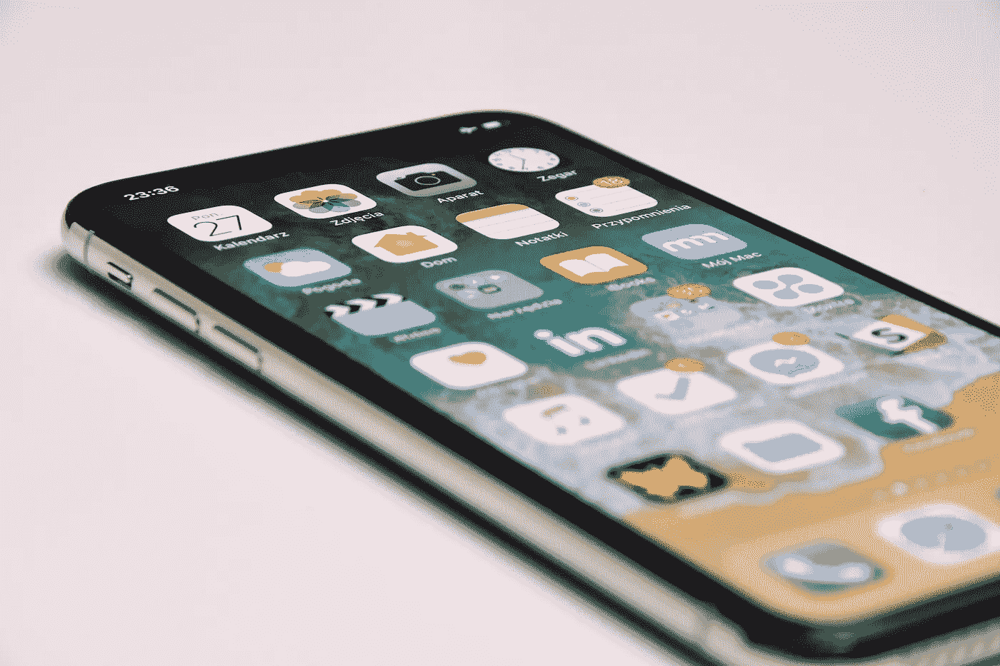

在 [Unsplash](https://unsplash.com/s/photos/ios?utm_source=unsplash&utm_medium=referral&utm_content=creditCopyText) 上由 [Przemyslaw Marczynski](https://unsplash.com/@pemmax?utm_source=unsplash&utm_medium=referral&utm_content=creditCopyText) 拍摄的照片

iOS 14 现在出来了。这是一个重大的更新，带来了几个新功能。没有太多的文献，让我们深入了解重要的更新。

# 1.应用程序库

目前的 iPhone 主屏幕很棒，但随着我们获得越来越多的应用程序，主屏幕上的页面数量增加，它开始看起来像下图一样。页面很多，我们通常会忘记哪个应用在哪个页面上。

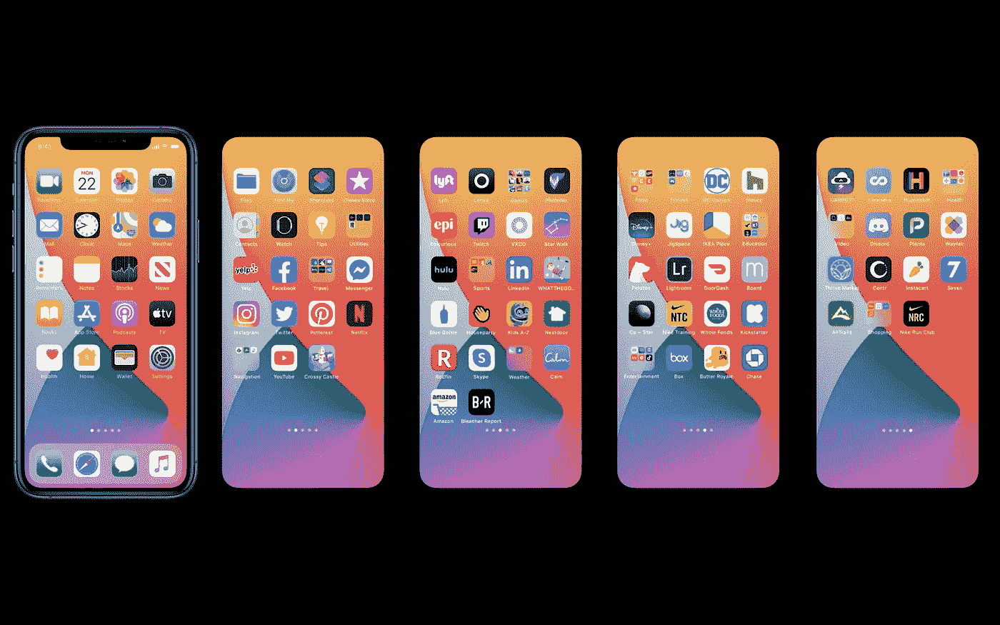

图片来源:苹果

为了解决这个问题，苹果在 iOS 14 中推出了一个名为**应用程序库的新功能。**

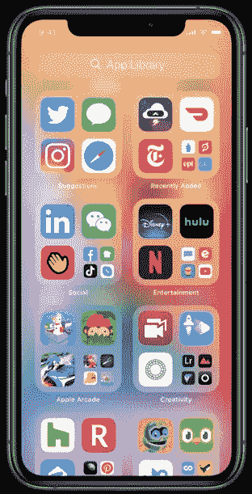

图片来源:苹果

它是主屏幕页面末尾的一个新空间，可以在一个简单易用的视图中自动组织所有应用程序。

在应用程序库中，访问应用程序很容易。在顶部，你有一个搜索栏，你可以从 A 到 z 组织你的所有应用。在左上角，你有建议的应用，在右边，你最近添加的应用。

您可以点击任何类别来查看该类别中的所有应用程序。

现在，问题是如何在主屏幕上隐藏这么多页面。这很简单:只要按照这些步骤。

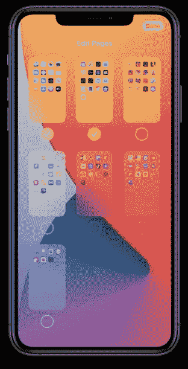

图片来源:苹果

**第一步:**长按任何应用程序，直到你看到应用程序在抖动。

**第二步:**点击底部的页面控件。

**第三步:**你会看到所有页面的缩小视图。取消选择您想要隐藏的页面。

**步骤 4** :点击完成。

# 2.小工具

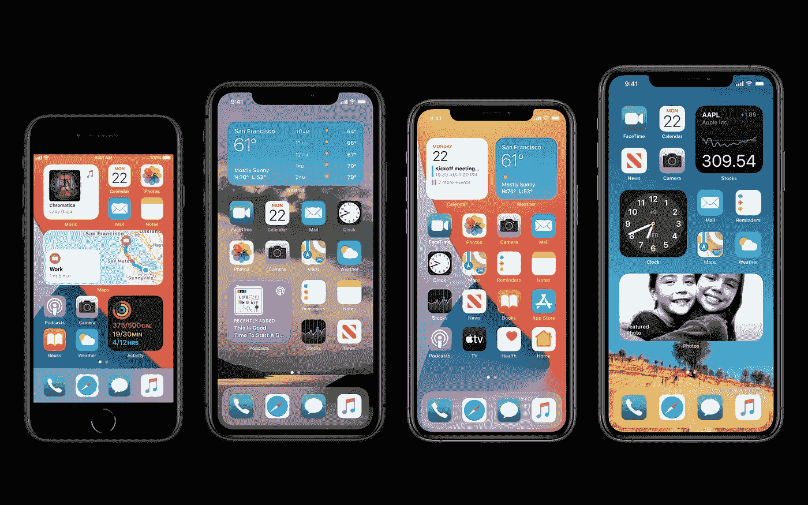

图片来源:苹果

iOS 14 在 widget 屏幕上引入了全新的外观。现在，您可以在主屏幕上拖放多个小部件。当你点击这个小工具时，你可以浏览所有可用的不同尺寸。苹果还增加了一个新的小工具，名为智能堆栈，，如下图所示。

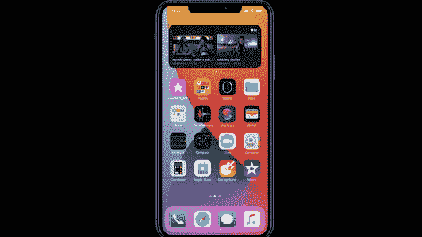

图片来源:苹果

# 3.画中画

现在，您可以在观看视频或进行 FaceTime 视频通话时访问您的应用程序。

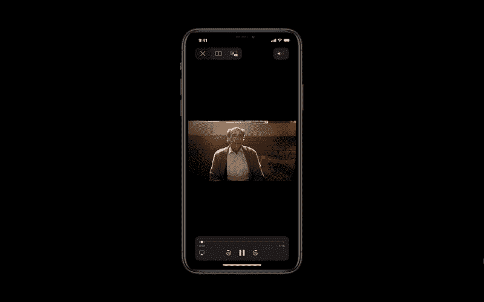

图片来源:苹果

# 4.重新设计的 Siri 体验

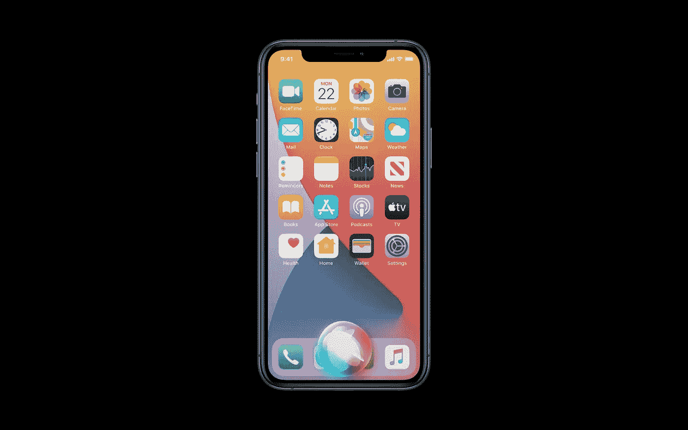

图片来源:苹果

目前，当你使用 Siri 时，你的手机会通过隐藏上下文切换到全屏 UI。在 iOS 14 中，我们会发现一种全新的紧凑设计，它将提供无缝的 Siri 体验。例如，如果我们说“打开 Safari”，Siri 会在屏幕底部弹出，并立即启动应用程序。不仅如此，Siri 还可以帮你给联系人发送音频信息。

# 5.新翻译应用程序

图片来源:苹果

您可以使用此应用程序通过音频将单词或句子从一种语言翻译成另一种语言。如果你切换到横向模式，它将打开一个对话模式。

# 6.信息

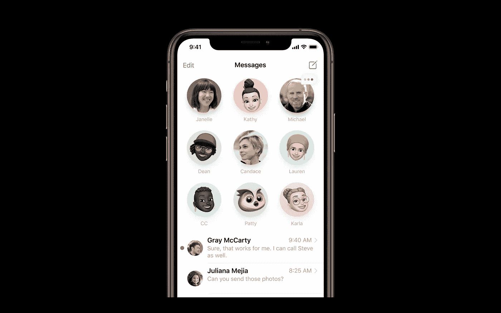

图片来源:苹果

关键点:

*   现在你可以锁定你最喜欢的对话，它会出现在顶部。
*   有新的 Memoji 发型，外观，面部覆盖，年龄选项，和贴纸。
*   内联回复可以单独关注，而不是看到整个群聊。
*   @已引入个人参与者的提及标记，以在他们的设备上触发通知。
*   现在可以设置合影了。

# 7.地图

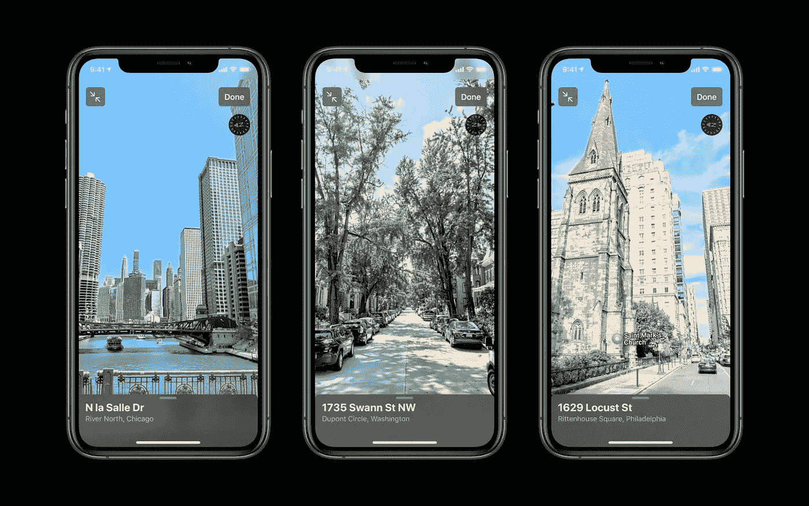

图片来源:苹果

您可以使用苹果地图，通过集成的指南**来发现精彩的地方。**它还提供关于美食、购物等的信息。它还增加了目的地的骑行方向，包括海拔和拥堵水平数据。增加了电动汽车路线，以帮助自动定位您路线上的充电站，使用特定于您车辆的充电器数据来帮助您避免错误类型的充电器。

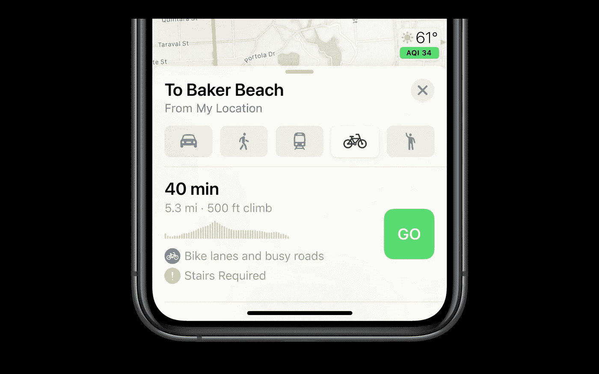

图片来源:苹果

# 8.汽车游戏

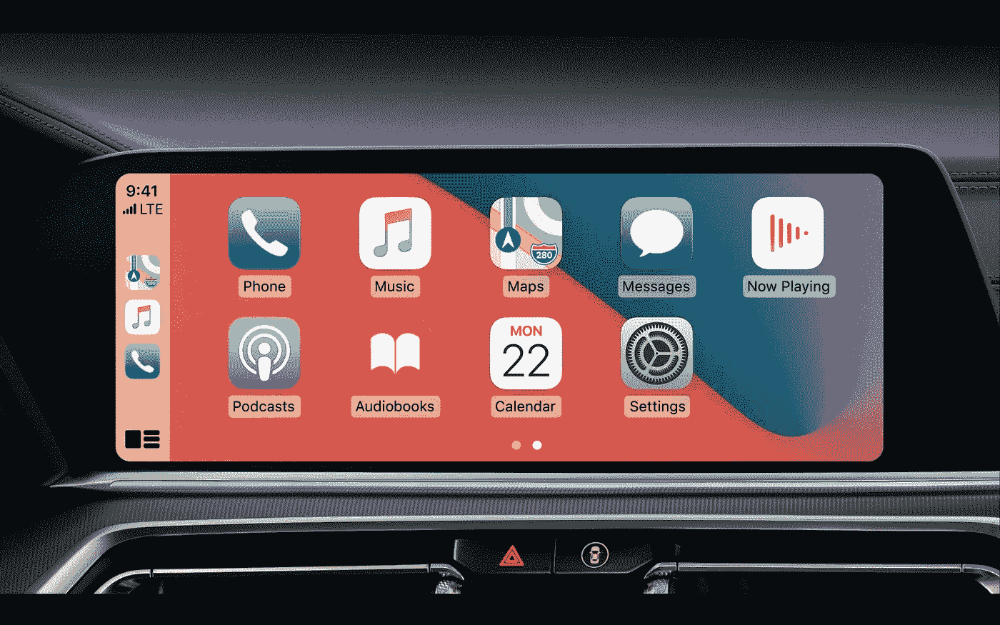

图片来源:苹果

在 iOS 14 中，苹果改进了车载界面 CarPlay，增加了自定义壁纸选项。苹果还发布了一项名为 CarKey 的新功能，这是一把为你的汽车准备的数字钥匙。您可以使用 CarKey 来锁定、解锁和启动支持 iPhone NFC 的汽车。2021 款宝马 5 系汽车将具备这些功能。您也可以暂时与服务员或您的朋友共享此车钥匙。iOS 13 也将推出 Carkey。

# 9.应用程序剪辑

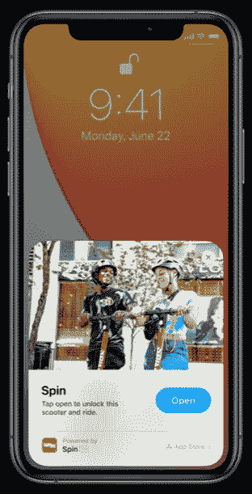

图片来源:苹果

App Clips 是 App 的一小部分。它又轻又快，很容易被发现。应用程序剪辑就像应用程序内容的迷你版或演示版，无需下载完整的应用程序。您可以使用 App clip 来快速访问购买或租借的应用程序。你也可以使用 App clips 进行支付，比如 Apple Pay。您可以从 Safari、iMessage、地图、NFC 标签或条形码(应用程序片段代码)中启动应用程序片段。应用程序剪辑的最大大小为 10MB。

我希望这篇文章对你有用。以上总结了 iOS 14 的大部分要点。敬请关注更多更新。

感谢阅读。