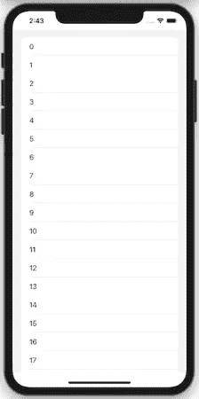

# iOS 14 UICollectionView —新增内容

> 原文：<https://betterprogramming.pub/whats-new-in-ios-14s-uicollectionview-3c02b63f7a0f>

## 对表视图列表的现成支持，一种新的单元格注册技术，以及 DiffableDataSources 中的增强功能


[张凯夫](https://unsplash.com/@zhangkaiyv?utm_source=medium&utm_medium=referral)在 [Unsplash](https://unsplash.com?utm_source=medium&utm_medium=referral) 上拍照。

在 WWDC 2020 期间，收藏视图并没有完全进入 SwiftUI，但这并没有阻止`UICollectionView`接收一些强大的新更新。

`CompositionalLayouts`和`DiffableDataSources`是在 iOS 13 `CollectionViews`中引入的，为我们的`UICollectionView`带来了更多构建布局和数据源的灵活性。

在 iOS 14 中，CollectionView APIs 新增了三项功能，分别用于布局、数据源和单元格，这是构建集合视图的三大支柱:

*   `Lists`是`CompositionalLayouts`的新成员，在`CollectionViews`中带来了`UITableView`般的外观。
*   `UICollectionView.CellRegistration`允许您使用新的配置 API 以完全不同的方式配置单元。此外，还有一个新的`UICollectionViewListCell`具体类，默认为单元格提供类似列表的内容样式。
*   Diffable Data Source 现在包括部分快照，允许在每个部分的基础上更新更多的数据。这在构建轮廓样式列表时很有用，这是 iOS 14 中引入的一种新的分层设计。

在接下来的几节中，我们将讨论前两个新增内容。我们来看看如何用 iOS 14 的新方式在`UICollectionView`中构造布局和单元格。

# iOS 14 单元配置和注册

iOS 14 引入了全新的单元格配置 API，用于配置我们的 CollectionView 和 TableView 单元格。

这意味着我们不需要像之前那样直接在`UITableViewCell`和`UICollectionViewCell`上设置属性。

新的配置 API 允许我们使用内容配置来设置单元格的内容和样式，或者根据不同的状态对其进行更新:

对于`UICollectionViews`，我们有了新的`UICollectionViewListCell`。我们可以通过以下方式直接获取其默认配置:

```
var content = listCell.defaultContentConfiguration()
```

通过这样做，我们能够摆脱使用单元标识符和必须的`if let`和`guard let`语句来确保单元被注册。

更重要的是，我们不再直接访问单元格的 label 和 image 属性，这允许我们组合可以跨`TableView`、`CollectionView`和定制单元格使用的配置。

除了`contentConfiguration`，还有一个`backgroundConfiguration`，我们可以利用它来设置背景外观属性，还有一个`leadingSwipeActionsConfiguration`和`trailingSwipeActionsConfiguration`，可以轻松地将类似`UITableView`的滑动行为直接嵌入到我们的`UICollectionView`单元格实现中。

我们刚刚创建的新的`UICollectionView.CellRegistration`结构在传递到`dequeueConfiguredReusableCell`内部时会自动处理单元注册。您不再需要使用标识符注册单元格。

# iOS 14 集合视图的新列表布局

从我们在前一节讨论的`UICollectionViewListCell`中得到启示，我们现在有了一个构建在复合布局之上的新列表布局。

快速设置这个布局所需要的就是传入`UICollectionViewListConfiguration`，除了下面的简单外观之外，它还可以设置为`grouped`、`insetGrouped`、`sideBar`和`sideBarPlain`:

`UICollectionView`中新的`Lists`支持的好处是它为自调整大小的单元格提供了开箱即用的支持。

我们还可以通过在组合布局中传递`NSCollectionSectionLayout.list`来创建基于每个部分的列表。

在`UICollectionView`中为列表定制`header`和`footer`与我们在`UITableView`中做的有点不同。

您需要以如下方式调用列表配置中的`headerMode`或`footerMode`:

```
config.headerMode = .supplementary
config.footerMode = .supplementary
```

随后，您需要通过调用 Diffable 数据源上的`supplementaryViewProvider`来提供视图，其中您可以设置`dequeueConfiguredReusableSupplementary`函数并传递头部配置。

现在让我们结合上面的新特性(单元配置 API、列表布局和注册)。

我们已经在我们的`UIViewController`中设置了一个简单的`UICollectionView`，如下所示:

在模拟器中运行应用程序时，您会得到以下输出:



# 结论

总而言之:

*   iOS 14 引入了一种新的`CellRegistration`技术，不需要使用蜂窝标识符进行注册。
*   新的配置 API 封装了单元的内容和背景视图属性。`UICollectionViewListCell`为我们提供了默认配置，可以根据状态进行设置和更新。
*   像滑动动作和设置附件这样的定制现在可以在设置单元配置时直接完成，从而鼓励我们保持单一的真实来源。
*   `UICollectionView`的新列表与`UITableView`相似，可以通过指定布局和配置(也可以基于每个部分)以及适当的页眉和页脚来轻松组合。

我们设法快速组合我们所学的东西，以声明的形式构建一个简单的`UICollectionView`。是时候告别单元格项目标识符了。

在下一篇文章中，我们将了解 iOS 14 的不同数据源中的新特性。敬请关注，感谢阅读。