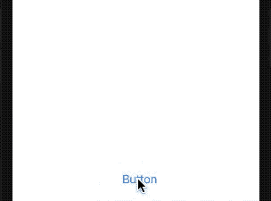
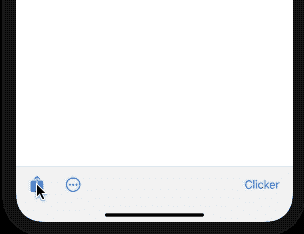
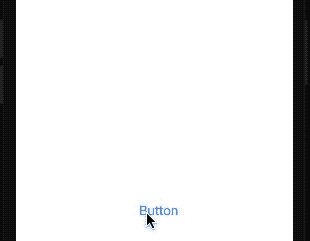

# iOS 14 的 UIMenu 和 ContextMenu 有什么新功能

> 原文：<https://betterprogramming.pub/whats-new-in-ios-14s-uimenu-and-contextmenu-433cd2037c37>

## 与 UIControl、新的 UIDeferredMenuElement 和上下文菜单增强功能的现成集成


[Yogi Purnama](https://unsplash.com/@yogipurnama?utm_source=medium&utm_medium=referral) 在 [Unsplash](https://unsplash.com?utm_source=medium&utm_medium=referral) 上拍摄的照片

在 iOS 13 中引入，允许轻松创建菜单和子菜单，这在构建上下文菜单时非常方便。

iOS 14 通过分别通过`menu`属性和初始化器引入对`UIButton`和`UIBarButtonItem`的开箱即用支持，为`UIMenu`带来了更多定制。

在接下来的几节中，我们将看看如何在上述 UI 控件上设置菜单。我们还将看看新的`UIDeferredMenuElement`，它可以让我们创建动态菜单项。

# 在 UIButton 上添加 UIMenu

通过将`UIMenu`分配给`UIButton`上新的`menu`属性，UIKit 自动负责在长按下时显示该菜单。

值得注意的是，将`displayInline`设置为`option`会在父菜单中显示子菜单。



为了在点击按钮时立即显示菜单，我们需要将`showsMenuAsPrimaryAction`属性设置为`true`:

```
button.showsMenuAsPrimaryAction = true
```

为了确定菜单是否被触发，并可能执行一些其他操作，iOS 14 为`UIButton`引入了一个新的控制事件，即`menuActionTriggered`。我们可以通过以下方式设置它来触发`UIAction`处理程序:

```
button.addAction(UIAction(title: ""){ _ in print("Hello Menu")},for: .menuActionTriggered)
```

# 在 UIBarButtonItem 上添加 UIMenu

除了提供`menu`属性来创建和显示 UI 菜单，`UIBarButtonItem`还引入了一个初始化器，其中您可以将`UIMenu`组和主要操作作为可选参数传递。

以下代码显示了如何用`primaryAction`和`menu`初始化器构建`UIBarButtonItems`:

`UIButton`和`UIBarButtonItem`菜单动作的重要区别在于，对于后者，没有`showAsPrimaryAction`属性。所以，如果你想让`UIBarButtonItem`在触地时立即显示菜单，就不要设置`primaryAction`。



# iOS 14 UIDeferredMenuElement

`UIDeferredMenuElement`是 iOS 14 中引入的一个强大的新组件，可以让你以异步方式添加菜单项。

为了做到这一点，您提供了一个标准的占位符菜单，一旦它被加载，就会被延迟的菜单元素所替换。

延迟菜单提供了一种内置的缓存机制，可以确保同一实例的后续加载更快。



`UIDeferredMenuElement`对于生成深度嵌套的菜单也很有用，在这种情况下，菜单项只有在需要时才会显示。

# iOS 14 新的上下文菜单交互

去年引入了上下文菜单交互，作为 3D 触摸菜单的替代品。iOS 14 增加了两个新功能:

*   `updateVisibleMenu` — `UIMenu`元素不再是不可变的，从而允许您在显示它们的时候，就地替换它们的属性。这肯定有助于在上下文菜单中切换状态。
*   通过调用`UIContextMenuIteraction`实例上的`menuAppearance`属性定制外观。这个新属性允许您将上下文菜单的外观设置为`rich`或`compact`，前者用于显示预览，后者是我们在前面章节中看到的默认外观。

# 结束语

改进后的`UIMenu` s 现在将在苹果自己的应用程序上支持大多数 UI 控件。例如，Safari 应用程序工具栏上的选项按钮，现在显示上面的紧凑上下文菜单，而不是旧的 UI 动作表。

`UIMenu` s 也将有助于从后退按钮执行快速导航。

苹果今年给 UIKit 带来的更新清楚地展示了这个框架将会继续存在。至少还有几年。

这一次到此为止。感谢阅读。