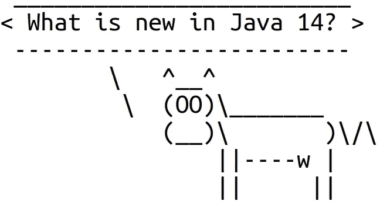

# Java 14 有什么新特性？

> 原文：<https://betterprogramming.pub/whats-new-in-java-14-a472ec291c05>

## 16 个主要增强功能、2400 个错误修复等等


[Fab Lentz](https://unsplash.com/@fossy?utm_source=unsplash&utm_medium=referral&utm_content=creditCopyText) 在 [Unsplash](https://unsplash.com/s/photos/idea?utm_source=unsplash&utm_medium=referral&utm_content=creditCopyText) 上拍摄的照片

Java 14 准备在 2020 年 3 月 17 日发布。除了约 2400 个错误修复和小的增强，新版 Java 包含 16 个主要增强，也称为 jep(Java 增强建议)。

让我们仔细看看 Java 14 中的主要更新:新的开关表达式、更好的`NullPointerException` s、垃圾收集的改进、JFR 事件流等等。



图片来源:作者

# 切换表达式

Java 语言的这一更新在 Java 12 和 13 中已经可用，但只是作为预览语言特性，这意味着它在默认情况下是不可用的。最后，Java 14 发布了新的开关表达式。长话短说，Java 14 引入了一种新的简化形式的带有`case L -> ...`标签的开关块。在某些情况下，新的开关表达式可能有助于简化代码。这里有几个例子。

假设我们有一个描述工作日的枚举。我们可以使用新的开关表达式编写以下代码:

```
switch (day) {
    case MONDAY              -> System.out.println("Aweful");
    case TUESDAY, WEDNESDAY  -> System.out.println("Okay");
    case THURSDAY            -> System.out.println("Good");
    case FRIDAY              -> System.out.println("Great");
    case SATURDAY, SUNDAY    -> System.out.println("Awesome");
}
```

在这里，我们只对每个`case`使用了一个单一的表达。注意，`switch`块没有使用任何`break`语句，这使得它更短。下一个示例显示了新的开关表达式如何返回值:

```
int numLetters = switch (day) {
    case MONDAY, FRIDAY, SUNDAY -> 6;
    case TUESDAY                -> 7;
    case THURSDAY, SATURDAY     -> 8;
    case WEDNESDAY              -> 9;
};
```

也可以编写多行代码块，用新的关键字`yield`返回值:

```
int result = switch (s) {
    case "Foo" -> 1;
    case "Bar" -> 2;
    default    -> {
        System.out.println("Neither Foo nor Bar, hmmm...");
        yield 0;
    }
};
```

使用新的开关表达式时，有几件重要的事情需要记住。例如，新开关表达式的情况必须是详尽的。这意味着，对于所有可能的值，必须有一个匹配的开关标签。或者，由于`yield`现在是一个关键字，名为`yield`的类现在在 Java 14 中是非法的。

如果你想了解更多新的开关表达，欢迎阅读 [JEP 361](https://openjdk.java.net/jeps/361) 。作者提供了大量关于新开关表达式的有用信息。

# 有用的 NullPointerExceptions

当代码试图取消引用一个空引用时，JVM 抛出一个`NullPointerException` (NPE)。所有 Java 开发人员以前都见过它们。例如，以下代码可能会导致 NPE:

```
foo.bar = 10;
```

NPE 将如下所示:

```
Exception in thread "main" java.lang.NullPointerException
    at App.main(App.java:17)
```

异常消息包含一个文件名和一行发生空解引用的地方。对于`foo.bar = 10;`语句，不难发现 NPE 是因为`foo`变量为空而被抛出的。不幸的是，有时并不清楚到底是什么导致了 NPE。例如，如果`a`、`b`或`c`为空，那么将抛出一个 NPE:

```
a.b.c.d = 42;
```

然而，无论哪个字段为空，NPE 看起来都是一样的。它没有给出任何实际上哪个字段为空的线索。

这是另一个例子。如果嵌套数组之一为空，则会导致 NPE:

```
a[i][j][k] = 99;
```

同样，无论哪个数组为空，NPE 看起来都是一样的。

Java 14 解决了这个问题，使 NPEs 更加友好。现在 JVM 可以判断出哪个变量为空，然后在异常消息中让用户知道。例如，行`foo.bar = 10;`中的空解引用将导致以下 NPE:

```
Exception in thread "main" java.lang.NullPointerException: 
        Cannot assign field "bar" because "foo" is null
    at App.main(App.java:17)
```

如果`a.b`为空，行`a.b.c.d = 41;`中的空解引用将导致以下 NPE:

```
Exception in thread "main" java.lang.NullPointerException: 
        Cannot read field "c" because "a.b" is null
    at App.main(App.java:17)
```

在`NullPointerException` s 中的新信息可能非常有助于分析其根本原因，并且可以使开发人员的生活稍微轻松一些。顺便说一下，自 2006 年以来，SAP 的 JVM 中就有了这种改进。可惜用了 14 年才最终带入 OpenJDK。

如果你对细节感兴趣， [JEP 358](https://openjdk.java.net/jeps/358) 的作者提供了很多关于这个新特性的信息。

# 包装工具(培养箱)

目前，Java 应用程序通常作为简单的 JAR 文件分发。然而，这不是很方便，尤其是对于应用程序的用户来说。如果 Java 应用程序是像 Windows 上的 MSI 或 Mac 上的 DMG 那样的可安装包，那就好得多了。这将允许以用户熟悉的方式分发、安装和卸载 Java 应用程序。

[JEP 343](https://openjdk.java.net/jeps/343) 推出了`jpackage`工具，该工具将 Java 应用打包成一个特定于平台的包，其中包含所有必要的依赖项。以下是支持的包格式列表:

*   Linux 上的 DEB 和 RPM
*   苹果电脑上的 PKG 和 DMG
*   Windows 上的 MSI 和 EXE

以下是如何使用新工具的示例:

```
$ jpackage --name myapp --input lib --main-jar main.jar \
  --main-class myapp.Main
```

它获取`lib/main.jar`文件，并以最适合于运行它的系统的格式生成一个包。入口点是`myapp.Main`类。

JEP 的作者提供了相当多关于新工具的有用[信息。](https://openjdk.java.net/jeps/343)

虽然`jpackage`工具在 JDK 14 中可用，但它是作为孵化器模块提供的，这意味着该功能不能保证是稳定的，可能会在未来的版本中进行修订。

# 更好的垃圾收集

Java 14 在垃圾收集方面包含了多项增强。

JEP 345 通过实现 NUMA 感知的内存分配来改进 G1 垃圾收集器。顺便说一下，NUMA 代表非统一内存访问。这个特性已经在并行垃圾收集器中实现了很长时间。现在，通过使用新的`+XX:+UseNUMA`命令行选项运行 Java，也可以在 G1 启用它。这应该会提高大型计算机上的 G1 性能。

[JEP 363](https://openjdk.java.net/jeps/363) 移除了几年前就被弃用的并发标记清除(CMS)垃圾收集器。再见 CMS！

[JEP 364](https://openjdk.java.net/jeps/364) 和 [JEP 365](https://openjdk.java.net/jeps/365) 使 Z 垃圾收集器(ZGC)在 macOS 和 Windows 上可用。ZGC 是几年前添加到 JVM 中的并发垃圾收集器。ZGC 试图减少垃圾收集的暂停时间，可以处理从几百兆字节到几兆字节大小的堆。以前，收集器只能在 Linux 上运行。

[JEP 366](https://openjdk.java.net/jeps/366) 不赞成并行清除和串行旧垃圾收集算法的结合。这种组合必须由用户使用`-XX:+UseParallelGC -XX:-UseParallelOldGC`命令行选项来启用。作者认为这种组合并不常见，但需要大量的维护工作。事实上，选项`-XX:UseParallelOldGC`现在已经被否决了。如果使用不赞成使用的模式，将会显示警告。

# JFR 事件流

JDK 飞行记录器(JFR)是一个事件记录器，内置于 JVM 中。它捕获关于 JVM 本身以及在 JVM 中运行的应用程序的诊断和分析数据。JFR 曾经是一个专有工具，但它在 2018 年作为 OpenJDK 11 的一部分发布的 Java 中是开源的。

要使用 JFR 提供的数据，用户必须开始记录，停止记录，将内容转储到磁盘，然后解析记录文件。这对于应用程序概要分析来说非常有效，但是对于监控来说就不太好了。

在 Java 14 中，JFR 允许用户异步订阅事件。用户现在可以注册一个处理程序，它将被调用以响应事件的到来。`RecordingStream`类提供了过滤和消费事件的统一方法。JEP 的作者提供了一个例子:

更多信息可在 [JEP 349](https://openjdk.java.net/jeps/349) 找到。

# 语言预览功能

Java 14 包含对 Java 语言的几个更新，缺省情况下这些更新还不可用。

首先， [JEP 305](https://openjdk.java.net/jeps/305) 用一个绑定变量扩展了`instanceof`操作符。这里有一个例子:

```
if (obj instanceof String s) {
    // can use s here
}
```

如果`obj`是`String`的一个实例，那么它就被转换成`String`，并赋给绑定变量`s`。

第二， [JEP 359](https://openjdk.java.net/jeps/359) 将记录引入 Java 语言。记录有名称和状态描述。状态描述声明了记录的组成部分。记录也可以有主体。这里有一个简短的例子:

```
record Point(int x, int y) {}
```

第三，在收集了对 Java 13 的反馈后， [JEP 368](https://openjdk.java.net/jeps/368) 为文本块添加了几个新的转义序列，这些序列是之前作为语言预览特性在 Java 13 中引入的。

不幸的是，这三个更新仍然只能作为默认情况下不启用的预览语言功能使用。要启用新语法，您必须使用`--enable-preview --release 14`选项运行 Java 编译器，然后使用`--enable-preview`选项启动`java`:

```
$ javac -d classes --enable-preview --release 14 Test.java
$ java -classpath classes --enable-preview Test
```

# 其余的

Java 14 还有什么变化？

JEP 370 引入了一个 API，允许 Java 应用安全有效地访问 Java 堆之外的外部内存。听起来很吓人。新的 API 应该成为`java.nio.ByteBuffer`和`sun.misc.Unsafe`类的替代品。该功能作为孵化模块提供。

[JEP 352](https://openjdk.java.net/jeps/352) 增加了新的文件映射模式，这样`FileChannel` API 可以用来创建引用非易失性存储器(NVM)的`MappedByteBuffer`实例。

Java 11 中不赞成使用 Pack200 工具。现在 [JEP 367](https://openjdk.java.net/jeps/367) 移除了工具及其 API。

如果你了解 Solaris 和 SPARC， [JEP 362](https://openjdk.java.net/jeps/362) 放弃了对 Solaris/SPARC、Solaris/x64 和 Linux/SPARC 平台的支持。将来，这些平台上的端口很可能会从 OpenJDK 中移除。

# 结论

与 Java 13 中的五个 jep 相比，新的 Java 14 提供了更多重要的增强。这些更新涉及各个领域。最有可能的是，Java 开发人员最感兴趣的更新将是新的开关表达式和增强的`NullPointerException`。不要忘记尝试新的语言预览功能，并向 JDK 开发人员提供您的反馈。享受全新的 Java 14！

# 环

*   [OpenJDK 14 时间表和增强功能列表](https://openjdk.java.net/projects/jdk/14/)