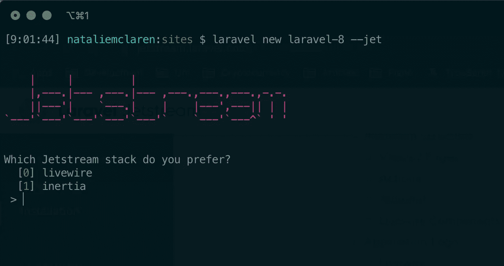
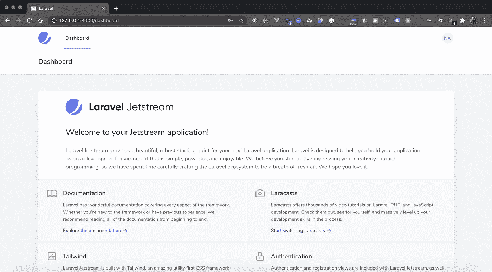
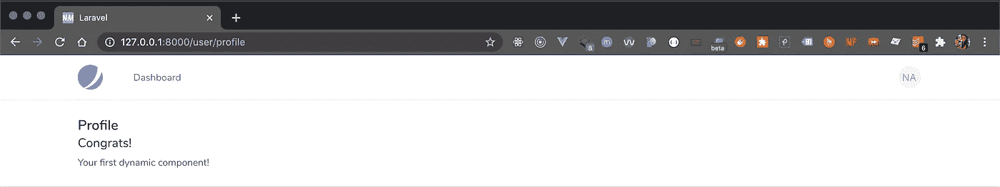
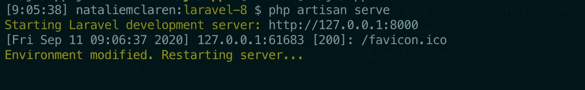

# Laravel 8 有什么新功能？

> 原文：<https://betterprogramming.pub/whats-new-in-laravel-8-847c73d16d7a>

## **#2 某型号目录！**


由[亨利·l·T3 在](https://unsplash.com/@d3cima?utm_source=unsplash&utm_medium=referral&utm_content=creditCopyText) [Unsplash](https://unsplash.com/s/photos/php?utm_source=unsplash&utm_medium=referral&utm_content=creditCopyText) 上拍摄的照片

已经六个月了吗？！确实如此。你知道这意味着什么:一个新的 Laravel 版本在这里——Laravel 8！

Laravel 8 于两天前发布，带来了一系列有用的更新，我很高兴听到这些更新。在这篇文章中，我将回顾发生了哪些变化。欲知详情，请点击查看发布说明[。](https://laravel.com/docs/8.x/releases)

*免责声明:Laravel 将在未来六个月内继续提供该版本的 bug 修复，并在下一年内提供安全修复。*

# 涵盖了哪些内容？

1.  [Laravel Jetstream](#2b79)
2.  [一个型号目录](#ddb2)
3.  [模型工厂类](#7604)
4.  [迁移挤压](#a387)
5.  [作业批处理](#68d1)
6.  [改良限速](#a387)
7.  [改进的维护模式](#4ef6)
8.  [关闭调度/连锁](#4684)
9.  [动叶片组件](#862d)
10.  [事件监听器改进](#1c2b)
11.  [时间测试助手](#9aed)
12.  [环境变化时自动重装](#91c7)
13.  [顺风成为分页器的默认样式](#57d2)
14.  [路由名称空间更新](#46ea)

# 1.拉勒维尔急流

版本 8 引入了 Laravel Jetstream——一个带有时尚用户仪表板的框架应用脚手架。Jetstream 处理从登录、注册和电子邮件验证到会话管理和可选团队管理的一切事务。它设计了一个高度可定制的 CSS 框架， [Tailwind](https://tailwindcss.com/) ，并为你提供了在 [Livewire](https://laravel-livewire.com/) 和 [Inertia](https://inertiajs.com/) 之间的选择。

要开始，请运行以下命令:

```
composer global require laravel/installerlaravel new laravel-8 --jet
```



```
npm install && npm run devphp artisan serve
```

*确保将您的数据库名称添加到。env 文件并迁移它。*

刷新后，你会看到通常的 Laravel 欢迎页面(虽然看起来有些不同，更加光滑。)点击注册链接注册您的帐户，并导航至`/dashboard`查看您的新仪表板:



此时，如果您运行`php artisan vendor:publish — tag=jetstream-views`并查看`resources/views/vendor/jetstream/components`下的内容，您会看到一个开箱即用的可用组件列表。例如，`welcome.blade.php`将在您的应用程序中用作`<x-jet-welcome />`。

# 2.模特目录

瞧，我们期待已久的时刻到了——模特名录！

在版本 8 之前，所有现有的和新生成的模型都位于框架的`/app`目录的根目录下。然后，大多数人会创建一个`Models`子文件夹，将所有模型移动到该文件夹，并更改它们的名称空间以反映新路径。当我说我们不喜欢这个设置时，我想我代表了社区的意见！然而，Otwell 通过最新的更新弥补了这一点。所有模型生成器命令已更新为*将新模型放置在* `*Models*` *文件夹中。*如果该目录尚不存在，将会为您创建一个目录，以及您的新模型。快乐的日子！

# 3.模型工厂类

基于类的工厂已经取代了我们以前知道的模型工厂。

## 拉勒维尔 7 号

```
/**
 * Run the database seeds.
 *
 * @return void
 */
public function run()
{
    factory(App\User::class, 50)->create()->each(function ($user) {
        $user->posts()->save(factory(App\Post::class)->make());
    });
}
```

## 拉勒维尔 8 号

```
use App\Models\User;/**
 * Run the database seeders.
 *
 * @return void
 */
public function run()
{
    User::factory()
            ->times(50)
            ->hasPosts(1)
            ->create();
}
```

# 4.迁移挤压

这个很酷的新功能让庞大的迁移文件夹成为过去。引入了迁移压缩，使得所有迁移都可以压缩到一个 SQL 文件中。

运行以下命令将在`database`下创建一个`schema`文件夹，其中包含一个 SQL 文件，该文件包含所有迁移的 CREATE TABLE 查询:

```
php artisan schema:dump
```

要删除迁移，只留下 SQL 文件，请运行以下命令:

```
php artisan schema:dump --prune
```

然后，`php artisan migrate`将首先运行 SQL 模式，随后是尚未成为`migrations`下文件一部分的任何新迁移。要将新的迁移包含到模式文件中，只需再次运行`schema:dump`命令。

# 5.作业批处理

Laravel 的新任务批处理特性允许使用`Bus` facade 的新`batch`方法分派多个任务。当然，你可以使用像`then`、`finally`和`catch`这样的方法来定制他们的完成。基本实现如下:

# 6.改进的速率限制

在路由上设置命中率限制现在可以以比以前版本更灵活和封装的方式来完成。使用`RateLimiter` facade 的`for`方法，可以设置限制时间，甚至可以基于接收到的`$request`进行动态设置。

## 拉勒维尔 7 号

```
Route::middleware('auth:api', 'throttle:60,1')->group(function () {
    Route::get('/user', function () {
        //
    });
});
```

## 拉勒维尔 8 号

```
use Illuminate\Cache\RateLimiting\Limit;
use Illuminate\Support\Facades\RateLimiter;RateLimiter::for('global', function (Request $request) {
    return $request->user()->vipCustomer()
                ? Limit::none()
                : Limit::perMinute(100);
});
```

要在某些路由上使用这些限制，可以像应用任何中间件一样应用它们，使用您传递到`for`方法中的相同名称:

```
Route::middleware(['throttle:global'])->group(function () {
    Route::post('/audio', function () {
        //
    });Route::post('/video', function () {
        //
    });
});
```

然而，保持了向后兼容性，以利用以前版本的`throttle`中间件 API。

# 7.改进的维护模式

尽管您的应用程序处于维护模式，Laravel 允许特定用户查看它，只要他们满足某个条件。这种情况现在已经改变了—以前需要 IP 地址，现在是一个秘密令牌。

## 拉勒维尔 7 号

```
php artisan down --allow=127.0.0.1 --allow=192.168.0.0/16
```

## 拉勒维尔 8 号

```
php artisan down --secret="1630542a-246b-4b66-afa1-dd72a4c43515"
```

设置令牌后，Laravel 将知道在用户点击 URL 时查找它。因此，下面将显示应用程序:

```
[https://test-site.com/1630542a-246b-4b66-afa1-dd72a4c43515](https://test-site.com/1630542a-246b-4b66-afa1-dd72a4c43515)
```

一旦 cookie 被保存到您的浏览器中，您将能够像在维护模式之外一样重新访问该应用程序！

## 预渲染维护模式视图

作为维护模式改进的一部分，您现在可以预渲染特定的维护视图。

*为什么这如此重要？*

在此之前，如果您在部署期间运行`php artisan down`，如果用户在任何依赖项更新以反映新模式之前点击应用程序，仍然有可能遇到错误。有了这个附加功能，您可以指定自己选择的维护模式视图，并在请求周期开始时立即显示，因此无需等待框架启动。

```
php artisan down --render="errors::503"
```

# 8.关闭派单/连锁

添加了一个新的`catch`方法，如果排队的闭包未能成功完成，将执行该方法。这对于定制发生故障时会发生什么非常有用。

## 拉勒维尔 7 号

```
$podcast = App\Podcast::find(1);dispatch(function () use ($podcast) {
    $podcast->publish();
});
```

## 拉勒维尔 8 号

```
$podcast = App\Podcast::find(1);dispatch(function () use ($podcast) {
    $podcast->publish();
})->catch(function (Throwable $e) {
    // This job has failed...
});
```

# 9.动态刀片组件

您现在不再需要将组件名硬编码到页面上，它们可以基于运行时值或变量来呈现！

## 拉勒维尔 7 号

```
php artisan make:component Info
```

要显示该组件，您可以使用以下命令:

```
<x-info />
```

## 拉勒维尔 8 号

```
<x-dynamic-component :component="$componentName" />
```

让我们看看如何实现它。

首先，使用`php artisan make:component <component-name>`创建一个组件。我决定给我的取名为`success`:

然后选择一条路线，并通过控制器将相关数据传递给视图:

我选择在`show.blade.php`中渲染我的动态组件。从您的仪表板导航到`/user/profile`，现在应该会显示您的成功文本:



这对于动态加载成功或错误组件非常有用。只需将名称传递给视图(在本例中，变量是 message，值是 success)，只要有一个组件具有该名称，Laravel 就会动态地呈现出来。

# 10.事件监听器改进

事件监听器已经得到改进，包括基于`Closure`的事件监听器的注册。这可以通过仅将`Closure`传递给`Event::listen`方法来完成。此外，这些新的基于`Closure`的事件监听器也可以标记为`queueable`，并且像排队作业一样，通常的现有方法——`onConnection`、`onQueue`和`delay`——可以用来定制排队监听器的执行。

```
Event::listen(queueable(function (PodcastProcessed $event) {
    //
}));
```

当然，标记为`queueable`是可选的，可以删除。

# 11.时间测试助手

这个新的更新为我们带来了助手，允许修改测试时返回的时间戳。`travel()`的介绍可以配合著名的`now()`一起进入未来，时光倒流，回到现在。

```
// Travel into the past
$this->travel(-5)->hours();// Come back to the present
$this->travelBack();
```

# 12.环境变化时自动重新加载

在`.env`文件中检测到的任何变化将触发自动重新加载，不再需要手动停止和重启`serve`命令。



# 13.顺风成为分页器的默认样式

但是 Bootstrap 3 和 4 视图仍然可用！

# 14.路由命名空间更新

版本 7 和更低版本中的`RouteServiceProvider`类包含一个`$namespace`属性。然后，该属性的值被加到 routes 文件中列出的所有路线的前缀上。Laravel 的这个新版本删除了名称空间，取而代之的是类名直接用在路由文件中。

## 拉勒维尔 7 号

```
class RouteServiceProvider extends ServiceProvider{/*** This namespace is applied to your controller routes.* In addition, it is set as the URL generator's root namespace.** @var string*/protected $namespace = 'App\Http\Controllers';}
```

因此，执行以下操作将会起作用，并且框架将会确切地知道您的控制器位于何处:

```
Route::get('/users', 'UserController@index');
```

## 拉勒维尔 8 号

介绍一种新的路线规划方法:

```
use App\Http\Controllers\UserController;Route::get('/users', [UserController::class, 'index']);
```

这是 Laravel 8 版本中宣布的所有新功能和更新功能。我希望你喜欢阅读它们！

你有最喜欢的吗？请在下面的评论中告诉我。编码快乐！

*   *公文:*【https://laravel.com/docs/8.x】T4
*   *发布说明:*[https://laravel.com/docs/8.x/releases#laravel-8](https://laravel.com/docs/8.x/releases#laravel-8)

*再也不想错过更新或新版本了？查看我的* [*免费网络应用*](https://dever-web-app.herokuapp.com/) *在这里你可以看到当今最常用语言和框架的所有最新 Github 版本！*