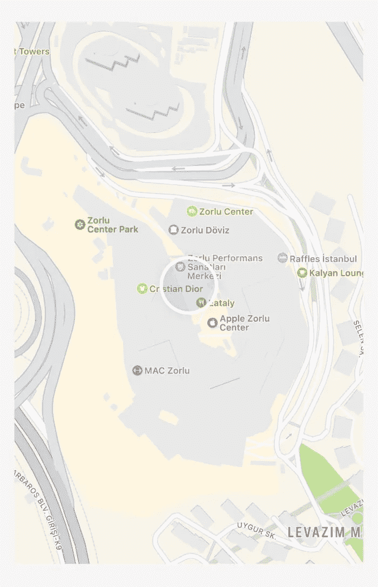
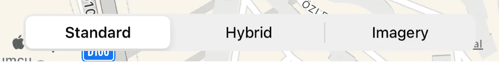
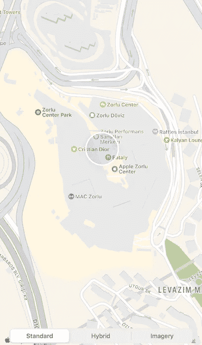
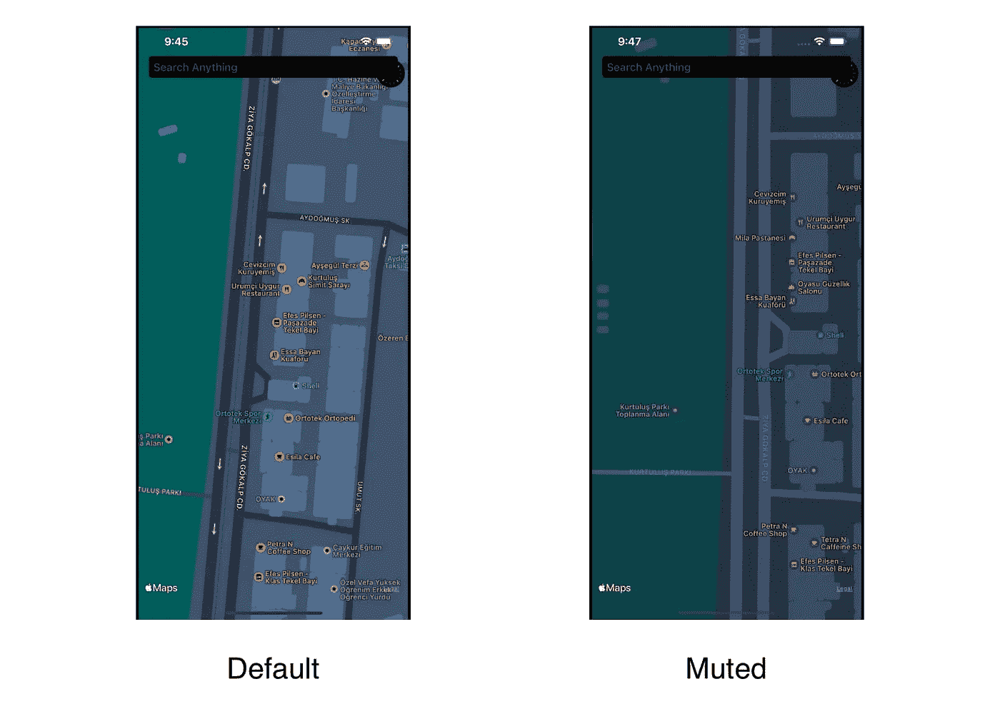
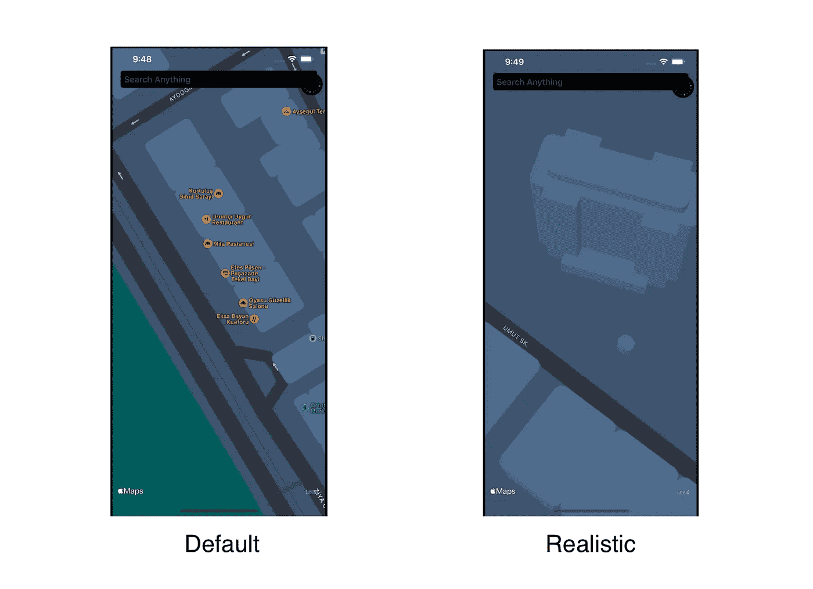
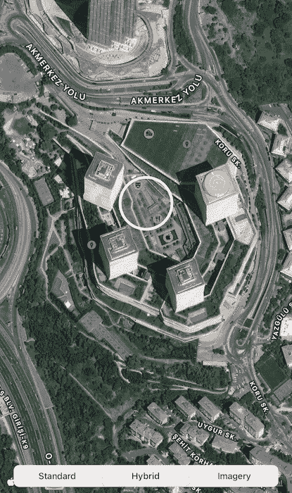
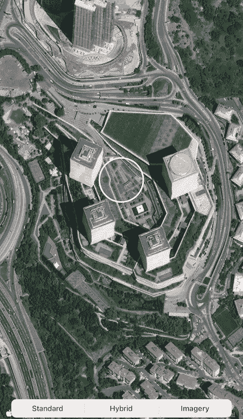
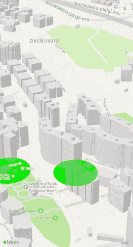
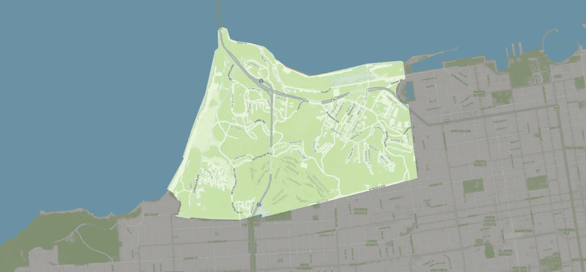
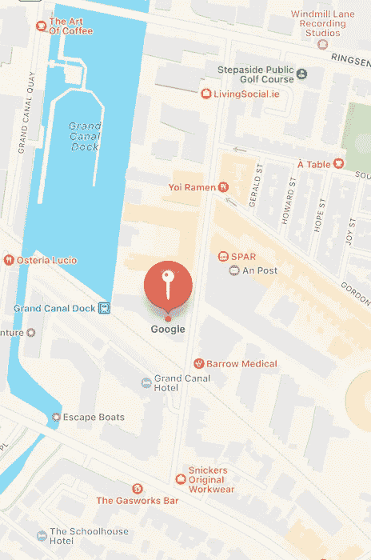

# iOS 16 的 MapKit 有什么新功能？

> 原文：<https://betterprogramming.pub/whats-new-in-mapkit-for-ios-16-7b2904693c4d>

## 混合模式、叠加改进等等

MapKit 是苹果的一个框架，用于在你的应用程序上显示苹果地图。它帮助开发者提供导航支持和现场指导，并在地图上为用户提供一个区域。WWDC22 发生在几个月前。什么变了？什么是新的？让我们开始吧。

苹果在开发苹果地图的同时，有一段时间并没有给开发者提供太多。他们提供的最后一个会话可以追溯到 WWDC19。然而，今年苹果为他们引入的每个功能都提供了 API，新的 MapKit 功能也可供开发者使用。让我们看看我们现在有哪些功能。

# 新用户界面

首先，苹果终于给了我们新的 3D 体验地图，可以在我们的应用上使用。你不需要添加一行代码来激活它，但简单地用新的 iOS 16/macOS 13 SDK 构建应用程序就足够了。当然，3D 映射也有局限性，只有 A12 及以后的芯片 iPhone 才有 M1，后来的 Mac 用户也能从中受益。如果您有这些设备，让我们看看新的布局是如何显示的。

它正确地显示了新的 3D 地图体验，包括地形、3D 建筑等。

然而，所有新的地图体验在每个国家都不可用；因此，你需要跟随苹果的页面去了解[可用的国家和城市](https://www.apple.com/ios/feature-availability/#maps-standard)。

# 地图配置

在 iOS 15 上，我们曾经用以下方式操作地图的外观:

*   禁用/启用地图类型
*   禁用/启用显示建筑
*   禁用/启用显示流量

这些现在都被弃用了。我们现在可以用什么？满足配置。

地图配置是一个新提供的类，它将地图类型与其子功能分开。有三种配置类型:

*   `MKStandardMapConfiguration`
*   `MKHybridMapConfiguration`
*   `MKImageryMapConfiguration`

## MKStandardMapConfiguration

这是你在苹果看到的标准地图视图，提供了带有标记的 3D 体验。您可以使用两个配置选项来创建此样式。

一个是强调风格，可以设置为“默认”或“静音”。静音显示为灰色。

另一种是立面风格，可以选择“平面”或“真实”。“平坦”是默认设置，将山区显示为“平坦”，而“真实”将提升地图上的山景。

## MKHybridMapConfiguration

该配置将显示带有标准格式的路线和标记的卫星视图。您可以在地图上选择加入/退出流量和兴趣点可见性。

## mkimagerymap 配置

这是基本卫星视图，没有可用的配置选项。

# 覆盖改进

叠加有助于在地图中用颜色绘制区域，以区别于地图。它在应用程序上是有效的，你可以向用户显示你可以服务的区域或属于土地所有者的房间。在 iOS 16 中，叠加层现在还可以在捏到一定程度时显示底层的 3D 建筑，并且在 2D 观看时会被隐藏。

# 混合模式

混合模式有助于将覆盖图与地图的其他部分区分开来。您可以将该区域的其余部分变暗，以将注意力集中在叠加上。

# 可选地图要素

该地图包含许多注释，但您只能点击和管理注释的触摸，而不是来自餐馆、地标或其他要素的注释。现在，你也可以设法使用它们。您可以在`MKMapFeatureOptions`属性下订购它们。现在，您可以在 viewer delegate 方法中使用`MapFeatureAnnotation`,以不同于注释的方式与它们进行交互。

# 环视视图

苹果最终提供了它的环视 API 用于我们的应用程序。它给出了一个`MKLookAroundSceneRequest`，它需要一个坐标来搜索环视场景。找到后，可以用一个位置初始化`MKLookAroundViewController`。

让我们看看我们可以用一个演示应用程序实现什么。

# 高级地图

`AdvancedMap`是一个显示地图工具包中 WWDC22 变化的应用程序。三个选项卡中有三张地图。

在第一个选项卡上，您可以使用地图和搜索/查找您周围的地方。您还可以将布局从标准切换到影像或混合。当你找到一个家庭时，你可以点击它来查看它的地址和在苹果地图中打开网站的选项。

在第二个选项卡上，您会看到您周围的附近商店，市场呈圆形。您可以平移以查看 3D 地图以及叠加图如何位于建筑物下方。

在最后一个选项卡上，您会看到一张英国地图。那是因为 LookAround 不是每个城市都有。我展示了一个随机的城镇。您所需要做的就是点击任何特征注释，例如注释，以检查它是否具有环视特征。如果有，它会给你一个按钮，让你点击，看看周围的地方和它的邻居。

你可以在这里找到完整的代码。

MapKit 是一个健壮的 API，它让开发者可以使用苹果最新的地图 UI 来工作。与谷歌地图或市场上的其他第三方 SDK 相比，3D 地图和带有覆盖功能的环视选项能够提供更加丰富的体验。您可能想知道为什么我选择 UIKit 来提供这些支持。所有被分享的工具都是为 UIKit 设计的，并以此进行演示。

然而，这是你的游戏，使所有这些`UIViewControllerRepresentable`和使用 SwiftUI。我选择了更快的选项来显示。

如果你有任何问题，欢迎在评论区提问。

祝你有愉快的一天。