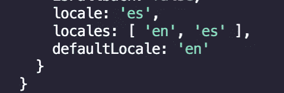
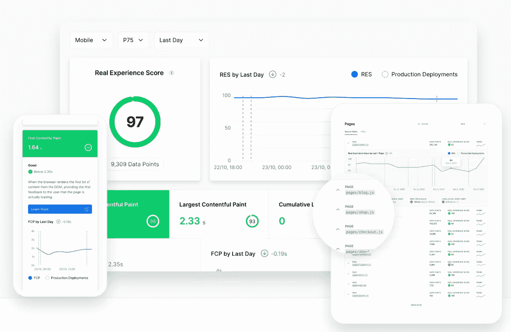

# Next.js V10 有什么新功能？

> 原文：<https://betterprogramming.pub/whats-new-in-next-js-v10-27ecf7407c5f>

## 突出好的、伟大的和令人敬畏的更新


作者照片。

超过 20 个更新被打包到新的 Next.js 版本 10 更新中，在本文中，我将讨论其中的大更新。如果你在寻找官方的说法，去看看 Next.js 的博客文章。

> “我们引入了超过 20 个新特性**来改善性能和开发者体验。同时，Next.js 核心的 JavaScript 大小已经**减少了 16%** 。”— [Next.js 博客](https://nextjs.org/blog/next-10)**

# 反应 17

我们现在可以用最新的更新安全地更新到 React 17。当你升级到 Next.js 10 或者开始一个新的项目时，你会默认得到奇妙的新 JSX 变换。

# **新图像组件**

我想大多数人会认为这是这次发布的 MVP。

我选择 Gatsby 而不是 Next.js 的第一个原因是了不起的 [gatsby-image](https://www.gatsbyjs.com/plugins/gatsby-image/) 组件，它仍然是生成包含大量图像的静态站点的最佳选择。

Next.js 团队与谷歌 Chrome 团队合作，在默认情况下提供超级图像优化。它基本上是普通`img`标签的替代物。

## **在**之前

```
export default function() {

  return }
```

## **在**之后

```
import Image from 'next/image'export default function() {return <Image src="/avatar.jpg" width="400" height="400" alt="Avatar">}
```

我不会在这里讲太多的细节，但是基本上，当我们使用这个新的`Img`标签时，默认情况下我们得到了延迟加载，然后我们可以标记初始视口中的图像来预加载它们。

我很高兴现在用这个标签替换我所有的图片。

# MDX 的快速刷新

这是一个小细节，并没有让我太沮丧，但是 Next.js 10 提供了一个很好的改进。`@next/mdx`现在将利用*快速刷新*，确保在你编辑和开发的时候浏览器不需要重新加载页面。

`[@next/mdx](https://github.com/vercel/next.js/tree/canary/packages/next-mdx)` [文档](https://github.com/vercel/next.js/tree/canary/packages/next-mdx)指导您如何使用 Next.js 设置 MDX。

# 来自 node_modules 的 CSS

更多优化！现在我们可以在所需的组件中导入它们，而不必直接将所有的 CSS 库加载到`_app.js`中。这似乎是一件小事，但是现在我们可以根据需要延迟加载 CSS。取决于你正在使用的库(以及你在哪里使用它)，这可能意味着你的初始加载速度会有很大的提高。

# 轻松国际化

有了域路由、子路径路由和语言检测，设置国际化从未如此简单。

如果您已经设置了区域设置，您将自动根据您的`Accept-Language`头进行路由(如果您不想这样做，可以很容易地禁用它)。

然后您可以从`next/router`中获取本地语言，现在您将在`router`对象中看到您的语言环境:



当我们导航到我们的西班牙域时，路由器对象的例子。

# href 的自动解析

当我使用`Link`标签时，我总是感到沮丧的一件事是记住在`as`和`href`中放什么。

现在您可以停止使用`as`，它会自动为您解决:

```
// before v10<Link href="/blog/[slug]" as="/blog/posts">// after v10<Link href="/blog/[slug]">
```

# Next.js 分析

Next.js Analytics 不是通常的基准测试程序。它分析你的实际用户的表现，这样你就可以真正看到你的用户如何看待你的网站，而不是一刀切的方法。



Next.js 分析

> “Next.js Analytics 关注的是整体情况，深入了解你的受众，以及你的应用程序如何为你的用户服务。”— [Next.js 博客](https://nextjs.org/blog/next-10)

我正在用 Next.js 重建我的商业网站，所以当我把它推向生产时，我很高兴能试运行一下。

# Next.js 商务

曾经需要建立一个电子商务解决方案，但不知道从哪里开始？


Next.js 商务网站截图

作为一个在 Shopify 上推出了一些商店的人，因为这是最简单的解决方案，我非常高兴看到这一点。Next.js Commerce 提供了一个样板优化的电子商务商店。获得超级速度，以提高您的搜索引擎优化和客户体验。目前，它已经与 BigCommerce 进行了开箱即用的集成，但他们表示，他们也在为 Shopify 等其他供应商开发解决方案(届时我可能会一头扎进去，把我的一家商店搬过来)。

[检查一下](https://nextjs.org/commerce)。

# 结论

在这段视频中，我将详细介绍所有这些功能:

我的 Next.js 本文视频版

自从这次更新取消后，我目前正在用 Next.js 重建我的商业网站，我很兴奋地想看看它完成后的表现。

你最喜欢的功能是什么？