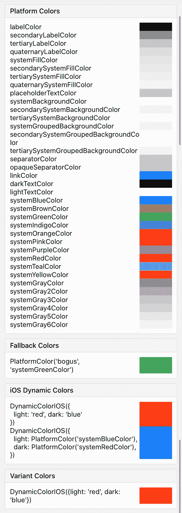
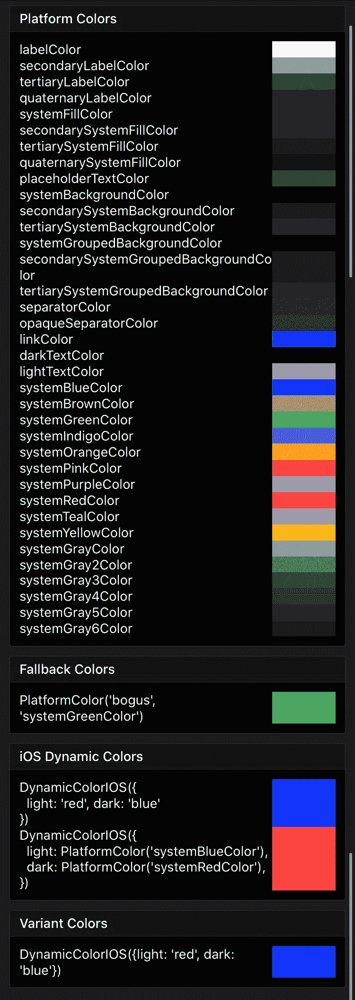
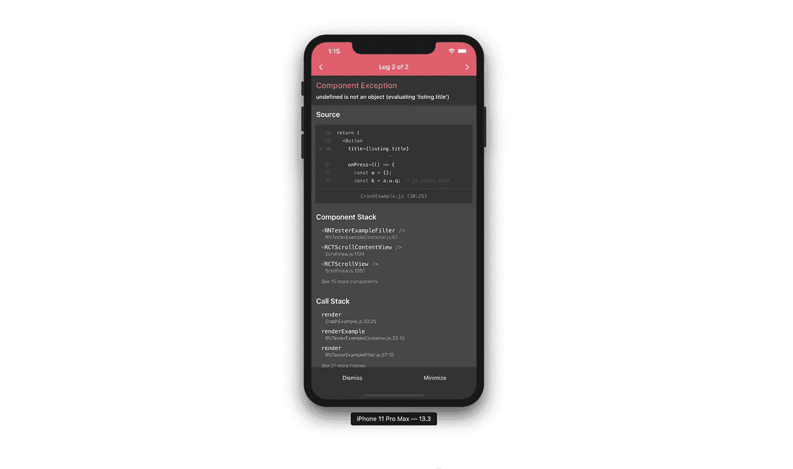
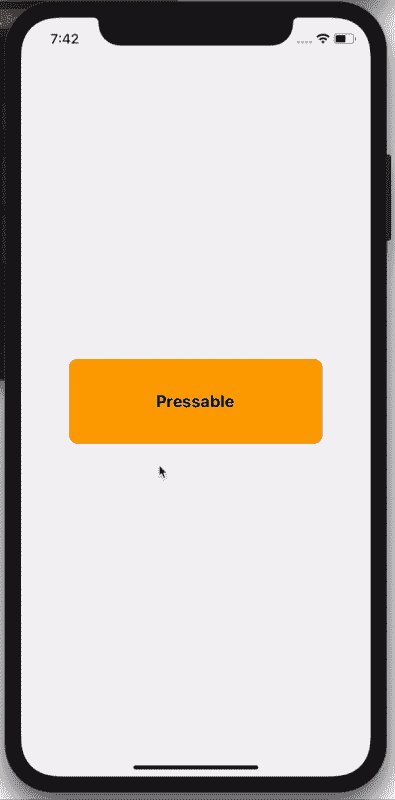

# React 原生 0.63 有什么新功能？

> 原文：<https://betterprogramming.pub/whats-new-in-react-native-0-63-d17b710368b5>

## 了解此版本的新增功能和影响


照片由[拉胡尔·查克拉博蒂](https://unsplash.com/@hckmstrrahul?utm_source=unsplash&utm_medium=referral&utm_content=creditCopyText)在 [Unsplash](https://unsplash.com/s/photos/mobile?utm_source=unsplash&utm_medium=referral&utm_content=creditCopyText) 拍摄

React Native 0.63 RC0 在几周前发布，为我们带来了一些真正令人兴奋的新功能。

# 本色

这里有两个新东西:PlatformColor 和 DynamicColor。

PlatformColor 允许用户在 iOS 或 Android 上使用设备的原生颜色。

DynamicColor 允许用户根据手机的外观模式(亮模式/暗模式)配置颜色。



下面是一个如何结合使用这两者的示例:

```
<View
  style={{
    backgroundColor: DynamicColorIOS({
      light: PlatformColor("systemBlueColor"),
      dark: PlatformColor("systemRedColor"),
    }),
  }}
/>
```

# 日志箱

启用 LogBox 是因为 React Native 0.62 处于测试模式。您可以通过在您的`index.js`文件中添加`require('react-native').unstable_enableLogBox()`来启用它。

对于这种改进，图片胜于文字:



这是一个很大的改进——我们被告知错误的确切位置和内容。

# 可压制的

这个新版本中有一个新的组件 Pressable。这个新组件旨在取代用于创建按钮的 TouchableWithoutFeedback 和 TouchableOpacity。这里有一个例子:



```
<Pressable
  style={({ pressed }) => [
    {
      opacity: pressed ? 0.5 : 1,
      backgroundColor: pressed ? "red" : "orange",
    },
    styles.button,
    ,
  ]}
>
  <Text style={styles.buttonText}>Pressable</Text>
</Pressable>
```

我们不再需要包装和库存`pressed`状态。这是由组件处理的。

# 来源

[React 原生 0.63 预览—可压、平台颜色和动态颜色](https://reactnativejobs.com/blog/react-native-pressable-platformcolor-dynamiccolor/)

[https://github.com/facebook/react-native/releases](https://github.com/facebook/react-native/releases)