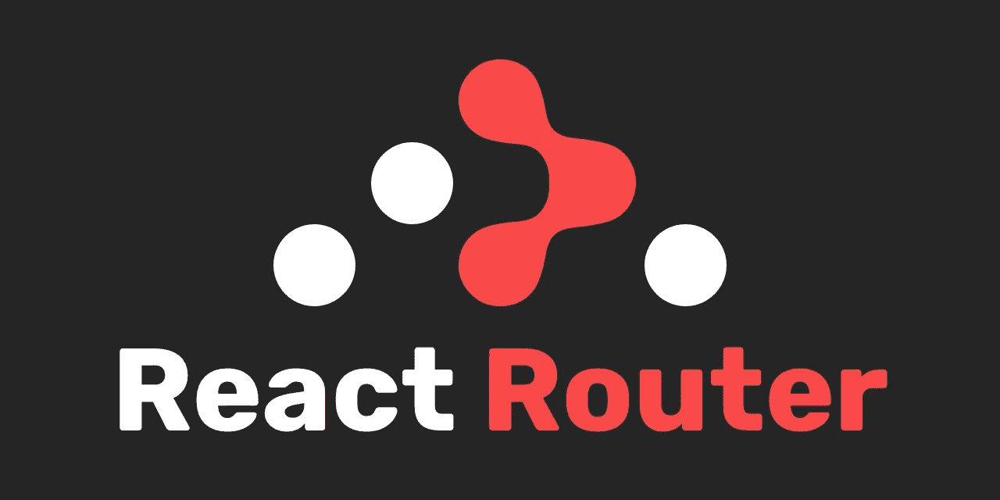
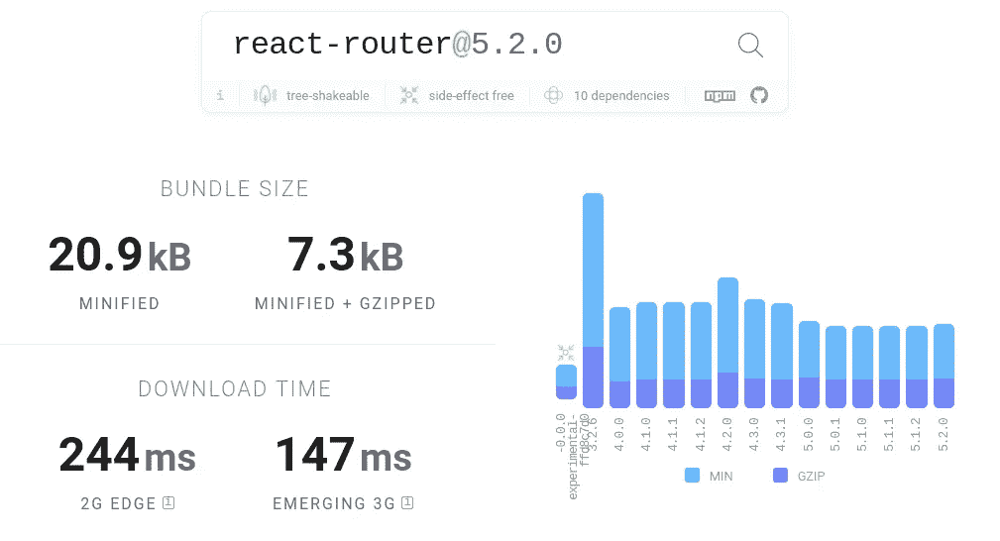
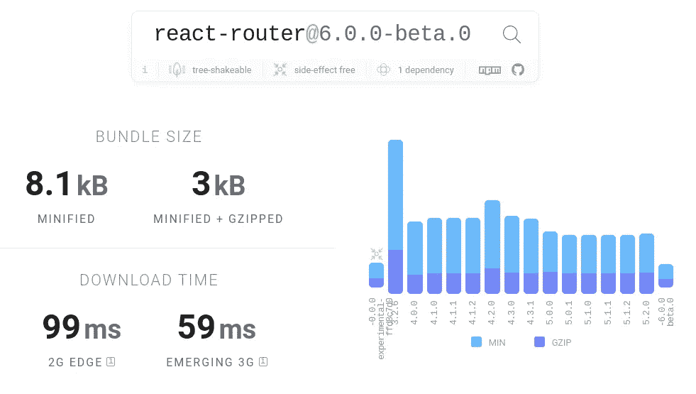

# React 路由器 v6 有什么新功能？

> 原文：<https://betterprogramming.pub/whats-new-in-react-router-v6-31930f4aae4c>

## 找出 React 路由器中的变化

官方[回购的标志](https://github.com/ReactTraining/react-router)

[React Router](https://reactrouter.com/) 是一个导航组件的集合，几乎在每个 React app 中都广泛使用。它是 React 中最流行的依赖项之一。下一个主要版本(v6)尚未发布。在撰写本文时，它仍处于测试阶段。因为探索新功能总是很好的，所以我想分享我的想法，并让大家先睹为快即将到来的功能和变化。

# 较小的束尺寸

React 路由器 v6 比它的前身小了很多。尺寸实际上减少了 60%，这是一件好事。这里是从 [Bundlephobia](https://bundlephobia.com/) *中截取的 v5 和 v6 的束尺寸对比。*

反应路由器 v5

React 路由器 v6

# <route>中的渲染组件</route>

在以前的版本中，我们使用`<Route>`组件中的`component`或`render`道具来渲染组件。每当我们需要向渲染组件传递道具时，我们就使用`render`道具；否则，我们就用`component`。现在，我们可以使用一个`element`道具实现这两种场景。

正如在上面的代码片段中看到的，v6 使编写代码变得相当容易，没有任何混乱。

# 更简单的嵌套路由

在 v6 中定义嵌套路由要容易得多。以前，您必须在文件中指定主路线，然后在由主路线呈现的组件中指定子路线，依此类推。现在在 v6 中，您可以在一个文件中指定所有的路由，这看起来干净整洁。

如上所示，在 v6 中你不需要使用任何字符串匹配或者`useRouteMatch`函数。相对而言，语法相当简单。

# <switch>就是现在的</switch>

以前，我们使用`<Switch>`并在其中编写`<Route>`组件。现在，我们使用`<Routes>`代替`<Switch>`，尽管功能上没有变化。

# 相对行为和可选的精确属性

在 v6 中，你不再需要在`<Route path="/">`上使用`exact`道具。这是因为默认情况下，所有的`<Route>`路径完全匹配。如果你想匹配更多的 URL，因为你有子路由，使用尾随的`*`，如`<Route path="users/*">`。所有的路线和链接都自动建立在呈现它们的路线的`path`之上，因此，例如，在`<Route path="users/*">`中呈现的`<Link to="me">`将链接到`/users/me`。

# 使用历史现在是使用导航

我们经常在应用程序中以编程方式导航到不同的路径。这就是我们利用`useHistory`方法的时候，我们使用`history.push(<someurl>)`来导航到一些其他的组件。在 v6 中，`useNavigate`被重命名为`useHistory`，我们需要使用`navigate(<someurl>)`而不是使用 history `方法。

要替换 URL，我们可以使用相同的导航方法，并传递一个额外的对象作为参数。

# 结论

我希望这篇文章已经让你对版本 6 将要发布的时候会发生什么有了一个概念！你可以在[最新发行说明](https://github.com/ReactTraining/react-router/releases)中了解更多关于 React 路由器 v6 的信息。我希望你喜欢阅读这篇文章。

感谢您的阅读！