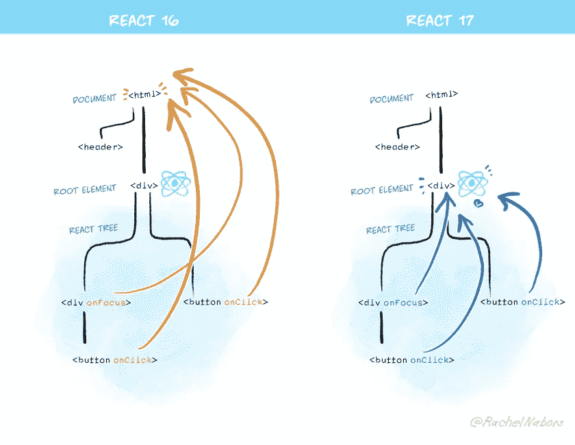

# React v17 有什么新功能？

> 原文：<https://betterprogramming.pub/whats-new-in-react-v17-68b7e15576e1>

## React 三年来的首次发布。有什么新鲜事？


由[尼古拉斯·天梭](https://unsplash.com/@nft?utm_source=medium&utm_medium=referral)在 [Unsplash](https://unsplash.com?utm_source=medium&utm_medium=referral) 上拍摄的照片。

React v16 第一次发布已经有三年了，终于，下一个主要版本的等待结束了。React 开发团队承诺，更新 v17 对 React 的未来非常重要，但也提到没有添加新功能。你可能想知道为什么它会在那时发布。

在本文中，我将列出最新版本中所做的更改。

# 为什么没有新功能？

React 17 主要致力于让 React 本身的升级变得更容易。虽然在这个更新中没有面向开发人员的功能是不寻常的，但这个版本的主要目标是确保将一个版本的 React 管理的树嵌入到另一个版本的 React 管理的树中是安全的。React 开发团队称这个[为“垫脚石”版本](https://reactjs.org/blog/2020/08/10/react-v17-rc.html)。

# 逐步升级

这些年来，React 升级一直是孤注一掷。要么你不得不继续使用旧版本，要么你需要将整个应用程序升级到新版本。因此，如果在新的更新中引入了突破性的变化，并且您计划迁移到新的版本，您必须更改您的代码库——尤其是当您的代码库非常大的时候。

React 团队已经用 React 17 修复了这些问题中的大部分。当 React v18 和以下版本推出时，您可以通过升级应用程序的一些部分来逐步迁移，同时仍然保持其他部分在 React v17 上运行。因此，如果您有一个大型应用程序使用的版本不是主动维护的，这个选项将非常有用。

React 的团队准备了一个 repo 来演示如何延迟加载 React 的旧版本:

[](https://github.com/reactjs/react-gradual-upgrade-demo/) [## react js/react-渐进-升级-演示

### 这是一个演示，展示了如何配置一个构建系统，以便在…

github.com](https://github.com/reactjs/react-gradual-upgrade-demo/) 

# 对事件委托的更改

> “在 React 17 中，React 将不再在`document`级别附加事件处理程序。相反，它会将它们附加到呈现 React 树的根 DOM 容器中。— [React 的博客](https://reactjs.org/blog/2020/08/10/react-v17-rc.html)

让我们看一个例子。考虑将一个`onClick`事件附加到 React 中的一个按钮上，如下所示:

```
<button onClick={handleClick}>
```

与上面编译的代码相当的普通 JS 将如下所示:

```
myButton.addEventListener('click', handleClick);
```

React 然后将每个事件类型的一个处理程序直接附加到文档节点，而不是附加到声明它们的 DOM 节点。这称为事件委托。



照片来自 React 的[博客](https://reactjs.org/blog/2020/10/20/react-v17.html)。

在 React v17 中，事件处理程序将不再附加在文档级别，而是附加在呈现树的 DOM 容器中。

```
const rootNode = document.getElementById('root');
ReactDOM.render(<App />, rootNode);
```

有了 React v17 中的这一变化，现在可以安全地嵌套使用不同版本 React 构建的应用程序了。

# 新 JSX 变换

React v17 提供了一个新的重写版本的 JSX 变换，尽管升级到这个新的变换是完全可选的。它仍然提供一些好处，如:

*   不需要导入`React`。
*   增加你的包大小。

如果您希望了解更多关于这一新转变的信息，请阅读 React 团队的这篇博客文章:

[](https://reactjs.org/blog/2020/09/22/introducing-the-new-jsx-transform.html) [## 介绍新的 JSX 变革-反应博客

### 虽然 React 17 不包含新功能，但它将为新版本的 JSX 变换提供支持。在这个…

reactjs.org](https://reactjs.org/blog/2020/09/22/introducing-the-new-jsx-transform.html) 

# 重大变化

这个新版本有一些突破性的变化。

## 1.事件委托

如上所述，升级后您可能会面临一些问题。

在这个新版本中，`event.stopPropagation()`实际上会阻止您的文档处理程序释放:

```
document.addEventListener('click', function() {
  // This custom handler will no longer receive clicks
  // from React components that called e.stopPropagation()
});
```

要解决这个问题，通过传递一个`{ capture: true }`选项作为第三个参数，将您的事件监听器转换为使用一个`capture`阶段，如下所示:

```
document.addEventListener('click', function() {
  // Now this event handler uses the capture phase,
  // so it receives *all* click events below!
}, { capture: true });
```

这样，我们看到事件委托现在比以往任何时候都更接近正常的 DOM。

## 2.与浏览器对齐

React 对事件系统做了一些修改:

*   `onScroll`事件不再冒泡。
*   `onBlur`和`onFocus`事件现在已经切换到在内部使用原生`focusin`和`focusout`事件，更好地匹配 React 的现有行为，甚至提供更多信息。
*   `onClickCapture`现在使用实际的浏览器捕获阶段监听器。

## 3.没有事件池

在这个新版本中，事件池优化已经从 React 中删除，原因是持续的混乱以及它没有提高性能。

在 React 17 中，这段代码如您所料地工作。旧的事件池优化已经完全移除，因此您可以在需要时随时读取事件字段。

## 4.效果清理时间

这个新版本也使得`useEffect`钩子清理函数计时更加一致。

```
useEffect(() => {
  // This is the effect itself.
  return () => {    // This is its cleanup.  };});
```

在 React v16 中，效果清理功能是同步运行的。根据 [React 博客](https://reactjs.org/blog/2020/08/10/react-v17-rc.html)，“在 React v17 中，效果清理功能总是异步运行——例如，如果组件正在卸载，清理会在屏幕更新后运行。”

## 5.返回未定义的一致错误

在 React v16 中，返回`undefined`的函数总是抛出一个错误，主要是因为无意中返回`undefined`非常容易:

```
function Button() {
  // We forgot to write return, so this component returns undefined.
  // React surfaces this as an error instead of ignoring it.
  <button />;
}
```

最初，这种行为只是类和函数组件独有的，但是在这个新版本中，添加了`forwardRef`和`memo`组件，使它们的行为与常规的类和函数组件一致。注意，对于那些你不想渲染任何东西的例子，将会返回`null`。

# 结论

虽然 React v17 没有任何新功能，但它通过直接解决升级体验问题为即将到来的版本奠定了坚实的基础，并使 React 的行为与现代浏览器更加一致。我希望这篇文章是有帮助的。

感谢您的阅读！

# 参考

[](https://reactjs.org/blog/2020/10/20/react-v17.html) [## React v17.0 - React 博客

### 今天，我们发布 React 17！我们已经详细讨论了 React 17 版本的作用以及它的变化…

reactjs.org](https://reactjs.org/blog/2020/10/20/react-v17.html)