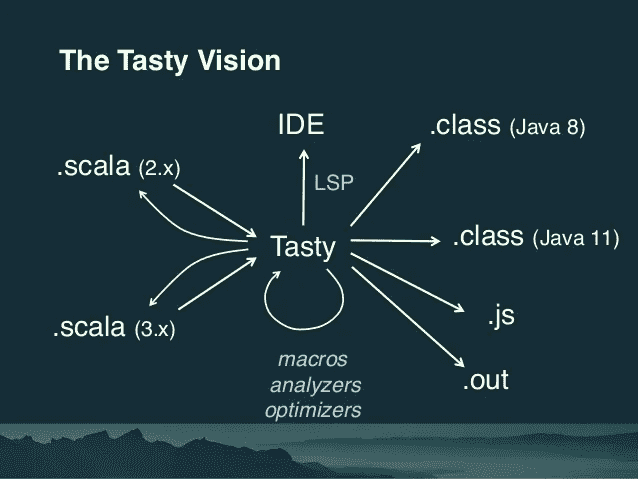

# Scala 3 有什么新特性？

> 原文：<https://betterprogramming.pub/whats-new-in-scala-3-586d69879253>

## 一个新的编译器，创建应用程序，枚举，等等

来源:miro.medium.com

自 2004 年首次发布以来，Scala 经历了疯狂的增长，像[苹果、LinkedIn、Twitter 和沃尔玛](https://en.wikipedia.org/wiki/Scala_(programming_language)#Adoption)这样的公司都是它的主要采用者。 [2020 StackOverflow 开发者调查](https://insights.stackoverflow.com/survey/2020?_ga=2.265760399.1046029926.1605935537-2102088099.1605935537#work-salary-and-experience-by-language)将 Scala 开发者列为行业中收入最高的类别之一。调查还将 Scala 排在软件工程师最喜爱的语言的第 14 位。随着 Scala 3 的发布，这种采用在未来肯定会增加，Scala 3 被认为是在类型化设置中实现 OOP 和 FP 范例融合的全部潜力的一大步。随着新版本即将发布(2020 年底)，让我们来看看这次设计革新背后的主要思想。

# 一种基于点演算的语言

[点演算](http://lampwww.epfl.ch/~amin/dot/fool.pdf)(依赖对象类型)是由 Martin Odersky 博士的团队开发的新演算。DOT 通过统一类型成员的构造来规范 Scala 的类型系统，并通过提供交集和并集类型来简化最大下界和最小上界的计算。这将提供强大的类型操作能力，并在领域驱动的设计中开辟新的途径。

# Dotty:新的 Scala 编译器

为了速度和正确性，新的编译器从头开始重写。这种语言经历了很多变化，经历了简化。

Scala 3 代码现在编译成一种新的中间格式: [TASTy](http://dotty.epfl.ch/docs/reference/metaprogramming/tasty-reflect.html) (类型化抽象语法树的简称)，可以用来生成 JavaScript 和不同版本的字节码。还有对美味语法树上反射的支持，这就是 Scala 3 中如何实现对宏[的支持。](https://dotty.epfl.ch/docs/reference/metaprogramming/macros.html)

来源: [SlideShare](https://image.slidesharecdn.com/scaladaysberlin-180517100049/95/preparing-for-scala-3-32-638.jpg?cb=1526551508)

# 死去的东西

几个不受欢迎和多余的功能已经被[删除](https://dotty.epfl.ch/docs/reference/dropped-features/delayed-init.html)，其中一些突出的功能是:

*   [型投影](https://dotty.epfl.ch/docs/reference/dropped-features/type-projection.html)
*   [存在类型](https://dotty.epfl.ch/docs/reference/dropped-features/existential-types.html)
*   [包对象](https://dotty.epfl.ch/docs/reference/dropped-features/package-objects.html)
*   [Scala 2 宏](https://dotty.epfl.ch/docs/reference/dropped-features/macros.html)

采取这些步骤是为了让 Scala 更加用户友好，避免早期采用者因为这些特性的复杂性和缺陷而气馁。

# 新东西！

Scala 3 中还引入了大量新特性，其中包括:

## 顶级声明

现在任何东西都可以在顶层声明，包括类型、变量和函数。不再需要将事物打包在一个对象中。此外，现在可以使用`@main`注释将任何函数声明为 Main 方法，因此不需要扩展`App`特征。

让我们来看看这段代码，它与 Dotty 编译器配合得非常好。

## 创建应用程序

Scala 3 引入了调用函数的第四种方式，称为 [creator applications](https://dotty.epfl.ch/docs/reference/other-new-features/creator-applications.html) ，它允许你创建一个类型的实例，而不需要使用`new`关键字，也不需要编写`apply`方法。

## 扩展方法

[扩展方法](https://dotty.epfl.ch/docs/reference/contextual/extension-methods.html)允许我们向现有类型添加额外的功能，如果我们不能或不想修改类型，它们会派上用场。扩展可以应用于泛型类型，也可以是运算符。

让我们自己尝试一下:

## 列举

最后，Scala 3 引入了对一级[枚举](https://dotty.epfl.ch/docs/reference/enums/enums.html)的支持。Scala 2 有一种间接的方式通过 case 类和`Enumeration`类来支持这个特性，但是现在它最终以 Java 风格支持它们。

另外，我们现在可以将用户定义的方法添加到`enum`定义中。

# 操纵类型的新方法！

Scala 3 通过让我们以更具描述性的方式定义类型，为我们提供了更丰富的描述数据的工具包。让我们看看一些新引入的类型。

## [联合类型](https://dotty.epfl.ch/docs/reference/new-types/union-types.html)

类型现在可以被定义为其他类型的联合，它们不必共享一个公共基类。让我们用一个简单的用例来理解这一点:你必须购买一部新的智能手机，你选择它的原因可以是它的摄像头、处理器或操作系统。让我们看看如何在 Scala 3 中实现这一点。

## [路口类型](https://dotty.epfl.ch/docs/reference/new-types/intersection-types.html)

Scala 3 现在也有交集类型了。简单来说，如果我们把类型的并集看作是`A`或者`B`，那么交集可以看作是`A`和`B`。这里有一个例子:

## 文字类型

我们现在可以将任何文字值定义为一个类型，它有一个单独的实例。简单地说，像`ABC`、`2.7`和`true`这样的文字值现在可以被视为一个类型。让我们用一个例子来理解这一点:

## [不透明类型别名](https://dotty.epfl.ch/docs/reference/other-new-features/opaques.html)

当我们使用[域驱动设计](https://en.wikipedia.org/wiki/Domain-driven_design#:~:text=Domain%2Ddriven%20design%20(DDD),should%20match%20the%20business%20domain.)时，这一点特别有用，我们经常需要定义新类型作为其他类型的包装器。例如，我们可以定义一个名为`ItemID`的类型，它实际上只是一个对`String`类型的包装，限制是第一个字符必须是大写的。

为此使用包装器类型的问题是，当访问它们的字段或方法，或者组合这些类型时，我们会招致不必要的开销。如果我们的设计中有很多这样的实体，这些开销就会越来越大。

这就是`opaque`型的用武之地。它允许我们将`ItemID`定义为一个`String`，并提供附加功能/限制(通过一个伴随对象)。因此，如果我们使用`opaque`类型对上述问题进行编码，我们可以这样编码:

## 隐含被给定和使用子句所取代

隐含是 Scala 中最强大的特性之一，允许代码抽象。它们是使用类型类的基本工具，也是库的中心点，就像 [Cats](https://typelevel.org/cats/) 和 [shapeless](https://github.com/milessabin/shapeless) 。但这也在大型代码库中引入了不必要的复杂性，因为很难跟踪编译器注入了什么。

Scala 3 引入了`given instances`和`using clauses`来打破`implicit`关键字的统一模式，对代码中注入的内容给予了更多的控制。我们来看一个小例子:

虽然这只是一个基本的例子，但我鼓励您查看上面链接的 Scala 3 文档，以获得更深入的理解。

我们最喜欢的语言 Scala 经历了重大的设计革新，在某种程度上，它可以被视为一种全新的语言。看到新的自由/开源软件项目出现将是令人兴奋的，如果你打算自己开始一个项目，我希望这篇文章能给你一个好的开端。

虽然这篇文章简要概述了我认为突出的变化，但它绝不是 Scala 3 中所有新事物的完整指南。我鼓励你去看一下[官方文件](https://dotty.epfl.ch/docs/index.html)以获得更好的整体理解。

下次见。再见。