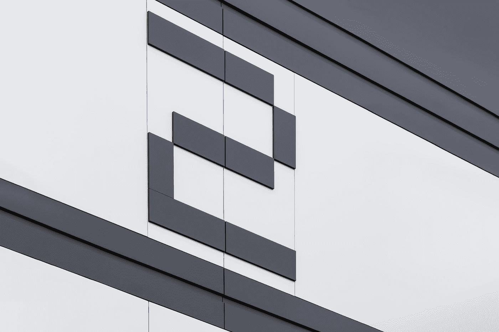
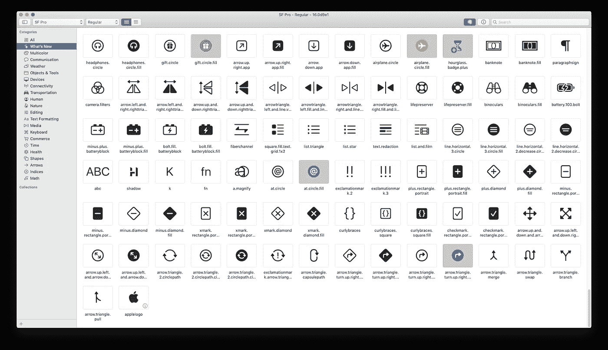
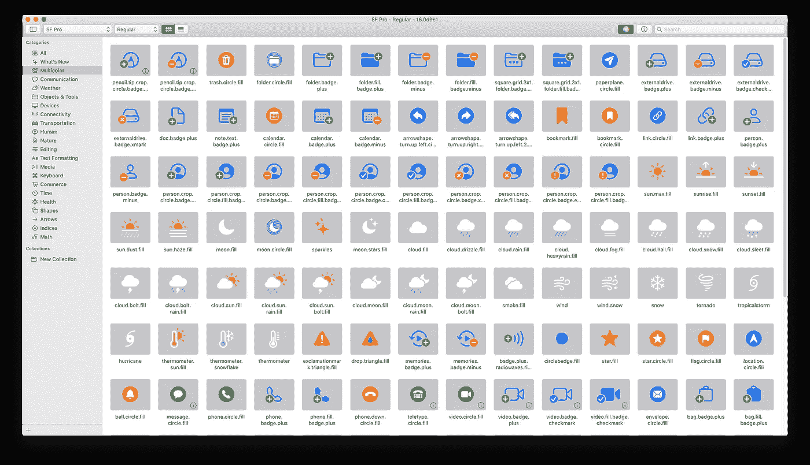
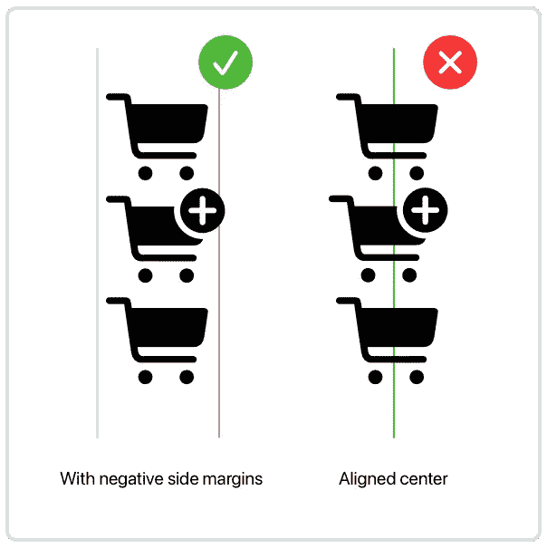
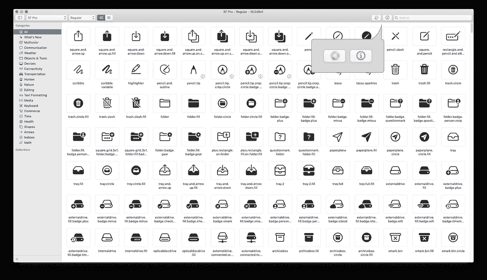
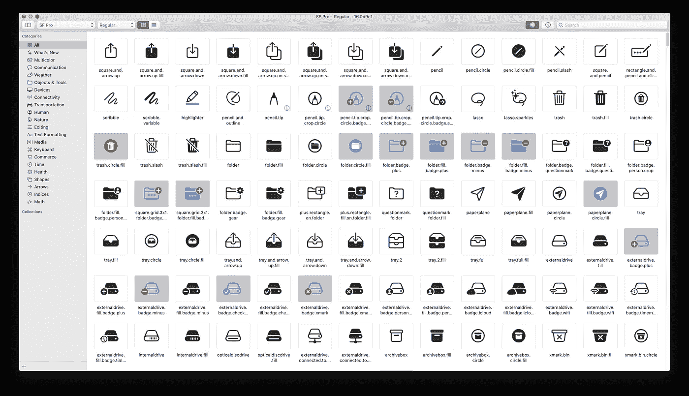
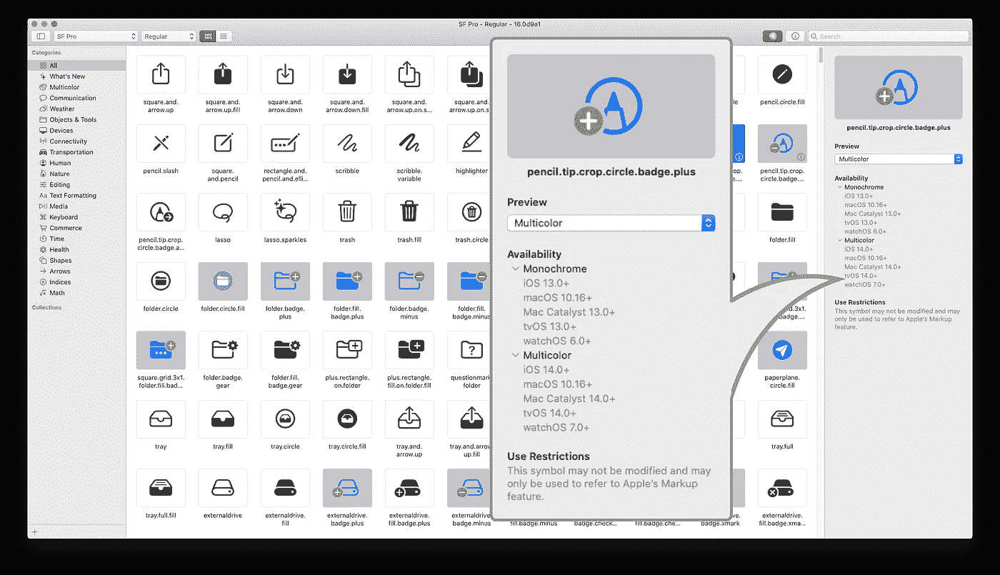
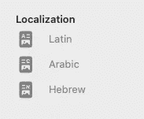
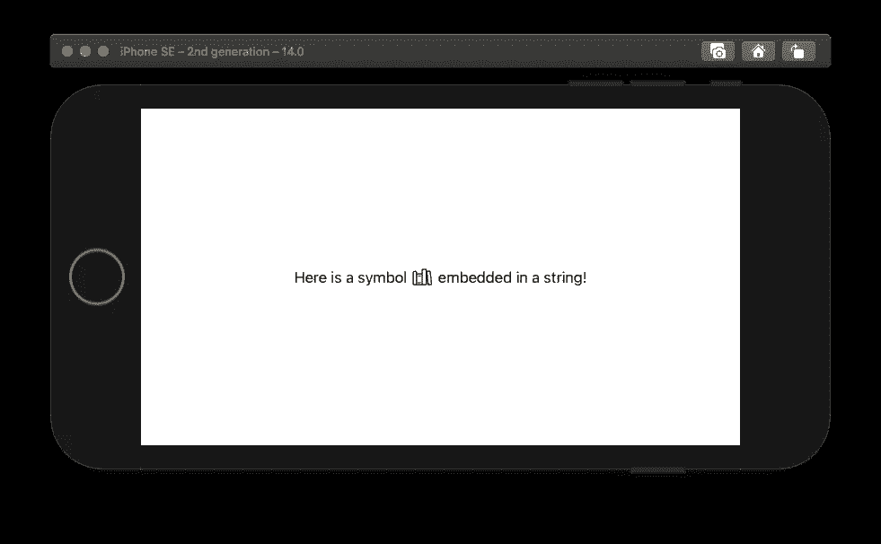

# 科幻符号 2 的新功能

> 原文：<https://betterprogramming.pub/whats-new-in-sf-symbols-2-b5e49eee7f0a>

## 虽然没有大苏尔大，但还是很大

paweczerwi ski 在 [Unsplash](https://unsplash.com?utm_source=medium&utm_medium=referral) 上的照片

在 SF 符号出现之前，为 iOS 应用程序制作图标对于设计者和开发者来说都是一个大麻烦。工作流通常看起来像这样:

1.  规划图标。
2.  设计它，并确保它符合你的应用程序的信息。
3.  或者上网找个图标代替…
4.  …这可能意味着购买许可证。
5.  完成所有工作后，你终于可以将它嵌入到你的应用程序中了——只是发现字体粗细不对，你需要调整它。

谷歌的材料设计图标从 2014 年就已经出现在[了，像](https://github.com/google/material-design-icons/commits/master?after=08ff5f18d57a89b819b839b865862ccec8635af4+125) [Font Awesome](https://fontawesome.com/) 这样的网站甚至更早就推出了。那么苹果什么时候会投入图标之战呢？

2019 年，苹果推出了他们自己的一套图标，名为 *SF 符号*。对于开发者和设计者来说，这是一个巨大的礼物，因为在真正的苹果方式中，它们比任何其他图标包都更容易使用。

现在，在 2020 年，苹果决定是时候更新换代了。在 WWDC20 上，他们发布了第二代 SF 符号:SF 符号 2。这是最新消息。

# 数字

SF 符号 1 拥有 1，500+个图标，SF 符号 2 将这一数字提高到 2，400+，其中包括 150+个多色图标。

许多新图标描绘了物理设备，如游戏控制器和外部驱动器上的按钮。苹果标志也终于可以作为图标使用了，但它只能用来指代“登录苹果”

# 设计改进

多色图标现已上市。

然而，它们目前只在 NSImage 中受支持，这在 iOS 上不工作。一位苹果工程师告诉我，“很遗憾，iOS 在这一点上不支持多色符号。这也包括 Mac Catalyst，因为它使用 UIKit APIs。”

但是支持肯定很快就会来。毕竟 SF Symbols 2 还在测试阶段，可以查看[这个线程](https://developer.apple.com/forums/thread/651671)的更新。

今年的新品利润率也是负数。这意味着图标可以溢出它们的边界框，同时保持对齐。

有了负的侧边空白，你就可以很好地控制光学校准。

# 应用改进

所有这些新图标，包括旧图标，都可以在新的[科幻符号 2 应用](https://developer.apple.com/sf-symbols/)中找到。就像图标升级一样，应用程序也升级了。

您首先注意到的可能是工具栏中的两个新按钮:

按下颜色池按钮时，会进入多色预览模式。任何可用的多色图标将被突出显示。

然后是信息按钮，打开全新的检查器面板。当您选择一个图标时，此面板将填充有关您选择的图标的信息。

该面板包含:

*   图标的名称
*   图标预览
*   不管有没有多色可选
*   本地化版本(如果有)
*   它在哪些 iOS 版本中可用
*   不推荐使用的名称(如果有)
*   任何使用限制

在我看来，iOS 版本可用性检查是整个 app 更新中最酷、最有用的功能。同样在我看来，新的应用程序图标是整个应用程序更新中最糟糕的部分。

我仍然不喜欢即将接管 macOS 的圆形应用程序图标。

# 杂项改进

## 本地化

SF 符号去年已经支持一些语言，但是今年支持更多。对于从右向左书写系统，您可以简单地翻转图像。(在资产目录中，将“方向”设置为“镜像”。)此外，像阿拉伯语、梵文和希伯来语等基于文字的语言现在也有了自己的变体。

## 字符串插值

SwiftUI 中的新功能，你现在也可以在字符串中嵌入 SF 符号。

然而，我在 UIKit 中尝试了这一点，但不起作用——看起来我现在仍然需要在我的 UIKit 应用程序中坚持使用`NSTextAttachment`。*叹息*

## 不推荐使用的名称的处理

现在 SF 符号已经得到了刷新，一些图标的名称已经改变。如果您使用的图标更改了名称:

*   如果你的最低部署目标是 iOS 13，你需要使用旧名称。
*   如果您的最低部署目标是 iOS 14，您应该使用新名称。

Xcode 知道这些变化，但只是在故事板中。在代码编辑器中，您需要记住命名。

# 结论

SF Symbols 2 带来了 750+个新图标，其中 150+个是多色的。控制光学对准要容易得多。本地化得到了改进，声明图标的语法也得到改进。该应用程序本身获得了一个小的(但非常有用的)更新。

总而言之，SF Symbols 2 对于开发者和设计者来说是一个非常好的资源。快乐编码，并确保使用它们！