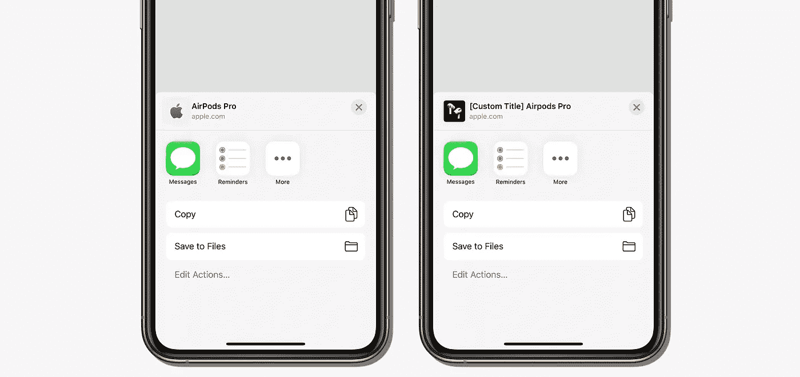

# 使用 LPLinkMetadata 将元数据添加到您的用户共享内容

> 原文：<https://betterprogramming.pub/whats-new-in-sharing-for-ios-13-3216999ff942>

## iOS 13 有什么新的分享？

动态链接元数据(左)和自定义链接元数据(右)

在 **WWDC 2019** 中，苹果宣布 iOS 13 现在支持[丰富链接](https://medium.com/better-programming/linkpresentation-in-ios-13-bbb6007818c6)。他们还宣布了 iOS 13 中共享功能的更新。首先，我们来看看 iOS 12 中的分享

比较 iOS 12 和 iOS 13 中的共享部分

如您所见，共享部分的顶部有一个视图，用于显示该链接中的元数据，本文将帮助您显示它，包括自动获取元数据和手动设置它。

好了，我们开始吧。

# 步骤 1:获取元数据

您首先需要的是`[LPLinkMetadata](https://developer.apple.com/documentation/linkpresentation/lplinkmetadata)`——一个存储 URL 元数据的对象，包括标题、图标、图像和视频。

## **自动提取元数据**

因为我们没有链接的元数据，所以我们需要另一个进程来获取它。为此，我们使用`[LPMetadataProvider](https://developer.apple.com/documentation/linkpresentation/lpmetadataprovider)`。

`LPMetadataProvider`是一个检索 URL 元数据的对象。在它完成获取之后，它会将元数据映射到`LPLinkMetadata` 对象。

`LPMetadataProvider` 支持一个叫`[startFetchingMetadata](https://developer.apple.com/documentation/linkpresentation/lpmetadataprovider/3143321-startfetchingmetadata)`的功能。

这里有一个例子:

## 自定义元数据

如果您的链接不支持元数据，或者您想要更改为另一个 URL、标题、图标、图像或视频，只需创建`LPLinkMetadata` 并输入所需数据。但是在`Sharing`部分，你需要重点关注`title`、`icon`、`URL`。

下面是为`Sharing`创建元数据的函数:

# 第二步。为元数据创建 UIActivityItemSource

当您有了`[LPLinkMetadata](https://developer.apple.com/documentation/linkpresentation/lplinkmetadata)`之后，下一步是创建一个实现来自`UIActivityItemSource`的协议的对象。

有两个功能需要实现。`activityViewControllerPlaceholderItem` —真实数据的占位符—以及

`activityViewController` —应该共享数据的句柄，它还检测数据发送到哪里(例如，脸书、Gmail、Twitter 等)。

在[苹果文档](https://developer.apple.com/documentation/uikit/uiactivityitemsource/1620453-activityviewcontroller)中阅读更多信息。

从 iOS 13 开始，我们有了一个新的功能来帮助我们实现 URL 的元数据，这个功能就是`activityViewControllerLinkMetadata`。它返回一个`LPLinkMetadata`。

点击了解更多`activityViewControllerLinkMetadata` [。](https://developer.apple.com/documentation/uikit/uiactivityitemsource/3144571-activityviewcontrollerlinkmetada)

下面是创建自定义`UIActivityItemSource`的完整代码:

# 第三步。呈现 UIActivityViewController

现在我们有了数据，一切都变得容易了。接下来，我们就展示一下`UIActivityViewController`:

为方便起见，我想将所有必要的函数放在一个文件中:

感谢阅读。我希望这篇文章对你有用。