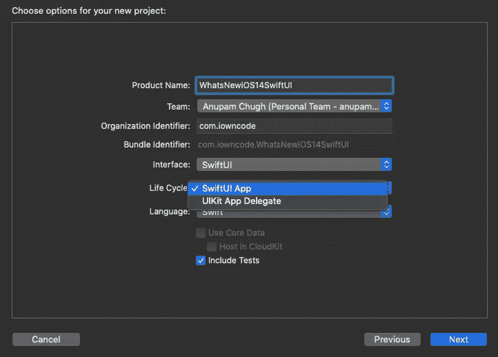
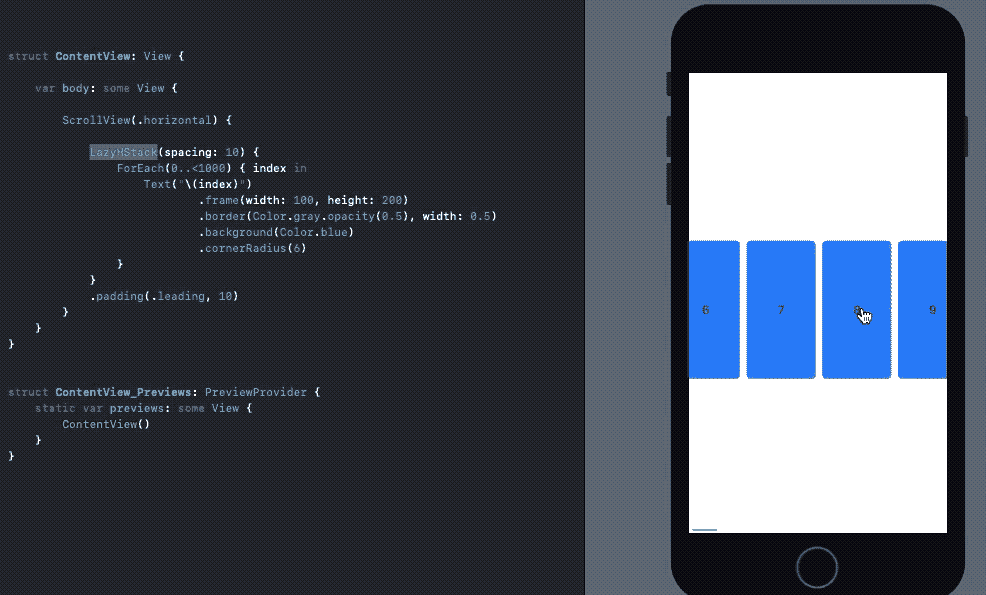
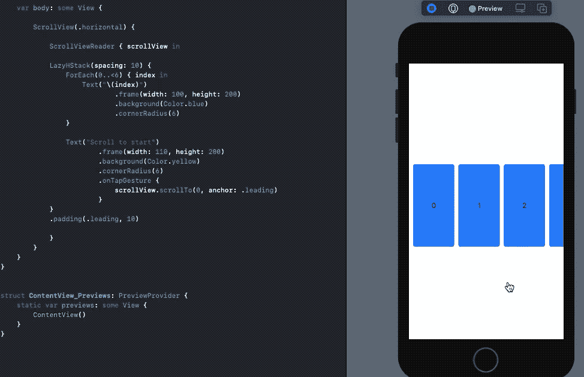
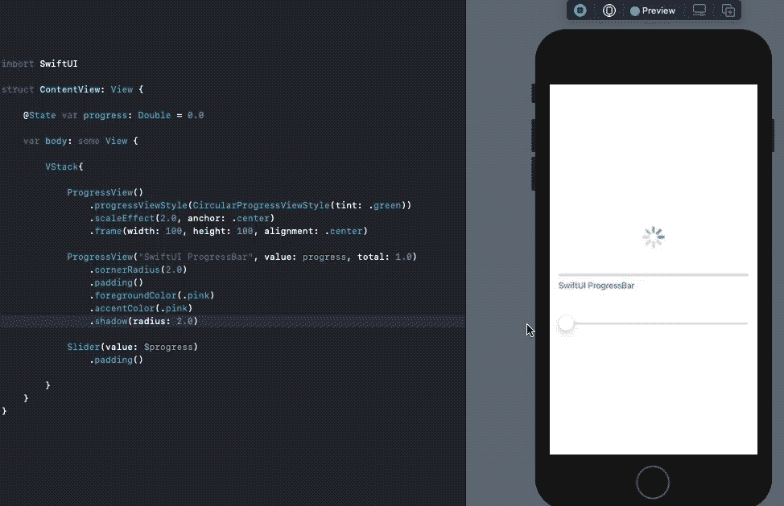
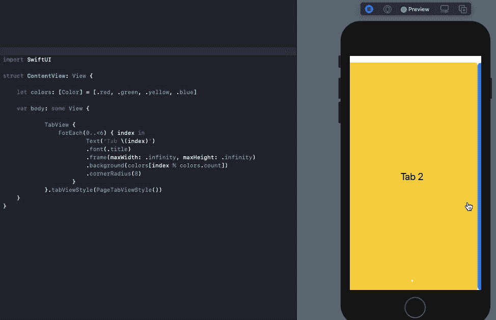
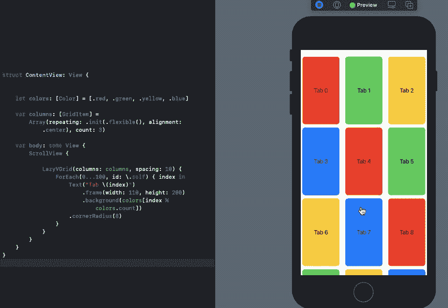

# SwiftUI 2.0 有什么新功能？

> 原文：<https://betterprogramming.pub/whats-new-in-swiftui-2-0-ed13f2c40ae2>

## iOS 14 带来了 Lazy Stacks、ProgressView、ColorPickers、标签、网格和更多 SwiftUI 控件


[Lina Trochez](https://unsplash.com/@lmtrochezz?utm_source=medium&utm_medium=referral) 在 [Unsplash](https://unsplash.com?utm_source=medium&utm_medium=referral) 上拍摄的照片

WWDC 2020 于本周开始，开发者社区热切期待 SwiftUI 2.0。不出所料，苹果在 Keynote 结束时放弃了一些针对 SwiftUI 的全新 API 更新。

SwiftUI 中的新改进本质上是附加的。这意味着没有会破坏您的旧的 13 个 SwiftUI 代码库的不赞成或改变。

在接下来的几节中，我们将先睹为快，看看 iOS 14 发布的新 SwiftUI 控件。你需要一个 Xcode 12 测试版(要求 macOS 最低版本为 10.15.4)来运行它们。让我们开始吧。

# 新的 SwiftUI 应用起点

到目前为止，我们必须使用`AppDelegates`和`SceneDelegates`来设置我们的第一个 SwiftUI 视图。Swift 5.3 引入了基于类型的程序入口点，可以使用`@main`属性进行设置，最新的 SwiftUI 迭代巧妙地利用了这一点。



Xcode 12 新项目

SwiftUI 现在提供了以下在应用程序启动时调用的结构:

`WindowGroup`是内部的一个场景属性，这样我们可以定义起始视图层次。我们可以在`WindowGroup`计算属性中设置 TabView、NavigationViews 或应用程序剪辑。

# SwiftUI LazyVStack 和 LazyHStack

以前，SwiftUI 视图通常会立即加载，这在填充大量数据时会导致性能和内存问题。

有趣的是，在 SwiftUI 的第一次迭代中，`NavigationLink` destination 视图也曾提前加载内容。这一次，苹果推出了新的惰性水平和垂直堆栈，在需要时加载内容，从而有助于 SwiftUI 的性能优化。现在 SwiftUI 列表中也引入了延迟加载。

下面是 SwiftUI `LazyHStack`的一个实例:



# SwiftUI 滚动视图位置

由于功能有限，SwiftUI 的第一个版本在`ScrollView`前线遭受了很多损失。iOS 14 的 SwiftUI 带来了急需的`ScrollViewReader`和`ScrollViewProxy`来捕捉滚动视图偏移位置，并以编程方式移动到它们上面。

为了做到这一点，我们将视图嵌入到一个`ScrollViewReader`中，并以下列方式之一使用`scrollTo`方法:

```
scrollView.scrollTo(viewId)
//or
scrollView.scrollTo(viewId, anchor: .center)
```

默认情况下，滚动视图位置设置为视图的开头或顶部。我们可以通过使用`anchor`属性来细化它。例如，在下面这段代码中，当将 anchor 属性设置为`center`时，滚动位置看起来比设置为`leading`时好得多。



# SwiftUI 进度视图

以前，我们必须利用 SwiftUI 形状来复制线性的`ProgressView`和`UIViewRepresentable`，以便在 SwiftUI 中创建`ActivityIndicator`。现在，在 iOS 14 的 SwiftUI 中，`ProgressView`有了原生支持。

默认的`ProgressView()`创建一个类似进度加载器的不确定的`UIActivityIndicator`，而下面的在 SwiftUI 中创建一个线性的`ProgressView`:

```
ProgressView("Text", value: 10, total: 100)
```

我们可以通过使用`progressViewStyle`来进一步定制`ProgressView`，它接受内置的`CircularProgressViewStyle`、`DefaultProgressViewStyle`，并允许您创建定制的修饰符。



`accentColor`用于设置`ProgressView`中的文字颜色，`foregroundColor`作为`tint`。

# SwiftUI 标签、链接和颜色选择器

标签是最新 SwiftUI 迭代中非常需要的附加功能。它们允许您使用以下代码行在文本旁边设置图标:

```
Label("SwiftUI 2.0", systemImage: "checkmark.icloud")
```

在`icons`属性中，您可以设置 SF 符号、图像资产或自定义 SwiftUI 形状。

*注:书写时，图标与文本顶部对齐。希望这个问题能很快得到解决。*

SwiftUI Link 是另一个很酷的 UI 控件，它为导航到 URL 提供内置支持:

```
Link("Click me",destination: URL(string: "your_url")!)
```

如果是通用链接，链接将被重定向到 web 浏览器或相关应用程序。

SwiftUI 库的另一个重大改进是包含了一个原生的`ColorPicker` UI 控件。您可以使用一个`State`属性包装器来更新用户选择的颜色。

```
ColorPicker("Sample Picker", selection: $myColor)
```

# SwiftUI TextEditor，MapKit，登录 Apple

上次省略的多行可滚动`UITextViews`现在原生包含在 SwiftUI 中，称为`TextEditor`。

```
TextEditor(text: $stateProperty)
```

MapKit 必须通过封装在`UIViewRepresentable`中才能嵌入 SwiftUI，现在可以原生添加了。我们可以通过一个`MKCoordinateRegion`，显示用户位置，并直接从 SwiftUI 的视图界面本身做许多其他的`MapKit`事情。

```
Map(mapRect:interactionModes:showsUserLocation: userTrackingMode:
```

`SignInWithAppleButton`现在进入 SwiftUI 的内置控制。要设置按钮，我们只需实例化`struct`并将`label`参数设置为`.signUp`或`.signIn`来指示授权的类型。关于其语法的更多细节，请参考[官方文档](https://developer.apple.com/documentation/swiftui/signinwithapplebutton?changes=latest_minor)。

# 一个新的 onChange 修饰符来监听状态变化

`onChange`是一个新的视图修改器，可用于所有 SwiftUI 视图。它允许您监听状态变化，并相应地对视图执行操作。

例如，我们可以切换一个按钮的状态变化，并触发`TextEditor`清除，因为已经附加了`onChanged`修改器，如下所示:

*注:* `*clearText*` *状态属性在 SwiftUI 的 body 被实例化*时第一次自动触发 `*onChange*` *修改器。*

# SwiftUI TabView 为页面控制带来新风格

`UIPageViewController`上一次确实进入了 SwiftUI。在 iOS 14 迭代中，`TabView`引入了一种新的风格，让你在 SwiftUI 视图中嵌入可切换的页面控件。只需在`.tabViewStyle()`修改器中设置`PageTabViewStyle()`，如下所示:

下面是上面代码在 Xcode 12 上运行的截屏:



# SwiftUI 网格

iOS 14 SwiftUI 中再次缺失了 CollectionView 和 Compositional Layouts。但这并没有阻止苹果为基于网格的布局引入新的容器，让你在`LazyHGrid`或`LazyVGrid`中设置子视图。

SwiftUI 网格的每个元素都是一个`GridItem`。我们可以设置`GridItem`的对齐、间距和大小。在以下代码中，我们在 SwiftUI 中创建了由三列组成的垂直网格布局:



仅用几行代码，我们就在 SwiftUI 中为 iOS 14 构建了一个可定制的网格布局。

# 结论

今年 SwiftUI 和其他 iOS 14 框架更新还有很多值得期待的地方。SwiftUI `OutlineGroups`和`VideoPlayer`支持是几个有前途的新特性。最重要的是，SwiftUI 视图构建器现在支持`if let`和`switch`语句。

这一次到此为止。感谢阅读。