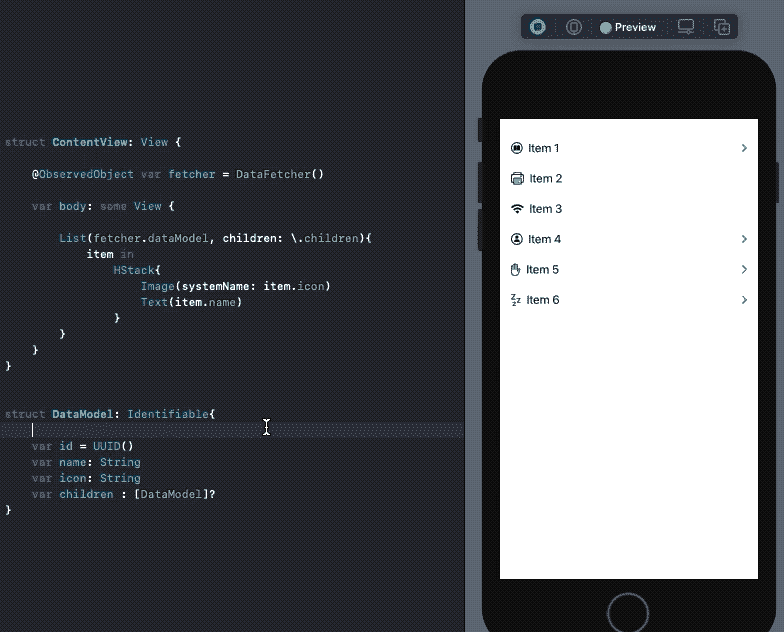
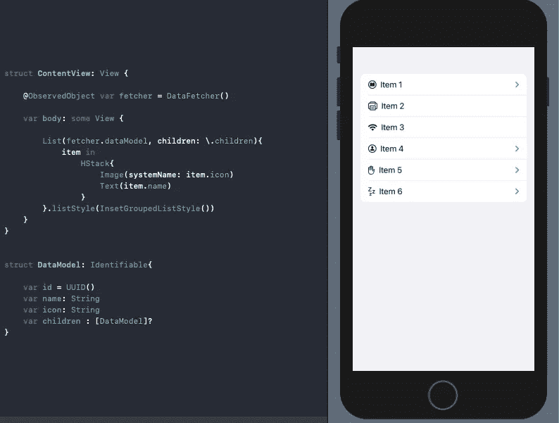
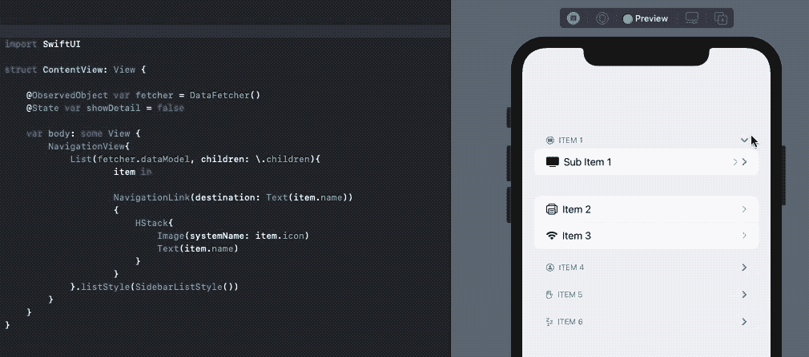

# iOS 14 的 SwiftUI 列表有什么新功能？

> 原文：<https://betterprogramming.pub/whats-new-in-swiftui-lists-for-ios-14-e6aed43ca134>

## 嵌套或可扩展的列表和一个全新的视图修改器


由 [Cathryn Lavery](https://unsplash.com/@cathrynlavery?utm_source=medium&utm_medium=referral) 在 [Unsplash](https://unsplash.com?utm_source=medium&utm_medium=referral) 拍摄的照片

列表是每个应用程序的重要组成部分，SwiftUI List 只是简化了我们填充数据的方式，通常符合`Identifiable`协议——该协议确保每一行对于动态项目都是唯一的。

WWDC 2020 为 iOS 14 中 SwiftUI 列表的一些有趣更新铺平了道路。让我们看看他们。

# SwiftUI 使用'新建嵌套列表。儿童关键路径

到目前为止，在 SwiftUI 中创建嵌套或可扩展列表需要在彼此之间嵌套`ForEach`循环。

SwiftUI 的最新版本通过在其初始化器中引入一个`.children`键路径参数，使得构建嵌套列表变得更加容易。这样做，它允许我们创建递归的 SwiftUI 列表，以系统标准的样式显示在 iOS、iPadOS 和 macOS 上。

让我们为新的 SwiftUI 概要列表建立一个数据结构。

```
struct DataModel: Identifiable{

    var id = UUID()
    var name: String
    var icon: String
    var children : [DataModel]?
}
```

现在，您可以使用 JSON 或任何资产文件填充数据，但是为了简单起见，我们将设置一些伪字符串和 SF 符号。让我们通过使我们的类符合`ObservableObject`来做到这一点，T3 是一种通过发布者宣布变化的对象。

既然我们的数据源已经准备好了，让我们把它插入到 SwiftUI 的`View`中。

```
struct ContentView: View {

    @ObservedObject var fetcher = DataFetcher()

    var body: some View {

        List(fetcher.dataModel, children: \.children){
            item in
                HStack{
                    Image(systemName: item.icon)
                    Text(item.name)
                }
        }
    }
}
```

子键路径确保列表以递归方式构建其内容(假设数据模型有效)。



# 新的“listStyle”修饰符

SwiftUI List 提供了一个`listStyle()`来定制外观和感觉。

可以通过`GroupedListStyle()`获得类似 iOS 12 的分组，或者通过`InsetGroupedListStyle()`获得 iOS 13 及以上的圆角外观。

通过上面的 SwiftUI 列表，我们可以看到后者的样子:



还有一个`SidebarListStyle()`在 iPadOS 和 macOS 中很有用，特别是对于利用侧边栏的基于文档的应用程序。

# 带导航链接的 SwiftUI 大纲列表

当使用`SidebarListStyle`并将列表嵌入到`NavigationView`中时，对于 NavigationLink 的目标视图，只有没有子行的行是可导航的。SwiftUI 在 iPadOS 和 macOS 上自动完成这项工作，如下所示:


但是在 iOS 设备上运行相同的程序，就有点问题了(在撰写本文时)。或者，它不打算这样使用:



如你所见，在 iOS 设备上，它显示了双重披露。尽管有子列表，`NavigationLink`仍然在工作，这在理想情况下是不应该的。希望这个 bug 很快得到修复。

# 结论

我们看到了 SwiftUI 第二次迭代的两个很酷的新更新，它可以在 iOS 14 和 Xcode 12 及更高版本上工作。

这一次到此为止。感谢阅读。