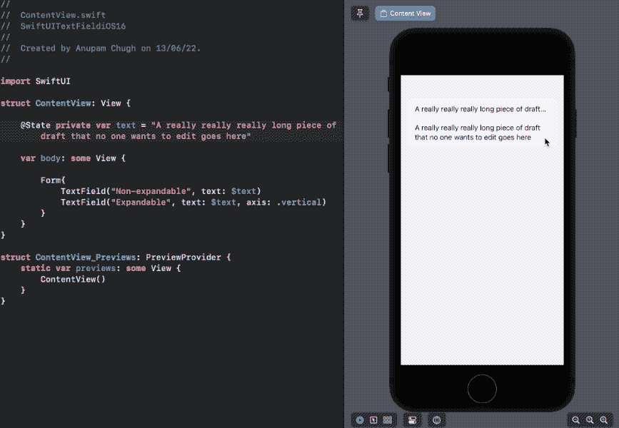
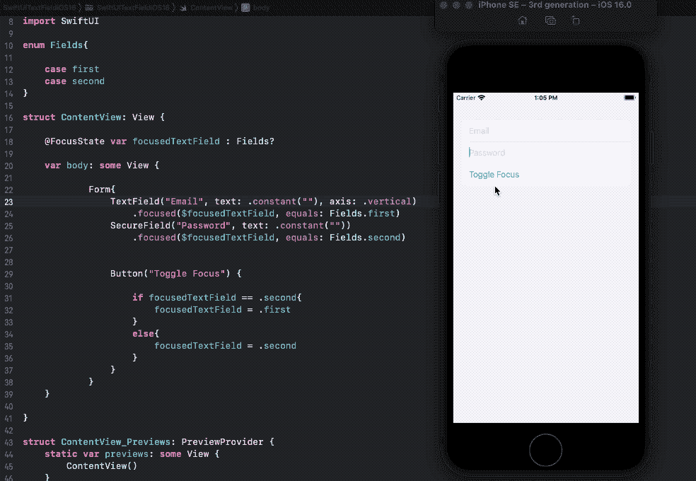
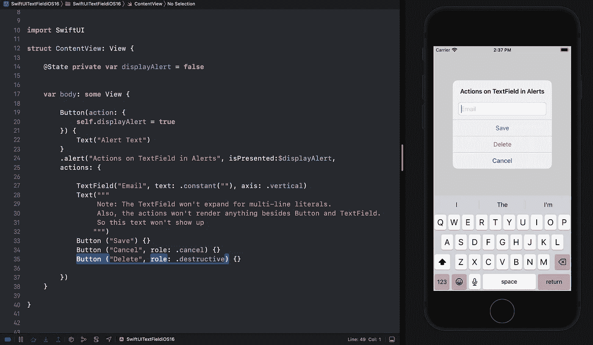
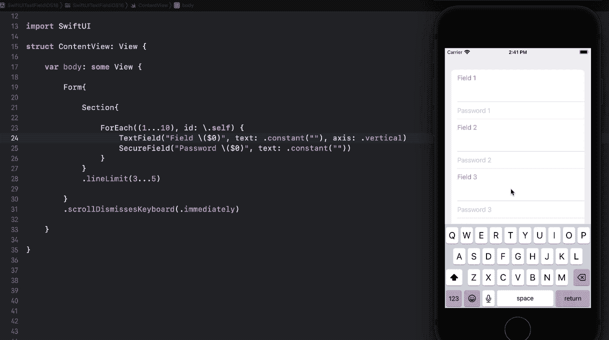

# iOS 16 版 SwiftUI TextField 有什么新功能？

> 原文：<https://betterprogramming.pub/whats-new-in-swiftui-textfield-for-ios-16-308264052ca3>

## 多行文本字段、默认焦点、新的自动更正修饰符、警报中的文本字段和微调的滚动


照片由[赛义德·阿里](https://unsplash.com/@syedmohdali121?utm_source=medium&utm_medium=referral)在 [Unsplash](https://unsplash.com?utm_source=medium&utm_medium=referral) 上拍摄

TextField 是用 SwiftUI 设计 UI 的核心控件之一。在 WWDC 2020 期间，为`TextField`展示了相当多方便的增强功能。比如:

*   通过轴参数的多行文本字段

在接下来的几节中，我们将逐一介绍它们:

# 多行文本字段

在 iOS 16 之前，为了构建一个随着内容动态增长或收缩的`TextField`——我们要么利用 UIViewRepresentable，要么通过使用`ZStack`来实现。

很高兴，在 iOS 16 中，axis 参数会自动为您处理这些事情。

```
TextField("Expandable", text: $text, axis: .vertical)
```



我们可以通过使用`lineLimit`修改器来进一步定制和控制`TextField`的动态高度。在`lineLimit`中设置一个下限和上限让我们可以设置文本字段的最小高度和滚动开始的高度。如下图所示，文本字段的高度对应于 6 行。

# 通过默认焦点更好地处理焦点

之前，我们不得不求助于`asyncAfter`来改变文本字段的焦点。我们现在可以做到这一点，没有任何延迟，如下所示:



iOS 16 还带来了一个方便的修饰符— `defaultFocus(_:_:priority:)`以编程方式设置默认焦点:

# 一种新的自动修正修改器

SwiftUI 中默认启用`TextFields`的自动校正。因此，在下面的修饰符中传递一个布尔值在早期没有什么意义:

```
//Prior to iOS 16disableAutocorrection(true)
```

现在在 iOS 16 中，`disableAutocorrection`被弃用，新的修饰符更容易插入和理解:

```
.autocorrectionDisabled()
```

# 在提醒中使用文本字段

现在，您可以在`actions` `ViewBuilder`参数中传递文本字段，以创建包含文本字段的警报。所以，和 iOS 16 的`UIViewRepresentable`做事方式说再见吧。

以下是如何实现 TextField inside alerts:

```
.alert("Title", isPresented:$displayAlert,actions: {TextField("Email", text: .constant(""), axis: .vertical)
Button ("Save") {}})
```

感谢按钮`roles`，我们不再需要依赖需要`primaryButton`和`secondaryButton`参数的旧警报`initialiser`:



# 滚动时键盘不可用

不完全是 TextField 特性，但是新的 SwiftUI 修饰符`.scrollDismissesKeyboard(.immediately)`允许你在 ScrollView 上以不同的方式关闭键盘。例如，当拖动滚动条时，模式`immediately`导致键盘立即消失。`interactively`只有当用户向上滚动时才关闭。

`scrollDismissesKeyboard`不仅适用于 ScrollView，也适用于如下所示的`List`和`Form`:



在构建注册表单时，这是一个非常方便的修饰符。

以上就是 iOS 16 版 SwiftUI TextField 的变化。感谢阅读。