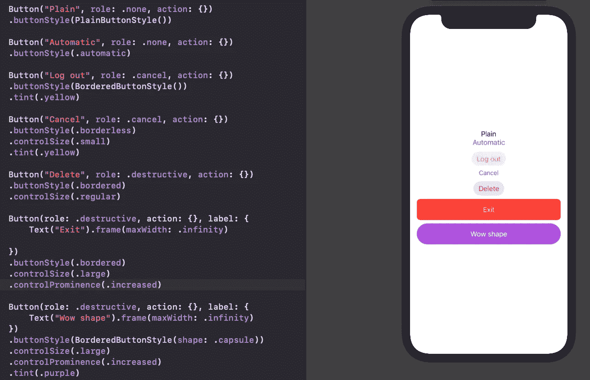
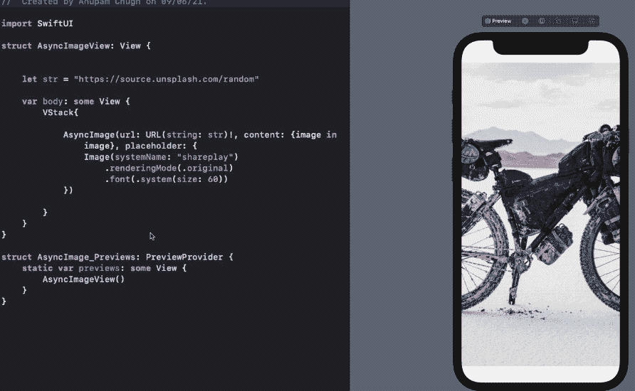
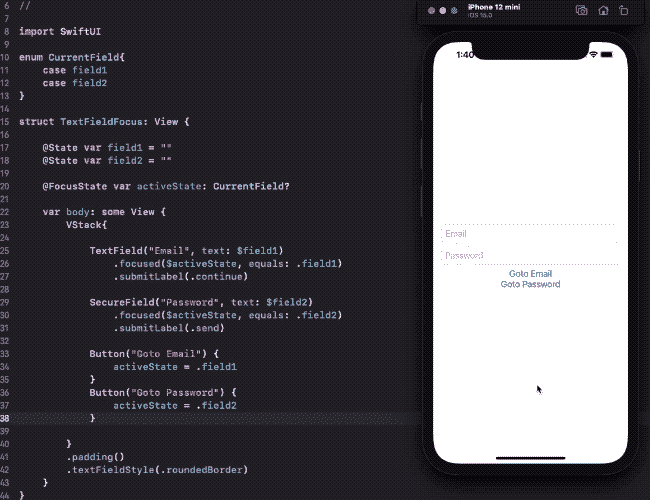
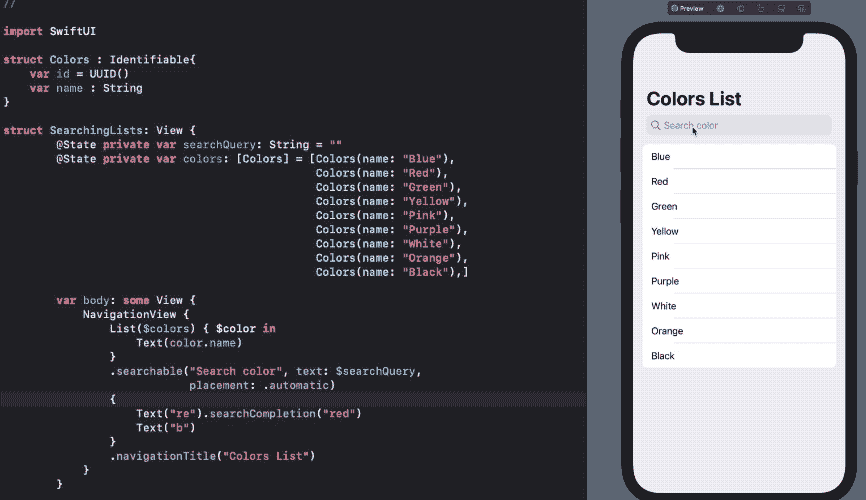
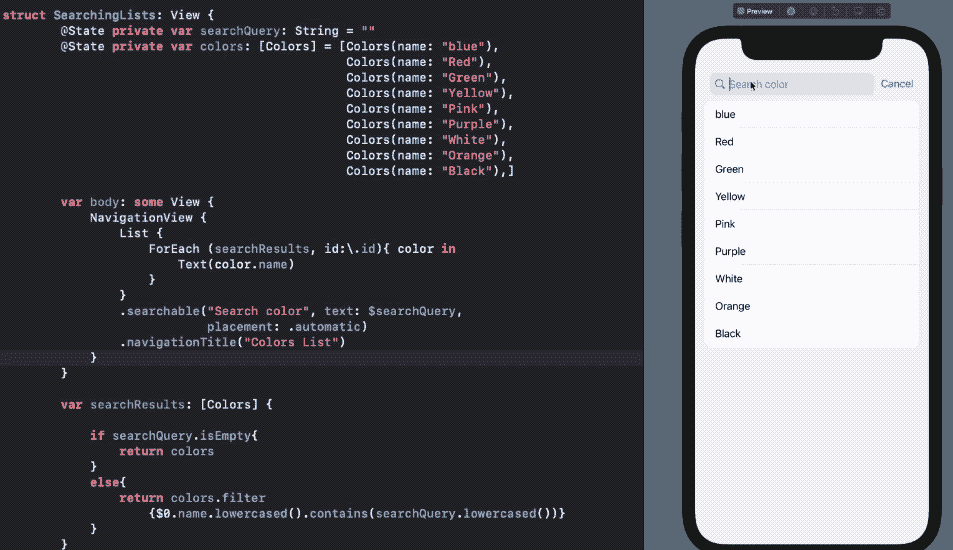
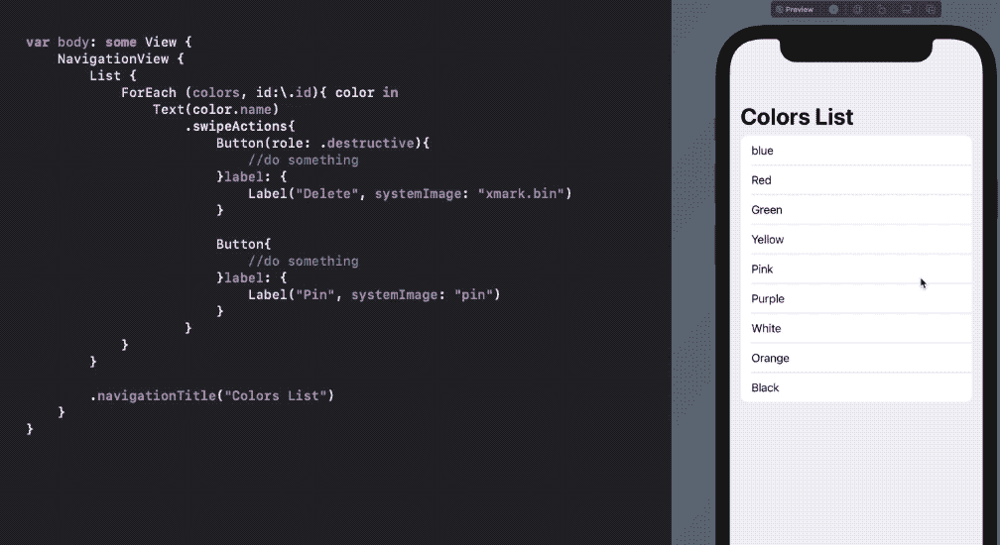
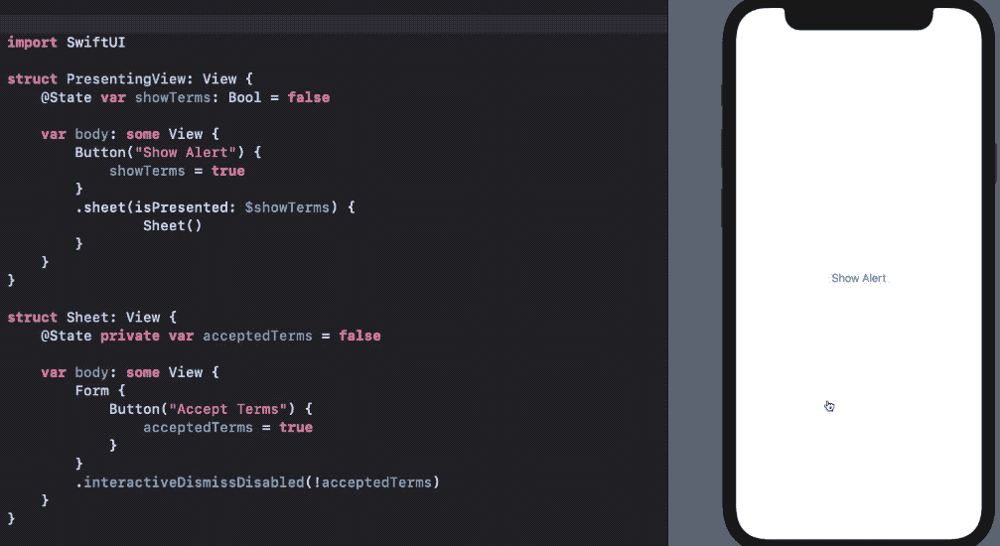
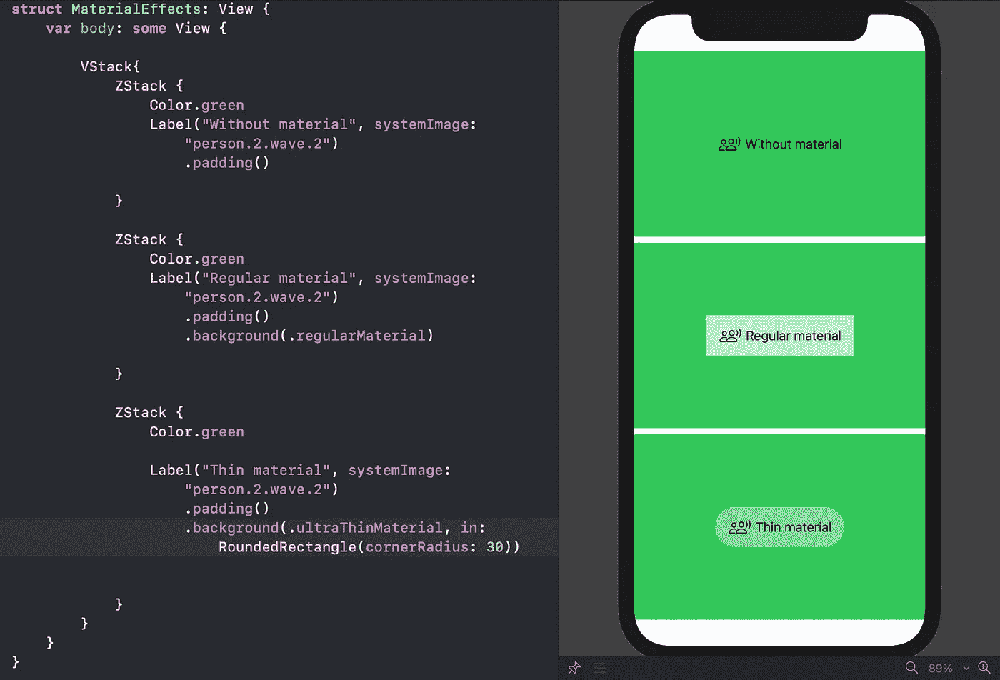

# SwiftUI 3.0 有什么新功能？

> 原文：<https://betterprogramming.pub/whats-new-in-swiftui3-ios15-fa0e0d62235b>

## 降价支持、新的按钮样式、可定制的列表等等


[Frédéricke Boies](https://unsplash.com/@fred_20?utm_source=medium&utm_medium=referral) 在 [Unsplash](https://unsplash.com?utm_source=medium&utm_medium=referral) 上拍摄的照片。

SwiftUI 是苹果的声明式 UI 框架。在 2021 年 WWDC 奥运会上，它再次迎来了令人兴奋的新增强功能和特性，以及一些对我们有益的反对意见。

SwiftUI 3.0 应该可以在 iOS 15，iPadOS 15，macOS 12，watchOS 12 上使用。

在我们开始之前，值得注意的是,`Info.plist`文件在 Xcode 13 项目结构中不再默认可见。相反，您必须从项目导航器选项卡中访问它。

在接下来的几个部分中，我们将看看 iOS 15 的 SwiftUI 的新功能(尽管其中大多数也将以某种形式在其他平台上工作)。

# 降价支持和新的 AttributedString API

Markdown 是一种用于编写格式化文本的通用语言。你可能在 GitHub Readme 文档中看到过很多。

从 iOS 15 开始，苹果将对`Foundation`框架和 SwiftUI 提供 Markdown 支持。所以，你可以在 SwiftUI `Text`中用 Markdown 语法添加字符串，如下所示:

```
Text("**Connect** on [Twitter](url_here)!")
```

这是一个正在运行的应用程序:


作者截屏— SwiftUI 文本降价

如果你想在上面的字符串中自定义一系列字符，SwiftUI 有一个全新的`AttributeString` API，UIKit 有一个增强的`NSAttributedString`。

您可以在 SwiftUI 文本中传递上面的`AttributeString`，或者使用新的`[AttributeScope](https://developer.apple.com/documentation/foundation/attributescopes)`和`[SwiftUIAttributes](https://developer.apple.com/documentation/foundation/attributescopes/swiftuiattributes)`对其进行定制。

查看[郑](https://medium.com/u/3968fe272788?source=post_page-----fa0e0d62235b--------------------------------)关于如何在 SwiftUI 中增加[属性字符串的文章。](/ios-15-attributed-strings-in-swiftui-markdown-271204bec5c1)

# 新按钮样式

SwiftUI 按钮现在变得更加强大了。我们有了新的角色和样式修改器。

`ButtonRole`让您描述按钮的种类。它接受:

*   `cancel`
*   `destructive`
*   `none`
*   `some()`发布者。

类似地，我们现在能够设计 SwiftUI 按钮的样式。通过使用`buttonStyle`视图修改器，你可以应用`BorderedButtonStyle`、`BorderlessButtonStyle`、`PlainButtonStyle`或`DefaultButtonStyle`。

*注意:这些样式也可以用它们的枚举对应物替换。*

对于`BorderedButtons`，有一个新的[边框形状](https://developer.apple.com/documentation/swiftui/borderedbuttonstyle/bordershape?changes=latest_minor)来描述你是否想要它作为`capsule`、`roundedRectangle`或`automatic`。

下面快速浏览一下 iOS 15 中可以应用于 SwiftUI 按钮的不同样式和角色类型:



[要旨](https://gist.github.com/iosdevie/0de04e6fe2ff1b5ae445746cf7b01d1f)

从上面的代码中可以明显看出，无边框按钮不符合当前操作系统的`tint`颜色和`automatic`样式。

*注意:为组容器设置一个样式修饰符(在我们的例子中是* `*VStack*` *)会将它应用到所有的按钮控件上。*

还有两个属性我们没有讨论:

*   `controlSize`从几个标准可用选项中选择按钮的尺寸。
*   `controlProminence` —这定义了不透明度。难怪最底部的按钮很突出。

除了 SwiftUI 按钮控制的一系列变化，苹果还为 SwiftUI 展示了一个名为`[LocationButton](https://developer.apple.com/documentation/corelocationui/locationbutton?changes=latest_minor)`的`CoreLocationUI`按钮。它提供了标准化的当前位置用户界面，有助于快速获取位置坐标:

```
LocationButton(.sendMyCurrentLocation) {// Fetch location with Core Location.}.labelStyle(.titleAndIcon)
```

# 用于从 URL 加载图像的 SwiftUI AsyncImage

以前，在图像中显示远程 URL 需要设置一个加载器并执行异步任务。处理不同的加载状态只会增加越来越多的样板代码。

谢天谢地，SwiftUI 3.0 带来了`AsyncImage`来抽象整个过程。

它是这样工作的:

```
AsyncImage(url: URL(string: <url_here>)!)
```

您还可以通过访问`content`参数来自定义输出图像。此外，您也可以使用`placeholder`参数来设置加载视图。



您还可以使用来自`content`块的`AsyncImagePhase`枚举来处理结果的不同状态。

`AsyncImage`让你指定`transcation`，在那里你可以传递一个动画。

还有另一个`scale`参数，不仅可以让你控制大小，还可以方便地放大和缩小。看一看:


由于`AsyncImage`使用了`URLSession`，它提供了开箱即用的缓存支持(尽管您现在还不能编写自定义缓存)。

# SwiftUI TextField 获得更好的键盘管理

在 iOS 15 中，我们有了一个新的属性包装器(`@FocusState`)来以编程方式管理当前的活动字段。这将在登录和注册表单中非常有用，因为开发人员现在可以突出显示特定的文本字段。

为了在 SwiftUI 中实现对`TextField`的编程聚焦，我们需要在`focusedStated`修饰符中绑定`FocusState`。它进行布尔检查以确定`FocusState`是否绑定到同一个视图。

这里有一个例子:



[要旨](https://gist.github.com/iosdevie/415728c7de0e111dd3c02bbee18db092)

注意`submitLabel`视图修改器。这让我们用一堆其他选项来设置键盘返回按钮。

目前，SwiftUI TextField `FocusState`在第一个 iOS 15 测试版中无法在`Forms`中工作。

## 新的 onSubmit 视图修饰符和 onCommit 的弃用

因为我们为 TextField 提供了更好的焦点管理，所以我们有了一种新的处理结果的方式也就不足为奇了。回车键的`onCommit`回调是不推荐使用的，并且有一个`[onSubmit](https://developer.apple.com/documentation/swiftui/texteditor/onsubmit(of:_:)?changes=latest_minor)`视图修饰符。此修饰符用于处理视图层次结构中的文本字段结果。

这里有一个例子:

*注意:您可以使用* `*.onSubmit(of:)*` *选择指定视图类型。此外，将* `*submitScope*` *设置为* `*true*` *可以确保不返回该层次结构的结果。*

# SwiftUI 列表现在可以搜索了

在前两次迭代中，SwiftUI 列表中缺少搜索功能。在 iOS 15 中，苹果给列表带来了一个`searchable`修饰符。

要记住的关键事情是:要将一个列表标记为`searchable`，您需要将它包装在一个`NavigationView`中。

这是带有搜索视图的 SwiftUI 列表的第一个视图:

有几件事需要考虑:

*   `searchable`允许您指定一组搜索建议。点击它们将在搜索栏中显示`searchCompletion`文本。
*   自动`placement`根据苹果平台决定搜索栏的位置。
*   如果您还没有注意到，我们现在可以直接在列表中传递`Binding`数组，并为每一行获取一个绑定值。SwiftUI `TextField`中需要一个绑定值。以前，在列表中设置一个`TextField`经常会导致整个视图层次的重载。幸运的是，`Lists`中对`Binding`数组的支持消除了这个问题。



为了显示搜索结果，我们可以使用上面讨论过的`onSubmit`修饰符，或者设置一个实时过滤的计算属性，如下所示:



[要旨](https://gist.github.com/iosdevie/66e5797931b909b53c540873e1960769)

还有一个环境值`isSearching`，用于跟踪用户是否正在与搜索视图交互。您可以使用它在覆盖图或其他视图中显示/隐藏搜索结果。

将`onSubmit`修饰符用于嵌套的 SwiftUI 列表会很有趣。

# SwiftUI 列表拉至刷新

*拉刷新*是另一个缺失的特性。这迫使我们使用`UIViewRepresentable` [的变通方法](/pull-to-refresh-in-swiftui-6604f54a01d5)。使用 iOS 15，你可以用`refreshable`修饰符把它集成到几行代码中，如下所示:


[要点](https://gist.github.com/iosdevie/af2df84e9b44f239b7f4b05a9d541880)

您可以获取网络请求，就像在 refreshable 修饰符中使用`async/await`一样，并显示结果。

目前，本地 SwiftUI Pull to Refresh 在 SwiftUI 网格或滚动视图上不工作。然而，它确实带来了一些可定制性。有一个`[RefreshAction](https://developer.apple.com/documentation/swiftui/refreshaction?changes=latest_minor)`环境值来手动触发刷新。

# SwiftUI 列出滑动动作

*滑动来执行动作*是另一个被请求的特性，我们今年通过新的`swipeActions`修改器得到了它。

这是全新按钮风格的滑动动作:



默认情况下，滑动动作将从屏幕的后缘显示。但是，我们也可以将它们配置为从前端工作。简单地使用这个:

```
.swipeActions(edge: .leading)
```

我们还可以通过链接多个修改器来支持两侧的滑动动作。

默认情况下，第一次推送操作在完整推送时触发。但是你可以通过设置`allowsFullSwipe`为`false`来改变这一点。

目前，推送操作不适用于绑定数组列表。

# 列表、选项卡、警告和工作表的更多修饰符

SwiftUI List 无疑在今年得到了最大的升级。如果搜索视图、刷新和滑动操作还不够，还有更多方法可以自定义您的列表:

*   `listRowSeparator`和`listSectionSeparator`显示或隐藏分隔线。
*   `listRowSeparatorTint`和`listSectionSeparatorTint`分别为每行和每段添加色调。
*   `.insetStyle(alternatesRowBackgrounds:)`针对 macOS。
*   `badges`设置在 SwiftUI 列表行的右侧。iOS 15 的 SwiftUI TabViews 也有这个功能。

SwiftUI 警报视图现已弃用。相反，我们有了新的`.alert`修改器。`.alert`也为`[error](https://developer.apple.com/documentation/swiftui/texteditor/alert(ispresented:error:actions:)?changes=latest_minor)`对话框带来了一个变种。

这里有一个`[interactiveDismissDisabled](https://developer.apple.com/documentation/swiftui/anyview/interactivedismissdisabled(_:)?changes=latest_minor)`功能，开发者可以选择阻止表单和表格的撤销。这里有一个简单的例子:



# 并发性的任务修饰符

以前，当获取视图数据时，许多 SwiftUI 开发人员会求助于`onAppear`。

在 iOS 15 中，苹果带来了一个全新的`task`修改器，让你的数据异步加载。当附加的 SwiftUI 视图被破坏时自动取消任务的能力使得任务修改器成为一个非常方便的工具。

通过按需加载更多数据来创建一个无止境的滚动列表是`task`修饰符的一个完美用例。这对于完成`NavigationLink`目的地视图的繁重工作也很方便(遗憾的是没有改进)。

# 全新 SwiftUI 材料结构

`Material`结构用于通过给视图添加透明度和活力来混合前景元素和背景。我们以下列方式使用它:

```
.background(.regularMaterial)
.background(.thinMaterial)
.background(.ultraThinMaterial)
.background(.thickMaterial)
.background(.ultraThicknMaterial)
```

或者，您可以在材质中设置一个形状，如下所示:



基本上，材质类型表示背景类型通过前景元素的程度。这是在视觉上模糊 SwiftUI 视图的一个很好的替代方法。

# 新画布和时间线视图

SwiftUI 里的一个`drawRect`失踪了两年。最后，苹果以`Canvas` API 和更多的形式带来了它。

Canvas API 为绘制路径和形状提供了现成的支持。因此，您可以通过在 SwiftUI 应用程序中设置遮罩、转换和应用滤镜来创建丰富的图形。最精彩的部分？是 GPU 加速的。

另一方面，`TimelineView`引入了构建实时更新的动态视图的能力。我们在去年的 SwiftUI 文本中看到了计时器发布者的一瞥。

但是`TimelineView`将它带到了另一个层次，它允许您包装任何 SwiftUI 视图，并通过`[TimelineSchedule](https://developer.apple.com/documentation/swiftui/timelineschedule)`设置可以定期或在特定时间配置的时间表。时间线视图就像应用程序中的小部件。

在 WWDC 2021 上，苹果展示了一系列使用 SwiftUI 构建的普通 iOS 应用。我很确定 TimelineViews 在其中一些作品中扮演了重要角色。

# 排除故障

SwiftUI 现在为调试[视图层次](https://twitter.com/luka_bernardi/status/1402045202714435585)提供内置支持。

在视图主体内调用以下函数将打印上次重新加载时修改的 SwiftUI 视图:

```
let _ = Self._printChanges()
```

# 结论

在本文中，我们看到了在 WWDC 2021 上宣布的一些主要 SwiftUI 功能。但是仍然有很多值得期待的，比如在 macOS 中使用 SwiftUI `Table`或者为`CoreData`使用`SectionedFetchRequest`属性包装器来增加 SwiftUI 应用的并发性。

暂时就这样了。感谢阅读。