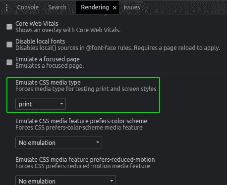

# 顺风社 CSS 3 有什么新功能？

> 原文：<https://betterprogramming.pub/whats-new-in-tailwind-css-3-f46c47262da>

## 激动人心的游戏改变者和开发者友好的版本


照片由[斯潘塞·因布罗克](https://unsplash.com/@spencerimbrockphoto?utm_source=medium&utm_medium=referral)在 [Unsplash](https://unsplash.com?utm_source=medium&utm_medium=referral) 上拍摄

新的 Tailwind CSS 版本 3 是其迄今为止最大的版本之一。我个人从来都不是顺风的狂热爱好者，但是这个让我想在我的下一个项目中使用它。如果你是它的爱好者之一，那你就有得吃了。

它带来了许多优化和性能改进，将改变您使用 Tailwind CSS 的方式。它将使我们能够打破主题限制，并在需要时通过括号符号使用幻数方法。虽然不推荐，但自由永远是明智的选择。

像往常一样，添加了许多新的实用程序，以跟上新的浏览器功能。

下面，我们将看看最相关的变化，以及它们为什么有用。

# 播放 CDN

从 3.0 开始，我们可以从 CDN 加载顺风 CSS。它不是基于 CSS 的 CDN，而是内置的 JavaScript。它并不是要在生产中使用，而是作为一种快速的方法来使用零配置的库。

它将使用下面描述的 JIT 编译器的特性。

你也可以使用他们的游乐场网站:[https://play.tailwindcss.com/](https://play.tailwindcss.com/)，这样你就可以跟随并尝试下面描述的任何功能。

# 即时编译程序

回到顺风 CSS `v2.1`,即时编译器被引入。它是作为预览版推出的。它有什么好处？按需生成样式，而不是在构建时预先生成。

让我们回顾一下它的影响:

*   开发模式下的浏览器性能更好，因为交付的代码更少。
*   更快的构建。
*   为开发环境生成的 CSS 与交付给生产环境的 CSS 是相同的。
*   无需清除未使用的样式。任何时候都只加载需要的内容。

作为这个新版本的一部分，JIT 引擎变得更加稳定。它现在正在取代传统的发动机🚀。

下面的配置是您在 JIT 预览中选择的，不再需要了:

```
// tailwind.config.js
module.exports = {
    **mode: 'jit',** }
```

您需要配置的只是填充内容选项。下面是一个配置 Next.js 项目的示例:

```
// tailwind.config.js
module.exports = {
  theme: {
    extend: {},
  },
  **content: [
    './pages/**/*.{js,ts,jsx,tsx}',
    './components/**/*.{js,ts,jsx,tsx}'
  ],**
  plugins: [],
};
```

JIT 引擎支持所有现成的变体。它甚至包括一些新的。它现在支持`pseudo-elements`变体`::before`、`::after`、`first-letter`……在以前的引擎中，由于开发中文件大小的增加，有些甚至必须手动启用。

让我们看一个新变体的例子:

上面的例子只是在`Example Text`文本之前创建了一个一像素的蓝色正方形元素内容。

JIT 引擎支持开箱即用的任意值。那些是什么？设计系统之外的特定任意值。在此版本之前，只能启用预览模式。

它的语法有一些注意事项，需要一些练习来适应它:

它使用括号符号来包含自定义值。它并不适用于所有属性。因此，请查看文档以了解更多关于受支持属性的信息。

# 任意属性

上面我们已经看到了如何在不需要 CSS 类的情况下指定超自定义值。但是如果我们想要一个 Tailwind CSS 没有提供的自定义属性呢？从这个版本开始，顺风团队让它成为可能。

为什么很酷？现在我们不必等待 Tailwind 赶上任何浏览器功能。我们可以手动选择一些尚未移植到 Tailwind 的功能。

这个特性也适用于 CSS 变量。您可以轻松地更改任何 CSS 变量的值。

让我们来看看这两种用法的例子:

我们也可以将这个特性与 CSS 修饰符一起使用。让我们配置一个仅在大屏幕上更改的 CSS 变量:

# 彩色方框阴影

这是一个期待已久的特性，终于发布了。我们可以用`shadow-{size}`加一个阴影。通过使用`shadow-{color/opacity}`,我们可以改变一个现有的盒子阴影的颜色。像往常一样，我们可以应用悬停、焦点和其他状态以及断点查询。

让我们看一个例子:

这是令人震惊的结果:


作者标题

# 开箱即用的更多颜色

这是 JIT 编译器的另一个积极的副作用。现在有更多的颜色出货。有大量的调色板可供选择。你可以在这里查看[。](https://tailwindcss.com/docs/customizing-colors)

概括地说，如果您需要定制颜色，您可以通过使用配置文件来进一步扩展调色板。

```
module.exports = {
  theme: {
    **colors: {
      w****atermelon****: '****FF555E****',
      c****itrus****: '****FF8650****',
      ....
    },**
  },
}
```

# 滚动 API

Scroll Snap API 已经有了不错的支持:大约 95%。顺风团队通过提供一系列实用程序使其成为可能。

您可以使用:

*   **滚动对齐**:用于对齐对齐起点、终点或中心。
*   **滚动捕捉停止:**控制用户是否可以跳过一些捕捉位置。
*   **滚动捕捉类型:**控制两个轴上捕捉点的严格程度。
*   **滚动填充:**控制 snap 容器内元素的滚动偏移量。
*   **滚动边距:**控制 snap 容器中元素的边距。

还添加了一个使用新滚动行为的实用程序:

*   **滚动行为**:控制是你想启用平滑滚动到一个元素。

# 打印修改器

现在支持打印修改器。你可以使用 Tailwind 来微调网站打印时的体验。

```
<p class="**print:hidden**">Text</p>
```

上面的代码会在页面打印时隐藏这一段。

要模拟打印布局，您可以使用开发工具中的`rendering`属性:



作者标题

# 包裹

我们检查了已经发布的最相关的特性。这个版本很胖，不适合一口气看完。还有更多的实用程序，如多列支持、纵横比 API 支持、从右到左和从右到右修饰符…

然而，它的基础是向 JIT 引擎的转换。这是对开发体验的巨大改进。它产生更快、更轻、更像产品的代码。

由于没有必要的净化，环境之间的摩擦大大减少。我是一个实用 CSS 库的超级粉丝，清理总是让我失望。

顺风团队正在向高级细节定制敞开大门，这将减少对特定 CSS 的需求。这不是推荐的方式，不应该被滥用。如果需要的话，我很高兴它就在那里。它给已经很棒的图书馆增加了一些急需的多功能性。

这个版本通过支持使用尚未被支持的 CSS 特性来保证未来的安全。如果我们愿意，我们可以在等待顺风支持的同时开始使用最新的功能。

干杯。

# 有关系的

[](/stop-using-the-pixel-unit-in-css-8b8788a1301f) [## 停止使用 CSS 中的像素单位

### 避免使用 px 装置的 3 个原因

better 编程. pub](/stop-using-the-pixel-unit-in-css-8b8788a1301f)