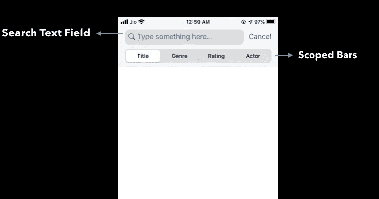

# iOS 13 搜索栏有什么新功能？

> 原文：<https://betterprogramming.pub/whats-new-in-the-ios-13-search-bar-f87c1e47f8d0>

## UISearchBarController 和 UIKit 中的增强功能


[乔·塞拉斯](https://unsplash.com/@joaosilas?utm_source=medium&utm_medium=referral)在 [Unsplash](https://unsplash.com?utm_source=medium&utm_medium=referral) 上的照片

在每一个 WWDC 版本中，苹果都发布了大量的改进和要求，以使用户界面现代化，从而允许构建更好的应用程序。2019 年 WWDC 也不例外。

除了引人注目的 SwiftUI 之外，苹果还在搜索栏中引入了不少新功能。在我们深入研究它们之前，让我们快速浏览一下`UISearchBarController`的搜索栏。

搜索栏主要由三部分组成:

*   文本字段。
*   取消按钮。
*   范围栏。

如下所示，设置一个简单的`UISearchBarController`既快速又简单:

```
let search = UISearchController(searchResultsController: nil)search.obscuresBackgroundDuringPresentation = falsesearch.searchBar.placeholder = "Type something here..."search.searchBar.scopeButtonTitles = ["Title", "Genre", "Rating", "Actor"]navigationItem.searchController = search
```

点击搜索栏，取消按钮和范围栏显示在`UISearchTextField`附近，如下所示:



我的应用程序中的随机截屏。

iOS 13 允许我们通过引入和展示一些新的好东西来以相当多的方式定制我们的`UISearchBarController`。让我们逐一介绍一下。

# 公开搜索文本字段属性

在 iOS 12 之前，`searchTextField`属性无法访问，因此无法进行定制。随着 iOS 13 的到来，苹果决定在其 API 中公开`SearchTextField`属性:

```
let textField = search.searchBar.searchTextField
```

现在可以定制背景颜色、字体以及`searchTextField`上的几乎任何东西来满足我们的需求。

```
textField.textColor = .whitetextField.backgroundColor = .systemPinktextField.font = UIFont.boldSystemFont(ofSize: 14)
```

# 访问 UISearchController 的属性

在 iOS 12 之前，`UISearchController`总是在`SearchTextField`活动时显示取消按钮和范围栏(如果定义的话)。

从 iOS 13 开始，我们可以通过调用下面几行代码来选择不在搜索栏上自动显示这些 UI 组件:

```
search.automaticallyShowsCancelButton = falsesearch.automaticallyShowsScopeBar = falsesearch.showsSearchResultsController = true
```

此外，iOS 13 允许我们在搜索栏被激活后立即显示搜索结果控制器。

这一点目前在 iOS 13 及以上设备的邮件应用中已经有了。此外，开发人员可以利用这一点来定制搜索过滤器，从而使其在视觉上吸引用户。

# 搜索令牌

搜索令牌是 iOS 13 中引入的新类别。它是`NSObject`的子类，允许用文本和图标以丰富的方式表示查询。

iOS 13 中升级后的 Photos 应用使用了这个新的搜索令牌 API。

虽然搜索标记支持复制粘贴和拖放，但它们总是在文本字段中输入的文本之前。

以下代码显示了如何创建一个带有额外自定义的搜索令牌。

```
let iosToken = UISearchToken(icon: UIImage(systemName: "tag"), text: "iOS")let shopToken = UISearchToken(icon: UIImage(systemName: "cart.fill"), text: "Shop")search.searchBar.searchTextField.insertToken(iosToken, at: 0)
search.searchBar.searchTextField.insertToken(shopToken, at: 1)search.searchBar.searchTextField.tokenBackgroundColor = .systemYellow
```

此外，我们可以选择禁止复制和删除搜索令牌。为此，需要调用以下属性:

```
searchBar.searchTextField.allowsCopyingTokens = false searchBar.searchTextField.allowsDeletingTokens = falsesearchBar.searchTextField.clearButtonMode = .never
```

注意:如果`UISearchTextField`中有清除按钮，禁用`allowsDeletingTokens`不起作用。


# 还有更多

除了`UISearchBarController`之外，苹果还引入了不少增强功能来更新 iOS 13 及以上版本的用户界面。随着默认视图控制器呈现方式的改变，Apple 旨在促进 iOS 应用程序中模态表的使用。

在今年重要的 UI 公告中，苹果要求所有在 2020 年 4 月之后使用 iOS 13 SDK 提交的应用程序都必须指定一个启动故事板。仅使用启动图像提交应用程序将不再可能。

这是 WhatsApp 和 Instagram 等流行的社交网络应用程序已经做到的事情。(您是否注意到那些应用程序中带有徽标的新启动屏幕？)

这一个到此为止。我希望你喜欢阅读。