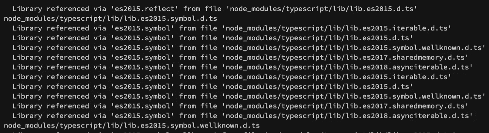

# TypeScript 4.2 有什么新功能？

> 原文：<https://betterprogramming.pub/whats-new-in-typescript-4-2-97f722689c43>

## TypeScript 的又一次惊人的增量升级


由[毗湿奴·R·奈尔](https://unsplash.com/@vishnurnair?utm_source=medium&utm_medium=referral)在 [Unsplash](https://unsplash.com?utm_source=medium&utm_medium=referral) 上拍摄的照片

Typescript 的`4.2`刚刚在 2 月 23 日星期二发布🎉。这个版本带来了哪些令人敬畏的功能？对你作为开发者的日常生活有什么影响？是否应该立即更新？

在这里，我将介绍所有最激动人心的新功能。以下是总结:

*   更智能的类型别名保留
*   元组类型中的前导/中间剩余元素
*   对`in`操作员进行更严格的检查
*   `--noPropertyAccessFromIndexSignature`
*   模板文字表达式具有模板文字类型
*   改进了逻辑表达式中的未调用函数检查
*   更好地理解编译过程
*   支持抽象构造函数类型

要获得最新 Typescript 版本的编辑器，请使用[Visual Studio Code Insiders](https://code.visualstudio.com/insiders/)。你也可以为 VS 代码使用一个插件。

如果你只是想边看文章边玩，你可以使用这里的`Typescript Playground` 。这是一个有趣和超级容易使用的工具。

# 更智能的类型别名保留

有时 TypeScript 不能正确地解析类型。它可能返回正确的类型，但不返回正确的别名。别名可能很重要，不应该在途中丢失。

让我们检查一下这个函数:

注意，一个`undefined`类型需要被添加到方法返回类型中，因为它在某些场景中返回`undefined`。

在`4.2`之前`divisablePer0`类型的返回是`number | bigint | undefined`。那个类型确实是正确的，但是我们丢失了一些信息。别名`BasicPrimitive`在这个过程中丢失了，这是一条有用的信息。

如果我们在 TypeScript `4.2`上做同样的事情，我们会得到正确的别名:

现在方法`divisablePer0`有了正确的返回类型:`BasicPrimitive | undefined`。仅仅通过升级就能让你的代码更具可读性。

# 元组类型中的前导/中间剩余元素

在关于映射类型的文章[中，我们已经看到了类型脚本元组。作为复习，让我们重温一下这个例子:](https://medium.com/better-programming/mastering-typescripts-mapped-types-5fa5700385eb)

但是，我们忘记了检查元组是否可以使用可选元素。让我们看看前面的例子是什么样的:

在`4.2`之前，我们甚至可以使用 spread 运算符来表示元素的动态数量:

在这个新的 TypeScript 中，版本元组变得更加强大。以前，我们可以使用 spread 操作符，但是我们不能定义最后的元素类型。

请注意，类似这样的内容是无效的:

```
let arrayOptions: [string, ...boolean[], number?];
```

可选元素不能跟在 rest 元素后面。然而，请注意，`...boolean[]`确实接受空数组，因此元组将接受`[string, number]`类型。

让我们在下面的例子中详细了解一下:

```
let arrayOptions: [string, ...boolean[], number];
arrayOptions = ['config', 12]; // works
```

# 对 in 运算符进行更严格的检查

`in`操作符很容易知道一个方法或属性是否在一个对象中。然而，在 JavaScript 中，如果对照原语进行检查，它将在运行时失败。

现在，当你尝试这样做的时候:

游乐场链接[此处](https://www.typescriptlang.org/play?noUncheckedIndexedAccess=true&ts=4.2.0-beta&ssl=2&ssc=77&pln=1&pc=1#code/EQWwpgLgFg9gJsABASwHaIEwGYBQB6PRAUQCcSYSAuRAFSjEROQHMoIBaKAQ1TkQGdkcBjABmiHogDkaKYjAAPAA4kw-QTHQgArvwiJUMfQCMGXRCuQhkEZADcwAOhxA)

您将得到一个错误，明确地告诉您发生了什么。由于这个操作符已经变得更加严格，这个版本可能会引入突破性的变化。

# `--noPropertyAccessFromIndexSignature`

另一个总是很有趣的编译器配置。在 TypeScript 中，可以使用带括号的元素语法或像 JavaScript 一样的点语法来访问属性。当键是字符串时，访问器是可能的。

```
interface Person {
  name: string;
}const p: Person = { name: 'Max };console.log(p.name) // Maxconsole.log(p['name']) // Max
```

有一种情况会导致显式属性类型错误:

```
interface Person {
  name: string;
  [key: string]: string;
}const p: Person = { name: 'Max };console.log(p.namme) // undefinedconsole.log(p['namme']) // undefined
```

注意我们是如何访问错误的属性`namme`的，但是因为它符合`[key: string]`隐式属性，所以 TypeScript 不会失败。

启用`--noPropertyAccessFromIndexSignature`将使 TypeScript 在使用点语法时查找`explicit`属性。

它不是`strict`配置的一部分，因为这可能不适合所有的开发者和代码库。

# 模板文字表达式具有模板文字类型

模板文字类型是在`4.1`中引入的，在这里它们变得更加智能。以前，您不能定义类型模板用法模板文字。

核心问题是字符串表达式被解析为类型`string`，这导致了这种类型的不兼容性:

```
const x = `get${propertyName}`; // string
```

然而，使用`4.2`，模板字符串表达式将总是以模板文字类型开始:

```
const x = `get${propertyName}`; // getName
```

# 改进了逻辑表达式中的未调用函数检查

TypeScript 的未调用函数检查适用于`&&`和`||`表达式。在`--strictNullChecks`下，您现在将检查以下错误:

游乐场链接[这里](https://www.typescriptlang.org/play?noUncheckedIndexedAccess=true&ts=4.2.0-beta#code/GYVwdgxgLglg9mABDAzgSTANxlApgEwAowBDAW1wC5EUoAnGMAcwEpEBvAKER8Ttygg6SUhUQBCALyTEAcgBKcAEa46UWQG5OAX06dQkWAkRN+A4uSo16jVh268YwRIVQZsefGy69fiAPT+iACidHRwdIjGADaMuIgAbA5+AUEAKgAWqIgQCPg48EgA7jDR0Ygk0UUkAJ4ofAJCSPQg8SiMEPFQGfEG0IXI9ZXVdYj4uMBx+AB0yX6BiAAiMPiINXAgiBQkzXA5leU4yGC0uCT4APxzvvyCwogABgDquNG5YgAk7KK42g9avl0N0a9weAGUInQamsNhV+IgwHAoMcPAR-jogA)。

更多详情[此处](https://github.com/microsoft/TypeScript/issues/40197)。

# 更好地理解编译过程

有时，确定 Typescript 文件定义是从哪里提取出来的是相当具有挑战性的。有时候是一个试错的过程。

现在可以更深入地了解正在发生的事情，使用下面的代码使编译器更加冗长:

```
tsc --explainFiles
```

让我们看看结果:



这是一个非常棒的特性，它将帮助您进一步理解 Typescript 的内部结构。

# 包扎


照片由[Dawid za wia](https://unsplash.com/@davealmine?utm_source=medium&utm_medium=referral)在 [Unsplash](https://unsplash.com?utm_source=medium&utm_medium=referral) 上拍摄

尽管 TypeScript `4.2`没有像之前的版本一样引入任何主要特性，但它仍然是功能齐全的。

上一个版本我们有模板文字特性。如果你在之前的版本中错过了这个特性，请在我的文章[中查看。在这个版本中，我们看到它变得更加成熟，使用起来更加有趣。](https://medium.com/better-programming/typescript-4-1s-advanced-mapped-types-eba9a2ba7a9)

像更智能的类型保留和改进的非调用函数检查这样的特性将对您的日常编码产生直接影响。它们将使你的代码更具可读性，并让你更好地了解正在发生的事情。

看到更多有助于使代码更严格的特性总是很好的。希望这能帮助你在早期发现错误。

想了解更多关于`4.2`发布的信息，请点击查看他们的官方发布博客[。](https://devblogs.microsoft.com/typescript/announcing-typescript-4-2/)

更多的 TypeScript 内容将很快出现—干杯

# **相关文章**

[](https://medium.com/better-programming/typescript-4-1s-advanced-mapped-types-eba9a2ba7a9) [## TypeScript 4.1 的高级映射类型

### 看看递归条件类型、模板文字类型等等

medium.com](https://medium.com/better-programming/typescript-4-1s-advanced-mapped-types-eba9a2ba7a9) [](https://medium.com/better-programming/simulating-a-typescript-interview-cdaf9d217dff) [## 模拟打字面试

### 知道你的下一次面试是什么样子，从而领先一步

medium.com](https://medium.com/better-programming/simulating-a-typescript-interview-cdaf9d217dff) [](https://medium.com/better-programming/mastering-typescripts-mapped-types-5fa5700385eb) [## 掌握 TypeScript 的映射类型

### 了解如何像专家一样处理 Typescript 映射类型

medium.com](https://medium.com/better-programming/mastering-typescripts-mapped-types-5fa5700385eb)