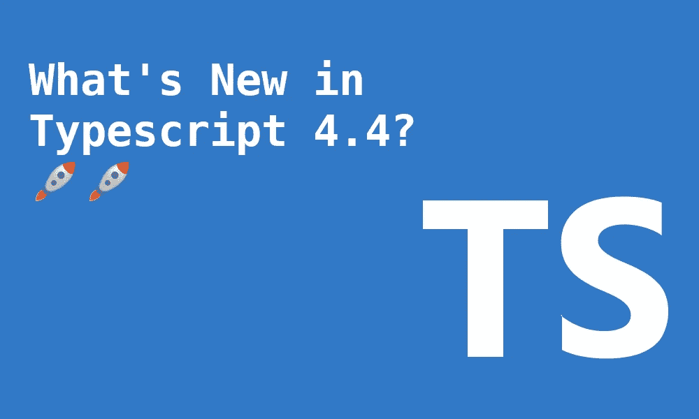

# TypeScript 4.4 有什么新功能？

> 原文：<https://betterprogramming.pub/whats-new-in-typescript-4-4-e17d63b84b86>

## 改进的控制流分析、索引签名等等



打字稿`4.4`于 8 月 26 日发布。我们应该成为早期采用者吗？

毫无疑问，这个版本将主要集中在它的核心和改进一些现有的功能。

在本文中，我将重点介绍最相关的变化:

*   别名条件表达式的控制流分析
*   符号和模板文字字符串的索引签名
*   在 Catch 变量中默认为`unknown`类型
*   精确的可选属性类型
*   性能改进

为了更好地理解，你可以在这里使用 Typescript Playground。

# 别名条件表达式的控制流分析

在深入研究这个新特性之前，让我们先了解一下`control flow analysis`是什么:

> 在计算机科学中，**控制流分析** ( **CFA** )是一种静态代码分析技术，用于确定程序的控制流。控制流被表示为控制流图(CFG)。对于函数式编程语言和面向对象编程语言，术语 CFA 以及诸如 *k* -CFA 之类的详细描述都是指计算控制流的特定算法。—维基百科

在 Typescript 中，CFA 意味着编译器会考虑代码流以更好地理解类型。例如，它会考虑类型 guards 的返回语句来推断变量的类型。

让我们看一个例子:

在上面的例子中，因为`typeof text`是一个类型守卫，所以该范围内的类型将是`string`。因为在类型保护内部有一个`return`语句，所以在`if`范围之外的类型将是`null | undefined`。

那么这个新版本有什么变化呢？长期以来，终审法院取得了最大的进步。

让我们把它分成三个部分:

## **1。类型保护引用保存在常量/只读变量中**

当使用条件断言 if 语句时，Typescript 现在将做一些额外的工作。如果变量是一个`const`或`readonly`变量，它将保留类型保护(如果有的话)。

让我们看一个例子:

如果`isString`变量是一个`let`变量，上面的代码就不起作用。没有保留类型保护，导致代码在`text.trim()`失败

```
// isString is declared as let
let isString = typeof text === "string";// ❌ this statement won't work as a Type Guard
if (isString) {
 ...
}
```

## **2。您可以组合多个变量**

类型保护别名将更加智能，甚至可以理解多个变量的组合。

`bothNonEmpty`常量变量保存两种类型守卫的信息。所以`a`和`b`都属于`if`语句中的`string`类型。

## **3。它是过渡性的**

如果您组合具有相关类型保护的变量，这些变量仍将被传播。这意味着可以根据需要组合任意多的类型保护相关变量，而不会丢失任何类型信息。

我们可以在上面的例子中看到，`bothNonEmpty`属性保留了类型保护信息。

总之，`CFA`已经改进了很多，使得 Typescript 编译器更加智能。最好的部分是这将在 Typescript `4.4`中开箱即用。仅仅这个特性就让整个升级物有所值。

# 符号和模板文字字符串的索引签名

该功能是已经工作了三年的`Generalized index signatures`的超集。那个 PR 可以在这里找到[。](https://github.com/microsoft/TypeScript/pull/26797)

Typescript `4.4`现在支持索引签名中的`symbol`、`unions`和`template literal string`。只要是由`string`、`number`或`symbol`组成的联管节都被支持。

使用`symbol`的示例:

使用`literal template string`的示例:

通过能够使用联合，我们可以减少许多样板文件。我们可以更好地表达我们的接口和类型。

索引签名仍然不完美。它们有局限性。他们仍然不支持`Generic Types`也不支持`Template Literal Types`:

尽管如此，这仍然是一个很棒的特性，它将帮助我们用更少的代码行创建更强大的界面。

# 在 Catch 变量中默认为未知类型

回到 Typescript `3.0`版本，引入了`unknown`类型。在大多数情况下，这是比`any`更好的选择。它更加类型安全，因为`any`好像根本没有类型检查。

随着 Typescript 的发展，我们发现`any`类型的用法越来越少。在`4.4`之前，任何 catch 子句的错误类型都是`any`。

为了改变这一点，在这个版本中，Typescript 添加了一个新的标志`--useUnknownInCatchVariables`。当设置为`true`时，catch 子句错误类型将为`unknown`，否则将为`any`类型。这面旗帜将是`--strict`家族的一部分。

如果您已经启用了推荐的`--strict`，您可能会发现这个新版本打破了您现有的代码库。您可以选择修复它，或者使用标志暂时默认为旧的行为。

让我们看一个简单的例子:

如何使用合适的错误类型？我们可以使用类型保护，如下例所示:

# 精确的可选属性类型

当使用 Typescript 时，有一个反复出现的争论:使属性可选还是使属性`undefined`？这确实取决于个人偏好。

Typescript 编译器以同样的方式处理这两者。这导致了不一致，会让我们困惑。

让我们看一个例子:

为了结束这种不一致性，Typescript 现在包含了一个标志:`--exactOptionalPropertyTypes`。如果启用，当试图将可选值视为可空值时将显示错误，反之亦然。

让我们检查一个将`--exactOptionalPropertyTypes`设置为 true 的代码示例:

如果没有启用该标志，上面的代码将会工作。

默认情况下，`--exactOptionalPropertyTypes`是禁用的，因为它可能会破坏您的代码库。可能需要少量的初始投资，但最终会有回报。

# **最终想法**

这绝对是一个有趣的版本。在性能方面有一些改进:

*   更快的声明发出
*   更快的路径规范化
*   更快的路径映射
*   使用`--strict`加快增量构建
*   更快地生成大输出的源地图
*   更快的`--force`构建

这一次，我认为看不到任何新的闪亮的新功能是好的。相反，Typescript 正在关注和改进其核心级别。在我看来，尝试修复一些已经存在了一段时间的已知问题是有意义的。

唯一的缺点是采用这些新的变化可能会暂时破坏代码库。从长远来看，这样更好，因为我们将有一个更一致的代码。

干杯！

不是中等会员？支持我[成为其中一员。](http://dioxmio.medium.com/membership)

# 有关系的

[](/7-typescript-common-mistakes-to-avoid-581c30e514d6) [## 要避免的 7 个打字稿常见错误

### 通过避免这些错误来改进您的 TypeScript 的代码库

better 编程. pub](/7-typescript-common-mistakes-to-avoid-581c30e514d6) [](/mastering-function-overloading-in-typescript-97108369570a) [## 在 TypeScript 中掌握函数重载

### 使用重载功能创建更全面、更易读的函数类型

better 编程. pub](/mastering-function-overloading-in-typescript-97108369570a)