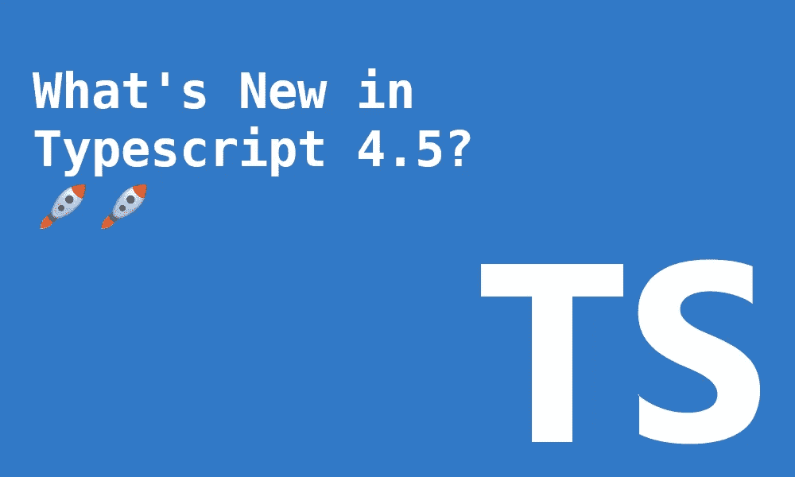
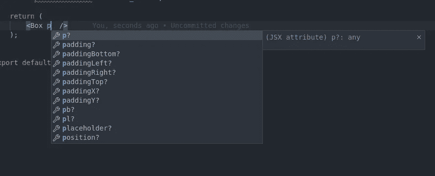

# TypeScript 4.5 有什么新功能？

> 原文：<https://betterprogramming.pub/whats-new-in-typescript-4-5-57d6b88b1e72>

## 等待的实用程序类型、仅类型修饰符、导入断言等等



作者图片

打字稿`4.5`版本于 11 月 17 日发布🎉。很久没有一个 TypeScript 版本被如此打包了。这是一个激动人心的时刻。

这是第一次尝试将 ES 模块引入 NodeJs 世界的实验版本。

这不是唯一受到关注的领域。进口领域有了很多改进。它们将带来更多的可读性，并控制我们如何导入我们的类型和变量。

下面我们来看看这个版本的主要变化。

# 等待的类型

在此版本之前，要获得承诺的返回类型，您必须使用`infer`功能，如下所示:

作为此次发布的一部分，有一个新的实用程序类型`Awaited`。您不需要像上面代码中描述的`Unwarp`那样的自定义映射类型。

它的用法与其他任何实用程序类型一样直观:

```
type Result = **Awaited**<T>;
```

该实用程序具有以下功能:

*   递归展开
*   不依靠`PromiseLike`变得更加强大
*   非承诺“奖品”解析为`never`
*   向`Promise.all`、`Promise.race`、`Promise.allSettled`和`Promise.any`添加过载，以利用`Awaited<T>`

让我们看一些不同的用例示例:

仅限类型的导入说明符

# 禁用导入省略

在编译时，tile TypeScript 检测该模块是否在发出的 Javascript 中使用。如果模块没有被使用或用作类型注释，则该模块不会被导入到发出的代码中。这种省略是一种很好的性能优化。

通常这一切都工作正常。但是在某些情况下，这个特性可能会妨碍我们。什么时候？例如，当使用像 Svelte 这样的框架和它们特定的文件格式时。为此，有一个新的标志`--preserveValueImports`可以使用。

```
Disabling Import Elision<script>
  import { **bookAppointment** } from "./appointment.js";
</script><button on:click={**bookAppointment**}>Book</button>
```

在上面的例子中，TypeScript 将删除`bookAppointment`导入，因为它只“看到”包装在`<script />`标签中的代码。

# 仅限类型的导入说明符

这是我最喜欢的这个版本的功能。从版本`3.8`开始，您可以通过将`type`附加到`import`关键字来显式使用类型导入。这确实告诉 TSC 编译器该导入只包括 TypeScript 类型。TSC 稍后可以对导入进行条带化。

```
import **type** { FC } from 'react';
import { useEffect } from 'react';
```

正如您在上面看到的，问题在于，如果您想要明确您的导入类型，有时您需要导入语句。您仍然可以执行以下操作:

```
import { FC, useEffect } from 'react';
```

但是你牺牲了一点可读性。从版本`4.5`开始，可以把它们混在一起。

```
import { **type** FC, useEffect } from 'react';
```

这使得代码更加清晰，而没有添加任何额外的样板文件。

# 导入断言

这个特性是 ECMAScript 提案`import assertions`的实现。它目前处于 ECMAScript 管道的第 3 阶段。

这是怎么回事？它确保导入具有预期的格式。

```
// ✅ regular importYou might want to
import students from "./students.json" **assert { type: "json" }**;// ✅ dynamic import
const students = await import("./students.json", {
    **assert: { type: "json" }**
})
```

在这种情况下，TypeScript 不会做任何事情。它会不去管它，以便浏览器和运行时可以处理这些问题。

# Node.js 中的实验性 ECMAScript 模块支持

⚠️ A *仅在夜间发布时可用，未来可能会有变化*

Node.js 的模块基础一直是 CommonJS。随着多态应用程序的转变，支持 ECMAScript 模块的呼声越来越高。在过去的几年里，Node.js 一直致力于支持这些。从 Node 12 版本开始，对 ES 模块的支持已广泛提供。

现在有两个新的`module`配置设置:`nodenext`和`node12`。

```
{
  "compilerOptions": {
    **"module": "nodenext"**
  }
}
```

## package.json 中的“类型”属性

`"type"`字段定义了模块格式，该节点将用于所有的`.js`文件，对于这些文件来说`package.json`文件是其最近的父文件。您可以选择`module`用于 ES 模块或`commonjs`用于传统的 CommonJS 模块。

TypeScript 将通过它的`.ts`文件包含相同的系统行为。当 TypeScript 找到一个`.ts/.tsx/.js/.jsx`时，它会查看最近的`package.json`文件来确定它的模块风格。

## 定制文件模块系统

单个文件如何确定自己的模块系统？只要改变它的文件扩展名。

*   `.cjs/.cjx`:不管最近的父`"type"`配置如何，文件将以 CommonJS 格式导入。
*   `.cts/.ctx/.d.cts`:不管父`"type"`规格如何，文件将以 CommonJS 格式导入。当发送文件时，它将输出其对应的`.` et，看看我们现在可以使用什么扩展名:`mjs`、`.mjx`或带有`.d.cts` 扩展名的声明。
*   `.mjs/.mts/.mtx/d.mts`:文件将以 ECMAScript 模块格式导入，不考虑父`"type"`规范。发出文件时会输出对应的`.mjs`、`.mjx`或扩展名为`.d.mts`的声明。

## 互用性

现在你可以通过调整文件系统来导入不同的模块类型，它们需要协同工作。ES 模块很简单，因为它只是一个翻译的问题。对于要导入 CommonJS 的 ES 模块，它会将它们视为默认导出。

让我们来看看这个例子:

## ES 模块的要点

es 模块带来了哪些特性？需要注意什么？让我们来看一个摘要列表:

*   *功能:*使用`import/export`语句语法
*   *特性:*顶层等待可与`nodenext`一起使用
*   *注意:*因为现在有不同的模块策略 es 模块相对进口需要完整的文件扩展名:`import fade from ./utils**.js**`
*   *互操作:*一些像`require`这样的全局关键字在 ES 模块上不起作用
*   *互操作:* CommonJS 将传输类似`import/export`语法的特性

# 在 node_modules 中解析@typescript[lib]

TypeScript 捆绑了某些库，以确保它能与 Javascript 很好地协同工作。但是，您可能希望将它们更改为另一种类型的库实现。

*   `lib.dom.d.ts`->-`@typescript/dom`
*   `lib.dom.iterable.d.ts`->-`@typescript/dom/iterable`
*   `lib.es2015.symbol.wellknown.d.ts`->-`@typescript/es2015/symbol-wellknown`

我们来做一个例子。让我们选择不同版本的`@typescript/dom`。现在，您只需执行以下操作即可实现这一点:

```
{
  "dependencies": {
    **"@typescript/lib-dom": "npm:@types/web"**
  }
}
```

这与`@types`的行为类似，现在您可以选择合适的类型定义。

# 模块 es2022

TypeScript 现在支持新的模块设置:`es2022`。它最显著的特点是`top-level await`那个。这使得我们能够在顶层模块中使用`async`函数之外的`await`。

它是用`nodenext`支撑的，`es2022`只是一个稳定的目标。

# JSX 属性的代码片段完成

使用 JSX 语法编写组件时，Typescript 不执行自动完成。有了代码片段补全，这个问题就解决了。在 React 应用程序中编写组件时，您将获得自动完成功能。



自动完成的示例

# 模板字符串类型作为判别式

模板文字类型是一个自发布以来一直在不断完善的特性。作为这个新版本的一部分，我们现在可以使用模板字符串类型作为判别器。在以前的版本中，代码可以工作，但是什么也不会发生。

# 包裹

尽管在 Node.js 中为支持 ES 模块付出了巨大的努力，但还是觉得有点仓促。这个功能还需要一些改进。随着实验性的发布，TypeScript 团队将有机会收集早期的反馈。这可能会在下一个版本中正式推出。

很高兴看到模板字符串类型仍在变得越来越好。导入名称上的类型修饰符非常有用。为类型添加特定的导入太冗长了。

升级一个应该是相当容易的。截至 11 月 6 日，没有太多重大变化。

干杯。如果你喜欢你所读到的，看看下面这个故事:

[](/mastering-typescript-template-literal-types-f4131a94ffb1) [## 掌握 TypeScript 模板文本类型

### 如何使用 awesome 模板文字类型特性

better 编程. pub](/mastering-typescript-template-literal-types-f4131a94ffb1) [](/7-typescript-common-mistakes-to-avoid-581c30e514d6) [## 要避免的 7 个打字稿常见错误

### 通过避免这些错误来改进您的 TypeScript 的代码库

better 编程. pub](/7-typescript-common-mistakes-to-avoid-581c30e514d6)