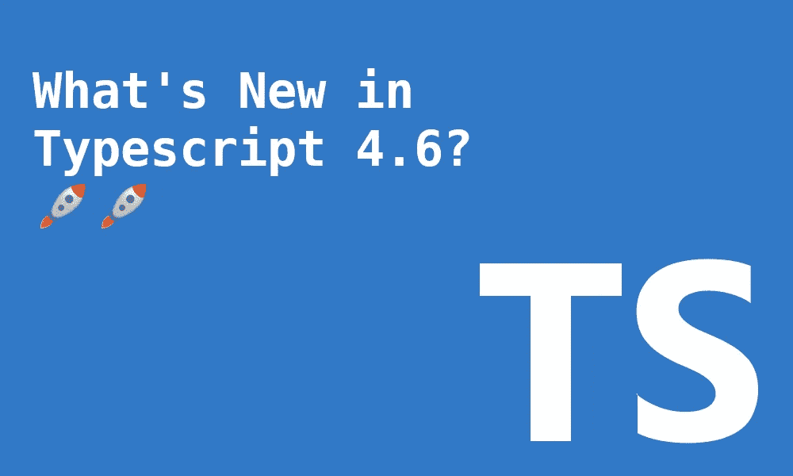

# TypeScript 4.6 有什么新功能？

> 原文：<https://betterprogramming.pub/whats-new-in-typescript-4-6-5e87cb34cb32>

## 构造函数修复、进一步的 JavaScripts 检查等等



作者图片

打字稿`4.6`版本计划于 2 月 22 日发布。28 号终于发货了🎉🎉🎉。遗憾的是，它没有第一次那么激动人心。老实说，它把标准定得有点高。它包含了等待类型、仅类型导入说明符等特性。

尽管如此，这个 TypeScript 版本仍然令人兴奋。它有一些有用的核心修正。在幕后，TypeScript 团队正在进一步为 NodeJs 集成 ES 模块。

和往常一样，您可以在这里使用 TypeScript Playground [跟随任何示例。](https://www.typescriptlang.org/play?)

# 允许在构造函数中的 Super 之前有代码

在 JavaScript 中，我们不允许在构造函数中的任何`super()`调用之前使用`this`引用。这是因为对象尚未创建。

让我们看一个例子:

然而，您可以执行代码，只要它与`this`引用无关。

Typescript 总是更具限制性。这使得 JavaScript 规则更加严格。它强制`super()`处于构造器的顶层。

如果我们将上面的 JavaScript 示例移植到 TypeScript，我们会得到以下错误:

```
A **'super'** call must be the first statement in the constructor when a class contains initialized properties, parameter properties, or private identifiers.
```

三年多前，一个与 JavaScript 平起平坐的 PR 诞生了。它最近被合并了，现在顶级`super()`的限制已经没有了。

最后，现在这段代码不会给出任何编译错误:

关于合并后 [PR](https://github.com/microsoft/TypeScript/pull/29374) 的原始代码建议

这个公关活得太久了，甚至有了自己的蛋糕🤣：


在 [PR](https://github.com/microsoft/TypeScript/pull/29374) 中发布的图像

# 相关参数的控制流分析

TypeScript 中有一个很酷的特性，您可以在其中表达方法的相关参数的组合。你可以告诉编译器，你想要一个函数参数不同组合的数组。

例如，让我们定义一个方法，如果第一个参数是一个`string`，第二个应该是一个`number`，反之亦然。

唯一的问题是我们必须手动检查`a`和`b`的类型。只有函数的调用在断言约束。

在这个新版本中，我们可以使用联合鉴别器来帮助我们鉴别`b`的类型，因为`a`是一个鉴别器(字符串或枚举),并且我们知道它的值。

让我们看一个例子:

请注意，上述内容不适用于非歧视性工会。

# 索引访问推理改进

如果我们想在 TypeScript 中表达类似下面的代码，我们会发现一个错误。

乍一看，这似乎是正确的，发生了什么事？TypeScript 正在使函数`(v) => void`的`v`成为类型`string & number & boolean`的交集。因为它们之间没有交集，所以会产生`never`类型。

这个问题可以通过使用映射类型来解决:

然而，在 TypeScript `4.6`之前，下面的调用不会失败。

`kind`值没有起到鉴别器的作用。这将使`v.toUpperCase()`编译产生错误。编译器不会知道`v`是一个字符串。

现在它工作了，索引访问类型应用于映射类型的问题已经被修复。前面的代码将编译无误。

# 目标 es2022

`target`设置改变哪些 JS 特性被传输，哪些保持原样。在此版本中，包含了对`--target es2022`的支持。

最新的模块`es2022`支持是在以前的 TypeScript 版本中引入的。这使我们能够使用像`top-level await`这样的功能。

这个`--target es2022`将作为`Typescript 4.5`版本的一部分发布，但是不幸的是，一些小问题推迟了它的发布。

# JavaScript 中的其他语法和绑定错误

TypeScript 编译器可以接受 TypeScript 和 JavaScript 文件作为输入。它可以被配置为甚至在那些 JavaScript 文件中查找错误。这将阻止我们在运行时发现这些错误。

选择加入此行为的配置是:

```
// tsconfig.json
{
  ...
  **"allowJs": true,**
  **"checkJs": true,**
  ...
}
```

如果我们不想在全局范围内启用这些功能，我们可以在每个文件的基础上执行一些调整:

*   `// @ts-check`在 JavaScript 文件的顶部:将检查该文件的类型错误。
*   `// @ts-nocheck`在文件顶部:将防止任何打字稿错误。尽管它是用 JavaScript 构建的，但它也禁止对文件进行类型检查。这是为了确保更容易的迁移。

那么这个版本有什么变化呢？Typescript 团队继续通过添加新的错误来进一步改进这一功能。

例如，它现在可以捕捉重新声明的变量:

将 Visual Studio 代码与最新的 TypeScript 版本一起使用时，也会显示这些错误。

# 包裹

这个版本的目的是进一步强化一些类型脚本行为。它没有其他产品那么耀眼，但它仍然在代码库和新特性上有所改进。

许多工作都是由后台的 NodeJS 集成完成的。NodeJS 对 ES 模块的支持越来越好。它是在以前的 TypeScript 4.5 版本的实验标志下引入的。希望它很快变得稳定。

干杯。

[](/top-5-typescript-features-you-should-master-2358db9ab3d5) [## 您应该掌握的五大打字稿功能

### 使用这些必须知道的特性来提高您的打字稿知识

better 编程. pub](/top-5-typescript-features-you-should-master-2358db9ab3d5) [](/5-awesome-http-headers-web-developers-should-master-332a1a332084) [## Web 开发人员应该掌握的 5 个非常棒的 HTTP 头

### 以更简洁的方式提高页面安全性和性能

better 编程. pub](/5-awesome-http-headers-web-developers-should-master-332a1a332084)