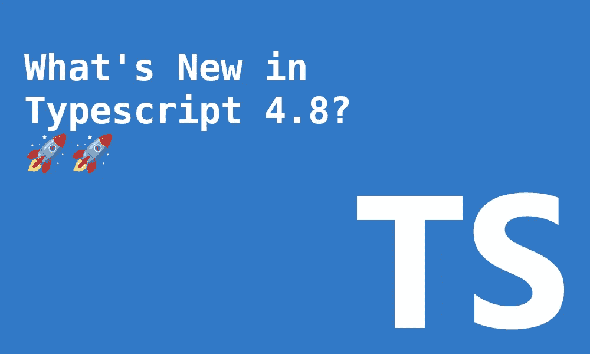

# TypeScript 4.8 有什么新功能？

> 原文：<https://betterprogramming.pub/whats-new-in-typescript-4-8-c4c4e59894c3>

## 构建改进，对模板字符串类型的更好推断，等等

作者图片

打字稿`4.8`版本计划在 8 月 23 日发布🎉。这一次我们不会看到令人兴奋的发布。尤其是如果我们将其与`4.7.`进行比较的话。它更侧重于改进一些现有的功能和提高其构建时间。

在本文中，我将重点介绍最相关的新特性。以下是摘要:

*   改进交集减少和 CFA，以实现真实性、相等性和检查类型。
*   改进了模板字符串类型中`infer`类型的推断
*   构建改进
*   与对象/数组文字进行比较时出现支持错误。

和往常一样，您可以通过使用 TypeScript web playground [这里的](https://www.typescriptlang.org/play/)来跟进这个例子。

# 改进交集减少和 CFA，以实现真实性、相等性和检查类型。

使用`--strictNulChecks`时引入了一些变化，这将带来更多的一致性。其中许多都围绕着无约束类型变量。

空对象`{}`现在是除了`null`和`undefined`之外的所有类型的超类型。这意味着`unknown`可以表示为`{} | null | undefined`。

结果，我们现在得到了更准确的打字。让我们看看下面的例子:

当`4.8`开启时，有一个错误信号提示`T`可能是`null`或`undefined`。同样的代码在`4.7`和更低版本上也能很好地编译。

对于任意非空且非未定义的`T`，其与`{}`的交集将被视为`T`。

让我们看一些其他的实际例子:

注意`T4, T6`在`TS 4.7`和`TS 4.8`之间没有改变，因为`{}`已经是这些类型的超集。`T8`和`T9`保持不变，因为它们从未与`{}`型相交。

`NonNullable`映射类型已被简化。

因为现在`{}`是不可空类型的超集，它的截取意味着如果它不同于`never`它就不可空。正如我们在上面看到的，任何不可空的与`{}`的交集都会返回相同的类型。

你现在可以做哪些很酷的事情？可以缩小`unknown`类型。

让我们看看`4.7`之前的现状。您永远无法将`unknown`类型进一步缩小到一个不可为空的值。它将总是循环回到`unknown`。为什么？因为`{}`不是所有不可空的超集:

从`4.8`我们可以:

点击查看 PR [了解更多信息。](https://github.com/microsoft/TypeScript/pull/49119)

# 改进了模板字符串类型中`infer`类型的推理

`Template String Types`是最新的特性之一，它倾向于在每个 TypeScript 版本中得到更新。

作为复习，我们可以使用带有占位符值的`Template String Types`。

当没有显式类型注释时，`inference`用于提供类型信息。让我们先来看一个基本的例子:

以上是伟大的，但是，我们可以做一个更有力的推论。`infer`关键字让我们在条件类型的条件中运行推理。

我们可以重写上面的例子，根据给定的先决条件有条件地运行`infer`。

上述代码在模板字符串类型中很有用，因为它们可能由不同的类型组成。`Is<Infer..>`有条件地区别于那些。这种复杂逻辑的结果将在此版本中得到解决。让我们来看看不同之处:

在上面的例子中，`100`作为类型比`number`更准确。

点击查看 PR [了解更多信息。](https://github.com/microsoft/TypeScript/pull/48094)

# 构建改进

众所周知，TypeScript 的一个致命弱点一直是它的性能和构建时间。围绕`--build`、`--watch`、`-incremental`做了一堆优化。简而言之，这一切都围绕着不重新计算被缓存的`timestamps`。

那些变化有多大？最低的改善情景意味着`10%`下降，而最佳情景意味着`40%`。这些数字可以在[这里](https://github.com/microsoft/TypeScript/pull/48784)看到，是检查 1994 年大型项目的结果。

点击查看 PR [了解更多信息。](https://github.com/microsoft/TypeScript/pull/48784)

# 与对象/数组文字进行比较时出现支持错误。

这是一个很好的增强，可以在早期发现错误。在 TypeScript 中，您可以使用`==`或`===`操作符进行比较。当使用对象时，它将检查它们是否都指向同一个引用。不会比较它们的价值。

作为此版本的一部分，TypeScript 将为我们排除这些场景:

如果你懂这门语言，你就不太可能犯这个错误。然而，这将有助于学习 JavaScript 的复杂性。

点击查看 PR [了解更多信息。](https://github.com/microsoft/TypeScript/pull/45978)

# 包裹

就是这样。我们有一个可靠的版本，可以帮助很多小地方。当我们看到一些核心问题得到解决时，这是令人敬畏的。这意味着在添加更多特性之前，语言变得越来越坚实。

如果你需要更多的细节，请点击这里查看 TypeScript 4.8 发布计划[。](https://github.com/microsoft/TypeScript/issues/49074)

构建时间的改进应该足以让每个人都非常兴奋，并立即安装这个新版本。

干杯

# 有关系的

 [## 5 个类型脚本库来改进您的代码库

### 增加你对静态打字的信心

better 编程. pub](/5-typescript-libraries-to-improve-your-codebase-d26f74a5c3)  [## ES2022 有什么新功能？4 个最新的 JavaScript 特性

### 新 ES13 规格概述

better 编程. pub](/es2022-features-javascript-a9f8f5dcba5a)