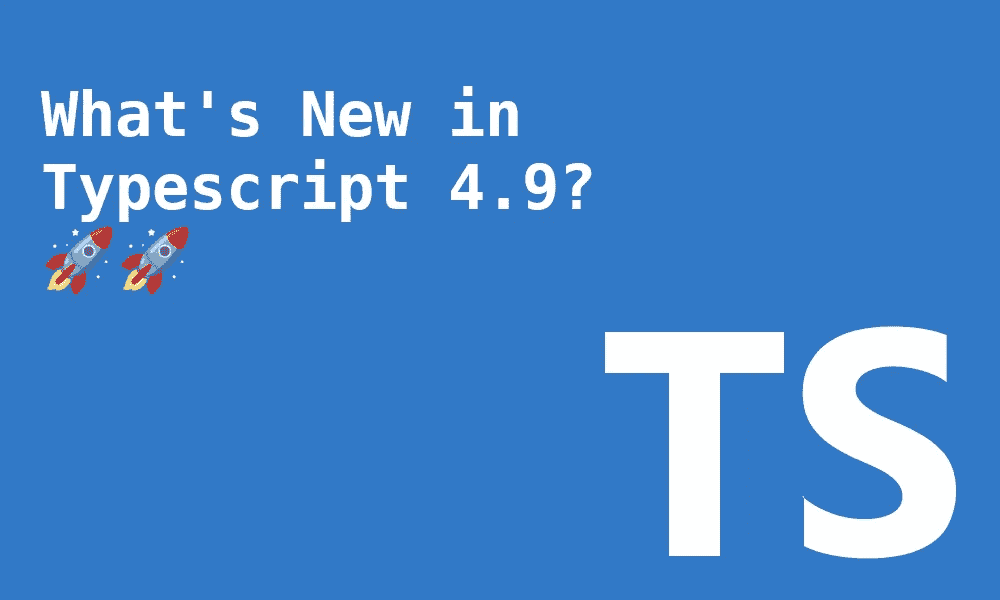

# TypeScript 4.9 有什么新功能？

> 原文：<https://betterprogramming.pub/whats-new-in-typescript-4-9-6bce2387aa31>

## 满足运算符、自动访问器字段等



作者捕获

打字稿`4.9`版本计划于 11 月 15 日发布🎉。这将是 2022 年的最后一次。对于 TypeScript 来说，这是很棒的一年。

在本文中，我将重点介绍最相关的新特性。以下是摘要:

*   满足运算符
*   支持自动访问器字段
*   改进对`in`操作器的检查
*   不允许与`NaN`进行比较

像往常一样，您可以通过使用这里的 TypeScript playground】来遵循任何示例。最好的学习方法总是互动地进行。

## 满足运算符

当输入一个变量时，我们必须决定是手动定义它的类型还是依靠推理。不可能两者兼而有之。

假设我们想声明一个变量，它的键可以是任何值，但我们希望值是一个数字。

如果我们仅仅依靠推理，除了交换之外，我们什么也不能实施，我们知道密钥是`a | b | c`

```
// relying on inference to do the typing for us
const foo = {
    a: 255,
    b: 255,
    c: 255
};

// typeof foo is 
// const foo: {
//    a: number;
//    b: number;
//    c: number;
// }
```

让我们尝试将键值强制为一个数字:

```
const foo: Record<string, number> = {
    a: 255,
    b: 255,
    c: 255
};

// typeof foo is 
// const foo: Record<string, number>
```

它的工作，但是，我们失去了键的类型信息被`a | b | c`。我们可以通过提供映射键来轻松解决这个问题:

```
type Keys = 'a' | 'b' | 'c';
const foo: Record<Keys, number> = {
    a: 255,
    b: 255,
    c: 255
};

// typeof foo is 
// const foo: Record<Keys, number>
```

以上是好的，但是有一个权衡。如果我们需要另一个键，我们必须将它添加到`Keys`类型和`foo`变量中。

所以没有好的方法来表达对类型的限制而不改变它。直到现在。使用新的`satisfies`操作符，我们可以在不改变变量推断类型的情况下实施类型限制。

```
const foo = {
    a: 255,
    b: 255,
    c: 255,
    // ❌ We get the error Type 'string' is not assignable to type 'number'
    d: 'bar'
} satisfies Record<string, number>;

// ✅ We are not losing any type inferance information
// typeof foo is 
// const foo: {
//    a: number;
//    b: number;
//    c: number;
//    d: string;
// }
```

在上面的代码中，我们可以看到它的好处。我们能够强制对象`foo`键总是属于`number`类型。我们仍然可以保留关于对象的推理信息。

过剩的房产怎么办？会失败还是会通过？关于这一点一直有争论。这有点棘手，因为你可以提出支持或反对的有力论据。

最后的决定似乎是，多余的属性将被禁止，导致编译时出错。

```
type Point = {
    x: number,
    y: number
};

const origin = {
    x: 0,
    y: 0,
    // ❌ Type '{ x: number; y: number; z: number; }' does not satisfy
    // the expected type 'Point'
    z: 0
} satisfies Point;
```

这个特性可能会在未来发展，也许会让`satisfies`操作符用于函数声明成为可能。

如果你想了解更多的细节或背景，你可以在这里看看最初的提议[。](https://github.com/microsoft/TypeScript/issues/47920)

# 支持自动访问器字段

ECMAScript decorators 提案已经在`Stage 3`(这里的[链接](https://github.com/tc39/proposal-decorators))中。这个特性将启用属性自动访问器构造。

```
class C {
  accessor x = 1;
}
```

作为这个版本的一部分，`accessor`字段声明已经可以在 TypeScript 中使用。它在幕后使用装饰者的功能。

让我们看看如何使用它

```
class Foo {
    accessor a: string = 'a';
}

const instance = new Foo();

// ✅ it works and prints 'a' 
console.log(instance.a);
```

请注意我们如何访问`a`属性，而不需要任何额外的样板文件。根据选择的`target`输出，`JavaScript`输出可能会有所不同。如果我们使用最新的`Es2022`，输出将依赖于去年发布的 JavaScript 私有变量。

让我们看看`tsconfig`目标设置为`Es2022`时的`js`输出代码:

```
"use strict";
class Foo {
    constructor() {
        this.#a_accessor_storage = 'a';
    }
    #a_accessor_storage;
    get a() { return this.#a_accessor_storage; }
    set a(value) { this.#a_accessor_storage = value; }
}

const instance = new Foo();
// ✅ it works and prints 'a' 
console.log(instance.a);
```

这个特征并没有就此结束。我们仍然可以使`accessors`私有，以限制对类实例内部的访问，或者使`static`可用，而不需要有一个实例。

让我们看一个这两种用法的例子:

```
class Foo {
    accessor a: string = 'a';
    accessor #b: string = 'b';
    static accessor c: string = 'c';

    log() {
        // ✅ it works and prints 'b'
        console.log(this.#b)
    }
}

const instance = new Foo();

// ❌ does not work since property is private
console.log(instance.#b);

// ✅ it works and prints 'c' 
console.log(Foo.c);
```

# 改进对`in`操作器的检查

TypeScript `in`是一个很好的方法，可以正确检查可能只存在于联合中的一个对象中的内容。

让我们看一个例子:

```
type Car = {
  wheels: number;
  topSpeed: number;
}

type Plane = {
  topSpeed: number;
}

function log(vehicle: Car | Plane) {
  if ('wheels' in vehicle) {
    // ✅ vehicle.wheels is of type string
    console.log(`vehicle has ${vehicle.wheels} wheels`)
  }
  console.log(`vehicle top topSpeed is ${vehicle.topSpeed} km/h`)
}
```

当类型未知时会发生什么？在键入脚本`4.9`之前，不可能对其进行类型检查。我们会得到一个打字错误。

现在，我们可以结合使用`in`操作符和`typeof`来缩小类型。如果`typeof`不存在，它将被输入为`unknown`。

带有`typeof`的示例:

```
function log(vehicle: {}) {
  // ✅ Works, item.wheels is now of type number
  if ('wheels' in vehicle && typeof vehicle.wheels === "number") {
    console.log(`the entity has ${vehicle.wheels} wheels`)
  }
}

log({ wheels : 4, topSpeed: 20, })
```

不带`typeof`的示例:

```
function log(vehicle: {}) {
  // ✅ Works, item.wheels is now of type unknown
  if ('wheels' in vehicle) {
    console.log(`the entity has ${vehicle.wheels} wheels`)
  }
}

log({ wheels : 4, topSpeed: 20, })
```

对`in`操作符的另一个改变是`key in obj`的键现在被约束到了`string | number | symbol`。以前，允许`key`为无约束类型的参数类型。

# 不允许与`NaN`进行比较

浮点运算标准是浮点运算的技术标准。它对于所有使用浮点的语言都是同等实现的。

`IEEE 754`规范声明`NaN`值永远不相等。

```
NaN === NaN // false
NaN !== NaN // false
```

那我们怎么能恰当地比较这些呢？在 JavaScript 中，我们可以使用`Number.isNaN`实用函数。

```
Number.isNaN(NaN) // true
Number.isNaN(0) // false
```

作为 TypeScript `4.9`版本的一部分，编译器在比较`NaN`值时会给出一个错误。

```
function logValue(value: Number | NaN) {
  // ❌ Error: This condition will always return 'true'
  // Did you mean '!Number.isNaN(value)'
  if (value !== NaN) { 
    console.log('It is NaN');
  }
  console.log(value);
}
```

这个方便的错误将节省大量的调试时间，尤其是对初学者来说。

# 包裹

总的来说，这是一次伟大的发布。我看到自己在相当多的场景中使用`satisfies`操作符。我相信它会很快流行起来。只有这个功能值得升级。

像现在变得常见的那样，还有一些性能改进。

我没有讲太多细节，但你可以在这里找到更多信息:

*   *优化#1:* 交换`forEachChild`使用一个函数表，而不是这里的`switch`语句。
*   *优化#2:* 在此添加一个`visitEachChild` [的跳转表。](https://github.com/microsoft/TypeScript/pull/50266)
*   *优化#3:* 优化替换类型[此处](https://github.com/microsoft/TypeScript/pull/50397)。