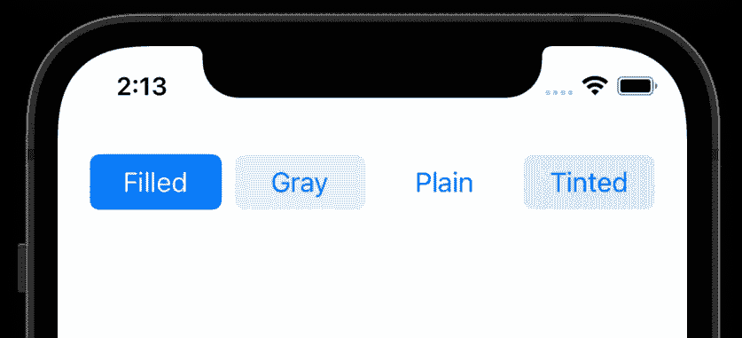
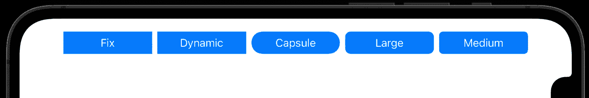
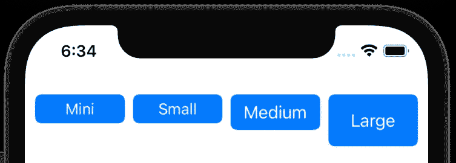
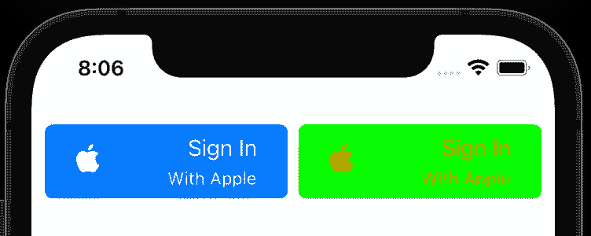
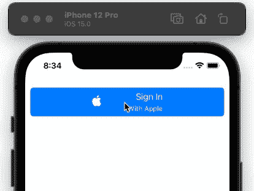

# iOS 15 的 UIButton 有什么新功能？

> 原文：<https://betterprogramming.pub/whats-new-in-uibutton-for-ios-15-eba1ce9ad899>

## UIKit 的按钮类型系统获得了更多的定制样式和一个新的配置处理器


照片由[德鲁·帕特里克·米勒](https://unsplash.com/@drewpatrickmiller?utm_source=medium&utm_medium=referral)在 [Unsplash](https://unsplash.com?utm_source=medium&utm_medium=referral) 上拍摄

SwiftUI 可能会再次成为 WWDC 2021 事件的话题，但 UIKit 的故事还没有结束。事实上，今天大多数 SwiftUI 代码库都以某种形式依赖于 UIKit。可以理解的是，今年我们在 UIKit 框架中加入了很多有趣的东西。其中`UIButton`的变化最为显著。

`UIButton` API 从一开始就差不多一样，在过去几年里只有一些有趣的更新——比如 iOS 14 引入了一个新的`UIAction`作为设置控件的目标动作的[替代](/goodbye-target-actions-hello-uiactions-a60e1e2052d5)。

随着 iOS 15 的发布，UIKit 的按钮系统无疑获得了十年来最大的更新。我们现在有了更多的样式，全新的按钮配置样式，多行文本支持，等等。

让我们浏览一下主要的更新，看看如何实现它们。

# 新的配置样式

直到去年，UIKit 的按钮式系统还有点拘束。iOS 开发者通常会使用默认的`system`类型，或者自己创建自定义类型。

随着新[配置](https://developer.apple.com/documentation/uikit/uibutton/configuration?changes=_4) API 的引入，我们有了一组预定义的风格可供选择:

```
UIButton.Configuration.filled()
UIButton.Configuration.gray()
UIButton.Configuration.plain()
UIButton.Configuration.tinted()
```

这里先来看一下四种配置风格:



作者截图

通过设置`UIButton`上的`configuration`实例属性，可以分配上述样式。

```
let button = UIButton(type: .system)
button.configuration = UIButton.Configuration.filled()
```

# 设置形状和大小的预定义值

新的配置 API 不仅增加了按钮样式，还提供了一系列其他定制选项，从标题、副标题、图像和背景外观到设置预定义的形状和大小。

我们来看看`UIButton` iOS 15 中如何配置形状和大小。

## 形状

我们可以直接在配置样式上设置圆角半径，如下所示:

```
var config = UIButton.Configuration.filled()
config.background.cornerRadius = 0
```

现在我们又有了一个新的`UIButton.Configuration.CornerStyle`来设置预定义的角样式，像`capsule`、`dynamic`、`fixed`、`small`、`medium`、`large`:

```
config.cornerStyle = UIButton.Configuration.CornerStyle.capsule
```

值得注意的是，除了`fixed`和`dynamic`，所有其他样式都忽略了`cornerRadius`值。例如，在下图中，我们将每个按钮的圆角半径设置为 0。查看`capsule`、`large`、`medium`如何用其预定义的圆角半径覆盖它。



作者图片

## 大小

像转角样式一样，我们也有一系列预定义的尺寸:

```
UIButton.Configuration.Size.mini
UIButton.Configuration.Size.small
UIButton.Configuration.Size.medium
UIButton.Configuration.Size.large
```

要在`UIButton`上设置大小，调用配置实例上的`buttonSize`属性。

```
config.buttonSize = .medium
```



作者截图

注:iOS 15 还为`UIButton`引入了一个新的`behaviorStyle`属性。它让您控制按钮控件的外观和行为。可以设置为`mac`或`pad`或`automatic`(默认)。

# 自定义文本、图像内容和外观

`UIButton`还接收了十几个定制内容的增强功能。默认情况下，`title`下会显示一个`subtitle`属性。我们还使用配置中的`image`属性在`UIButton`中插入一个`UIImage`。

下面这段代码对一些按钮属性进行了样式化，以组合成一个自定义按钮:

```
var config = UIButton.Configuration.filled()config.title = "Sign In"
config.image = UIImage(systemName: "applelogo")
config.imagePadding = 50
config.titlePadding = 5
config.subtitle = "With Apple"
config.titleAlignment = .trailing
```

*   `titleAlignment`属性用于相对于副标题定位标题。
*   `textPadding`用于设定`title`和`subtitle`之间的间距。
*   还有一个`imagePlacement`属性来设置图像相对于标题的位置。

除了内容外观之外，新的配置系统允许我们以不同的方式定制按钮颜色。`baseBackgroundColor`和`baseForegroundColor`属性允许您分别设置背景和内容颜色。

以下是两种自定义按钮配置外观:



右边的按钮包含背景和内容颜色属性

作为`UIButton.Configuration`的一部分，我们还获得了一个新的`showsActivityIndicator`属性。它让您显示一个不确定的进度指示器来代替按钮。这在处理点击状态变化时很有帮助——这将我们带到最后一节。

# 按钮状态更改的配置处理程序

在 UIKit 的`UIButton`系统中，我最喜欢的改进之一是包含了一个集中式闭包来处理按钮状态随时间的变化:`configurationUpdateHandler`。

在我们之前的按钮配置上应用它会产生以下结果:



作者截屏

要以编程方式触发`configurationUpdateHandler`，请调用`setNeedsUpdateConfiguration()`函数。

我们还获得了一个`imageColorTransformer`属性来转换按钮状态变化时的图像。

# 结论

`UIButton`是 UIKit 系统中最古老的控制类型。很高兴看到今年它的 API 有了重大改进。

iOS 15 引入的新框架`[CoreLocationUI](https://developer.apple.com/documentation/corelocationui/cllocationbutton?changes=latest_minor)`也公开了一个标准化按钮`CLLocationButton`，用于处理位置授权。

除了 UIKit，SwiftUI 的按钮系统也有了类似的变化。要了解更多信息，请查看 [Mohammad Azam](https://medium.com/u/2300266301b3?source=post_page-----eba1ce9ad899--------------------------------) 的文章，这篇文章深入探讨了 iOS 15swift ui 中的[定制按钮。](/customizing-buttons-in-swiftui-ios-15-97a02394417c)