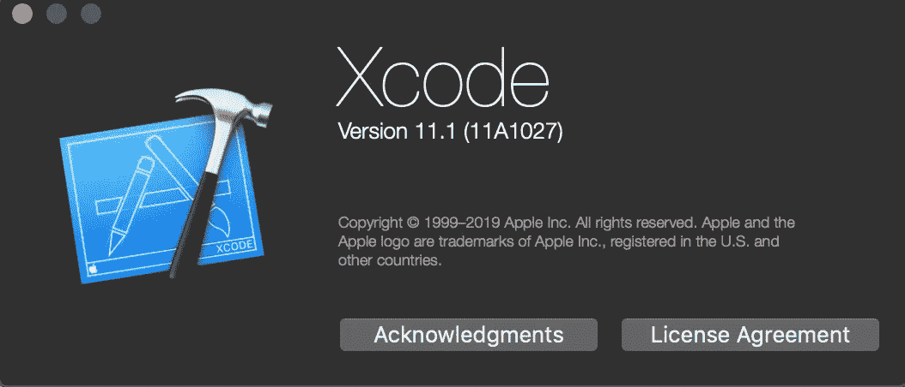
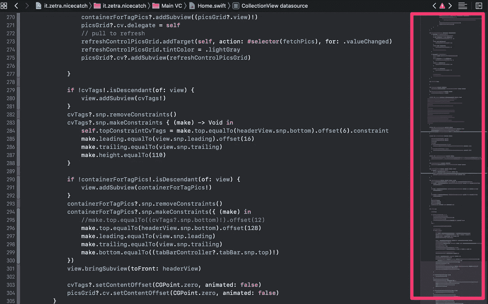
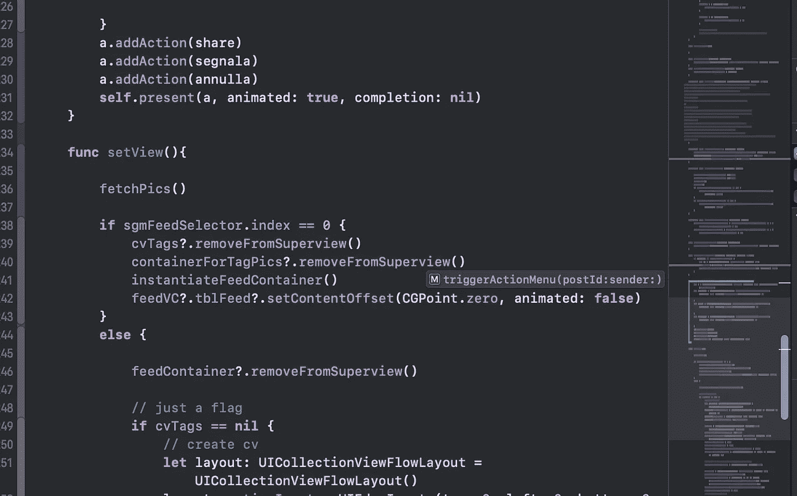
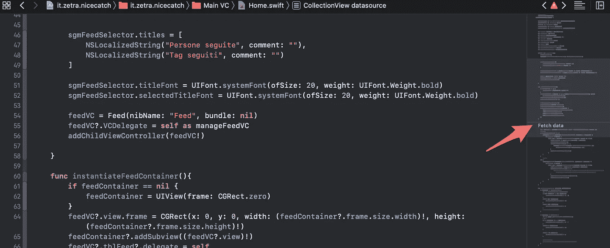
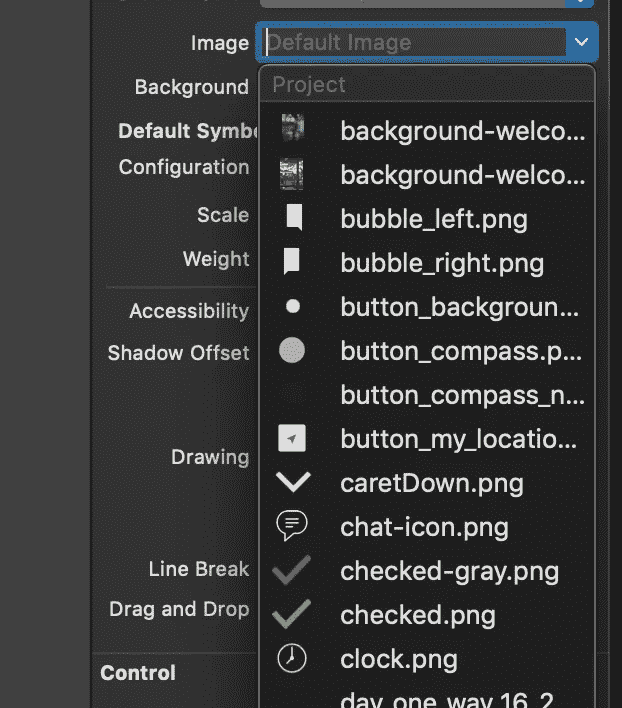
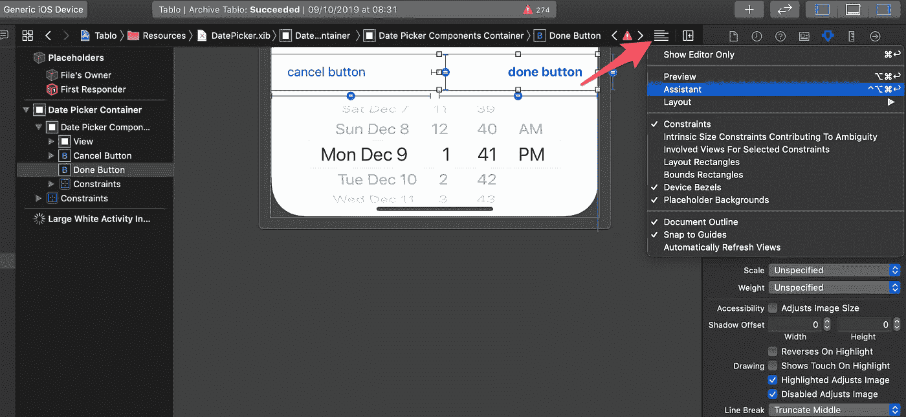

# Xcode 11 的新功能

> 原文：<https://betterprogramming.pub/whats-new-in-xcode-11-6680823e87a6>

## 新版本中的所有关键功能



苹果终于发布了面向 iOS、MacOS 和 iPadOS 开发者的全新 IDE:[Xcode 11](https://developer.apple.com/documentation/xcode_release_notes/xcode_11_release_notes)。不得不承认，看起来还不错，比以前更像一个稳定的开发环境。如果你已经做了一段时间的开发人员，你肯定知道过去非常好的版本都遭受了崩溃、糟糕的支持、糟糕的文档参考、代码搭建和完成。模拟器本身在某些场合表现非常糟糕。XCode 11 是一个很棒的版本，但由于新的 SDK 和对 [SwiftUI](https://developer.apple.com/documentation/xcode_release_notes/xcode_11_release_notes) 的支持，它遇到了一些编译问题和奇怪的行为。

# 功能

## 欢迎来到黑暗面

新的 Xcode 配备了一个新的黑色界面，遵循最新的趋势，以及与新的 [Catalina](https://www.apple.com/macos/catalina/) MacOS 的外观和感觉集成，默认情况下是黑色的。过去，我一直是浅色界面的粉丝，但最近我开始更喜欢深色的 UI。深色用户界面最初是为了优化移动设备的电池寿命而推出的，所以它看起来像是我们在桌面上并不真正需要的东西。但是它就在那里，如果你喜欢它，你可以留着它。就我个人而言，我喜欢新的代码外观、字体和颜色，所以我没有改变默认设置。

## 更好更快地导航代码

最后，Xcode 引入了对上下移动数千行代码的良好支持。这一直是 Xcode 的问题，我也一直想要这个功能。现在，从一个文件跳到另一个文件，从一个标记(怀旧的#pragma 标记)跳到另一个标记变得更加容易，这要归功于现在具有快速链接和改进的滚动功能的侧边栏。臭名昭著的，有时很慢的“跳转到定义”功能已经得到改善。苹果承诺通过在编译代码中比源代码中更多地引用代码段来增强这一功能。我发现它稍微好一点。



Xcode 11 中新的迷你工具条

注意浏览代码的迷你侧边栏。如果您将鼠标放在代码的某个部分上，它们会显示方法名:



方法名称显示为链接:单击它们可以跳转

现在，尝试用 Swift 标记来标记您的代码，就像这样:

```
// MARK: - CollectionView datasource
```

XCode 将在侧菜单中显示标记:



马克也一样，终于！

点击它，直接跳到标记处。多酷啊。

## 图像预览



终于！图像文字长期以来一直是每个专业 iOS 开发人员的眼中钉；支持和制定方面的改进早就应该进行了。Xcode 现在在属性检查器中的[故事板](https://developer.apple.com/library/archive/documentation/General/Conceptual/Devpedia-CocoaApp/Storyboard.html)中工作时显示资源图像预览，即使在编码时也可以更容易地更改图像引用。双击图片，你终于有一个 popover，比以前好多了。

## 分离式窗户和出口/动作连接

在 Xcode 11 中，你使用 UI 和代码分离的方式是垂直的而不是水平的。在我的 27 英寸 iMac 上，我从来没有遇到过需要更多水平空间的问题，但我不得不承认垂直空间更好。苹果还改变了访问它的方式:现在你必须使用右上角按钮的“助手”。



## Swift 5.1 和 SwiftUI

我们在 Swift 和 ui 编码方面有一些很酷的新功能。关于这两位的文章很多，我就不深究了。SwiftUI 是不使用 Autolayout(正确地)构建 UI 的下一代方法，但坏消息是它只在 iOS 13 上可用。[另一方面，Swift 5.1](https://swift.org/blog/swift-5-1-released/) 提供了一些新的关键字和语法元素。如果您想了解更多信息，请查看我的专用资源:

[](https://medium.com/better-programming/whats-new-in-swift-5-1-4c6aefb24006) [## Swift 5.1 的新功能

### 有了 Xcode 11，苹果让 Swift 疲于奔命。让我们看看新的关键特性

medium.com](https://medium.com/better-programming/whats-new-in-swift-5-1-4c6aefb24006) 

## Swift 软件包管理器

很久以来，我们一直听到直接来自苹果的专用包管理器设计。iOS 开发者经常使用 [CocoaPods](https://cocoapods.org/) 来代替，这基本上是同一个东西:依赖管理器。在这个时代，所有事情都有一个依赖管理器；只要看看 [npm](https://www.npmjs.com/) 和所有其他的命令行和易于使用的工具。大多数用于 Swift 的 GitHub 库由 Git 托管，可以通过 CocoaPods 安装。现在，这种支持已经扩展到 Swift 本机依赖管理器。

## 跨平台开发支持

Xcode 现在支持跨平台应用。有了新的 Xcode，很容易将 iPad 应用程序直接移植到 macOS 上，并获得良好的性能。我还没有测试过它，我也不认为它是最伟大的新特性之一，但它确实值得一提，甚至值得一试。

## 有什么故障吗？

不完全是，但是有时会发生，你应该知道。我确实注意到 Xcode 11 中有一些奇怪的行为，这些行为主要是由新的 Swift 版本和 SwiftUI 支持引起的。我在使用我的标准`UICollectionView`和[石匠](https://masonry.desandro.com/) y 型布局时也注意到了一些意外的 UI 行为，我不得不用一个简单的条件语句为 iOS 13 重写代码。另一个小惊喜是注意到，如果`UITabBar`标签是空的，它们在 iOS 13 中会被系统自动隐藏，而在 iOS 12 中则不会。因此，有一些小的偏离基础的规范和意外的行为，但没有什么真正令人担忧的。

## 结论和最后的考虑

我很喜欢 XCode 11。在我看来，它很快(甚至比 XCode 10 还要快)，并且更容易访问一些关键功能。我还没有在卡特琳娜身上试过，但是没有理由说它不能正常工作。显然，你还有[游乐场](https://developer.apple.com/swift-playgrounds/)和所有其他你需要的工具。关于 SwiftUI 的集成，我认为我们需要时间来看到 iOS 13 安装并运行在至少 90%的设备上。苹果刚刚声称，大约 55%的 iPhone 用户正在运行 iOS 13，这不足以让我拥抱和融入这种 UI 构图和设计的新方法。