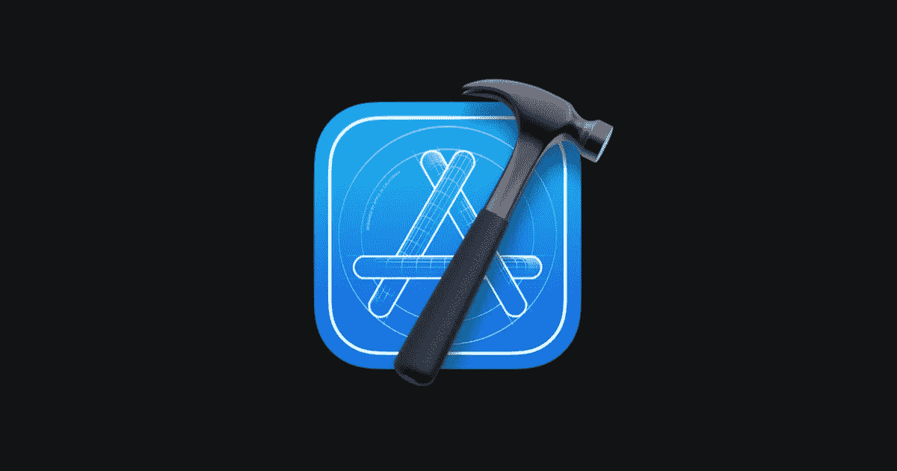
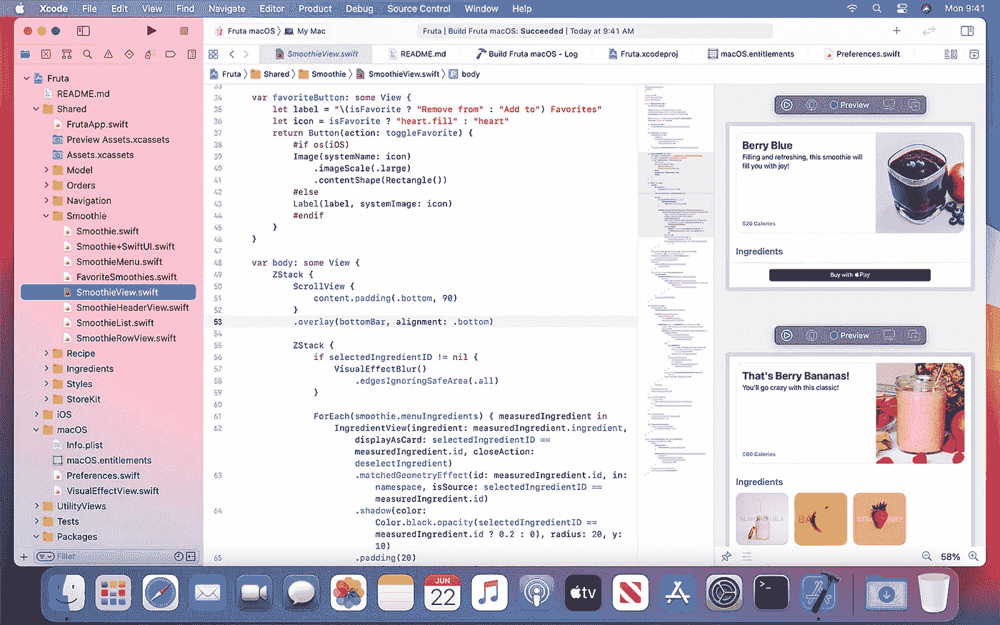
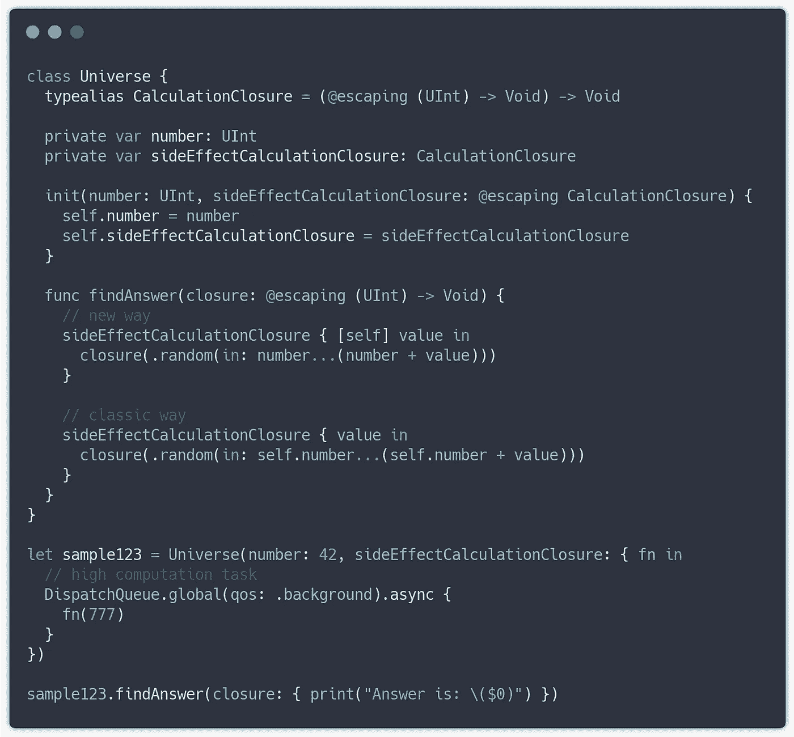

# Xcode 12.0 有什么新功能？

> 原文：<https://betterprogramming.pub/whats-new-in-xcode-12-0-6202528b8f9b>

## Swift 5.3、适用于 iOS/iPadOS/tvOS 14、watchOS 7 和 macOS Big Sur 的 SDK

在这个版本中，苹果围绕使用 Xcode 的开发做了很多改进，Xcode 是一种通过 SwiftUI 和 Swift Package Manager (SPM)的方法。

# Xcode

新的用户界面/UX 设计。导航字体与系统相关(但可以关闭)。选项卡导航非常类似于 VS 代码，它有一个智能的方法来保留打开的文件或在查看后关闭它。

为了发展:

*   新的代码完成对话框被重新设计，占用更少的空间，并且“完成的速度更快”，正如苹果公司声称的那样。
*   在我看来，更重要的是，他们改进并重新设计了 Organizer，您可以使用它来检查客户使用的应用程序的特定指标，如:*崩溃日志、能源报告和启动时间性能等。*
*   他们还增加了对可缩放矢量图形(SVG)图像资产的支持，支持 macOS 10.15、iOS 13 和 iPadOS 13 的部署目标。
*   在使用图像拾取器进行选择期间，iOS 的 SF 符号的渲染模式和符号比例属性是可编辑的。其他属性将在其图像名称下展开。
*   一个新的 minimap for Interface Builder canvas，它可以附着在它的任何角落，双击和 command-click 它就可以聚焦 minimap 场景。
*   小而重要的补充:界面构建器支持`[UISplitViewController](https://developer.apple.com/documentation/uikit/uisplitviewcontroller)`的两/三栏样式，这是 iOS 14 中引入的；`[UIButton.ButtonType.close](https://developer.apple.com/documentation/uikit/uibutton/buttontype/close)`型支撑按钮。

# 斯威夫特伊

苹果，在发展中，更接近可伸缩性和模块化方法的最佳实践。例如，您的 SwiftUI 视图组件可以变成一个可重用的组件，并且可以出现在 Xcode 库中。

另一个性能改进是拥有惰性视图。有
`LazyVStack``LazyHStack``LazyVGrid``LazyHGrid`。因此，除了不懒惰的经典视图之外，对于动态表示，使用懒惰视图来处理庞大的数据集是更好的选择。

正如苹果开发团队所说:

> SwiftUI 中的应用程序生命周期使整个应用程序能够完全在 iOS、iPadOS 和 macOS 的 SwiftUI 中编写。

# 迅速发生的

从 **5.3，**版本开始，在转义闭包时，允许以隐式方式引用类作用域，而不需要在变量上显式赋值或调用`self`。因此，调用实际上就像在一个简单的函数中一样，在这里您不需要放置明显的`self.number`，因此您的访问闭包看起来就像示例中的那样:

了解另一个已经实现并正在开发的特性的更多信息:

 [## Swift 5.3 有什么新功能？

### Swift 语言在每一次版本更新中都得到了改进，变得更加有趣，在本文中我们将看到…

medium.com](https://medium.com/@dimpiax/whats-new-in-swift-5-3-b44b2e5e5af1) 

# Swift 包裹

对 SPM 环境进行了有意义的改进，我想说，这提供了完整的机会来规划您的开发，并寻求使用资产的模块化，在没有任何其他依赖管理器的情况下使用 SPM。它支持:

*   包含资源:图像、资源、故事板、本地化内容和其他文件，Xcode 会在编译过程中自动将其添加到应用程序包中。
*   根据自定义条件组织构建目标依赖项，例如，如果您想要限制每个平台或环境变量/
*   预构建的库，即 XCFramework，可以包含`.dSYM`和`.bcsymbolmap`——使用`-debug-symbols`标志调试库包中的符号文件。更多信息请使用:`xcodebuild -create-xcframework -help`。
*   并且为了做一些实验或者进行快速开发，通过 Playgrounds，一个他们可以导入和使用 Swift 包和框架的改进，要*在 playground 的文件检查器中选择 Build Active Scheme 复选框，确保 Active Scheme 构建包或者框架目标*。

# 排除故障

获得关于 UI 效率改进和响应性的详细解释看起来要聪明和灵活得多。在对应用程序的视图层次结构进行调试的过程中，这些建议会显示在调试导航器中。

Swift 语言诊断得到了极大的改进，这使得理解编码错误变得更加容易，尤其是在 SwiftUI 代码中。

另一个有趣的功能在**视图调试器**中，你可以看到`[CALayer](https://developer.apple.com/documentation/quartzcore/calayer)`，通过:
*编辑器→显示图层来查看 CALayers* 、和检查性能运行时问题的`CALayer`，通过:
*编辑器→显示优化机会*

对于断点，Xcode 会显示特定断点位置的**命中次数**，作为编辑器中断点注释的一部分，从现在开始，您可以命名断点，并通过另一个断点的操作的名称来引用它。例如，要启用之前禁用的名为`SpecialBreakpoint`的断点，请在调试器命令字段中键入:
`break enable SpecialBreakpoint`将其打开。

最后但同样重要的是，Xcode 在控制台中打印崩溃消息，其样式与调试期间进程崩溃时在 CrashReporter 中显示的样式相似。

## 商店工具包

对于包含应用内购买的应用程序，这是使用新框架 [StoreKit Test](https://developer.apple.com/documentation/storekittest) 在模拟器或设备中测试和调试任何场景的重大改进，可以完全在本地完成，无需连接到应用商店服务器。

测试范围:

*   测试应用内购买场景，改变订阅状态。
*   订阅优惠:介绍性和促销性。
*   恢复购买。
*   要求购买、中断购买等等。

一个重要的功能是控制您的测试环境，这是可能的:重置优惠资格，清除购买历史，并加快基于时间的订阅的续订率。

有关入门的更多信息，请参见[在 Xcode 中测试应用内购买项目](https://developer.apple.com/documentation/storekit/in-app_purchase/testing_in-app_purchases_in_xcode)和[在 Xcode 中设置 StoreKit 测试](https://developer.apple.com/documentation/xcode/setting_up_storekit_testing_in_xcode)。

# 模拟器

下面是一些改进，这使得我们使用 Simulator 的开发和测试过程更加容易:

*   保持领先——这个功能很久以前就被删除了，现在有望重新启用。您的设备会保持在其他应用程序窗口的前面。
*   你可以在 macOS 的某个空间中以全屏模式再次**定位它，或者将它的窗口平铺在 Xcode 旁边。**
*   模拟器默认为内置麦克风，除非您明确选择不同的音频源，因此如果您通过 MacBook 听音乐，您的音频质量不会下降:)
*   此外，测试新功能的一个非常重要的事情是模拟[附近的交互](https://developer.apple.com/documentation/nearbyinteraction)——在另一个模拟器周围拖动设备窗口将显示模拟的距离。

谢谢你的阅读，我确信我们今天学到了一些新东西！
本文将持续更新 Xcode 12 中的新功能。

如果你还在 Xcode 11 上，检查一下那里做了哪些功能。

 [## Xcode 11.4 有什么新功能？

### Swift 5.2、Clang 编译器 11.0.3 等等

medium.com](https://medium.com/better-programming/whats-new-in-xcode-11-4-bd7c6f6bb0ba)