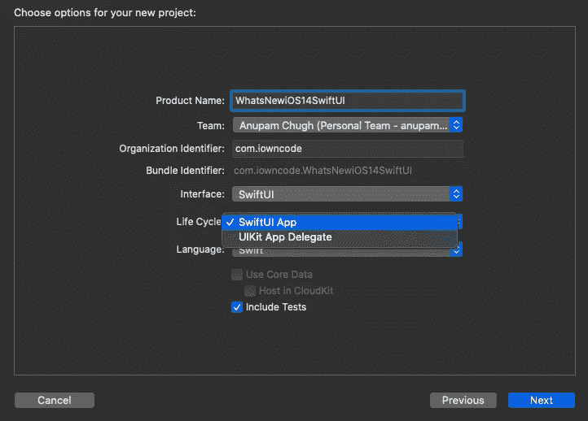
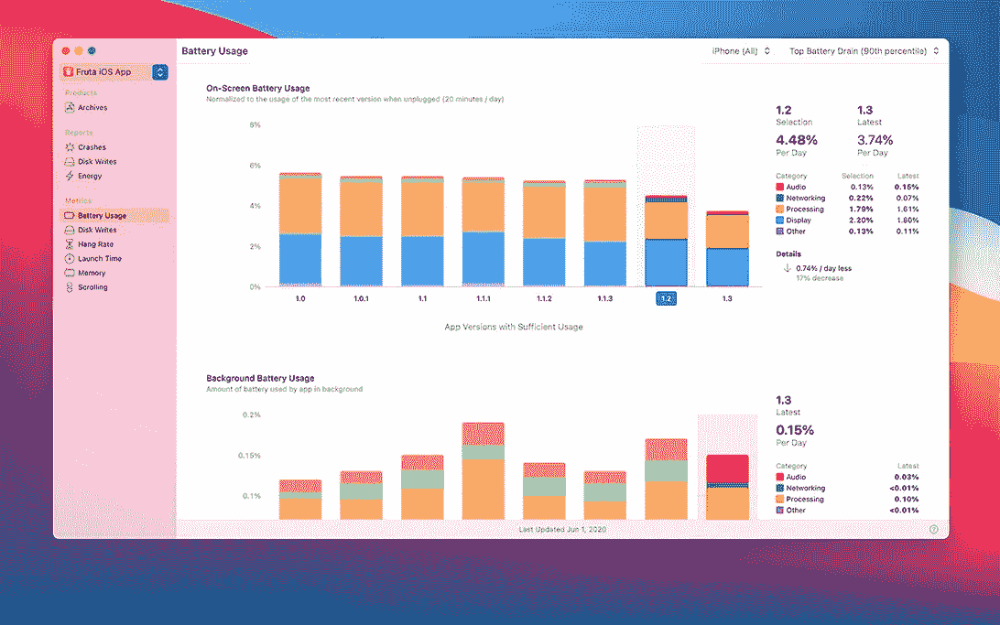
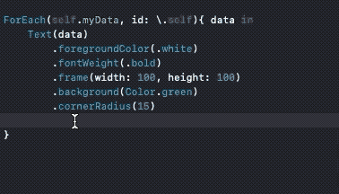
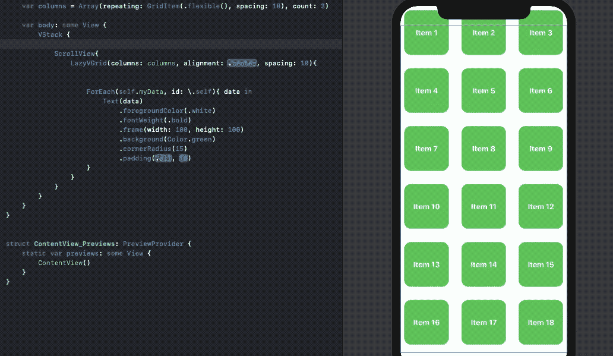
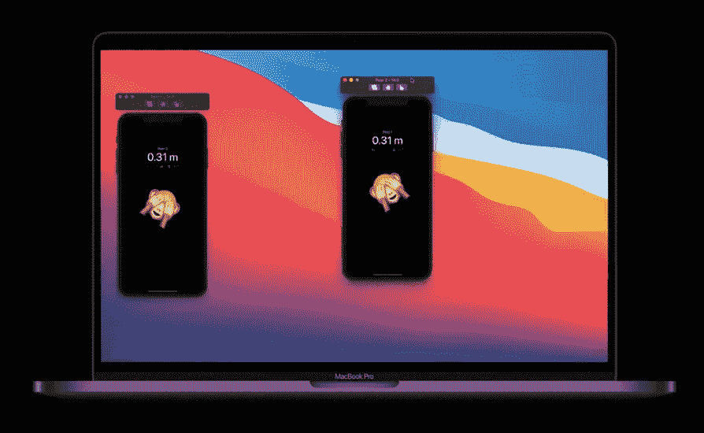
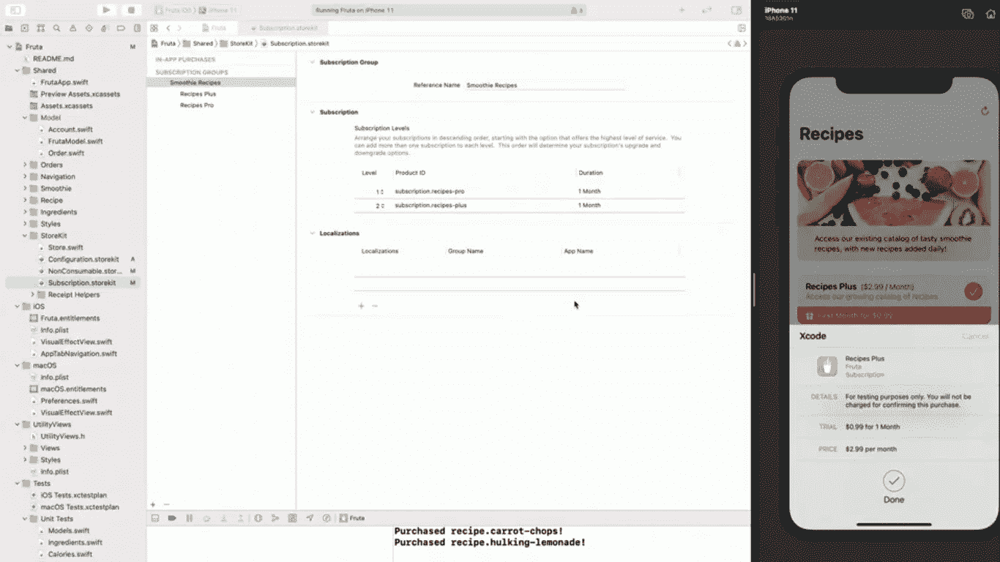
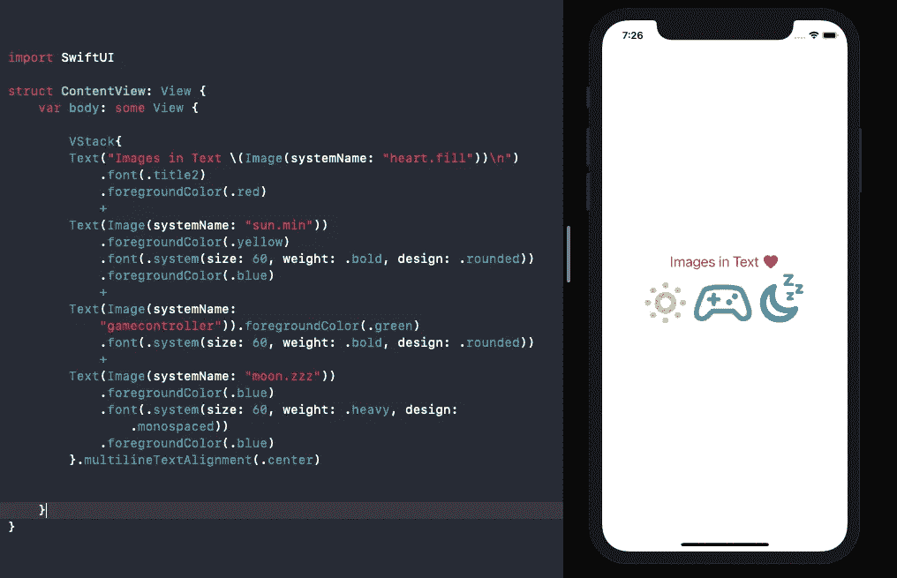

# Xcode 12 有什么新功能？

> 原文：<https://betterprogramming.pub/whats-new-in-xcode-12-7eb6a71af8d1>

## 强大的自动完成功能、增强的模拟器、重新设计的预览等等

由[罗布·汉普森](https://unsplash.com/@robman?utm_source=medium&utm_medium=referral)在 [Unsplash](https://unsplash.com?utm_source=medium&utm_medium=referral) 上拍摄的照片

Xcode 是 iOS、macOS、tvOS 和 watchOS 开发的核心。多年来，它经历了相当多的重大改进。虽然今年对 ipad Xcode 的希望再次被淹没，但这并没有阻止 Xcode 12 收到一些令人兴奋的新更新。

在接下来的章节中，除了丰富精致的图标之外，我们将看到我们最喜欢的 IDE 为我们准备的新产品。

# 新的 SwiftUI 应用生命周期

一旦您创建了一个新的 Xcode 项目，就会看到一个更新的 onboarding 向导，让您在 SwiftUI App 和 UIKit App Delegate 之间进行选择。

Xcode 12 新项目窗口

随后，使用 Swift 5.3 中引入的`@main`属性，使用起始部件集创建一个没有应用程序委托和场景委托的项目

# 新的文档选项卡和外观变化

文档标签是开发者急需的喘息之机。它可以让你通过双击在一个新标签中快速打开不同种类的文件，还可以让你重新排列它们。这意味着如果你将一个文件夹组拖到标签栏中，所有包含的文件都将被打开。

更重要的是，标签有一个固定的空间，不会填满 IDE 的宽度。

项目导航图标大小和文本字体现在可以根据系统设置使用 Xcode 通用设置中的“侧边栏字体和图标大小”选项进行调整。

在`Assets.xcassets`文件夹中包含的强调色允许我们为应用程序设置全局主题颜色。现在也提供了对 SVG 向量的现成支持。

此外，工具栏和侧边栏也经过了改进，设计美观，增强了用户体验，保持了 macOS Big Sur 的真实性。这样，左侧栏的切换图标就被移到了左侧。

# 具有丰富指标的组织者

允许您查看和上传产品档案的管理器窗口现在拥有对应用程序的详细分析，从电池使用情况到启动时内存写入和滚动故障指标，这是您诊断问题和优化应用程序所需的一切。

[来自 WWDC20 视频](https://developer.apple.com/videos/play/wwdc2020/102/)

您现在可以调整从设备和模拟器弹出的“添加设备”窗口的大小。

# 强大的自动完成功能

自动补全一直是 Xcode 的致命弱点。有时，加载时间太长。但是 Xcode 12 给了我们一个闪电般快速的自动补全功能，可以填充默认值，从而打破了这种局面。

新的自动完成功能的一个奇怪的问题是它没有为你提供默认选项`()`。因此，您必须手动清除它。

除了在不覆盖丰富默认值的情况下提交代码之外，它还在 GitHub 代码编辑器中用一个`##`将代码包装起来。看来这将在未来的更新中得到解决。

# SwiftUI 预览和代码完成

SwiftUI 预览已经改版，现在可以让您查看小工具和应用程序剪辑。复制预览和设置不同的主题非常容易，例如黑暗模式。

更重要的是，您可以将内置 SwiftUI 控件从检查器窗格直接拖放到代码中或预览中，如下所示:

Xcode 12 使得在您的设备上快速查看 SwiftUI 预览成为可能。它还允许您使用`DeveloperToolsSupport`框架将自定义视图保存为代码片段。

今年另一个令人惊讶的增加是在你的故事板的界面构建器中引入了一个小地图，允许你在视图控制器之间快速跳转。

# 模拟器的增强

在 Xcode 12 中，模拟器现在可以从窗口菜单设置为停留在其他应用程序之上。这减少了在窗口之间切换以确保模拟器在顶部的麻烦。

今年模拟器的几个重要新增功能是:

*   设置全屏模拟器窗口的能力
*   附近的交互 API 与模拟器一起工作。因此，如果你沿着屏幕拖动两个模拟器，可以实时查看它们的距离和位置变化。
*   现在可以在模拟器中直接查看设备预览。

[来自 WWDC20“附近的互动”视频](https://developer.apple.com/videos/play/wwdc2020/10668/)

# 测试 StoreKit 购买的能力

Xcode 12 现在为测试应用内购买提供了内置支持，无需依赖 App Store Connect。这样，您可以在沙盒环境中模拟购买、收据和不同的订阅。

[来自这个 WWDC 20 的视频](https://developer.apple.com/videos/play/wwdc2020/10659/)

# 结论

今年 Xcode 12 中引入了许多令人兴奋的好东西来增强我们的用户体验。

Xcode 附带的一个附加但独立的应用 Create ML 拥有风格转换功能。调试断点时，您现在会看到一个指示该行执行次数的指示器。Xcode Playgrounds 现在可以导入和使用 Swift 包和框架。

是时候和全屏分屏的模拟器打招呼了，如下图:

除此之外，Xcode 12 还提供了一个新的 Any Mac 设备，可以独立于本地 macOS 架构运行应用程序。

这一次到此为止。感谢阅读。