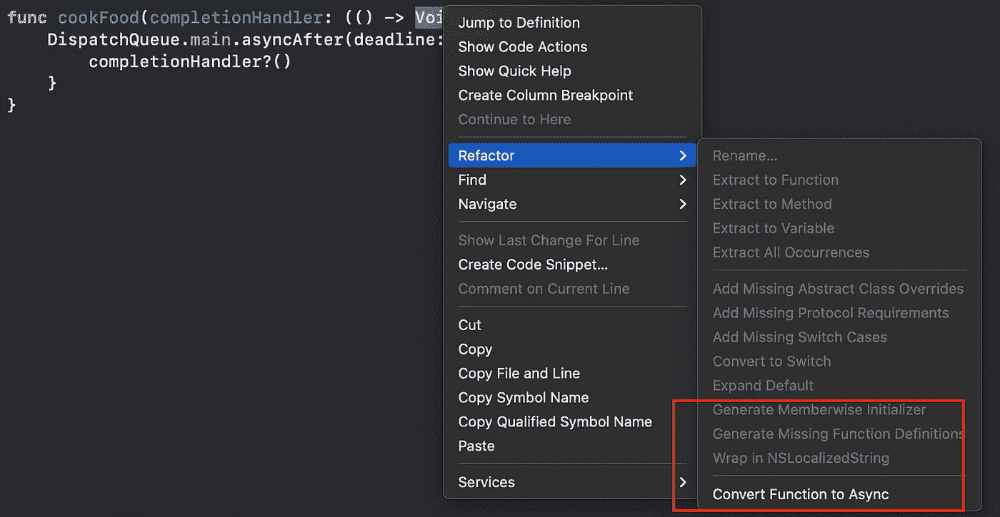
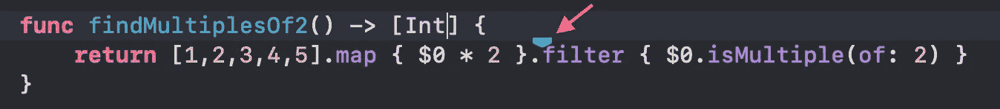
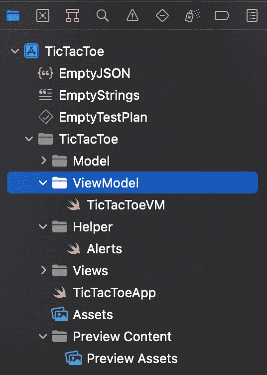

# Xcode 13 有什么新功能？

> 原文：<https://betterprogramming.pub/whats-new-in-xcode-13-a48d5158f98>

## 列断点、更好的自动完成和新的 DocC 工具


照片由 [Zan](https://unsplash.com/@zanilic?utm_source=medium&utm_medium=referral) 在 [Unsplash](https://unsplash.com?utm_source=medium&utm_medium=referral) 上拍摄

Xcode 13 出现在 [WWDC 21](https://developer.apple.com/wwdc21/) 上，包含了大量的新元素、升级和性能改进。在这篇文章中，我将带你经历一些我认为有趣和有用的关键变化。

# 迅速发生的

Swift 现在原生支持使用 async/await 和 actors 的并发编程。有关更多信息，请参见[Swift 中的新功能](https://developer.apple.com/wwdc21/10192)、Swift 中的[Meet async/await](https://developer.apple.com/wwdc21/10132)和[探索 Swift 中的结构化并发](https://developer.apple.com/wwdc21/10134)。

如果你有使用`completionHandler`的代码，你可以很容易地重构它们。新的重构有助于迁移到异步代码。“Convert Call to Async Alternative”可用于将完成处理程序作为最后一个参数的调用，并重构它们以使用新的异步语言功能，假设该功能的异步等效功能已经存在。



将功能转换为异步

异步函数可以使用`async let`绑定创建并发执行的子任务。子任务从父任务声明`async let`的地方开始，变量`async let`在使用它们的地方声明`await`。`async let`等待直到子任务完成并返回值。

例如:

```
func chopVegetables() async throws -> [Vegetables]
func marinateMeat() async -> Meat
func preheatOven(temperature: Int) async -> Ovenfunc makeDinner() async throws -> Meal { 
    async let veggies = chopVegetables()  
    async let meat = marinateMeat()  
    async let oven = preheatOven(temperature: 350) let dish = Dish(ingredients: await [try veggies, meat])  
    return try await oven.cook(dish, duration: .hours(3))}
}
```

所有子任务都在声明它们的作用域退出之前完成。

# 源代码控制

现在，当登录 GitHub 或 Bitbucket 服务器帐户时，您可以使用 Xcode 的源代码控制功能来创建、检查和合并请求。

现在，您可以从文档选项卡栏的任何编辑器(或编辑器拆分)中启用代码审查，默认情况下，它会在内联演示文稿中显示比较结果。编辑器底部新的提交选择器允许您定制显示的差异。

## 精力

Xcode 13 现在支持 Vim 键绑定，如果你感兴趣，你可以在 [VIM 备忘单](https://vim.rtorr.com/)中找到更多命令。

# DocC:Xcode 的文档工具

DocC 是 Xcode 13 中的一个新文档工具，它扩展了现有的基于 Markdown 的源代码文档语法。

除了 API 参考之外，您还可以为您的包创建文章和教程，并生成文档存档。这些可以在线阅读或在 Xcode 文档浏览器中阅读。

要更全面地了解这个工具，请查看这篇[文章](/introducing-docc-a-new-tool-to-write-documentation-from-xcode-64d990d0a1c9)。

# **自动完成**

Xcode 13 包括重新设计的 Swift 代码完成，最大限度地提高了可靠性和性能，尤其是在项目源代码中存在结构和逻辑不一致的情况下。

Xcode 13 中的代码补全功能可以帮助您快速完成您的想法，即使周围的源代码已损坏。完成出现得更快，更有预测性，表明在较少键入后最有可能完成。

除了完成类型和方法之外，Xcode 13 中的代码完成功能还提供了像`for item in items {`或`guard let item = item else { return nil }`这样的完整语句，甚至是带有`enum`案例的完整`switch`语句。当在一个视图中完成`cornerRadius`时，代码完成还会搜索属性以提供类似`layer.cornerRadius`的链式完成。

代码完成帮助您完成尚不正确的表达式。它查找并识别模块中尚未导入的类型，并自动添加必要的导入。当周围的源代码有错误时，代码补全仍然会推断出您的意思。它提供了您正在寻找的完成方式，并带有一条描述如何使其有效的消息。

当在 Swift 中将占位符扩展为闭包时，代码完成使用闭包的参数名而不是`<#Type#>`

此外，Xcode 现在允许您自动展开选项。

# 列断点

若要在行上设置列断点，请按住 Command 键单击表达式，然后从“动作”菜单中选择“设置列断点”。

```
func findMultiplesOf2() -> [Int] {
   return [1,2,3,4,5].map { $0 * 2 }.filter { $0.isMultiple(of: 2) }
}
```

您现在可以通过右击`filter` - >选择`Code Actions`->-在`filter { $0.isMultiple(of: 2) }`设置断点



列断点

# 辅助功能设置

现在，您可以在 Interface Builder 场景中预览以下辅助功能设置:动态类型、粗体文本、按钮形状、开/关标签、增加对比度和降低透明度。

您可以通过单击画布按钮栏中的“辅助功能”按钮来激活这些设置，并在“辅助功能”弹出式菜单中进行设置。

# 试映

预览现在支持在预览视图时检查视图的辅助功能元素。这种支持需要 macOS 12。


SwiftUI 景观

# 设计

Xcode 13 有一个刷新的项目导航器，它包含了各种文档类型的符号。文件扩展名目前被自然地隐藏起来，以获得更整洁的外观和感觉。显然，你可以决定在你希望的时候展示它们。



如果你想更深入地了解 Xcode 13，你可以在这里找到它们。

我希望这篇文章能以某种方式帮助你，如果你有问题，请告诉我。谢谢大家！祝你好运。