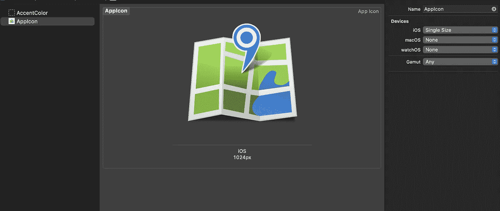
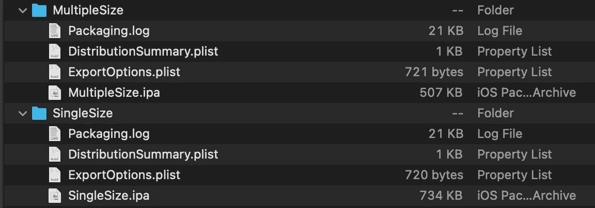
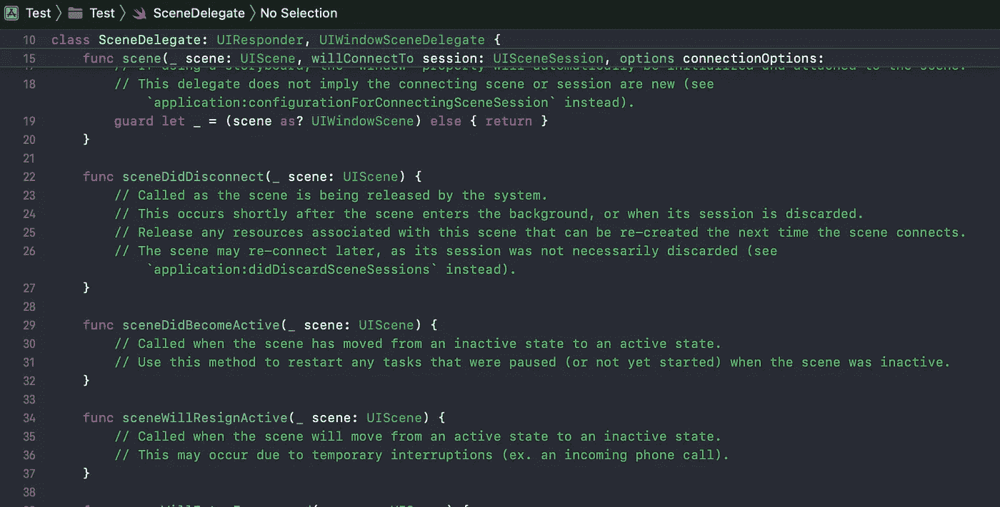
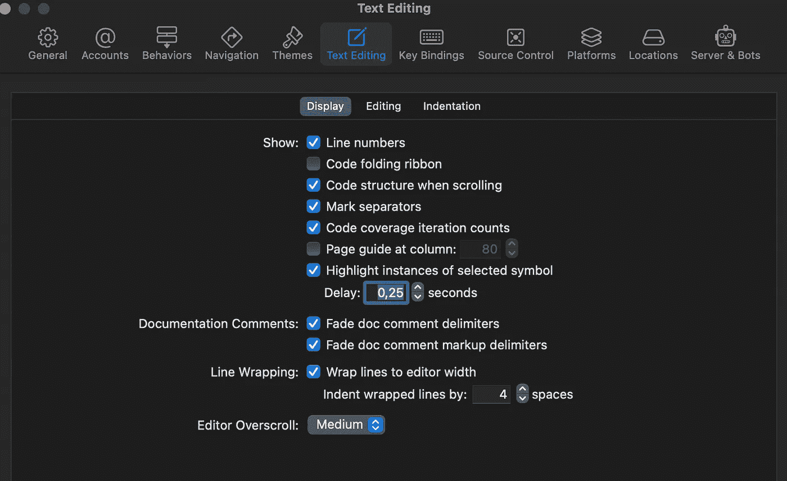
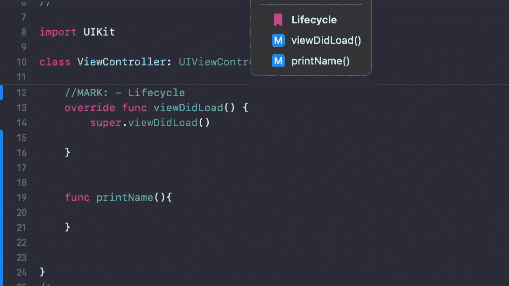
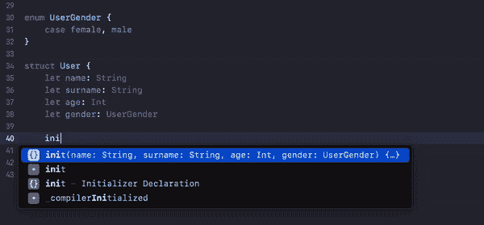
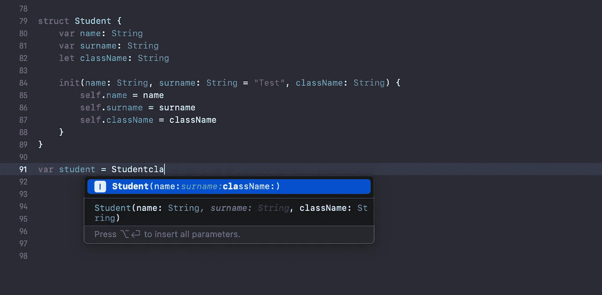
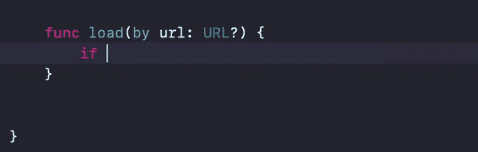
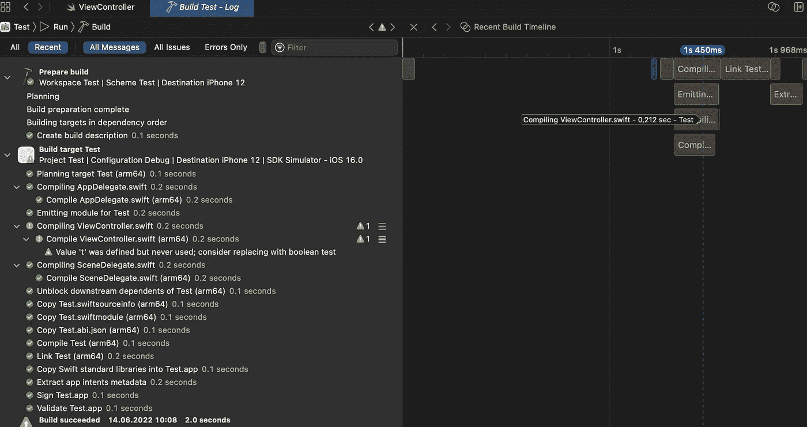

# Xcode 14 的新功能

> 原文：<https://betterprogramming.pub/whats-new-in-xcode-14-f6b56c33a8b3>

## 更快。Xcode 14 让您比以往更快地开始使用比以前小 30%的二进制文件。


谷歌图片

在 WWDC22 上，苹果宣布了 Xcode 的新版本。编号为 14 的 Xcode 版本提供了许多功能集和许多改进。源代码编辑器和其他一些东西很酷。我将与你分享你所需要的消息。

让我们深入这个话题。

# **单一尺寸应用图标**

对开发者来说，单一尺寸的应用程序图标可能是最好的功能。
你不再需要一个应用图标生成器工具了。您可以为您的应用程序使用单个 1024x1024 像素的应用程序图标资源。

不仅如此，它还减少了你的应用程序的大小。你可以检查一下。制作一个 1024x1024 像素的应用程序图标资源，然后将其导入到 Xcode 的资源中，并从 Xcode 的右侧栏中选择单一大小。

一旦您为 iPhone 型号导出带有细化设置的 IPA，您将会看到它们之间的差异。



单一尺寸应用程序图标

它展示了如何选择单一大小的应用程序图标。



单尺寸应用图标与多尺寸应用图标对应用尺寸的影响

上面截图是单个 app 存档结果。它显示单尺寸和多尺寸应用程序图标选择之间的应用程序尺寸。

# **滚动时的代码结构**

我一看到它就大吃一惊。我记得分组表格视图样式。我对此确信无疑。这是一个很有价值的特性，可以在滚动时显示您在代码编辑器中的位置。



滚动时的代码结构

您可以通过下面的设置禁用或启用它。



滚动设置时的代码结构

此外，您知道标记导航，它在代码编辑器的顶部用标记标签显示您所写的内容。



语用标记

# **成员式初始化器完成**

在 Xcode 的早期版本中，需要点击右键来生成一个 memberwise 初始化器。

Xcode 14 毫不费力地提供了它。要创建一个成员式初始化器，你只需要写 init，然后你会看到初始化器方法的其余部分。



成员式初始值设定项完成


代码完成

并且有更多的代码完成改进。这些包括更高的准确性。



代码完成准确性

# **可选解包**

我看到的一个重大进步是，您不需要通过 if let 集创建一个不可变变量来检查一个可选变量。



可选展开

# **Xcode 构建时间线**

在 Xcode 的早期版本中，我们将构建日志视为一个列表，正如您在左侧看到的下面的列表。我们也知道哪一步是构建，需要多少时间。现在，有了 Xcode 14，我们可以将这些日志视为一条时间线。



Xcode 14 构建时间线

## **强调了发行说明中的其他特性和改进**

*   模拟器现在支持在苹果硅或 T2 处理器的 Mac 电脑上运行 macOS 13 时在 iOS 16 中的远程通知。
*   Xcode 14 现在可以并行编译目标及其 Swift 目标依赖项。
*   您现在可以使用`ENABLE_USER_SCRIPT_SANDBOXING`构建设置为 shell 脚本构建阶段启用沙箱。
*   Xcode 现在提供了`RECOMMENDED_MACOSX_DEPLOYMENT_TARGET`、`RECOMMENDED_IPHONEOS_DEPLOYMENT_TARGET`、`RECOMMENDED_TVOS_DEPLOYMENT_TARGET`、`RECOMMENDED_WATCHOS_DEPLOYMENT_TARGET`和`RECOMMENDED_DRIVERKIT_DEPLOYMENT_TARGET`构建设置，这些设置指示每个支持的 Xcode 平台的推荐最低部署版本。
*   因为现在不推荐使用位代码，所以默认情况下，iOS、tvOS 和 watchOS 的构件不再包含位代码。
*   调试应用程序时,“线程性能检查器”会在问题导航器和源代码编辑器中显示运行时性能问题。
*   界面生成器现在异步更新场景。
*   用 if 语句包装代码现在会自动重新缩进代码块。

别忘了 Xcode 14 还在测试阶段。

感谢阅读。

```
**Want to Connect?**Let’s connect on Twitter [@batikansosun](http://twitter.com/batikansosun).
```