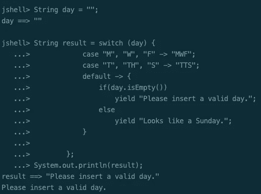
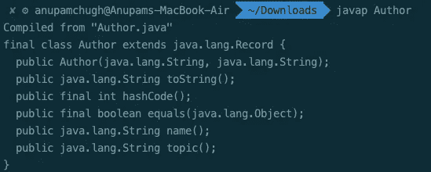
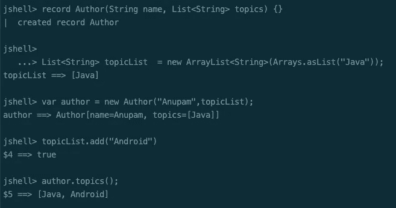
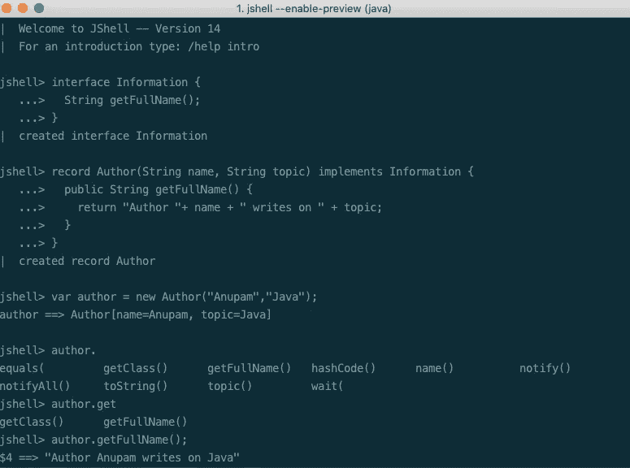
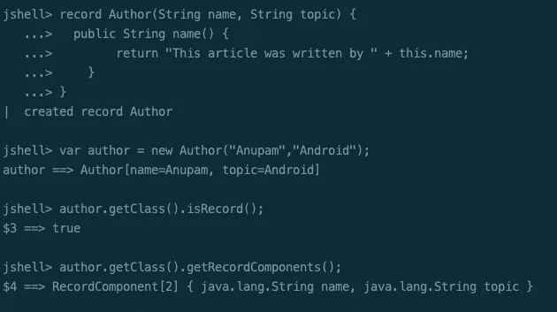

# 有什么新鲜事？Java 14 特性

> 原文：<https://betterprogramming.pub/whats-new-java-14-features-6b5856c94aa4>

## 入门指南

## 记录、文本块、有用的 npe 等等


照片由[卡尔·乔](https://unsplash.com/@karlchor?utm_source=medium&utm_medium=referral)在 [Unsplash](https://unsplash.com?utm_source=medium&utm_medium=referral) 上拍摄

紧跟 2019 年 9 月 17 日 [Java 13](https://www.journaldev.com/33204/java-13-features) 发布后六个月的周期传统，Java 14，另一个非 LTS 版本计划于 2020 年 3 月 17 日发布。

以下是 Java 14 的特性列表:

*   开关表达式(标准)— JEP 361
*   实例的模式匹配(预览)— JEP 305
*   有用的空指针异常— JEP 358
*   记录(预览)— JEP 359
*   文本块(第二次预览)— JEP 368
*   包装工具(孵化器)— JEP 343
*   G1 — JEP 345 的 NUMA 感知内存分配
*   JFR 活动流— JEP 349
*   非易失性映射字节缓冲区— JEP 352
*   苹果电脑上的 ZGC—JEP 364
*   Windows 上的 ZGC—JEP 365
*   外部内存访问 API(孵化器)— JEP 370

# Mac OS 上的 Java 14 安装设置

*   要开始使用 Java 14，请在这里下载 JDK。
*   复制并解压`/Library/Java/JavaVirtualMachines`中的 tar 文件，如下图所示:

```
$ cd /Library/Java/JavaVirtualMachines$ sudo cp ~/Downloads/openjdk-14_osx-x64_bin.tar.gz /Library/Java/JavaVirtualMachines$ sudo tar xzf openjdk-14_osx-x64_bin.tar.gz$ sudo rm openjdk-14_osx-x64_bin.tar.gz
```

一旦完成，使用任何文本编辑器创建/编辑`bash_profile`。我用的是`vim ~/.bash_profile`。将 Java14 的路径设置为`JAVA_HOME`，保存更改，并做一个`source ~/.bash_profile`来反映更改。

```
export JAVA_HOME=/Library/Java/JavaVirtualMachines/jdk-14.jdk/Contents/Home
```

最后，您已经准备好使用 Java 14 编译和运行程序了。我们将使用 JShell，一个交互式 REPL 命令行工具，用于快速测试 Java 14 的新特性。

值得注意的是，Java 14 中发布的许多特性都在预览版中。这意味着，虽然他们现在正在全力工作，但未来可能会有所改变。有些可以成为标准，或者在下一个发布周期中简单地删除。为了测试预览功能，您需要在运行 JShell 或 Java 程序时显式设置`--enable-preview`，如下所示:

```
jshell --enable-previewjavac --release 14 --enable-preview <FileName>.java
```

在接下来的几节中，让我们讨论一些语言和 JVM 特性。

# 1.切换表达式

在 Java 12 和 Java 13 的最后两个版本中保留了预览特性之后，Switch 表达式终于在 Java 14 中获得了永久的地位。

*   [Java 12](https://www.journaldev.com/28666/java-12-features) 为 switch 表达式引入了 lambda 语法，从而允许多个 case 标签用于模式匹配，并防止导致冗长代码的失败。它还强制执行了穷举的情况，如果没有覆盖所有的输入情况，就会抛出编译错误。
*   [Java 13](https://www.journaldev.com/33204/java-13-features) ，第二个预览版引入了`yield`语句而不是`break`来从表达式返回值。

Java 14 现在终于让这些特性成为了标准。

```
String result = switch (day) {
            case "M", "W", "F" -> "MWF";
            case "T", "TH", "S" -> "TTS";
            default -> {
                if(day.isEmpty())
                    yield "Please insert a valid day.";
                else
                    yield "Looks like a Sunday.";
            }
        };
System.out.println(result);
```



注意:Yield 不是 Java 中的新关键字。它只是用在开关表达式中。

# 2.实例的模式匹配(预览)

请任何 Java 开发人员展示他们的代码库，你会在整个代码中很好地利用`instanceof`条件。具体来说，`instanceof`条件检查之后通常是显式类型转换。

Java 14 通过使条件提取更加简洁来消除这种冗长。

## Java 14 之前:

```
if (obj instanceof Article) {
  Article a= (Article) obj;
  System.out.println(a.getAuthor());
}
```

## Java 14 以上版本:

```
if (obj instanceof Article a) {
  System.out.println(a.getAuthor());
}
```

在上面的代码中，只有当`obj`的类型为`Article`时，实例`a`才会被赋值。变量的范围仅限于条件块。

# 3.有用的 NullPointerExceptions

空指针异常对于任何开发人员来说都是一场噩梦。以前，直到 Java 13，调试声名狼藉的 npe 都很棘手。

开发人员不得不求助于其他调试工具，或者手动确定为空的变量/方法，因为堆栈跟踪只会显示行号。

## Java 14 之前:

```
String name = a.getBlog().getAuthor()//Stacktrace 
Exception in thread "main" java.lang.NullPointerException at NullPointerExample.main(NullPointerExample.java:5)
```

Java 14 引入了一个新的 JVM 特性，它通过一个更具描述性的堆栈提供了更好的洞察力，如下所示:

```
Exception in thread "main" 
java.lang.NullPointerException: Cannot invoke "Blog.getAuthor()" because the return value of "Article.getBlog()" is null at NullPointerExample.main(NullPointerExample.java:4)
```

**注意**:以上特征不是语言特征。这是运行时环境的增强。

# 4.记录(预览)

记录是存储纯数据的数据类。引入记录背后的想法是快速创建没有样板代码的简单明了的类。

通常 Java 中的类需要你实现`equals()`、`hashCode()`、getters 和 setters 方法。虽然有些 ide 支持自动生成这样的类，但是代码仍然很冗长。对于一个`record`，你需要简单地用下面的方法定义一个类。

```
record Author(){}//orrecord Author (String name, String topic) {}
```

Java 编译器会自动生成一个构造函数、私有 final 字段、访问器、`equals` / `hashCode`和`toString`方法。上面类的自动生成的 getter 方法是`name()`和`topic()`。

要查看生成的代码，在使用`javac`编译完程序后，使用`javap Author`。下图显示了为`record Author (String name, String topic) {}`生成的类:



记录的语义类似于 Kotlin 中的[数据类。](https://www.journaldev.com/18594/kotlin-data-class)

此外，我们可以通过以下方式向记录添加额外的字段、方法和构造函数:

记录中定义的额外构造函数称为*紧凑构造函数*。它不包含任何参数，只是规范构造函数的扩展。

编译器不会将紧凑构造函数生成为单独的构造函数。相反，它用于验证案例，并将在主构造函数开始时被调用。

关于记录，需要注意一些重要的事情:

*   一个记录既不能扩展一个类，也不能被另一个类扩展。这是最后一门课。
*   记录不能是抽象的。
*   记录不能扩展任何其他类，也不能在主体内定义实例字段。实例字段只能在状态描述中定义。
*   声明的字段是私有的和最终的。
*   记录的主体允许静态字段和方法。

## 4.1 记录的引用字段内的值可以变异

值得注意的是，对于定义为对象的字段，只有引用是不可变的。基础值可以修改。下图显示了 ArrayList 被修改的记录。如您所见，每当 ArrayList 发生变化时，该值都会被修改。



## 4.2 记录可以实现接口

以下代码显示了一个用记录实现[接口](https://www.journaldev.com/1601/interface-in-java)的示例:

```
record Author(String name, String topic) implements Information {
  public String getFullName() {
    return "Author "+ name + " writes on " + topic;
  }
}

interface Information {
  String getFullName();
}
```

下面是上述代码在 JShell 中的输出:



## 4.3 记录支持多个构造函数

记录允许声明多个带参数或不带参数的构造函数，如下所示:

```
record Author(String name, String topic) {
  public Author() {

    this("NA", "NA");
  }

  public Author(String name) {

    this(name, "NA");
  }
}
```

## 4.4 记录允许修改访问器方法

尽管记录确实为状态描述中定义的字段生成公共访问器方法，但它们也允许您在主体中重新定义访问器方法，如下所示:

```
record Author(String name, String topic) {
  public String name() {
        return "This article was written by " + this.name;
    }
}
```

## 4.5 运行时检查记录及其组件

记录为我们提供了`isRecord()`和`getRecordComponents()`来检查这个类是否是一个记录，并查看它的字段和类型。下图显示了这是如何做到的:



虽然我们在上面的代码示例中向记录添加了额外的字段和方法，但是请确保不要做得太多。记录被设计成普通的数据载体，如果你想实现更多的方法，最好回到普通的类。

# 5.文本块(预览)

文本块是作为 Java 13 中的一个预览特性引入的，目的是允许轻松创建多行字符串文字。它有助于轻松创建 HTML 和 JSON 或 SQL 查询字符串。

在 Java 14 中，文本块仍然在预览中，只是增加了一些新的内容。我们现在可以使用:

*   反斜杠用于显示好看的多行字符串块。
*   `\s`用于考虑尾随空格，默认情况下编译器会忽略这些空格。它保留了它前面的所有空间。

```
String text = """
                Did you know \
                Java 14 \
                has the most features among\
                all non-LTS versions so far\
                """;

String text2 = """
                line1
                line2 \s
                line3
                """;

String text3 = "line1\nline2 \nline3\n"

//text2 and text3 are equal.
```

# 结论

Java 14 主要关注减少样板代码和改进模式匹配——通过增强开关表达式和`instanceof`操作符。

尽管 preview 中有许多语言特性，但 Java 开发人员可以希望从这里开始，在可读性、冗长性和开发速度方面，事情只会变得更容易。

这一篇就到此为止——感谢阅读。

【https://www.journaldev.com】最初发表于[](https://www.journaldev.com/37273/java-14-features)**。**